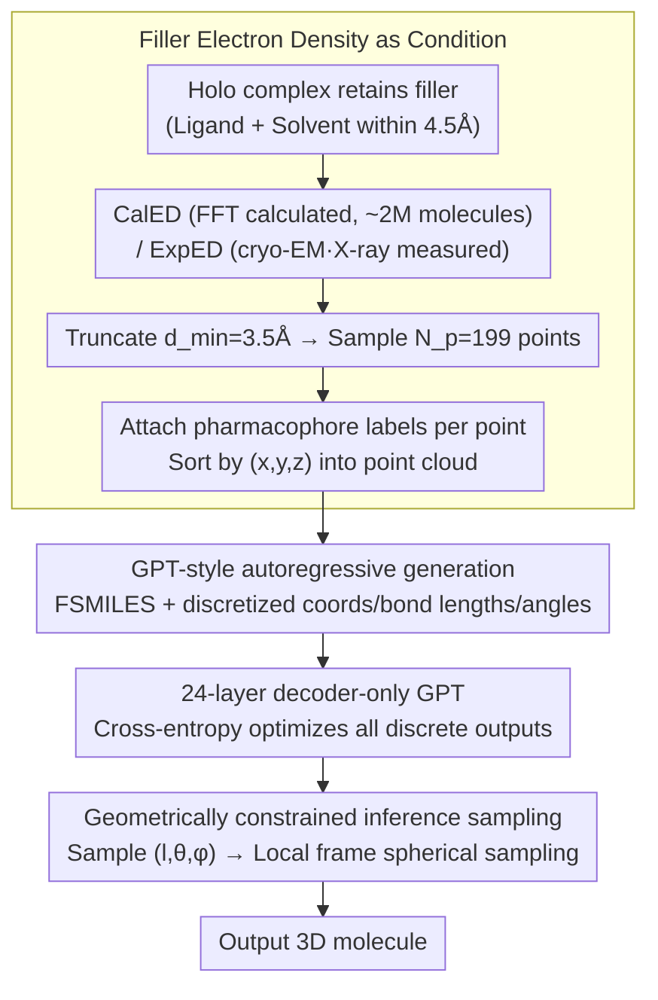

# From Holo Pockets to Electron Density: GPT-style Drug Design with Density

**Conference**: ICML 2026  
**arXiv**: [2605.08767](https://arxiv.org/abs/2605.08767)  
**Code**: https://jiahaochen1.github.io/EDMolGPT_Page/ (Project page available)  
**Area**: Structure-based drug design / Generative molecular modeling  
**Keywords**: structure-based drug design, electron density, autoregressive, FSMILES, GPT

## TL;DR
This paper replaces the condition for structure-based drug design from a "rigid empty pocket" to a "low-resolution electron cloud of the filler (containing ligand and solvent)." It proposes EDMolGPT, the first decoder-only autoregressive model in this domain, which achieves a bioactive recovery of 41% across 101 DUD-E targets, significantly outperforming previous electron density (ED)-based methods.

## Background & Motivation

**Background**: The mainstream structure-based drug design (SBDD) workflow starts from a holo protein-ligand complex, **removes** the filler (existing ligand + solvent), and uses the remaining empty pocket as the generation condition. This is supported by autoregressive or diffusion models such as Pocket2Mol, TargetDiff, Lingo3DMol, and MolCRAFT.

**Limitations of Prior Work**: An empty pocket represents a single-frame static conformation, which suppresses the intrinsic flexibility of the protein and ignores ligand-induced conformational adaptation. A few studies that attempted to use pocket electron density (e.g., ECloudGen, ED2Mol) found that electron density signals are inherently weak and unstable in flexible regions, which introduced more noise.

**Key Challenge**: Drug design requires a condition that can both reflect the "true binding environment of the target" and provide a "unified representation" for generative models. Rigid pockets satisfy the latter at the expense of the former, while pocket ensembles satisfy the former at the expense of the latter.

**Goal**: (1) Identify a condition that can encode ensemble-averaged conformational information while maintaining a unified representation; (2) Develop a generative model capable of utilizing this condition, supporting large-scale pre-training and fine-tuning on experimental data.

**Key Insight**: The electron density of the filler (ligand + solvent within 4.5 Å) is typically well-defined (directly validated by experiments) and naturally encodes where the ligand resides and which surrounding H-bond networks are active—making it more "substantial" than the vacuum of a pocket.

**Core Idea**: Use the low-resolution electron density point cloud of the filler as the condition. Employ a decoder-only GPT-style autoregressive model to predict FSMILES + discretized 3D geometry. Establish a unified pipeline consisting of large-scale CalED pre-training followed by ExpED fine-tuning based on experimental data.

## Method

### Overall Architecture
EDMolGPT addresses two problems: "which condition to use" and "which model to use." The condition is shifted from the removed empty pocket to the retained filler (ligand + surrounding solvent) electron density. The model utilizes a decoder-only GPT to concatenate the point cloud with the molecular sequence, generating atoms in an autoregressive manner. Two types of electron density are unified into the same format: CalED is calculated from atomic coordinates via FFT and used to pre-train on approximately 2M molecules; ExpED is directly read from cryo-EM / X-ray experimental data for fine-tuning on 40k PDBbind complexes. Regardless of the source, signals are truncated to a resolution of $d_{\min}=3.5\text{Å}$, sampled into a point cloud of fixed size $N_p=199$, labeled with pharmacophores, sorted by $(x,y,z)$, and concatenated with molecular tokens for the GPT input.

### Key Designs

**1. Filler Electron Density as Condition: Retaining "Removed Information"**

Traditional SBDD removes the filler from the holo complex, losing traces of where the ligand was and how the H-bond network functioned. This work does the opposite, using the low-resolution electron density of the filler (ligand + solvent within 4.5 Å) as the condition. CalED involves calculating structure factors $F(h) = \sum_i f_i(h) e^{2\pi i h\cdot v_f^i}$ followed by a truncated inverse FFT $\rho(v_f) = V^{-1} \sum_{|h|\le 1/d_{\min}} F(h) e^{-2\pi i h\cdot v_f}$ to obtain the density map. ExpED skips the FFT and uses experimental measurements directly. After obtaining the density field $\rho$, $N_p$ points are randomly sampled and assigned a pharmacophore type $c_p^i$ (HBD / HBA / HBD-HBA / Other) based on the nearest atom, resulting in a semantic point cloud $\mathcal{P}_f = \{(c_p^i, v_p^i)\}$. The advantage is that filler electron density is a "real" signal verified by experiment, naturally encoding ensemble-averaged flexible binding environments.

**2. GPT-style Autoregressive Generation: Empowering Decoder-only Models with Discretized Geometry**

To avoid the loss of context in encoder-decoder splits and the engineering overhead of SE(3)-equivariant diffusion models, this work uses a GPT-2 medium-style 24-layer Transformer to autoregressively predict atom types, 3D coordinates, and bonding geometry simultaneously. Molecules are represented as FSMILES (fragment-level SMILES to avoid breaking rings). Coordinates are discretized as $\hat v_m^i = \lfloor (v_m^i - \mu_m)/\sigma \rfloor$, where $\sigma=0.1$ maps $\pm 15\text{Å}$ to the integer range $[-150,150]$. Additionally, discretized values for bond length $l_m^i = \|v_m^i - v_m^{i-1}\|$, bond angle $\theta_m^i$, and dihedral angle $\phi_m^i$ are included. Point cloud and molecular tokens share the same coordinate embedding, and the entire sequence is optimized using cross-entropy. By discretizing geometry into the sequence, inference can use $(l,\theta,\phi)$ to constrain the placement of the next atom, improving stability.

**3. Geometrically Constrained Inference Sampling: Parameterizing Spheres via Bond Parameters**

If independent temperature sampling is applied to the three coordinate components of $v_m^i$ during inference, autoregressive errors accumulate, leading to distorted conformations. This work instead samples $(l_m^i, \theta_m^i, \phi_m^i)$ first, then uses the previous three atom positions to define a local frame, constraining the feasible $v_m^i$ onto a sphere of radius $l_m^i$ parameterized by $\theta$ and $\phi$. Sampling in the space of bond lengths and angles is more chemically reasonable and significantly narrows the search space.

### Loss & Training
The entire sequence is optimized via cross-entropy: $\mathcal{L} = -\frac{1}{N_m}\sum_t \log p((\hat a_m^t, \hat v_m^t, \hat l_m^t, \hat\theta_m^t, \hat\phi_m^t) \mid h_p^{1:N_p}, h_m^{1:t-1})$. Training used AdamW with a learning rate of $1\times 10^{-5}$, a 1000-step warmup, and cosine decay. Training was conducted for 100 epochs with a batch size of 96 on 2× A40 GPUs. Inference temperature was set to $T=0.7$.

## Key Experimental Results

### Main Results (DUD-E 101 targets, CalED)

| Method | Bio. Recov. ↑ | Min-in-place ↓ | Redocking ↓ | Min<Re ↑ |
|------|---------------|----------------|--------------|----------|
| Pocket2Mol | 8% | -6.7 | -7.5 | 17.9% |
| TargetDiff | 3% | -6.2 | -7.0 | 15.2% |
| Lingo3DMol | 33% | -6.8 | -7.8 | 12.0% |
| MolCRAFT | 17% | -6.1 | -6.9 | 20.1% |
| ED2Mol | 3% | -5.22 | -6.15 | 7.4% |
| ECloudGen† | 33% | — | -6.68 | — |
| **EDMolGPT** | **41%** | **-6.92** | -7.18 | **37%** |
| Reference (Active Ligands) | — | -7.93 | -7.93 | — |

### Ablation Study (Resolution and Temperature)

| $d_{\min}$ | $T$ | Min-in-place | Recov. | Div ↓ |
|-----------|-----|---------------|--------|-------|
| 1.5 Å | 0.7 | -6.94 | 46% | 0.186 |
| 1.5 Å | 1.2 | -6.90 | 44% | 0.178 |
| 3.5 Å | 0.7 | -6.92 | 41% | 0.184 |
| 3.5 Å | 1.2 | -6.91 | 41% | 0.176 |

On the ExpED subset (92 targets with experimental density): Min-in-place was $-5.4$, recovery was 20%, and QED was 0.50. The model can generate active ligands that are permitted by experimental conformational flexibility but would be rejected by rigid pockets due to steric clashes.

### Key Findings
- The $N_p=199$ point cloud has a greater impact on low-resolution representation than $d_{\min}$. Maintaining $N_p$ ensures ECFP similarity between generated and reference ligands remains $< 0.2$, proving that the condition does not leak the 2D structure of the reference ligand.
- Comparison with ED2Mol by molecular weight: ED2Mol shows high QED (0.66) at $<180$ Da but essentially "cheats" by drawing small molecules. EDMolGPT maintains SAS $\approx 3.8$ in larger weight ranges, closer to actual drug candidates.
- Although docking scores on ExpED may appear lower, some generated ligands cover experimental chemical spaces that are excluded in rigid pockets due to steric clashes, suggesting traditional SBDD evaluations are biased against flexible scenarios.

## Highlights & Insights
- The contrast between "removing filler" and "retaining filler" is stark. The authors demonstrate the superiority of filler encoding flexibility using an experimental density map from PDB 6KMP.
- The combination of a decoder-only GPT, discretized geometry, and spherical sampling simplifies SBDD by avoiding the engineering complexities of SE(3) equivariance or diffusion models, yet achieves SOTA results.
- The dual-source strategy (CalED + ExpED) provides a clear template for "large-scale pre-training + experimental fine-tuning," which is transferable to any cryo-EM molecular task.

## Limitations & Future Work
- ExpED is limited by the scarcity of experimental data (only 92 targets), restricting generalization. Inference requires a known filler (i.e., an existing ligand), so docking is still required for novel targets.
- Drug-like metrics such as QED are only moderate, as no post-generation force-field optimization was performed.
- The decoder-only model does not explicitly model SE(3) equivariance and relies on coordinate embeddings to learn symmetry; rotational robustness has not been quantified.
- No wet-lab validation was conducted; 41% recovery indicates structural similarity in a computational sense, not actual drug efficacy.

## Related Work & Insights
- **vs Pocket2Mol / Lingo3DMol**: These models condition on empty pocket geometry; Ours conditions on filler ED, which is physically richer.
- **vs TargetDiff / MolCRAFT**: These use diffusion routes; Ours is decoder-only, simple, and faster at inference.
- **vs ECloudGen / ED2Mol**: Prior ED-based work used pocket ED or fragment assembly; Ours uses filler ED and end-to-end atom-level generation.
- **vs cryo-EM molecule fitting**: Traditional fitting is "known molecule → fit to density," while Ours is "known density → generate molecule," reversing the direction.

## Rating
- Novelty: ⭐⭐⭐⭐ Switching to filler ED condition + decoder-only SBDD are both firsts.
- Experimental Thoroughness: ⭐⭐⭐⭐ 101 targets + multi-dimensional metrics + ExpED subset, though lacking wet-lab experiments.
- Writing Quality: ⭐⭐⭐⭐ Figures 1 and 2 communicate motivation intuitively; formulas and algorithms are clear.
- Value: ⭐⭐⭐⭐ Establishes a new baseline for ED-guided drug design with significant potential as cryo-EM data grows in industry.

<!-- RELATED:START -->

## Related Papers

- [\[NeurIPS 2025\] EDBench: Large-Scale Electron Density Data for Molecular Modeling](../../NeurIPS2025/computational_biology/edbench_large-scale_electron_density_data_for_molecular_modeling.md)
- [\[ICML 2026\] Stein Diffusion Guidance: Training-Free Posterior Correction for Sampling Beyond High-Density Regions](stein_diffusion_guidance_training-free_posterior_correction_for_sampling_beyond_.md)
- [\[ICML 2026\] EvoEGF-Mol: Evolving Exponential Geodesic Flow for Structure-based Drug Design](evoegf-mol_evolving_exponential_geodesic_flow_for_structure-based_drug_design.md)
- [\[ICML 2026\] Site4Drug: Predicting Drug-Binding Target Sites with an AI Agent](site4drug_predicting_drug-binding_target_sites_with_an_ai_agent.md)
- [\[ICML 2026\] Constrained Flow Optimization via Sequential Fine-Tuning for Molecular Design](constrained_flow_optimization_via_sequential_fine_tuning_for_molecular_design.md)

<!-- RELATED:END -->
