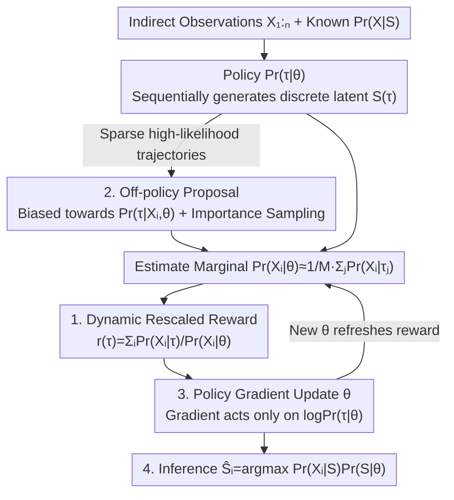

# Generative Modeling of Discrete Latent Structures via Dynamic Policy Gradients

**Conference**: ICML2026  
**arXiv**: [2606.07400](https://arxiv.org/abs/2606.07400)  
**Code**: To be confirmed  
**Area**: Computational Biology / Reinforcement Learning / Discrete Generative Modeling  
**Keywords**: Policy Gradients, Dynamic Rewards, Discrete Latent States, Maximum Likelihood, RNA Isoform Reconstruction

## TL;DR
GReinSS employs a **reward dynamically rescaled by parameters**, $r(\tau)=\sum_i \Pr(X_i\mid\tau)/\Pr(X_i\mid\theta)$, to transform policy gradients into an unbiased gradient ascent of the "observed data log-likelihood." This enables generative modeling and inference across combinatorially exploding discrete latent spaces. It consistently outperforms GFlowNets, naive policy gradients, and VAE/Diffusion/Autoregressive GEM baselines on simulated graph/set reconstruction, and surpasses standard RSEM on isoform reconstruction for real short-read RNA sequencing.

## Background & Motivation

**Background**: Inferring **mechanistic latent states** from indirect observations is a core requirement in scientific modeling—including chemical reaction paths, traffic networks, evolutionary trees, gene regulatory networks, and RNA isoforms. These latent states $S$ are inherently combinatorial structures; however, $S$ is unobservable, with only indirect observations $X$ and a **known or partially known likelihood $\Pr(X\mid S)$** available.

**Limitations of Prior Work**: Two mainstream approaches face significant drawbacks. ① General unsupervised methods (clustering, topic models, representation learning, VAE) learn **artificial latent states**. The latent variables in VAEs reside in a vector space entirely distinct from the mechanistic ground truth and are not designed to recover the actual $S^*$. ② Classic EM / Generalized EM (GEM) aim to infer mechanistic latents, but the E-step requires calculating the expectation of complex data log-likelihoods $\mathbb{E}_{S\sim\Pr(S\mid X,\theta)}[\cdot]$, which is generally **computationally intractable** in exponentially large state spaces (unless a Markov structure exists for dynamic programming, as in HMMs).

**Key Challenge**: Researchers must either settle for artificial latents (VAE route) or face the bottleneck of combinatorial explosion (EM route). While reinforcement learning is naturally suited for "sequential generation of combinatorial structures," standard RL/policy gradients and GFlowNets maximize expected returns or match reward distributions under **fixed rewards**, failing to **directly optimize the "marginal likelihood of indirect observations" $\Pr(X_{1:N}\mid\theta)$**.

**Goal**: Simultaneously solve two problems on arbitrary discrete structures: the learning problem (finding $\theta$ to maximize $\Pr(X_{1:N}\mid\theta)$, Problem 2.1) and the inference problem (estimating each $\hat{S}_i=\arg\max \Pr(X_i\mid S)\Pr(S\mid\theta)$ given $\theta$, Problem 2.2).

**Key Insight**: Treat the RL engine **as an optimization tool** rather than the modeling objective itself. The crucial observation is that if rewards vary dynamically with current policy parameters $\theta$ and are rescaled by $\Pr(X_i\mid\theta)$ in the denominator, the update direction of standard policy gradients becomes **exactly equal** to the gradient direction of the data log-likelihood.

**Core Idea**: Utilize dynamically rescaled rewards to enable policy gradients to perform maximum likelihood estimation. The denominator $\Pr(X_i\mid\theta)$ accounts for the contribution of each observation by "proportion" rather than "raw probability," thereby solving for the **optimal trajectory distribution** $\Pr(\tau\mid\theta)$ instead of converging to a single highest-reward trajectory.

## Method

### Overall Architecture

GReinSS (Generative Reinforcement Learning of Structured States) transforms "maximum likelihood generative modeling on combinatorial latent spaces" into a **policy gradient training loop with an integrated feedback cycle**: a policy $\Pr(\tau\mid\theta)$ sequentially generates trajectories $\tau$, where the terminal state $S(\tau)$ represents a discrete latent state (graph, set, sequence, isoform, etc.).

The overall loop operates as follows: ① Sample trajectories from the policy under current parameters $\theta$ (using an off-policy proposal distribution if necessary to ensure sampling of states with high $\Pr(X_i\mid S)$); ② Estimate the marginal probability of each observation using the samples: $\Pr(X_i\mid\theta)\approx\frac1M\sum_j \Pr(X_i\mid\tau_j)$; ③ Calculate the **dynamic reward** $r(\tau)=\sum_i \Pr(X_i\mid\tau)/\Pr(X_i\mid\theta)$ using the marginals as denominators; ④ Perform a standard policy gradient update on $\theta$; ⑤ Refresh rewards with the new $\theta$ and return to step ①. After training converges, solve the inference problem: sample states and select $\hat{S}_i$ that maximizes $\Pr(S\mid\theta)\Pr(X_i\mid S)$.

Key detail: Although the reward is computed using $\theta$, the gradient $\frac{d}{d\theta}$ **acts only on $\log\Pr(\tau\mid\theta)$ and not on $r(\tau)$**. This distinction from standard RL (fixed rewards) provides the source of unbiasedness.

### Key Designs

**1. Dynamic Rescaled Reward: Equating Policy Gradients with Data Log-Likelihood Gradients**

Addressing the fundamental misalignment where standard RL/GFlowNets optimize fixed rewards instead of marginal likelihood, GReinSS presents Theorem 3.1: The policy gradient $\mathbb{E}_\tau[r(\tau)\frac{d}{d\theta}\log\Pr(\tau\mid\theta)]$ with the dynamic reward
$$r(\tau)=\sum_{i=1}^N \frac{\Pr(X_i\mid\tau)}{\Pr(X_i\mid\theta)}$$
is an **unbiased estimator** of the data log-likelihood gradient $\frac{d}{d\theta}\log\Pr(X_{1:N}\mid\theta)$ (Corollary 3.2: it performing gradient ascent on the data log-likelihood).

Why is the denominator $\Pr(X_i\mid\theta)$ critical? The intuition is that it weights the reward of each trajectory based on its **proportional contribution** to $\Pr(X_i\mid\theta)$, rather than the raw probability $\Pr(X_i\mid\tau)$. Removing the denominator (i.e., "Naive Policy Gradient" reward $r'(\tau)=\sum_i \Pr(X_i\mid\tau)$) causes optimization to **collapse to a single highest-reward trajectory**. With the denominator, the solution is the optimal trajectory distribution $\Pr(\tau\mid\theta)$, achieving a true distribution fit. The paper also proves it supports unbiased mini-batch estimation (Corollary A.1), ensuring scalability. It is emphasized that the reward is calculated with $\theta$, but the gradient is only backpropagated through $\log\Pr(\tau\mid\theta)$, treating $r(\tau)$ as a constant—a technical prerequisite for unbiasedness.

**2. Optimal Off-policy Sampling: Addressing Sparse Likelihoods with Minimum-Variance Proposals**

To combat the bottleneck where direct policy sampling in combinatorial spaces rarely hits trajectories with non-zero $\Pr(X_i\mid\tau)$, the authors derive Theorem 3.3. The unbiased off-policy proposal with **minimum variance** is:
$$q(\tau\mid X_{1:N},\theta)=\frac1N\sum_{i=1}^N \Pr(\tau\mid X_i,\theta),$$
where $\Pr(\tau\mid X_i,\theta)=\Pr(X_i\mid\tau)\Pr(\tau\mid\theta)/\Pr(X_i\mid\theta)$ is obtained via Bayes' theorem.

Since exact sampling from $q$ is often impossible, heuristics are used to **bias** sampling toward $q$. For example, in cancer phylogenetics (CloMu), observations specify which nodes exist in the graph; thus, only trajectories generating those node sets are allowed. In CNRein, a simple non-ML algorithm (CNNaive) provides initial credible latent states, and trajectories are biased toward these. Biased samples are then corrected via importance sampling within the policy gradient. Experiments show GReinSS's accuracy is **insensitive** to specific proposals as long as sampling is roughly biased toward $q$.

**3. Alternating Policy Updates and Reward Refreshing: RL as MLE Optimizer**

Training in GReinSS is a closed loop involving Theorem 3.1 and Theorem 3.3. Each step uses current $\theta$ to estimate the marginal via Eq. (2) $\Pr(X\mid\theta)=\mathbb{E}_\tau[\Pr(X\mid S(\tau))]$, calculates the dynamic reward via Eq. (3), and performs a standard policy gradient update. The significance of this cycle is that it leverages mature policy gradient implementations (sequential generation + REINFORCE updates) while effectively optimizing for the **marginal likelihood of indirect observations**. This avoids the intractability of EM E-steps and the requirement for predefined terminal rewards in GFlowNets.

**4. Unification and Reduction: Contextualizing GReinSS**

The authors characterize how GReinSS reduces to existing methods under special cases: ① If observations equal ground truth $X_i=S_i^*$, Problem 2.1 reduces to standard MLE generative modeling (Lemma 3.4), solvable by VAE/Diffusion/Autoregressive models. ② If $\Pr(X_i\mid S)$ is identical for all $i$ (Lemma 3.6), the denominator becomes ineffective, and GReinSS reduces to **standard policy gradients** with return normalization. ③ If each $X_i$ is explained by exactly one trajectory with probability 1 (Lemma 3.7), GFlowNets' optimal distribution also solves Problem 2.1. ④ For GEM, as the E-step is intractable, the paper uses an approximate GEM (inferring $\hat{S}_{1:N}$ at current $\theta$ to approximate the E-step, followed by gradient ascent) paired with VAE/Diffusion as baselines. This unification places local search, GEM, naive PG, and GFlowNets in the same framework.

## Key Experimental Results

### Main Results

GReinSS was evaluated against baselines listed in Table 1 (local search, VAE-GEM, Autoregressive-GEM, Diffusion-GEM, Naive PG, GFlowNets) on simulated graph/set inference and real RNA isoform reconstruction. Evaluation metrics included $F_1$ and an isoform prediction error based on Jaccard/Optimal Transport/Long-read support.

| Task | Setting | GReinSS | Best Baseline | Description |
|------|------|------|------|------|
| Graph Inference | $k=10$ random walks | Median $F_1=0.891$ | All $<0.55$ | Largest advantage with low info |
| Set Inference | $|\mathcal{U}|=1000,\sigma=0.3$ | Median $F_1=0.938$ | local search 0.869 / Naive PG 0.849 | Scales to large universes |
| Set Inference | $|\mathcal{U}|=10$ | Median $F_1=1.0$ | Most baselines 1.0 | Simple methods suffice for small spaces |
| RNA Isoforms | GTEx 14,390 genes | Lower median error than RSEM | RSEM (EM baseline) | GReinSS−RSEM median error $-0.0405$ |

In the RNA task, GReinSS used short-read junction counts as input and long-read (FLAIR) isoforms as ground truth across 14,390 genes. It outperformed the GTEx standard RSEM. Specifically, on the MBD2 gene, GReinSS reconstructed isoforms and proportions consistent with long-read data, which RSEM failed to detect.

### Ablation Study

| Configuration | Key Phenomenon | Description |
|------|---------|------|
| Full GReinSS | Optimal across all tasks | Full dynamic reward + off-policy |
| w/o Denominator (Naive PG) | Graph tasks collapse to empty graphs, $F_1\approx 0$ | Removing $\Pr(X_i\mid\theta)$ causes single-trajectory collapse |
| GFlowNets Replacement | Graph task median $F_1<0.55$ | Optimizes proxy objectives, not marginal likelihood |
| VAE / Autoregressive GEM | Second best in graph tasks | Limited by the GEM framework bottleneck |
| Varying Off-policy Proposal | Accuracy remains stable (Fig S4) | Robust if biased towards optimal $q$ |

### Key Findings
- **The dynamic reward denominator is life-and-death**: Removing it (Naive PG) leads to catastrophic collapse in graph tasks; this "minor" algorithmic change is decisive for performance.
- **Lower observation information increases GReinSS's lead**: It dominates at $k=10$ (0.891 vs others <0.55), while gaps narrow as information becomes abundant.
- **Scalability**: Only GReinSS successfully scales to large combinatorial spaces ($|\mathcal{U}|=1000$), where GEM baselines degrade significantly ($F_1<0.4$).
- **Noise robustness**: Under high noise $\sigma$, effective optimization of $\Pr(X_{1:N}\mid\theta)$ (GReinSS/GEM) is critical; under low noise, leveraging observations (off-policy/local search) matters most—GReinSS excels in both.

## Highlights & Insights
- **RL as MLE Optimizer**: Simply dividing the reward by $\Pr(X_i\mid\theta)$ shifts the policy gradient's fixed point from the "highest reward trajectory" to the "optimal distribution for data likelihood."
- **Theoretical Unification**: Presenting local search, GEM, naive PG, and GFlowNets as special cases of GReinSS provides a clean, rigorous argument for its superiority and natural ablation designs.
- **Robust Off-policy Design**: The closed-form minimum-variance proposal $q$ and its robustness to specific heuristics facilitate deployment on real-world scientific problems.
- **Real Scientific Value**: Outperforming RSEM on GTEx data demonstrates that the method is not just a toy but a viable tool for any inverse problem with known $\Pr(X\mid S)$.

## Limitations & Future Work
- **Likelihood Dependency**: Requires a known or computable $\Pr(X\mid S)$, making it inapplicable to purely unsupervised scenarios.
- **Off-policy Heuristics**: Problems with extremely sparse high-likelihood regions still require task-specific bias designs (e.g., CloMu).
- **Sampling Noise**: Reward estimation depends on $M$ trajectories; small $M$ might introduce bias/variance, the effects of which require further theoretical characterization.
- **Evaluation Breadth**: While successful in RNA isoforms, further validation on other real-world combinatorial inverse problems (e.g., phylogenetics) is needed.

## Related Work & Insights
- **RL Comparison**: Unlike standard PG (maximizing fixed rewards) or GFlowNets (sampling proportional to rewards), GReinSS constructs an adaptive reward to maximize marginal likelihood.
- **VAE Comparison**: GReinSS models directly in the mechanistic state space $\mathcal{S}$ rather than in an artificial latent vector space.
- **EM Comparison**: GReinSS bypasses the intractable expectation step in EM via policy gradients, surpassing GEM-based frameworks limited by "approximate E-step" constraints.

## Rating
- **Novelty**: ⭐⭐⭐⭐⭐ The dynamic rescaled reward equating PG to MLE gradient is a concise and insightful contribution.
- **Experimental Thoroughness**: ⭐⭐⭐⭐ Combines extensive parameter sweeps in simulations with a real-world RNA application.
- **Writing Quality**: ⭐⭐⭐⭐⭐ Clear definitions and rigorous unification of methods into a single framework.
- **Value**: ⭐⭐⭐⭐⭐ Provides a universal and effective generative modeling paradigm for scientific inverse problems.

<!-- RELATED:START -->

## Related Papers

- [\[ICML 2026\] Towards A Generative Protein Evolution Machine with DPLM-Evo](towards_a_generative_protein_evolution_machine_with_dplm-evo.md)
- [\[ICML 2026\] Disentangling Latent Risk Pathways via Bayesian Hypergraph Inference](disentangling_latent_risk_pathways_via_bayesian_hypergraph_inference.md)
- [\[ICML 2026\] On the Collapse of Generative Paths: A Criterion and Correction for Diffusion Steering](on_the_collapse_of_generative_paths_a_criterion_and_correction_for_diffusion_ste.md)
- [\[ICML 2026\] TD3B: Transition-Directed Discrete Diffusion for Allosteric Binder Generation](td3b_transition-directed_discrete_diffusion_for_allosteric_binder_generation.md)
- [\[ICML 2026\] Plug-and-Play Guidance for Discrete Diffusion Models via Gradient-Informed Logit Correction](plug-and-play_guidance_for_discrete_diffusion_models_via_gradient-informed_logit.md)

<!-- RELATED:END -->
