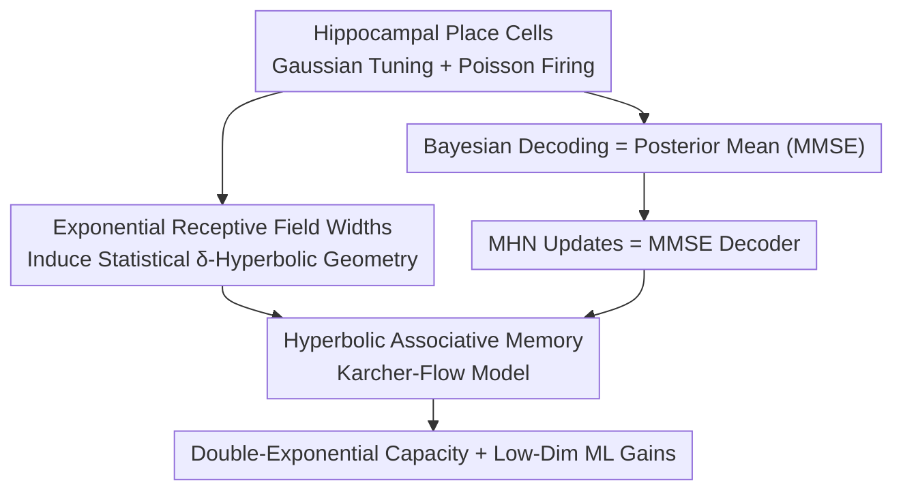

# Hyperbolic Neural Population Geometry Benefits Computation

**Conference**: ICML2026  
**arXiv**: [2606.10238](https://arxiv.org/abs/2606.10238)  
**Code**: Yes (Original source code is on GitHub)  
**Area**: Computational Neuroscience / Associative Memory / Hyperbolic Geometry  
**Keywords**: Neural population geometry, Hippocampal place cells, Modern Hopfield Networks, MMSE decoding, Memory capacity

## TL;DR
This paper establishes a theoretical framework for the experimental phenomenon where "hippocampal population activity exhibits a hyperbolic structure." It proves that place cells with exponentially distributed receptive field widths **statistically induce tree-like/hyperbolic stimulus geometry**. It further reveals that the update rules of Modern Hopfield Networks essentially compute the MMSE optimal decoder. Based on this, the authors propose an **associative memory model defined in hyperbolic space (Karcher-flow model)**, with capacity growing exponentially with dimension and double-exponentially with the maximum norm, significantly exceeding existing models.

## Background & Motivation
**Background**: Neuroscience is shifting from studying "single neurons" to the "collective representation of large-scale populations," focusing on how **neural population geometry** induced by population activity determines downstream computation. Machine learning is also drawing inspiration from population geometry to improve models. Recent experiments have found that **hyperbolic geometry emerges** in biological systems like the hippocampus.

**Limitations of Prior Work**: These findings are **almost entirely empirical**—lacking a theoretical explanation for how hyperbolic geometry is induced by neural populations, failing to characterize its impact on downstream decoding, and providing no design principles for ML models.

**Key Challenge**: The fundamental difference between hyperbolic (negative curvature, tree-like) structures and Euclidean representations is that hyperbolic volume expands exponentially with radius, making it naturally suitable for storing hierarchical and sparse information. However, a unified framework connecting "place cell encoding → hyperbolic geometry" generation mechanisms and the "hyperbolic geometry → superior decoding/memory" causal chain is missing.

**Goal**: To connect three components: (i) explaining how hyperbolic geometry is induced by neural populations; (ii) characterizing its impact on decoding; and (iii) distilling design principles for ML.

**Key Insight**: Leveraging the **experimental observation** that "place cell receptive field widths follow an exponential distribution" as a seed to prove it induces tree-like geometry. Then, using the bridge "Hopfield updates = MMSE estimation" to translate the decoding problem into associative memory, thereby constructing a high-capacity memory model in hyperbolic space.

## Method

### Overall Architecture
The paper is a theoretical work with a logical chain linking neuroscience observations, Bayesian decoding, and associative memory capacity. The encoding side models hippocampal spatial encoding using Gaussian tuning curves + Poisson firing: the firing rate of neuron $i$ for stimulus $s$ is $\lambda_i(s)=\lambda_{\max}\exp(-\|s-s_i\|_2^2/2\sigma_i^2)$, with receptive field widths $\sigma_i\sim\mathrm{Exp}(\beta)$. The decoding side formalizes "inferring stimulus $s$ from population activity $n$" as statistical estimation, noting that the Bayesian optimal solution under squared loss is the posterior mean (MMSE). The critical transition is the discovery that the **structure of the MMSE decoder is isomorphic to the update rules of Modern Hopfield Networks (MHN)**—both are softmax-weighted sums of memory patterns. Using this bridge, the authors upgrade the Euclidean MHN to a hyperbolic version, resulting in a high-capacity associative memory.

### Key Designs

**1. Induction of Statistical Hyperbolic Geometry by Exponential Receptive Field Widths: An Implementable Construction for "Hyperbolic Hippocampus"**

Experimental observations show that the receptive field widths $\sigma$ of place cells in hippocampal region CA1 approximately follow an exponential distribution $p(\sigma)\approx\zeta e^{-\zeta\sigma}$ (which corresponds to uniform sampling in a hyperbolic ball). The authors embed this observation into a Gaussian tuning model to study the stimulus "semi-metric" $d_{ab}=-\phi(\langle\lambda(s_a),\lambda(s_b)\rangle)+C$ induced by the inner product of population responses. To discuss hyperbolicity under randomness, the authors **relax Gromov's four-point condition into a probabilistic version**—defining "statistical $\delta$-hyperbolicity" (Def. 4.1): for quadruplets sampled uniformly on $\mathcal{S}$, the four-point excess $\Delta=L_{(1)}-L_{(2)}$ satisfies $\Pr[\Delta>2\delta]<\eta$. Theorem 4.2 proves that when the number of neurons $N=\mathcal{O}((L/\beta)^D)$ is sufficiently large, there exists a constant $\delta(\beta, \rho)$ such that this semi-metric is statistically $\delta$-hyperbolic and non-trivial ($\lim_{L\to\infty}\delta/L=0$, meaning tree-likeness is maintained despite the domain's infinite growth). Intuitively, this suggests that **by incorporating exponentially distributed receptive field widths into Gaussian tuning, the stimulus distance induced by population activity is tree-like**, implying the hippocampus encodes space using a hyperbolic semi-metric.

**2. Modern Hopfield Update = MMSE Decoder: Bridging Decoding and Associative Memory**

By discretizing the stimulus space into $M$ grid points and assuming a uniform prior, the posterior takes a softmax form $p(s_\mu\mid n)=\mathrm{softmax}_\mu(h(n))$. Thus, the Bayesian optimal decoder is $s^*(n)=\sum_\mu \mathrm{softmax}_\mu(h(n))\,s_\mu$. This is structurally isomorphic to the MHN update $\mathrm{MHN}(v)=\sum_\mu\mathrm{softmax}_\mu(\langle v,\xi_\mu\rangle)\,\xi_\mu$. Proposition 2.2 further conditions that when the posterior follows a Boltzmann distribution, **a single MHN update computes the posterior mean estimate**, i.e., $\mathrm{MHN}(v)=\arg\min_z\mathbb{E}_{p(\mu\mid v)}\|\xi_\mu-z\|_2^2$. This unifies "neural decoding" and "associative memory retrieval" into the same MMSE problem. This bridge is vital because it allows the loss function to be replaced with a version respecting the $\lambda(s)$ geometry, leading naturally to **non-Euclidean (hyperbolic) associative memory** in Section 4. The paper also introduces a nonlinear mapping $\psi^E$ from the tuning curve encoder to the MHN to decouple encoder and decoder.

**3. Hyperbolic Associative Memory Karcher-Flow Model and Double-Exponential Capacity: Moving Memory to Negative Curvature Space**

On the hyperbolic (Lorentz/hyperboloid) model $\mathbb{H}^d_\kappa$, the authors formulate decoding as an estimation under squared geodesic loss. The optimal solution is the posterior **weighted Fréchet mean**, solved iteratively via Karcher flow. This defines the **Karcher-flow Model (KFM)**: $H(\mathbf v)=\mathrm{Exp}_{\mathbf v}\big(\sum_\mu w_\mu(\mathbf v)\,\mathrm{Exp}^{-1}_{\mathbf v}(\boldsymbol\xi_\mu)\big)$, where weights $w_\mu$ use the **Lorentz inner product** $\langle\cdot,\cdot\rangle_L$ in the softmax. There are two key differences from MHN: first, it is defined on a hyperboloid; second, it uses the Lorentz inner product instead of the Euclidean one. The latter naturally encodes geodesic distance ($\cosh(\sqrt{|\kappa|}d_g)=-\kappa\langle\mathbf x,\mathbf y\rangle_L$) but with the same computational complexity as Euclidean inner products, allowing it to distinguish "similarly oriented but different norm" patterns at negligible cost. Regarding capacity, Theorem 4.8 proves that under Chernoff-type separation conditions, as $d\to\infty$, the recall success probability tends to 1, and the number of stored patterns $M$ satisfies $\log M=\Theta\!\big(\frac{d}{|\kappa|}\frac{e^{2\alpha r_{\min}}}{r_{\min}^2}\big)$—i.e., **capacity grows exponentially with dimension $d$ and double-exponentially with maximum norm $r_{\max}$**, adding an extra "double-exponential in $r_{\max}$" factor compared to MHN. Notably, this model **does not require normalization of memory patterns**, as the Lorentz inner product encodes geodesic distance rather than angular similarity.

### Loss & Training
The ML layers (KFAttention / KFPooling) can be constructed without introducing any hyperbolic parameters. Consequently, they can be trained using standard Euclidean optimizers like AdamW while still enjoying the capacity benefits of hyperbolic space; this contrasts with methods like (Shimizu et al., 2021) that require Riemannian optimizers.

## Key Experimental Results

### Pattern Completion
- Data: Synthetic points, MNIST, CIFAR10, dimensions $d\in\{10,20,100\}$, $r_{\max}=3$, 10 random seeds.
- Results: The Karcher-flow model shows high recall success rates. **The two baselines (MHN, DAM) fail to store even a small number of patterns in low dimensions.** When scanning $r_{\max}=1\to6$, KFM capacity increases significantly with $r_{\max}$, while MHN remains largely unaffected by this rescaling—consistent with the "double-exponential in $r_{\max}$" theory.

### Classification / Multi-Instance Learning (Table 1)

| Model | MNIST d=4 | MNIST d=8 | MNIST d=32 | MIL·Tiger | MIL·Fox | MIL·Elephant |
|------|------|------|------|------|------|------|
| KarcherFlow | **85.52** | **92.42** | **96.89** | 87.34 | **66.00** | 91.20 |
| Hopfield | 83.70 | 92.29 | 96.71 | 83.52 | 60.54 | 91.65 |
| Gulcehre 2019 | 84.85 | 91.71 | 96.80 | **89.20** | 62.92 | **93.04** |
| Shimizu 2021 | 67.35 | 84.17 | 84.17 | 80.32 | 57.76 | 85.32 |

(MNIST values are Accuracy %, MIL values are AUC; Mean ± Std Dev; Std Dev omitted here.)

### Key Findings
- **Gains are most prominent in low dimensions**: On MNIST at $d=4$, KarcherFlow outperforms Hopfield by ~+1.8, but the gap narrows to <+0.2 at $d=32$—validating the claim that "hyperbolic space provides more efficient storage in low dimensions."
- MIL results show trade-offs: KarcherFlow is best on Fox and significantly outperforms Hopfield on Tiger, but trails hyperbolic attention networks (Gulcehre 2019) on Tiger/Elephant—suggesting advantages are task-dependent rather than universal.
- Shimizu 2021, which requires Riemannian optimizers, performs significantly worse, highlighting the engineering value of "achieving hyperbolic capacity with Euclidean optimizers."

## Highlights & Insights
- **From Experimental Observation to Implementable Construction**: Not just another paper saying "we observed hyperbolicity," but a theorem-level mechanism: "exponential receptive field width → statistical hyperbolic geometry," turning the observations of Zhang et al. (2023) into derivable conclusions.
- **The Elegant "Hopfield = MMSE Decoder" Bridge**: This structural isomorphism unifies associative memory and Bayesian decoding, making "changing the geometry = changing the loss" a logical path for generalization.
- **Lorentz Inner Product as a Free Lunch**: It shares the same complexity as the Euclidean inner product but encodes geodesic distance and eliminates the need for pattern normalization—key to the capacity explosion and engineering feasibility.
- **Transferability**: KFAttention/KFPooling as plug-and-play layers suggest that in ML scenarios with limited memory dimensions (small models, edge deployment), using hyperbolic memory to trade for capacity is a promising direction.

## Limitations & Future Work
- The theory relies on several simplifying assumptions: single receptive fields ($K=1$), fixed amplitudes, uniform priors, grid discretization, and Chernoff separation conditions. Multi-field (large environment) scenarios are left for future work.
- It assumes a mapping $\psi^E/\psi^H$ between encoders and memory patterns, but the specific form and biological plausibility of this remain unexplored.
- The capacity results are asymptotic ($d\to\infty$); constants and boundaries in finite dimensions require more detailed experimental characterization.
- The scale of ML experiments is relatively small (MNIST/CIFAR10/three MIL datasets), and performance on some MIL tasks lags behind existing hyperbolic attention, necessitating testing on larger benchmarks.

## Related Work & Insights
- **vs. Modern Hopfield Networks (MHN, Ramsauer 2020) / DAM (Krotov 2021)**: These operate in Euclidean/continuous domains using Euclidean inner products and require normalized patterns. Ours moves to a hyperboloid, uses Lorentz inner products, and removes normalization constraints, yielding a capacity factor double-exponential in $r_{\max}$.
- **vs. Empirical "Biological Hyperbolic Geometry" Discoveries (Zhang 2022/2023)**: Those are observations; this paper completes the theoretical triad of "how it's induced + how it benefits decoding + how it guides ML."
- **vs. Hyperbolic Neural Networks (Gulcehre 2019 / Shimizu 2021)**: The latter often require Riemannian optimizers and parameters defined in hyperbolic space. This paper's layers involve no hyperbolic parameters and can be trained with standard Euclidean optimizers, simplifying deployment.

## Rating
- Novelty: ⭐⭐⭐⭐⭐ Unifies neural population geometry, Bayesian decoding, and associative memory capacity into a provable theoretical chain.
- Experimental Thoroughness: ⭐⭐⭐ Pattern completion and small-scale ML validation are solid, but benchmarks are small and some MIL tasks lack dominance.
- Writing Quality: ⭐⭐⭐⭐ The logical chain is clear, with both theorems and intuitive explanations, though the geometric prerequisites are high.
- Value: ⭐⭐⭐⭐ Provides a theoretical answer for "why biology uses hyperbolic encoding" and offers design principles for high-capacity memory in low dimensions.

<!-- RELATED:START -->

## Related Papers

- [\[CVPR 2026\] Hyperbolic Busemann Neural Networks](../../CVPR2026/computational_biology/hyperbolic_busemann_neural_networks.md)
- [\[ICML 2026\] Viral Proteins Reveal Geometry of Protein Language Models](viral_proteins_reveal_geometry_of_protein_language_models.md)
- [\[CVPR 2026\] HyperST: Hierarchical Hyperbolic Learning for Spatial Transcriptomics Prediction](../../CVPR2026/computational_biology/hyperst_hierarchical_hyperbolic_learning_for_spatial_transcriptomics_prediction.md)
- [\[ICLR 2026\] PoinnCARE: Hyperbolic Multi-Modal Learning for Enzyme Classification](../../ICLR2026/computational_biology/poinncare_hyperbolic_multi-modal_learning_for_enzyme_classification.md)
- [\[ICML 2026\] Neural Estimation of Pairwise Mutual Information in Masked Discrete Sequence Models](neural_estimation_of_pairwise_mutual_information_in_masked_discrete_sequence_mod.md)

<!-- RELATED:END -->
