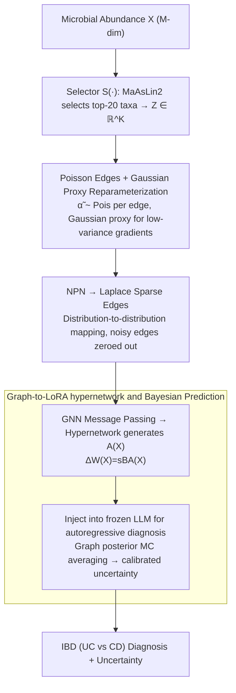

# iLoRA: Bayesian Low-Rank Adaptation with Latent Interaction Graphs for Microbiome Diagnosis

**Conference**: ICML 2026
**arXiv**: [2605.30179](https://arxiv.org/abs/2605.30179)
**Code**: https://github.com/GoodGoodMaul/iLoRA (Available)
**Area**: Scientific Computing / Microbiome Diagnosis / Parameter-Efficient Fine-Tuning / Bayesian Deep Learning
**Keywords**: LoRA, Bayesian Inference, Latent Interaction Graph, Microbiome, IBD Diagnosis

## TL;DR
iLoRA employs a Bayesian approach to infer a sparse microbial interaction graph from each microbiome sample (Poisson edges $\rightarrow$ Laplace sparsification $\rightarrow$ GNN embedding). This graph is then used to generate an input-conditioned LoRA matrix $A$, enabling the LLM to identify microbial "cross-talk" patterns simultaneously with IBD diagnosis.

## Background & Motivation

**Background**: The mainstream approach for gut microbiome diagnosis (especially IBD: UC vs CD) involves treating each taxon as an independent feature for classifiers or training LLMs/tree models on abundance tables. Concurrently, tools like SparCC or MaAsLin2 are used post-hoc to perform co-occurrence network analysis for model interpretation. On the LLM side, PEFT methods like LoRA are used to adapt large models to downstream biomedical tasks.

**Limitations of Prior Work**: These two lines of research are decoupled. First, standard LoRA learns a **globally static** low-rank update $\Delta W = sBA$ shared across all samples, failing to encode the internal relational structure of the input. Second, microbial interaction networks generally serve as post-hoc explanatory tools, entirely separated from predictor training, which leads to a lack of clarity between "predictive features" and "mechanistic interactions." Third, clinical deployment requires calibrated uncertainty, which a single point-estimate LoRA cannot provide.

**Key Challenge**: Clinical signals for IBD are inherently distributed across co-varying microbial clusters and cross-talk patterns, rather than marginal abundance differences of single taxa. However, the current LoRA + post-hoc network paradigm can neither utilize interaction structures during adaptation nor provide principled uncertainty.

**Goal**: (i) Make LoRA adaptation signals dependent on input-specific microbial interaction structures; (ii) Jointly learn interaction graphs and diagnosis under an end-to-end Bayesian objective; (iii) Provide calibrated predictions via the graph posterior.

**Key Insight**: The authors formulate the mapping of "sample $\rightarrow$ latent interaction graph $\rightarrow$ LoRA update" as a hypernetwork. The graph is no longer a post-hoc visualization but a conditional signal that **directly generates the adapter**. Consequently, the quality of the graph is directly supervised by the prediction loss.

**Core Idea**: The first Bayesian graph-conditioned LoRA framework, which infers a Poisson-edged and Laplace-sparsified latent graph for each sample, uses GNN embeddings, and then employs a hypernetwork to produce the LoRA $A$ matrix.

## Method

### Overall Architecture
iLoRA is a dual-branch hypernetwork. The prediction branch encodes the $M$-dimensional microbial abundance $X \in \mathbb{R}^M$ into prompts for a frozen LLM for next-token diagnosis. The iLoRA branch infers a $K \times K$ sparse interaction graph from the same $X$, transforms this graph into a sample-specific LoRA $A$ matrix, and injects it back into the prediction branch. Crucially, the graph is a conditional signal generating the adapter—processed through "Poisson edges $\rightarrow$ Laplace sparsification $\rightarrow$ GNN embedding $\rightarrow$ hypernetwork." The resulting $\Delta W(X) = sBA(X)$ ensures that LoRA operates according to the relational structure of the input, with the graph's quality directly supervised by the diagnostic loss.

### Key Designs

**1. Poisson Edges + Gaussian Proxy Reparameterization: Encoding co-occurrence with counts while maintaining low-variance gradients**

The semantics of microbial co-occurrence refer to the "non-negative intensity of events occurring together," for which Poisson random variables are well-suited. However, the difficulty lies in performing variational inference on $\mathrm{Pois}$ without low-variance reparameterization gradients, as discrete sampling is non-differentiable. iLoRA first uses selector $S(\cdot)$ (MaAsLin2 selecting the top-20 species in IBD experiments) to compress $X$ into $K$ key taxa $Z = S(X) \in \mathbb{R}^K$. For each pair $(i,j)$, a Poisson edge variable $\tilde\alpha_{ij} \sim \mathrm{Pois}(m_{ij})$ is inferred using a continuous Gaussian proxy $q_\varphi(\tilde\alpha_{ij}\mid Z) = \mathcal{N}(u_{ij}, \delta_{ij}^2)$ for the variational posterior. The prior is an input-dependent $\mathrm{Pois}(m_{ij}^{(0)})$ (where $m_{ij}^{(0)} = \mathrm{Softplus}(f_{\phi_0}(e_{ij}))$ and $e_{ij}$ is the edge feature concatenated from LLM-encoded node embeddings). This works due to a closed-form rate matching proof: when using a Gaussian proxy $\mathcal{N}(m,m)$ to approximate $\mathrm{Pois}(m)$, the unique positive minimum for KL matching is $m_{ij} = \frac{2u_{ij}-1 + \sqrt{(2u_{ij}-1)^2 + 8\delta_{ij}^2}}{4}$. Thus, training uses Gaussian reparameterization $\tilde\alpha_{ij} = u_{ij} + \delta_{ij}\epsilon_{ij}$ for gradients, while the KL term uses the closed-form Poisson-Poisson divergence $m_{ij}^{(0)} - m_{ij} + m_{ij}\log(m_{ij}/m_{ij}^{(0)})$, preserving the non-negative count interpretation while remaining end-to-end differentiable.

**2. NPN to Transform Poisson Edges into Laplace Sparse Edges: Auto-zeroing noisy edges to retain cross-talk**

The previous stage results in a dense graph, but real microbial interactions are inherently sparse. iLoRA adopts the Natural Parameter Network (NPN) approach, applying a sampling-free distribution-to-distribution mapping $(\mu_{ij}, b_{ij}) = \mathcal{T}_{\mathrm{npn}}(\tilde\alpha_{ij}, e_{ij})$. By fixing $\mu_{ij}=0$ and interpreting $b_{ij}$ as an edge-specific sparsity scale, they obtain $\bar\alpha_{ij} \sim \mathrm{Laplace}(0, b_{ij})$. The "sharp peak + heavy tail" shape of the Laplace distribution naturally induces sparsity, suppressing noisy edges to nearly zero. Implementation utilizes the Gaussian scale mixture representation of Laplace: $\bar\alpha_{ij} \mid \sigma_{ij}^2 \sim \mathcal{N}(0,\sigma_{ij}^2),\; \sigma_{ij} \sim \mathrm{Rayleigh}(b_{ij})$, allowing the NPN to run entirely in the continuous natural parameter space, bypassing discrete Poisson sampling. This acts as a deterministic probabilistic pipeline that propagates uncertainty from the Poisson stage. The prior is $\mathrm{Laplace}(0, b_0)$, with a closed-form KL: $\log(b_0/b_{ij}) + b_{ij}/b_0 - 1$.

**3. Graph-to-LoRA Hypernetwork and Bayesian Prediction: Converting the graph into an input-conditioned adapter with uncertainty**

Standard LoRA $A$ is an input-agnostic global parameter. iLoRA generates $A$ from the sparse interaction graph: GNN message passing on the graph yields a representation, which a hypernetwork maps to $A \in \mathbb{R}^r \times d_\text{in}$ (with $B$ statically shared). The input-conditioned $\Delta W(X) = s B A(X)$ is injected into the frozen LLM, so the adaptation signal "observes" the microbial structure. Since $A$ originates from the graph posterior, inference naturally performs Monte Carlo averaging $\hat p(y\mid X) = \frac{1}{S}\sum_s p_\theta(y\mid X, \bar A^{(s)})$ (with $\bar A^{(s)}$ sampled from the Laplace posterior), converting graph stochasticity into calibrated epistemic uncertainty.

### Loss & Training
End-to-end ELBO:

$\mathcal{L} = \mathcal{L}_{\mathrm{pred}} + \lambda_{\mathrm{Pois}} \sum_{i<j} \mathrm{KL}(\mathrm{Pois}(m_{ij}) \| \mathrm{Pois}(m_{ij}^{(0)})) + \lambda_{\mathrm{Lap}} \sum_{i<j} \mathrm{KL}(\mathrm{Lap}(0, b_{ij}) \| \mathrm{Lap}(0, b_0))$

Where $\mathcal{L}_{\mathrm{pred}}$ is the token NLL. The LLM backbone remains frozen; only the graph branch and LoRA (excluding the selector) are trained.

## Key Experimental Results

Two complementary tasks: Molweni (multi-party dialogue, validating structural recovery) + IBD UC vs CD diagnosis (validating clinical utility).

### Main Results

| Dataset | Metric | iLoRA | Strongest Baseline | Description |
|--------|------|-------|---------------|------|
| Molweni (Span QA) | F1 / EM | **74.51 / 60.57** | MLE 72.83 / 57.78 | Outperforms MAP, BLOB, MCD, ENS |
| Molweni Graph Recovery | Error Rate ↓ | **26.7%** | Random 50.0% | Inference vs Human Annotation |
| IBD | ECE ↓ | **0.0980** | BLOB 0.1570 | MLE is 0.2533 |
| IBD | AUROC ↑ | **0.7990** | BLOB 0.7812 | LAP 0.7641, ENS 0.7574 |
| IBD | AUPRC ↑ | **0.7617** | BLOB 0.7577 | |
| IBD | F1 (UC) ↑ | **0.6557** | MAP/LAP 0.6496 | |
| IBD Graph Recovery | Error Rate ↓ | **27.3%** | Random 50.0% | High-weight edges vs 41 cohort-level pairs |

Vs. standard tabular baselines (same 20 taxa): iLoRA AUROC 0.7990 significantly outperforms RF 0.6151 / XGBoost 0.5823 / MLP 0.5346—indicating gains come from interaction-aware adaptation, not just feature selection.

### Ablation Study

| Configuration | ECE ↓ | F1 (UC) ↑ | AUROC ↑ | AUPRC ↑ | Description |
|------|-------|-----------|---------|---------|------|
| MLE (vanilla LoRA) | 0.2533 | 0.6071 | 0.7617 | 0.7570 | No graph conditioning |
| iLoRA w/o Laplace | 0.1032 | 0.6341 | 0.7557 | 0.7440 | Poisson graph branch only |
| iLoRA full | **0.0980** | **0.6557** | **0.7990** | **0.7617** | With Laplace sparsification |

### Key Findings
- **Poisson stage primarily improves calibration**: Adding the Poisson graph branch alone reduced ECE from 0.2533 to 0.1032 (−59%), while AUROC remained similar (0.7617 → 0.7557), suggesting this step mainly injects Bayesian uncertainty.
- **Laplace sparsification primarily improves discriminative power**: Adding Laplace to Poisson increased AUROC from 0.7557 to 0.7990 and AUPRC from 0.7440 to 0.7617—sparsification eliminates noisy edges, highlighting task-relevant interaction structures.
- **Verifiable Graph Semantics**: Sample-level high-weight edges showed significant enrichment in 41 cohort-level significant taxon pairs (27.3% vs random 50%) and identified known IBD biomarkers (e.g., E. coli enriched in CD, R. lactaris as protective).
- **Robustness across Cohorts**: Effective across 8 independent cohorts, achieving AUROC of 0.95 on Franzosa_2019B and 0.86 on Lee_2021.

## Highlights & Insights
- **Clean "Graph → Adapter" design**: Unlike previous hypernetwork-based PEFT focusing on task embeddings or prompts, using a latent graph binds "structural inference" and "adapter generation" into a single objective. Structure quality is directly supervised by prediction loss, avoiding the ambiguity of post-hoc explanations.
- **Gaussian-proxy-for-Poisson closed-form rate matching is a reusable trick**: Theorem 5.1 provides a closed-form solution that resolves the dilemma of wanting Poisson semantics with reparameterization gradients.
- **NPN as a "distribution pipeline"**: Using sampling-free distribution-to-distribution mapping to bypass discrete Poisson sampling while retaining Laplace sparsity is more elegant than Gumbel-Softmax or straight-through estimators as it operates in natural parameter space without biased gradients.

## Limitations & Future Work
- **Limitations cited by authors**: Feature selection still depends on MaAsLin2 pre-screening ($K=20$); graph scale grows at $O(K^2)$; MC averaging during inference adds overhead; co-occurrence is not causality.
- **Independent observations**: The IBD test set is small (152 samples); while cohort-level stratified splits control for shift, the absolute sample size for AUROC ranking metrics is limited. The Laplace prior fixing $\mu_{ij}=0$ forces symmetric interactions, potentially losing directional cross-talk information.
- **Future directions**: Jointly learning the selector $S(\cdot)$ (e.g., differentiable top-K); using sparse attention or $O(K \log K)$ approximations for larger $K$; adding do-calculus modules for causal interactions; extending to multi-omics.

## Related Work & Insights
- **vs. LoRA / QLoRA**: iLoRA learns input-conditioned $\Delta W(X) = sBA(X)$ rather than input-agnostic global parameters, explicitly utilizing relational structures at the cost of graph-branch overhead.
- **vs. BLOB / Laplace LoRA**: These perform Bayesian inference in the **LoRA parameter space**, whereas iLoRA operates in the **latent graph space**. IBD results (ECE 0.098 vs BLOB 0.157) show that grounding uncertainty in interpretable structures improves calibration.
- **vs. Microbiome Network Inference**: Unlike SparCC or SPIEC-EASI which produce deterministic networks for downstream use, iLoRA binds inference and diagnosis under a single ELBO, ensuring edge importance is supervised by the prediction task.

## Rating
- Novelty: ⭐⭐⭐⭐⭐ The "first Bayesian graph-conditioned LoRA" is a unique combination of graph hypernetworks and closed-form Poisson rate matching.
- Experimental Thoroughness: ⭐⭐⭐⭐ Complemented by multiple tasks, tabular baselines, and cross-cohort validation, though limited by small test sets and $K=20$.
- Writing Quality: ⭐⭐⭐⭐ Clear motivation and complete derivations, though the NPN section is dense.
- Value: ⭐⭐⭐⭐ Provides a paradigm at the intersection of PEFT and microbiome diagnosis that is extensible to multi-omics; calibration improvements are vital for clinical application.

<!-- RELATED:START -->

## Related Papers

- [\[ICML 2026\] Learning the Interaction Prior for Protein-Protein Interaction Prediction: A Model-Agnostic Approach](learning_the_interaction_prior_for_protein-protein_interaction_prediction_a_mode.md)
- [\[ICML 2026\] Transformed Latent Variable Multi-Output Gaussian Processes](transformed_latent_variable_multi-output_gaussian_processes.md)
- [\[ICML 2026\] Scalable Single-Cell Gene Expression Generation with Latent Diffusion Models](scalable_single-cell_gene_expression_generation_with_latent_diffusion_models.md)
- [\[AAAI 2026\] Distributional Priors Guided Diffusion for Generating 3D Molecules in Low Data Regimes](../../AAAI2026/computational_biology/distributional_priors_guided_diffusion_for_generating_3d_molecules_in_low_data_r.md)
- [\[ICML 2026\] Cross-Chirality Generalization by Axial Vectors for Hetero-Chiral Protein-Peptide Interaction Design](cross-chirality_generalization_by_axial_vectors_for_hetero-chiral_protein-peptid.md)

<!-- RELATED:END -->
