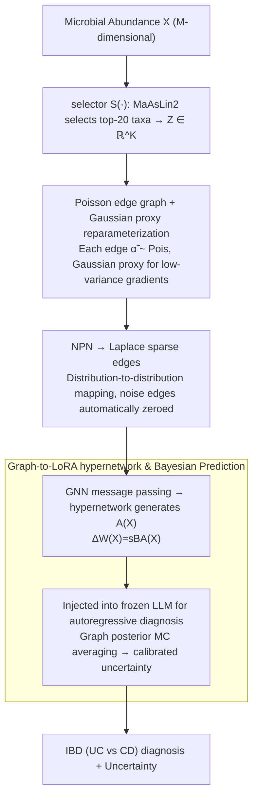

# iLoRA: Bayesian Low-Rank Adaptation with Latent Interaction Graphs for Microbiome Diagnosis

**Conference**: ICML 2026  
**arXiv**: [2605.30179](https://arxiv.org/abs/2605.30179)  
**Code**: https://github.com/GoodGoodMaul/iLoRA (Available)  
**Area**: Scientific Computing / Microbiome Diagnosis / Parameter-Efficient Fine-Tuning / Bayesian Deep Learning  
**Keywords**: LoRA, Bayesian Inference, Latent Interaction Graphs, Microbiome, IBD Diagnosis

## TL;DR
iLoRA employs a Bayesian approach to infer a sparse microbial interaction graph from each microbiome sample (Poisson edges $\rightarrow$ Laplace sparsification $\rightarrow$ GNN embedding). This graph is then used to generate an input-conditioned LoRA matrix $A$, enabling the LLM to learn which bacteria are "cross-talking" while simultaneously performing IBD diagnosis.

## Background & Motivation

**Background**: The mainstream approach for intestinal microbiome diagnosis (specifically IBD: UC vs CD) involves treating each taxon as an independent feature for a classifier or training LLMs/tree models based on abundance tables. Separately, tools like SparCC or MaAsLin2 are used for post-hoc co-occurrence network analysis to interpret the models. In the LLM domain, PEFT methods such as LoRA are used to adapt large models to downstream biomedical tasks.

**Limitations of Prior Work**: These two lines of research are disconnected. First, standard LoRA learns a **globally static** low-rank update $\Delta W = sBA$ shared across all samples, failing to encode the internal relational structure of the input. Second, microbial interaction networks are generally used as post-hoc explanatory tools, entirely separated from predictor training, which prevents a clear distinction between "predictive features" and "mechanistic interactions." Third, clinical deployment requires calibrated uncertainty, which a single point-estimate LoRA cannot provide.

**Key Challenge**: Clinical signals for IBD are inherently distributed within co-varying microbial populations and cross-talk patterns rather than marginal abundance differences of individual taxa. However, the current LoRA + post-hoc network paradigm can neither utilize interaction structures during the adaptation phase nor provide principled uncertainty.

**Goal**: (i) Make LoRA adaptation signals dependent on input-specific microbial interaction structures; (ii) Jointly learn interaction graphs and diagnosis under an end-to-end Bayesian objective; (iii) Provide calibrated predictions through graph posteriors.

**Key Insight**: The authors treat the pipeline of "sample $\rightarrow$ latent interaction graph $\rightarrow$ LoRA update" as a hypernetwork—the graph is no longer a post-hoc visualization but a conditional signal that **directly generates the adapter**. Consequently, the quality of the graph is directly supervised by the prediction loss.

**Core Idea**: The first Bayesian graph-conditioned LoRA framework, which infers a Poisson-edged and Laplace-sparsified latent graph for each sample, then uses a GNN embedding and a hypernetwork to produce the LoRA $A$ matrix.

## Method

### Overall Architecture
iLoRA is a dual-branch hypernetwork: the prediction branch encodes the $M$-dimensional microbial abundance $X \in \mathbb{R}^M$ into prompts for a frozen LLM to perform next-token diagnosis. The iLoRA branch infers a $K \times K$ sparse microbial interaction graph from the same $X$ and transforms this graph into a sample-specific LoRA $A$ matrix injected back into the prediction branch. Crucially, the graph is a conditional signal generating the adapter—following "Poisson edges $\rightarrow$ Laplace sparsification $\rightarrow$ GNN embedding $\rightarrow$ hypernetwork," the resulting $\Delta W(X) = sBA(X)$ allows LoRA to operate according to the relational structure of the input.

### Key Designs

**1. Poisson Edge Graph + Gaussian Proxy Reparameterization: Encoding co-occurrence with counts while maintaining low-variance gradients**

The semantics of microbial co-occurrence represent non-negative event intensities of two taxa appearing together. Poisson random variables fit this meaning, but the challenge lies in the non-differentiability of discrete sampling. iLoRA uses a selector $S(\cdot)$ to compress $X$ into $K$ key taxa $Z = S(X) \in \mathbb{R}^K$. For each pair $(i,j)$, it infers a Poisson edge variable $\tilde\alpha_{ij} \sim \mathrm{Pois}(m_{ij})$. The variational posterior uses a continuous Gaussian proxy $q_\varphi(\tilde\alpha_{ij}\mid Z) = \mathcal{N}(u_{ij}, \delta_{ij}^2)$, with an input-dependent prior $\mathrm{Pois}(m_{ij}^{(0)})$. This is feasible due to a closed-form rate matching proven in the paper: when using a Gaussian proxy $\mathcal{N}(m,m)$ to approximate $\mathrm{Pois}(m)$, the unique positive minimum matching the KL is $m_{ij} = \frac{2u_{ij}-1 + \sqrt{(2u_{ij}-1)^2 + 8\delta_{ij}^2}}{4}$. Thus, training uses Gaussian reparameterization for gradients, while the KL term uses the closed-form Poisson-Poisson divergence $m_{ij}^{(0)} - m_{ij} + m_{ij}\log(m_{ij}/m_{ij}^{(0)})$.

**2. NPN for Transforming Poisson Edges into Laplace Sparse Edges: Automatic sparsification to retain core cross-talk**

Real microbial interactions are inherently sparse. iLoRA uses a Natural Parameter Network (NPN) for a sampling-free distribution-to-distribution mapping $(\mu_{ij}, b_{ij}) = \mathcal{T}_{\mathrm{npn}}(\tilde\alpha_{ij}, e_{ij})$, where $\mu_{ij}=0$ and $b_{ij}$ is the edge-specific sparsity scale, yielding $\bar\alpha_{ij} \sim \mathrm{Laplace}(0, b_{ij})$. The Laplace distribution's "peak + heavy tail" shape naturally induces sparsity, suppressing noise edges while amplifying key interactions. The implementation uses a Gaussian scale mixture of the Laplace distribution to handle uncertainty through a deterministic probabilistic pipeline.

**3. Graph-to-LoRA Hypernetwork and Bayesian Prediction: Turning graphs into input-conditioned adapters with uncertainty**

Standard LoRA $A$ matrices are input-agnostic. iLoRA generates $A$ from the sparse interaction graph: GNN message passing produces a graph representation, which a hypernetwork maps to $A \in \mathbb{R}^r \times d_\text{in}$. Since $A$ is derived from the graph posterior, inference can involve Monte Carlo averaging $\hat p(y\mid X) = \frac{1}{S}\sum_s p_\theta(y\mid X, \bar A^{(s)})$, translating graph stochasticity into calibrated epistemic uncertainty—a requirement for clinical deployment that point-estimate LoRA cannot meet.

### Loss & Training
End-to-end ELBO:

$$\mathcal{L} = \mathcal{L}_{\mathrm{pred}} + \lambda_{\mathrm{Pois}} \sum_{i<j} \mathrm{KL}(\mathrm{Pois}(m_{ij}) \| \mathrm{Pois}(m_{ij}^{(0)})) + \lambda_{\mathrm{Lap}} \sum_{i<j} \mathrm{KL}(\mathrm{Lap}(0, b_{ij}) \| \mathrm{Lap}(0, b_0))$$

Where $\mathcal{L}_{\mathrm{pred}}$ is the token NLL. The LLM backbone remains frozen, only the graph branch and LoRA components are trained.

## Key Experimental Results

### Main Results

| Dataset | Metric | iLoRA | Best Baseline | Description |
|--------|------|-------|---------------|------|
| Molweni (Span QA) | F1 / EM | **74.51 / 60.57** | MLE 72.83 / 57.78 | Outperforms MAP, BLOB, MCD, ENS |
| Molweni Graph Recovery | Error Rate ↓ | **26.7%** | Random 50.0% | Inferred adjacency vs. manual labels |
| IBD | ECE ↓ | **0.0980** | BLOB 0.1570 | MLE is 0.2533 |
| IBD | AUROC ↑ | **0.7990** | BLOB 0.7812 | LAP 0.7641, ENS 0.7574 |
| IBD | AUPRC ↑ | **0.7617** | BLOB 0.7577 | |
| IBD | F1 (UC) ↑ | **0.6557** | MAP/LAP 0.6496 | |

Compared to standard tabular baselines (using the same 20 taxa): iLoRA AUROC of 0.7990 significantly exceeds RF (0.6151) and XGBoost (0.5823), indicating gains come from interaction-aware adaptation, not just feature selection.

### Ablation Study

| Config | ECE ↓ | F1 (UC) ↑ | AUROC ↑ | AUPRC ↑ | Description |
|------|-------|-----------|---------|---------|------|
| MLE (vanilla LoRA) | 0.2533 | 0.6071 | 0.7617 | 0.7570 | No graph conditioning |
| iLoRA w/o Laplace | 0.1032 | 0.6341 | 0.7557 | 0.7440 | Poisson graph only |
| iLoRA full | **0.0980** | **0.6557** | **0.7990** | **0.7617** | With Laplace sparsification |

### Key Findings
- **Poisson stage primarily improves calibration**: Adding the Poisson graph branch reduces ECE from 0.2533 to 0.1032 (−59%), while AUROC remains stable, indicating this step injects Bayesian uncertainty.
- **Laplace sparsification improves discriminative power**: Adding Laplace to the Poisson base increases AUROC from 0.7557 to 0.7990 by suppressing noise edges.
- **Graph semantics are verifiable**: High-weight edges in the samples are significantly enriched for 41 cohort-level significant taxon pairs, identifying known IBD biological markers.
- **Robust across cohorts**: Works consistently across 8 independent cohorts (e.g., Franzosa_2019B AUROC 0.95).

## Highlights & Insights
- **Clean "Graph $\rightarrow$ Adapter" design**: Unlike hypernetwork-based PEFT based on task embeddings, this use of latent graphs ties structure inference to adapter generation, ensuring structure quality is supervised by prediction loss.
- **Closed-form rate matching for Gaussian-proxy-for-Poisson**: The derived solution for $m_{ij}$ resolves the conflict between Poisson semantics and reparameterization gradients, useful for any discrete latent variable work.
- **NPN as a "distribution pipeline"**: Using sampling-free mappings to avoid discrete Poisson sampling while maintaining Laplace sparsity priors is more elegant than Gumbel-Softmax or straight-through estimators.

## Limitations & Future Work
- **Limitations**: Feature selection still relies on MaAsLin2 pre-screening ($K=20$); graph scale grows at $O(K^2)$; inference requires MC averaging overhead; graphs represent co-occurrence, not causality.
- **Future Work**: Learn the selector $S(\cdot)$ jointly; optimize graph branch to $O(K \log K)$ for larger $K$; incorporate do-calculus for causal interactions; extend to multi-omics.

## Related Work & Insights
- **vs. Standard LoRA / QLoRA**: iLoRA learns input-conditioned $\Delta W(X)$ instead of input-agnostic global parameters,显式 incorporating relational structures.
- **vs. BLOB / Laplace LoRA**: iLoRA performs Bayesian inference in the latent graph space rather than the parameter space, leading to better calibration (ECE 0.098 vs BLOB 0.157).
- **vs. Microbiome network inference**: Instead of independent post-hoc networks, iLoRA binds inference and diagnosis under a single ELBO, ensuring edge importance is supervised.

## Rating
- Novelty: ⭐⭐⭐⭐⭐ 
- Experimental Thoroughness: ⭐⭐⭐⭐ 
- Writing Quality: ⭐⭐⭐⭐ 
- Value: ⭐⭐⭐⭐ 

<!-- RELATED:START -->

## Related Papers

- [\[ICML 2026\] Disentangling Latent Risk Pathways via Bayesian Hypergraph Inference](disentangling_latent_risk_pathways_via_bayesian_hypergraph_inference.md)
- [\[ICML 2026\] Learning the Interaction Prior for Protein-Protein Interaction Prediction: A Model-Agnostic Approach](learning_the_interaction_prior_for_protein-protein_interaction_prediction_a_mode.md)
- [\[ICML 2026\] Transformed Latent Variable Multi-Output Gaussian Processes](transformed_latent_variable_multi-output_gaussian_processes.md)
- [\[ICML 2026\] Scalable Single-Cell Gene Expression Generation with Latent Diffusion Models](scalable_single-cell_gene_expression_generation_with_latent_diffusion_models.md)
- [\[ICML 2026\] Cross-Chirality Generalization by Axial Vectors for Hetero-Chiral Protein-Peptide Interaction Design](cross-chirality_generalization_by_axial_vectors_for_hetero-chiral_protein-peptid.md)

<!-- RELATED:END -->
