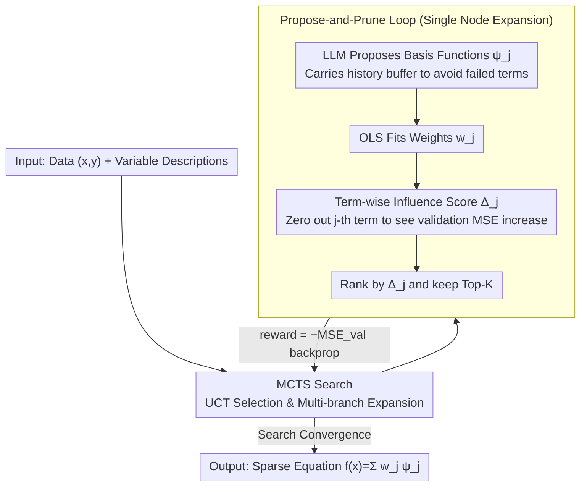

# Influence-Guided Symbolic Regression: Scientific Discovery via LLM-Driven Equation Search with Granular Feedback

**Conference**: ICML 2026  
**arXiv**: [2605.29184](https://arxiv.org/abs/2605.29184)  
**Code**: https://github.com/DrShushen/IGSR (Available)  
**Area**: Computational Biology  
**Keywords**: Symbolic Regression, Influence Score, LLM Equation Discovery, MCTS, Interpretable Modeling

## TL;DR
IGSR decomposes symbolic regression into a two-step "LLM proposes basis functions $\psi_j$ + pruning via granular influence scores $\Delta_j$" cycle. This cycle is embedded into Monte Carlo Tree Search (MCTS) to explore the combinatorial space. It achieves state-of-the-art MSE and symbolic recall across six biomedical benchmarks and LLM-SRBench, while discovering a novel relationship between DNA methylation and RNA Pol II pausing validated via wet-lab experiments.

## Background & Motivation

**Background**: Traditional symbolic regression (GP-SR, PySR, SINDy) performs evolution or sparse regression over a predefined operator library. While they output closed-form formulas, they struggle with high-dimensional inputs where $d \gg 20$. Recently, LLM-driven equation discovery methods (D3, ICSR, LLM-SR, LaSR) use scientific priors of LLMs to "propose" basis functions, pushing symbolic regression into complex scenarios like biology, epidemiology, and pharmacokinetics.

**Limitations of Prior Work**: All LLM-based equation discovery methods rely on **global scalar signals** (typically global MSE or code execution errors) as feedback. This tells the LLM "this formula is good/bad" but **not which specific term contributes or hinders performance**. Consequently, the search degenerates into trial-and-error, depending heavily on the LLM's generative prior rather than the data itself.

**Key Challenge**: Generation (creative proposal) and selection (rigorous pruning) are coupled within a single scalar loss. The LLM is tasked with both "proposing new terms" and "judging if old terms should stay." It often fails at the latter, hallucinating and deleting statistically significant terms as irrelevant.

**Goal**: (1) Provide LLMs with **term-wise** fine-grained credit assignment signals; (2) **Decouple** generation and selection—let the LLM create, let statistics select; (3) Efficiently balance exploration and exploitation in the combinatorial search space.

**Key Insight**: The authors restrict the model class to a **linear model** of basis functions $f(\mathbf{x}) = \sum_{j=1}^M w_j \psi_j(\mathbf{x})$. Thus, the marginal contribution of each $\psi_j$ is naturally quantifiable—defined as $\Delta_j$, the increase in validation MSE when a specific term is removed. This provides a direct, cheap, and principled signal.

**Core Idea**: Replace global MSE with **term-wise influence scores $\Delta_j$** for feedback, embedding the "propose-and-prune" loop into MCTS to explore the combinatorial space of basis functions.

## Method

### Overall Architecture
IGSR aims to discover sparse closed-form models $f(\mathbf{x}) = \sum_j w_j \psi_j(\mathbf{x})$, where each basis function $\psi_j$ is proposed by an LLM and can be arbitrarily non-linear, while the outer weights $w_j$ are fitted via Ordinary Least Squares (OLS). The core is the complete separation of "proposing new terms" and "judging retention." The LLM acts as the creator, while a cheap statistical metric makes the selection. This propose-and-prune loop is integrated into MCTS to search the basis function combination space.

### Key Designs

**1. Term-wise Influence Score $\Delta_j$: From Guessing to Measuring**

A common failure of LLM-based symbolic regression is using only global MSE as feedback; the LLM knows the formula's overall quality but not which term is a "hero" or a "villain." By constraining the model to a linear superposition of basis functions, IGSR makes marginal contributions quantifiable. After fitting the linear model, the $j$-th weight is set to zero (keeping other coefficients fixed) to measure the increase in validation MSE: $\Delta_j = \mathrm{MSE}_{\mathrm{val}}(\mathbf{w}_{-j}) - \mathrm{MSE}_{\mathrm{val}}(\mathbf{w})$. This essentially ports classic "leave-one-out" analysis from the "data point dimension" to the "structural dimension." Calculating $\Delta_j$ requires only one OLS fit and simple algebra, offering structure-aware credit assignment at near-zero cost.

**2. Propose-and-Prune Loop: Decoupling Generation and Selection**

Coupling creation and selection in one scalar loss forces the LLM to simultaneously think and judge, where LLMs are notoriously unreliable at judging statistical significance. IGSR's loop splits these: in each round, the LLM agent reads the context (variable descriptions, active terms, historical buffer of kept/dropped terms with $\Delta_j$ impact) to generate candidate $\psi_j$. These are combined with existing terms for OLS fitting to calculate $\Delta_j$, and terms are kept based on their scores. **Deterministic Pruning** (keeping Top-$K$ by $\Delta_j$) is the default—hallucination-free and cheap. An optional **Agentic Pruning** (IGSR-Agent) uses a second LLM to evaluate the $(\psi_j, w_j, \Delta_j)$ triplet, using $\Delta_j \approx 0 \Rightarrow$ drop as a heuristic combined with semantic reasoning.

**3. MCTS Search: Balancing Exploration and Exploitation**

Single-chain iterative refinement often gets stuck in functional form biases. IGSR wraps the propose-and-prune loop in an MCTS tree. Each node is an equation state (a set of $\psi_j$ with weights). Multiple successors can branch out from a parent—one exploring trigonometric terms, another exploring interactions, and another exploring exponential decays. The node reward is $-\mathrm{MSE}_{\mathrm{val}}$, using UCT $\bar r_i + c\sqrt{\ln N / n_i}$ for selection. The default is **Heuristic MCTS**, which backpropagates immediate rewards without full rollouts to maximize breadth within the search budget.

### Loss & Training
IGSR is a search-based method rather than end-to-end training. OLS fitting uses the training set, while $\Delta_j$ and MCTS rewards are calculated on the validation set. The sparsity limit $K$ is the primary hyperparameter. LLM backends used include GPT-4o for primary benchmarks and GPT-4o-mini for LLM-SRBench (with a 300k token budget).

## Key Experimental Results

### Main Results
Six biomedical benchmarks (Lung Cancer variants, COVID-19, RNA Polymerase, Warfarin), 25 seeds, GPT-4o:

| Dataset | IGSR MSE | Best White-box Baseline MSE | Notes |
|--------|------|----------|------|
| Lung Cancer | 5.64e-5 | ICL 0.0557 (3 orders better) | Clean tumor growth ODE |
| LC + Chemo | 0.0013 | ICSR 0.688 | Coupled ODE with chemotherapy |
| LC + Chemo+Radio | 0.0141 | LaSR 3.97 | Hardest coupled triple-drug dynamics |
| COVID-19 | 5.01e-8 | ICL 9.35e-8 | Epidemic simulation; comparable to RNN |
| RNA Polymerase | 0.0111 | ICL 0.0119 | 263-dim high-dimensional genomic data |
| Warfarin | 0.565 | ICSR 0.497 | Only case where IGSR was 2nd best |
| Average Rank | **1.17** | ICL 3.83 | IGSR is 1st in 5/6 white-box tasks |

On LLM-SRBench (128 discovery problems), IGSR achieved the best average rank across NMSE, Acc$_{0.1}$, Term Recall, and Symbolic Accuracy. It also outperformed AFE baselines (AutoFeat, OpenFE, SyMANTIC, CAAFE) on 5/6 datasets.

### Ablation Study

| Configuration | Observation | Explanation |
|------|---------|------|
| Full IGSR (MCTS + Δ + history) | Best Performance | Complete model effectiveness |
| Linear Iterative (No MCTS) | Lower convergence speed | MCTS structure improves search |
| No $\Delta_j$ feedback (ICL) | Rank drops 1.17 → 3.83 | Influence score is the core gain source |
| No history buffer | LLM repeats failed terms | In-context memory is necessary |
| IGSR-Agent vs IGSR | Slightly worse/unstable | Selection does not require LLM intervention |

### Key Findings
- **Granular Signals are Crucial**: Degrading IGSR to use only global loss (ICL) drops performance to baseline levels, suggesting $\Delta_j$—not just MCTS—is the key driver.
- **Deterministic Pruning Beats LLM Pruning**: IGSR-Agent is less stable, confirming that decoupling generation and selection by assigning the latter to statistics is optimal.
- **Wet-lab Discovery**: For RNA Pol II pausing, IGSR not only replicated known mechanisms but hypothesized a new relationship involving DNA methylation. This hypothesis was later **supported by wet-lab cell treatment and sequencing**, marking a rare instance of a symbolic regression method leading to a verified scientific discovery.

## Highlights & Insights
- **Repurposing "Leave-one-out"**: While traditional influence functions (Cook & Weisberg) study the impact of data points on parameters, IGSR applies this to basis functions. This transforms symbolic regression into an "influence-guided" structural search at near-zero cost.
- **"Gen-Select Decoupling" is a General Agent Insight**: Using LLMs for creative proposals is effective, but using them for selection introduces hallucinations. Replacing LLM judgment with cheap statistical metrics wherever possible is a key finding for robust agent design.
- **Wet-lab Closed-loop**: Moving beyond benchmark performance, IGSR demonstrates its capability in generating verifiable scientific hypotheses, making it applicable to fields like drug mechanism discovery and materials science.

## Limitations & Future Work
- The model class is restricted to **linear combinations** of basis functions $\sum w_j \psi_j$, which might not capture deep nesting or complex cyclic dynamics (though individual $\psi_j$ can be non-linear).
- Influence scores are **conditional leave-one-out** (fixing other weights), which might underestimate contributions in cases of extreme collinearity. 
- Performance remains dependent on the LLM's proposal quality, which may diminish in "pure mathematics" domains lacking scientific priors.
- Future work: Upgrading $\Delta_j$ to group-wise or SHAP-like attribution to handle strongly coupled terms and integrating physical consistency constraints into MCTS rewards.

## Related Work & Insights
- **vs LLM-SR / D3 / LaSR**: These methods use LLMs but rely on scalar feedback. IGSR's differentiator is the **structure-aware** $\Delta_j$ signal.
- **vs PySR / SINDy**: Traditional SR relies on fixed operator libraries and manual feature engineering; IGSR uses LLM priors to "think" of features in high-dimensional spaces.
- **vs AFE (AutoFeat / OpenFE)**: AFE generates features for black-box models; IGSR produces a sparse, interpretable linear equation using $\Delta_j$ for robust feature selection.
- **vs SHAP / LIME**: While SHAP/LIME provide post-hoc explanations for black-box models, $\Delta_j$ is an **active** feedback signal driving the search process directly and efficiently.

## Rating
- Novelty: ⭐⭐⭐⭐ (Applies leave-one-out influence to basis functions as LLM feedback).
- Experimental Thoroughness: ⭐⭐⭐⭐⭐ (Benchmarks + LLM-SRBench + AFE comparison + wet-lab verification).
- Writing Quality: ⭐⭐⭐⭐ (Clear differentiation in Table 1, well-structured algorithms).
- Value: ⭐⭐⭐⭐⭐ (Demonstrates real scientific discovery; design patterns applicable to other AI-for-Science agents).

<!-- RELATED:START -->

## Related Papers

- [\[ACL 2025\] LADDER: Language Driven Slice Discovery and Error Rectification in Vision Classifiers](../../ACL2025/computational_biology/ladder_language-driven_slice_discovery_and_error_rectification_in_vision_classif.md)
- [\[ICLR 2026\] Continuous Multinomial Logistic Regression for Neural Decoding](../../ICLR2026/computational_biology/continuous_multinomial_logistic_regression_for_neural_decoding.md)
- [\[CVPR 2026\] BiGMINT: Biologically-guided Hierarchical Multimodal Integration for Modeling Multiple Compound Activities in Drug Discovery](../../CVPR2026/computational_biology/bigmint_biologically-guided_hierarchical_multimodal_integration_for_modeling_mul.md)
- [\[ICML 2026\] TadA-Bench: A Million-Variant Benchmark for Future-Round Discovery Toward Agentic Protein Engineering](tada-bench_a_million-variant_benchmark_for_future-round_discovery_toward_agentic.md)
- [\[ICML 2026\] Learning Protein Structure-Function Relationships through Knowledge-guided Representation Decomposition](learning_protein_structure-function_relationships_through_knowledge-guided_repre.md)

<!-- RELATED:END -->
