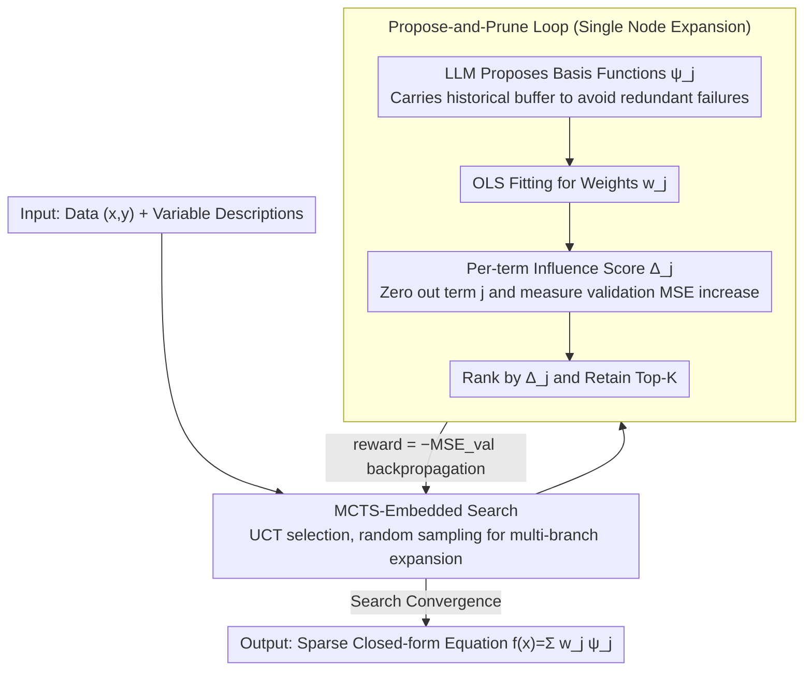

# Influence-Guided Symbolic Regression: Scientific Discovery via LLM-Driven Equation Search with Granular Feedback

**Conference**: ICML 2026  
**arXiv**: [2605.29184](https://arxiv.org/abs/2605.29184)  
**Code**: https://github.com/DrShushen/IGSR (Available)  
**Area**: Computational Biology  
**Keywords**: Symbolic Regression, Influence Score, LLM Equation Discovery, MCTS, Interpretable Modeling

## TL;DR
IGSR decomposes symbolic regression into a two-step cycle: "LLM proposes basis functions $\psi_j$ + pruning via per-term influence scores $\Delta_j$." This cycle is embedded within MCTS to search the combinatorial space. It achieves the best MSE and symbolic recall across six biomedical benchmarks and LLM-SRBench, while discovering a novel relationship between DNA methylation and RNA Pol II pausing in wet-lab experiments.

## Background & Motivation

**Background**: Traditional symbolic regression (GP-SR, PySR, SINDy) performs evolution or sparse regression over a preset operator library. While they output closed-form formulas, they struggle with high-dimensional inputs ($d \gg 20$). Recent LLM-driven equation discovery methods (D3, ICSR, LLM-SR, LaSR) leverage scientific priors of LLMs to "hallucinate" basis functions directly, pushing symbolic regression into complex scenarios like biology, epidemiology, and pharmacokinetics.

**Limitations of Prior Work**: All LLM-based equation discovery methods rely on **global scalar signals** (typically global MSE or code execution errors) as feedback. This informs the LLM whether a formula is "good or bad" but **does not specify which term contributes or which term hinders performance**. Consequently, the search degenerates into trial-and-error, highly dependent on the LLM's generative prior rather than the data itself.

**Key Challenge**: Generation (creative proposal) and selection (rigorous pruning) are coupled within the same scalar loss. The LLM is tasked with both "proposing new terms" and "judging if old terms should remain." It fundamentally fails at the latter, often hallucinating and deleting statistically significant terms as irrelevant.

**Goal**: (1) Provide LLMs with **per-term** fine-grained credit assignment signals; (2) **Decouple** generation and selection—let LLMs handle creativity while leaving selection to statistics; (3) Efficiently balance exploration and exploitation in the combinatorial search space.

**Key Insight**: The authors constrain the model class to **linear models** of basis functions: $f(\mathbf{x}) = \sum_{j=1}^M w_j \psi_j(\mathbf{x})$. This makes the marginal contribution of each $\psi_j$ naturally quantifiable. By defining the increase in validation MSE after removing a specific term as $\Delta_j$, the method obtains a direct, inexpensive, and principled signal.

**Core Idea**: Replace global MSE with **per-term influence scores $\Delta_j$** as feedback and embed the "propose-and-prune" cycle into MCTS to explore the combinatorial space of basis functions.

## Method

### Overall Architecture
IGSR aims to discover sparse closed-form models $f(\mathbf{x}) = \sum_j w_j \psi_j(\mathbf{x})$. Each basis function $\psi_j$ is proposed by an LLM and can be arbitrarily non-linear, while the outer weights $w_j$ are fitted via Ordinary Least Squares (OLS). The core mechanism separates "proposing new terms" from "deciding what to keep"—LLMs only create candidates, while selection is handled by a lightweight statistic. This proposal-pruning cycle is then nested within MCTS to search the combinatorial space.

### Key Designs

**1. Per-term Influence Score $\Delta_j$: Moving from Guessing to Measuring**

A common pitfall of LLM-based equation discovery is using only global MSE as feedback; the LLM knows the formula's quality but not which term is responsible. By restricting the model to a linear combination of basis functions, IGSR makes marginal contributions quantifiable. For a fitted linear model, the influence score is defined as $\Delta_j = \mathrm{MSE}_{\mathrm{val}}(\mathbf{w}_{-j}) - \mathrm{MSE}_{\mathrm{val}}(\mathbf{w})$, where the weight of the $j$-th term is zeroed. This essentially shifts classic leave-one-out analysis from the "data dimension" to the "structural dimension." While traditional influence functions ask "how much do parameters change if this sample is removed," $\Delta_j$ asks "how much does the error increase if this term is removed." Computation requires only one OLS solution and simple algebra, offering structure-aware credit assignment at near-zero cost.

**2. Propose-and-Prune Loop: Decoupling Generation and Selection**

Coupling creation and selection in a single scalar loss forces the LLM to simultaneously brainstorm new terms and judge old ones—a task where LLMs are prone to hallucinated deletions of statistically significant terms. IGSR separates these tasks: in each round, the LLM agent reads the context (variable descriptions, active terms, historical records of retained/discarded terms with MSE impacts) to generate candidates $\psi_j$. These are concatenated with existing terms to fit coefficients via OLS and calculate $\Delta_j$, after which only the Top-$K$ terms are retained based on their scores. **Deterministic pruning** (selection purely via $\Delta_j$) is the default for its zero hallucination and reproducibility. An optional **Agentic pruning** (IGSR-Agent) uses a second LLM to interpret the $(\psi_j, w_j, \Delta_j)$ triplets, using $\Delta_j \approx 0 \Rightarrow \text{drop}$ as a heuristic combined with semantic reasoning.

**3. MCTS-Embedded Search: Balancing Exploration and Exploitation**

Single-chain iterative refinement often gets trapped in specific functional form biases. IGSR wraps the propose-and-prune loop in an MCTS tree. Each node represents an equation state (a set of $\psi_j$ and weights). Random sampling from a parent node via the LLM creates branches exploring different functional directions (e.g., trigonometric, interaction, or exponential decay). The node reward is set to $-\mathrm{MSE}_{\mathrm{val}}$, and the UCT formula $\bar r_i + c\sqrt{\ln N / n_i}$ guides expansion.

### Loss & Training
IGSR does not perform end-to-end training; the process is a structured search. OLS fitting utilizes the training set, while $\Delta_j$ and MCTS rewards are calculated on a validation set. The sparsity limit $K$ is the primary hyperparameter. GPT-4o was used for the six main benchmarks, and GPT-4o-mini for LLM-SRBench (with a 300k token budget for fair comparison).

## Key Experimental Results

### Main Results
Six biomedical benchmarks (Lung Cancer variations, COVID-19, RNA Polymerase, Warfarin), 25 seeds, GPT-4o:

| Dataset | IGSR MSE | Best White-box Baseline MSE | Notes |
|--------|------|----------|------|
| Lung Cancer | 5.64e-5 | ICL 0.0557 (3 orders of magnitude difference) | Clean tumor growth ODE |
| LC + Chemo | 0.0013 | ICSR 0.688 | Coupled ODE with chemotherapy |
| LC + Chemo+Radio| 0.0141 | LaSR 3.97 | Coupled 3-drug dynamics |
| COVID-19 | 5.01e-8 | ICL 9.35e-8 | Epidemic simulation; comparable to RNN |
| RNA Polymerase | 0.0111 | ICL 0.0119 | 263-dimensional genomic data |
| Warfarin | 0.565 | ICSR 0.497 | Only case where IGSR was not 1st (2nd) |
| **Mean Rank** | **1.17** | ICL 3.83 | IGSR ranked 1st in 5/6 white-box tests |

LLM-SRBench (128 discovery problems, GPT-4o-mini, 5 seeds): IGSR achieved the best mean rank across NMSE, Acc$_{0.1}$, Term Recall, and Symbolic Accuracy for both ID and OOD test sets. It also outperformed AFE baselines (AutoFeat, OpenFE, SyMANTIC, CAAFE) on 5/6 datasets.

### Ablation Study

| Configuration | Phenomena | Explanation |
|------|---------|------|
| Full IGSR (MCTS + $\Delta$ + history) | Best performance | Complete model functionality |
| Linear Iterative Refinement (No MCTS) | Slow convergence, local optima | Search structure is necessary |
| No $\Delta_j$ feedback (degenerated to ICL) | Rank dropped from 1.17 to 3.83 | Influence score is the core gain source |
| No historical buffer | Repeated proposal of failed terms | In-context memory is essential |
| IGSR-Agent vs IGSR | Slightly worse + hallucinated deletions | Confirms selection does not need an LLM |

### Key Findings
- **Fine-grained signals are key**: Degrading IGSR to use only global loss (similar to ICL) results in performance dropping to baseline levels, indicating that the $\Delta_j$ signal is more critical than the MCTS structure itself.
- **Deterministic pruning outperforms LLM-based pruning**: IGSR-Agent is less stable than the deterministic version, validating that "selection should be handled by statistics."
- **True wet-lab validation**: In RNA Pol II pausing modeling, IGSR reconstructed known mechanisms and hypothesized a novel relationship between DNA methylation and Pol II pausing. Subsequent cell treatment and sequencing in a **wet-lab experiment supported this hypothesis**, marking a significant scientific discovery led by SR.

## Highlights & Insights
- **Transferring "Leave-one-out" to Structural Dimensions**: While traditional influence functions analyze how data points affect parameters, IGSR applies this to basis functions, obtaining structured credit assignment with zero overhead.
- **Decoupling Generation and Selection as a Design Principle**: Using LLMs for creative proposals is effective, but entrusting them with selection/scoring often introduces hallucinations. Replacing LLM judgment with inexpensive statistics where possible is a powerful heuristic for AI agents.
- **Closing the Wet-Lab Loop**: The transition from benchmark performance to genuine biological discovery demonstrates that IGSR's propose-and-prune architecture is ready for complex scientific domains.

## Limitations & Future Work
- The model class is restricted to **linear superpositions** $\sum w_j \psi_j$, which cannot capture deep nested structures or cyclical dynamics (though $\psi_j$ itself can be non-linear).
- Influence scores are **conditional leave-one-out** (fixing other coefficients), which may underestimate contributions under strong collinearity.
- Heavily dependent on LLM proposal quality; the advantage may diminish in "pure math" scenarios lacking scientific priors.
- Future work involves upgrading $\Delta_j$ to group-wise or SHAP-like attribution and incorporating multi-objective MCTS rewards (accuracy, simplicity, and physical consistency).

## Related Work & Insights
- **vs LLM-SR / D3 / LaSR**: These use LLMs for equations but provide only scalar feedback. IGSR's advantage lies in **structure-aware** feedback ($\Delta_j$).
- **vs PySR / GP-SR / SINDy**: Traditional SR evolves within a fixed operator library; IGSR's ability to "imagine" $\psi_j$ from scientific context is a key differentiator in high-dimensional tasks.
- **vs AFE (AutoFeat / OpenFE / CAAFE)**: AFE generates augmented feature matrices for black-box models; IGSR produces interpretable sparse equations via principled selection.
- **vs SHAP / LIME**: While SHAP explains black-box predictions post-hoc, $\Delta_j$ is an **active** signal driving the search process with much lower computational costs.

## Rating
- Novelty: ⭐⭐⭐⭐
- Experimental Thoroughness: ⭐⭐⭐⭐⭐
- Writing Quality: ⭐⭐⭐⭐
- Value: ⭐⭐⭐⭐⭐

<!-- RELATED:START -->

## Related Papers

- [\[ACL 2025\] LADDER: Language Driven Slice Discovery and Error Rectification in Vision Classifiers](../../ACL2025/computational_biology/ladder_language-driven_slice_discovery_and_error_rectification_in_vision_classif.md)
- [\[CVPR 2026\] BiGMINT: Biologically-guided Hierarchical Multimodal Integration for Modeling Multiple Compound Activities in Drug Discovery](../../CVPR2026/computational_biology/bigmint_biologically-guided_hierarchical_multimodal_integration_for_modeling_mul.md)
- [\[ICML 2026\] TadA-Bench: A Million-Variant Benchmark for Future-Round Discovery Toward Agentic Protein Engineering](tada-bench_a_million-variant_benchmark_for_future-round_discovery_toward_agentic.md)
- [\[NeurIPS 2025\] Post Hoc Regression Refinement via Pairwise Rankings](../../NeurIPS2025/computational_biology/post_hoc_regression_refinement_via_pairwise_rankings.md)
- [\[ICML 2026\] Learning Protein Structure-Function Relationships through Knowledge-guided Representation Decomposition](learning_protein_structure-function_relationships_through_knowledge-guided_repre.md)

<!-- RELATED:END -->
