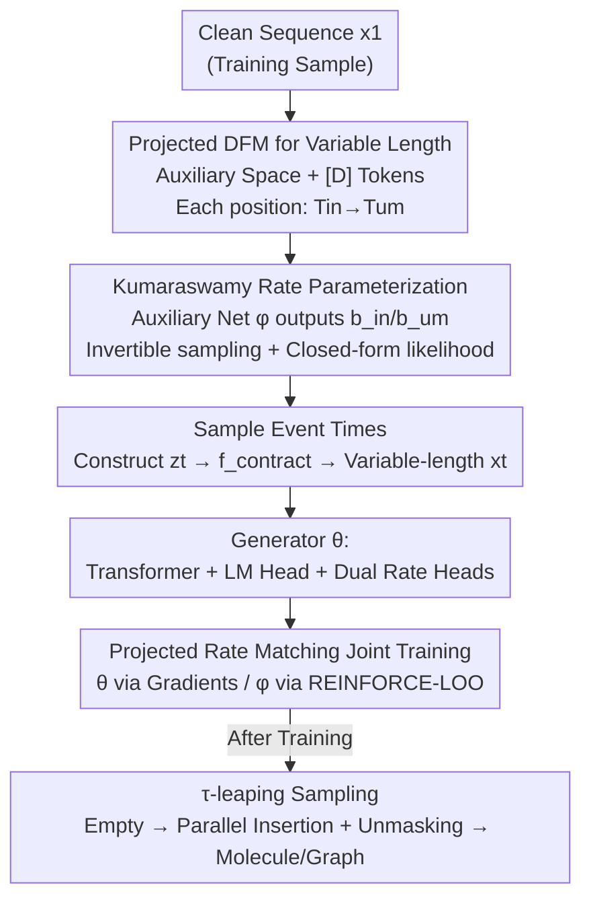

# Insertion Based Sequence Generation with Learnable Order Dynamics

**Conference**: ICML2026  
**arXiv**: [2602.18695](https://arxiv.org/abs/2602.18695)  
**Code**: https://github.com/dhruvdcoder/LoFlexMDM  
**Area**: Computational Biology / Discrete Diffusion Generation  
**Keywords**: Masked Diffusion Models, Discrete Flow Matching, Insertion-based Generation, Learnable Generation Order, Molecule Generation

## TL;DR
This paper proposes LoFlexMDM—a generation model that replaces the **fixed generation order** of the two-step insertion-based masked diffusion model ("mask insertion + unmasking") with **learnable, sample-dependent order dynamics**. By generalizing discrete flow matching to variable-length sequences, parameterizing learnable insertion/unmasking times with Kumaraswamy CDFs, and jointly training the generator and target order network via REINFORCE, the model learns near-optimal generation orders on molecule and graph tasks. De novo molecule quality is improved by up to 17.5 percentage points compared to FlexMDM.

## Background & Motivation

**Background**: Masked Diffusion Models (MDM) generate sequences by repeatedly unmasking tokens at **fixed absolute positions in fixed-length strings**. Insertion-based diffusion models go further by inserting new tokens into "gaps" between existing tokens, naturally handling variable-length sequences. FlexMDM (Kim et al. 2026b) is a representative work: it uses a two-stage process where each token is first inserted as a mask `[M]` and then unmasked into a symbol, i.e., `[D]→[M]→symbol`, allowing multiple masks to be inserted and unmasked in parallel across any gap.

**Limitations of Prior Work**: Structured sequences like graphs and molecules are **variable-length**, and their dependencies are often expressed through **relative positions**. For instance, in a star graph, inserting edges from the leaves toward the central junction makes the junction's outgoing edges locally predictable, whereas they would require foresight otherwise. However, FlexMDM’s target insertion/unmasking **schedule is fixed and data-independent**, forcing the model to learn to "generate every ground-truth sequence in all possible orders." When certain orders are clearly superior, spreading probability mass over many suboptimal orders is wasteful and amplifies uncertainty in the action space, degrading generation quality.

**Key Challenge**: There is a tension between the flexibility of insertion-based diffusion (any gap, any order) and training efficiency/quality—freer orders increase the trajectory space the model must cover, making it harder to learn; yet, hardcoding the order sacrifices the opportunity to "pick a good order for this specific sample."

**Goal**: Make the generation order a **learnable, sample-dependent** quantity while keeping the training **analytical and parallelizable** (without simulating full trajectories), and providing lower bound guarantees for data log-likelihood.

**Key Insight**: The authors observe that the two-step process in FlexMDM is implicitly determined by the "insertion time $T_\text{in}$ and unmasking time $T_\text{um}$" at each position (if $T_\text{um}^j>T_\text{um}^i$, $j$ is generated after $i$). By making the **distribution** of these two times learnable, the order can be controlled without changing the final state distribution.

**Core Idea**: Retain the two-step insertion-unmasking structure of FlexMDM but use an auxiliary network $\phi$ to predict **sample-dependent insertion/unmasking rates**. These rates are parameterized with a Kumaraswamy CDF to allow analytical sampling and closed-form likelihoods. The generator $\theta$ and target order $\phi$ are then jointly trained using Projected Rate Matching and REINFORCE, allowing the model to learn "which order is easier to generate."

## Method

### Overall Architecture
LoFlexMDM aims to let the insertion-based diffusion model learn sample-dependent generation orders while keeping training analytical and parallel. The pipeline has two sides: the **target side** uses an auxiliary network $\phi$ to read the clean sequence $x_1$ and predict insertion/unmasking rates for each position, defining "target order dynamics" (a distribution over generation orders). The **generator side** features a network $\theta$ (a transformer backbone + one LM head for token probabilities + two rate heads for insertion rate $\lambda_\text{in}$ and unmasking rate $\lambda_\text{um}\!\cdot\!K$) that predicts rates on variable-length partial sequences $x_t$, trained to match the endpoint-conditioned rates of the target side. During training, partial sequences are sampled at time $t$ to calculate the projected rate matching loss, with $\theta$ updated via automatic differentiation and $\phi$ via REINFORCE. Sampling uses $\tau$-leaping starting from an empty sequence, inserting masks and unmasking them in parallel.

### Key Designs

**1. Projected Discrete Flow Matching: Generalizing DFM to Variable-length Two-event Processes**

The challenge is that variable-length sequences cannot directly construct conditional marginals $p_{t|C}(x_t|x_1)$ as fixed-length masked DFM does, because there are multiple alignments between $x_t$ and $x_1$. The authors introduce an **auxiliary space with alignment information**: defining a "dropped" token `[D]` (out-of-vocabulary, indicating "position not yet present"), the fixed-length space $\bar{\mathbb Z}=(\mathbb V\cup\{[D]\})^L$ is isomorphic to the variable-length partial sequence space $\mathbb Z$ via $f_\text{contract}$ (deleting `[D]` and moving absolute positions into an ordered tuple $s$). In $\bar{\mathbb Z}$, each position follows a two-event process $[D]\to[M]\to z_1^i$: $T_\text{in}^i$ controls `[D]→[M]`, and $T_\text{um}^i$ (with $T_\text{um}^i>T_\text{in}^i$) controls `[M]→z_1^i`. If $z_1^i=[D]$, the rate is zero. The relative timing of these events **implicitly defines the generation order**. The "projection" ensures the dynamics are defined in the easy-to-handle auxiliary space, then projected back to the real variable-length space $\mathbb X$ using an encoding kernel $\pi_\text{enc}$ and Bayes decoding $\pi_{\text{dec},t}$:
$$R_t^\pi(x,y)=\sum_{z,w}\pi_\text{enc}(y|w)\,\pi_{\text{dec},t}(z|x)\,R_t(z,w),$$
Crucially, the **generator only works on $\mathbb X$ and never sees `[D]`**, learning by minimizing the projected Bregman divergence. An independence assumption per position prevents the rate matrix from exploding exponentially with length $L$.

**2. Kumaraswamy Rate Parameterization: Making Sample-dependent Orders Sampleable and Likelihoods Closed-form**

To implement learnable orders, one must efficiently sample partial sequences and calculate likelihoods to update $\phi$. By Proposition 1, the target rate can be expressed by two increasing right-continuous functions $F_\text{in}^i(t),F_\text{um}^i(t)$ on $[0,1]$ with boundaries $F(0)=0,F(1)=1$. The authors choose the **Kumaraswamy CDF** $F_*^{\phi,i}(t;z_1)=1-(1-t^{a_*})^{b_*}$ because it supports inverse CDF sampling (parallel event timing), produces internal modes, and yields closed-form likelihoods when $a_\text{in}^i=a_\text{um}^i=a$ (constant). The auxiliary transformer $\phi$ outputs $b_\text{in}^{\phi,i},b_\text{um}^{\phi,i}$ for each token, giving the hazard rates:
$$\lambda_\text{in}^i(t)=b_\text{in}\,\frac{a t^{a-1}}{1-t^a},\qquad \lambda_\text{um}^i(t)=b_\text{um}\,\frac{a t^{a-1}}{1-t^a}.$$
Interestingly, insertion and unmasking **share the same shape function** $\frac{a t^{a-1}}{1-t^a}$, with the multipliers $b_\text{in},b_\text{um}$ controlling the overall speed. Under a time transformation $\tau=-\log(1-t^a)$, it reduces to an **exponential race** with an "insertion before unmasking" priority constraint. When $a=b=1$, the loss reverts to FlexMDM (hence the L for Learnable in the name).

**3. Projected Rate Matching + REINFORCE-LOO: Jointly Training Generator and Target Order Without Trajectory Simulation**

The goal is to optimize the generator $\theta$ and target order $\phi$ simultaneously while maximizing the ELBO. The loss consists of an unmasking term and an insertion term, using the Bregman divergence $D_\psi$ induced by negative entropy $\psi(r)=\sum_k r_k\log r_k$ to make the generator rate $\lambda^\theta$ match the endpoint-dependent target rate $\lambda^\phi$. Since the expectation depends on $\phi$, many-sample gradients are needed. The authors use **REINFORCE leave-one-out (RLOO)** for variance reduction: sampling two partial states $z^{(1)},z^{(2)}$ with different event times for the same $z_1$, and using $\mathcal L^{(1)}-\mathcal L^{(2)}$ as the advantage signal:
$$\tfrac12\big[\mathcal L^{\phi,\theta}(z^{(1)})-\mathcal L^{\phi,\theta}(z^{(2)})\big]\nabla_\phi\log\frac{p^\phi_{t|z_1}(z^{(1)})}{p^\phi_{t|z_1}(z^{(2)})}+\cdots$$
The intuition is to **increase the likelihood of the partial sequence (order) that the generator finds easier to complete**, pushing $\phi$ toward orders favored by the generator. The entire update is performed in one backward pass using stop-gradient operators (Algorithm 1), avoiding full CTMC trajectory simulation. Sampling uses $\tau$-leaping (Gillespie), starting from an empty sequence and inserting/unmasking in parallel (Algorithm 2), potentially with confidence-based position selection and nucleus sampling. One engineering note: because both the generator and target rates are learnable, rates can reach extremes, necessitating **schedule regularization**.

### Loss & Training
- **Joint Objective**: Unmasking loss $\mathcal L_\text{um}^{\phi,\theta}$ (cross-entropy + Bregman rate matching) + insertion loss $\mathcal L_\text{in}^{\phi,\theta}$ (Bregman matching on summed gap rates), with expectations over $t\sim\mathcal U(0,1)$, $z_1\sim p_\text{data}$, and $z_t\sim p^\phi_{t|z_1}$.
- **Stability Finding**: Fixing $b_\text{um}=1$ (learning only $b_\text{in}$) stabilizes training. A fully learnable $b_\text{um}$ causes instability, especially on "hard" tasks; fixing it still allows for learning insertion orders.
- **Architecture Choice**: Using independent transformers ("separate") for the target rate and generator is more stable than a "shared" backbone for hard graph tasks.

## Key Experimental Results

### Main Results: Star Graph Traversal (Exact Match %, medium / hard)

| Model | conf. | medium | hard |
|------|-------|--------|------|
| ARM (Autoregressive) | N/A | 75.0 | 23.0 |
| MDM | ✓ | 36.5 | 21.0 |
| FlexMDM | × | 89.6 | 6.0 |
| FlexMDM | ✓ | 91.3 | 7.4 |
| LoFlexMDM (Learnable $b_\text{um}$, Separate) | × | 92.3 | 38.0 |
| LoFlexMDM (Fixed $b_\text{um}{=}1$, Separate) | × | **93.2** | **87.9** |
| LoFlexMDM (Fixed $b_\text{um}{=}1$, Separate) | ✓ | 93.0 | 88.1 |
| LoFlexMDM (Fixed $b_\text{um}{=}1$, Shared) | × | 93.6 | 34.2 |

On the "hard" task, FlexMDM achieves only 6–7%, while LoFlexMDM (fixed $b_\text{um}=1$) jumps to ~88%—a qualitative shift when picking the correct order is critical.

### Main Results: De novo Molecule Generation (1024 steps)

| Model | conf. | $p$ | Validity % | Diversity | Uniqueness % | Quality % |
|------|-------|-----|-----------|-----------|--------------|-----------|
| SAFE-GPT | — | — | 94.0 | 0.879 | 100.0 | 54.7 |
| MDM | — | — | 96.7 | 0.896 | 99.3 | 53.8 |
| FlexMDM | × | — | 98.9 | 0.890 | 99.6 | 62.0 |
| FlexMDM | ✓ | — | 67.8 | 0.940 | 61.7 | 5.5 |
| LoFlexMDM (Aux=medium) | ✓ | 0.5 | **99.9** | 0.830 | 93.2 | **69.3** |

Quality is 69.3 for LoFlexMDM vs 62.0 for FlexMDM. The abstract reports a maximum gain of +17.5pp for de novo and +6.7pp for fragment-constrained generation.

### Ablation Study

| Configuration | Observation | Explanation |
|------|------|------|
| Learnable $b_\text{um}$ vs Fixed $b_\text{um}{=}1$ | hard: 38.0 → 87.9 | Fully parameters $b_\text{um}$ is unstable; fixing it improves stability while retaining order learning. |
| Shared vs Separate Backbone | hard: 34.2 → 87.9 | Shared backbones significantly degrade performance on hard tasks. |
| Confidence Position Selection (conf.) | LoFlexMDM: Harmless/Beneficial; FlexMDM: Crash (quality 62.0→5.5) | conf. only adds value if the model has learned a proper order. |

- **Generation order is effectively learned**: The optimal order for star graphs is leaves-to-center (ideal correlation -1). LoFlexMDM with learnable $b_\text{um}$ reaches -0.91; with fixed $b_\text{um}=1$, it is -0.22 (no conf.) to -0.60 (+conf.). FlexMDM stays at -0.09 to -0.33. The model spontaneously learns near-optimal orders.
- **Confidence selection is a double-edged sword**: It amplifies learned good orders (benefiting LoFlexMDM) but is catastrophic for FlexMDM (5.5% quality) since it lacks a structured order.
- **Stability > Flexibility**: The most flexible fully-trainable config is not optimal; fixing $b_\text{um}=1$ sacrifices slight flexibility for training stability, yielding the best overall results.

## Highlights & Insights
- **Explicitly modeling "Generation Order" as a learnable distribution**: Encoding order via hazard rates of $T_\text{in}, T_\text{um}$ without changing final distributions provides a clean framework applicable to other discrete generators.
- **Utility of Kumaraswamy**: It satisfies the triple requirement of inverse CDF sampling, closed-form likelihood, and internal modes. It reduces complex order learning to simple scalar multipliers.
- **Elegant RLOO signal interpretation**: "Reinforce orders that the generator completes easily" creates a self-consistent signal for $\phi$ and $\theta$ synergy, executable in a single backward pass.
- **Stability-Flexibility Trade-off**: The fact that fixing $b_\text{um}=1$ performs best serves as a warning against numerical instabilities in fully learnable schedules.

## Limitations & Future Work
- **Training Instability**: Learnable schedules required fixed $b_\text{um}$ and regularization, suggesting "fully learnable order" remains difficult to handle.
- **REINFORCE Variance**: Despite RLOO, score function gradient variance remains a concern for larger vocabularies or longer sequences.
- **Baseline Comparison with Confidence**: FlexMDM’s crash with confidence selection to 5.5% highlights that absolute comparisons require context regarding "learned order" vs "random order + confidence."
- **Task Scope**: Experiments are limited to star graphs and small molecules; larger proteins or general text/graphs remain unverified.
- **Auxiliary Network Overhead**: The "separate" setting requires an extra transformer, creating a memory vs quality trade-off.

## Related Work & Insights
- **vs FlexMDM (Kim et al. 2026b)**: FlexMDM uses fixed, data-independent schedules. LoFlexMDM makes them learnable/sample-dependent. It achieves a qualitative jump on order-sensitive tasks (6% → 88% on hard graphs).
- **vs Masked Diffusion MDM (Sahoo/Shi 2024)**: MDM uses fixed absolute positions; LoFlexMDM handles variable length and relative dependencies via insertion.
- **vs Single-token Insertion (Patel 2026b; Ding 2026)**: Single-token models force greedy decisions; LoFlexMDM allows parallel unmasking of multiple tokens in one gap.
- **vs Discrete Flow Matching DFM (Campbell/Gat 2024)**: This work generalizes DFM to variable-length sequences via auxiliary spaces and makes the probability path (order) learnable.
- **vs Autoregressive (SAFE-GPT)**: Autoregressive models use fixed left-to-right orders; LoFlexMDM learns sample-dependent orders, resulting in higher de novo quality (69.3 vs 54.7).

## Rating
- Novelty: ⭐⭐⭐⭐⭐ First to make insertion-based masked diffusion orders learnable/sample-dependent while maintaining analytical training.
- Experimental Thoroughness: ⭐⭐⭐⭐ Strong graph and molecule results with deep ablations, though task variety is slightly narrow.
- Writing Quality: ⭐⭐⭐⭐ Rigorous mathematical framework (Projected DFM + Kumaraswamy + RLOO), though notation-heavy.
- Value: ⭐⭐⭐⭐ Provides a general scheme for "learning to order" in discrete generation, highly applicable to structural sequences.

<!-- RELATED:START -->

## Related Papers

- [\[ICML 2026\] DNAChunker: Learnable Tokenization for DNA Language Models](dnachunker_learnable_tokenization_for_dna_language_models.md)
- [\[ICML 2026\] LineageFlow: Flow Matching for High-Fidelity Family-Aware Protein Sequence Generation](lineageflow_flow_matching_for_high-fidelity_family-aware_protein_sequence_genera.md)
- [\[ICML 2026\] Neural Estimation of Pairwise Mutual Information in Masked Discrete Sequence Models](neural_estimation_of_pairwise_mutual_information_in_masked_discrete_sequence_mod.md)
- [\[ICLR 2026\] ProTDyn: A Foundation Protein Language Model for Thermodynamics and Dynamics Generation](../../ICLR2026/computational_biology/protdyn_a_foundation_protein_language_model_for_thermodynamics_and_dynamics_gene.md)
- [\[ICLR 2026\] Riemannian High-Order Pooling for Brain Foundation Models](../../ICLR2026/computational_biology/riemannian_high-order_pooling_for_brain_foundation_models.md)

<!-- RELATED:END -->
