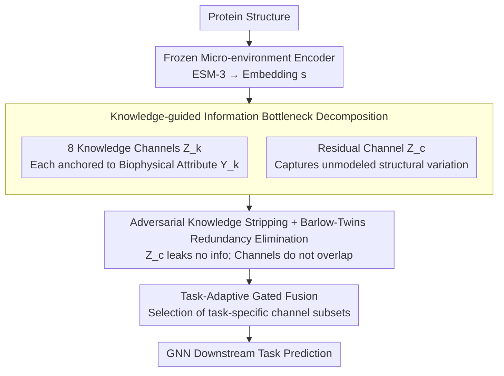

# Learning Protein Structure-Function Relationships through Knowledge-guided Representation Decomposition

**Conference**: ICML 2026  
**arXiv**: [2605.23960](https://arxiv.org/abs/2605.23960)  
**Code**: https://github.com/AI-HPC-Research-Team/ProtDiS (Available)  
**Area**: Scientific Computing / Protein Representation Learning / Disentangled Representation  
**Keywords**: Protein Structure-Function, Knowledge-guided Disentanglement, Information Bottleneck, ESM-3, Redundancy Elimination

## TL;DR
ProtDiS decomposes pre-trained protein micro-environment embeddings (such as ESM-3) into 8 biophysically interpretable "knowledge channels" and 1 residual channel through information bottleneck and redundancy elimination. This leads to consistent improvements in structural representation across twelve downstream tasks, particularly in scenarios where proteins share similar structures but possess different functions.

## Background & Motivation

**Background**: Current protein structural representations primarily rely on pre-trained micro-environment encoders like GearNet, ESM-3, or Foldseek. These encoders compress 3D geometry, physicochemical, and topological information into a high-dimensional latent space, which is then fed into GNNs for downstream tasks (e.g., enzyme classification, ligand binding sites, PPI).

**Limitations of Prior Work**: These latent spaces are highly entangled—geometric, physicochemical, and topological signals are squeezed into the same set of dimensions. This leads to two consequences: (1) Lack of interpretability, as model decisions cannot be traced back to specific biophysical quantities; (2) Collapse on protein pairs with similar structures but different functions. Specifically, when the TM-score is high, cosine similarity also reaches its maximum, making it impossible to distinguish different functions.

**Key Challenge**: Protein function does not depend on the complete high-dimensional structural embedding but rather on a few semantically clear local micro-environment attributes (e.g., secondary structure, packing density, flexibility, curvature). However, pure structural similarity tends to dominate pre-training objectives, burying these fine-grained signals.

**Goal**: To decompose the entangled structural embedding $\mathbf{s}$ into $K$ knowledge-specific channels $Z_k$ (each aligned with a pre-defined biophysical attribute $Y_k$) plus 1 residual channel $Z_c$ (capturing unmodeled structural variations). This must satisfy: each $Z_k$ encodes only its respective $Y_k$, redundancy between different $Z_k$ is low, and the union of all channels can fully reconstruct $\mathbf{s}$.

**Key Insight**: Instead of strictly pursuing statistical independence (since biophysical attributes are inherently correlated, e.g., hydrophobicity and exposure), the authors adopt a Barlow Twins-style "redundancy elimination" approach. This penalizes second-order linear correlations between channels while allowing non-linear biological relationships to persist.

**Core Idea**: Explicitly anchor the information bottleneck to biophysical variables using knowledge supervision, while employing adversarial learning, reconstruction, and redundancy elimination to ensure that the residual channel does not "leak" information and knowledge channels do not overlap, all without losing overall information.

## Method

### Overall Architecture
ProtDiS addresses the issue where geometric, physicochemical, and topological signals are entangled and uninterpretable within pre-trained protein structural embeddings. It frames this as a supervised information bottleneck decomposition task. Taking the output embedding $\mathbf{s} \in \mathbb{R}^d$ from a frozen micro-environment encoder (defaulting to ESM-3 Structural Tokenizer), it uses $K=8$ independent encoders to decompose it into 8 "knowledge channels"—each anchored to a computable biophysical attribute (packing density, local complexity, curvature, shape, exposure, flexibility, stability, hydrophobicity)—and 1 residual channel $Z_c$ for unmodeled structural variation. During training, each knowledge channel uses a supervision head to fit its label, while the residual channel utilizes a reconstruction head and an adversarial discriminator. For downstream applications, relevant channels are selected via gated fusion and fed into a GNN.

### Key Designs

**1. Knowledge-guided Information Bottleneck Decomposition: Explicitly anchoring "minimal sufficient statistics" to biophysical quantities**

The pain point is that unsupervised disentanglement finds abstract latent factors, and interpretability relies on post-hoc attribution. ProtDiS reverses this by aligning each channel $Z_k$ directly with a white-box label $Y_k$ (e.g., DSSP for secondary structure, Kyte-Doolittle for hydrophobicity, which are computationally free). The goal is to make $Z_k$ a minimal sufficient statistic of $\mathbf{s}$ regarding $Y_k$, formally represented as $\min_{Z_k} I(Z_k;\mathbf{s}) - \beta_k I(Z_k;Y_k)$.

Since mutual information cannot be directly optimized, the authors implement it via three surrogates: the supervision loss $\mathcal{L}_{\mathrm{kn}}^{(k)} = \mathbb{E}[\ell(h_k(Z_k), y_k)]$ as a variational lower bound for $I(Z_k;Y_k)$ to "select the right information"; batch-level KL regularization $\mathcal{L}_{\mathrm{KL}} = \sum_k \mathrm{KL}(q(Z_k) \| \mathcal{N}(0, I))$ as an upper bound for $I(Z_k;\mathbf{s})$ to "compress redundancy"—note that this uses the aggregated posterior against a standard Gaussian, which is more stable than traditional sample-wise VIB; and the $\ell_1$ reconstruction loss $\mathcal{L}_{\mathrm{rec}} = \|\hat{\mathbf{s}} - \mathbf{s}\|_1$ for the residual channel to ensure that $(Z_1,\ldots,Z_K,Z_c)$ collectively reconstruct $\mathbf{s}$ without information loss. These three tasks—selecting information, compressing redundancy, and ensuring completeness—are unified within the bottleneck framework.

**2. Adversarial Knowledge Stripping + Barlow-Twins-style Redundancy Elimination: Ensuring residual purity and channel distinctness**

Supervised decomposition alone is insufficient; the residual channel might still learn pre-modeled knowledge, and knowledge channels might overlap. For the residual side, an adversarial loss with gradient reversal $\mathcal{L}_{\mathrm{adv}} = \sum_k \mathbb{E}[\ell(d_k(\mathcal{R}_\lambda(Z_c)), y_k)]$ is minimized as an upper bound for $I(Z_c; Y_k)$. While the discriminator $d_k$ tries to predict $y_k$ from $Z_c$, the gradient reversal layer $\mathcal{R}_\lambda$ forces $Z_c$ to discard this knowledge, leaving it only with structural variations not covered by the defined attributes.

For inter-channel redundancy, rather than a strict statistical independence approach like FactorVAE, the authors penalize second-order linear redundancy using a Barlow Twins approach, noting that biophysical attributes are inherently correlated. The variance regularization $\mathcal{L}_{\mathrm{var}} = \sum_k \mathbb{E}_d[(\mathrm{std}(Z_k^{(d)}) - 1)^2]$ prevents collapse by pushing the standard deviation of each dimension to 1. The Frobenius norm of the cross-correlation matrix $\mathcal{L}_{\mathrm{cov}} = \frac{1}{|\mathcal{P}|}\sum_{(i,j)} \|C_{ij}\|_F^2$ (where $C_{ij} = \frac{1}{N}\tilde{Z}_i^\top \tilde{Z}_j$) suppresses linear correlations across channels. This effectively removes redundancy while preserving true non-linear biological relationships.

**3. Task-Adaptive Gated Fusion: Enabling the model to select "which biophysical quantities determine which function"**

Not every downstream task requires all 8 channels; concatenating all high-dimensional features can lead to overfitting on small-sample multi-class tasks (e.g., SCOP-cf). ProtDiS selects the most relevant channel subset for each task based on feature-level importance analysis—for example, Enzyme Commission (EC) prediction might only select residual + secondary structure + local packing + contact entropy. These are merged through a gating network before being sent to the GNN. This step suppresses overfitting and provides an interpretable interface for understanding which biophysical dimensions the model uses for functional prediction.

### Loss & Training
The total loss is a weighted sum of the aforementioned components: $\mathcal{L}_{\mathrm{total}} = \mathcal{L}_{\mathrm{sup}} + \lambda_{\mathrm{KL}}\mathcal{L}_{\mathrm{KL}} + \lambda_{\mathrm{red}}(\lambda_{\mathrm{var}}\mathcal{L}_{\mathrm{var}} + \lambda_{\mathrm{cov}}\mathcal{L}_{\mathrm{cov}}) + \lambda_{\mathrm{rec}}\mathcal{L}_{\mathrm{rec}} + \lambda_{\mathrm{adv}}\mathcal{L}_{\mathrm{adv}}$. Pre-training data consists of 100,000 high-quality structures sampled from PDB and AlphaFoldDB. During downstream evaluation, the representation is frozen, and only the fusion layer and GNN head are trained to purely measure the quality of the representation.

## Key Experimental Results

### Main Results
A comparative evaluation of ESM-3 ST vs. ProtDiS across 12 downstream tasks was conducted under both random and structure-based splits. The focus is on the more rigorous structural split.

| Task (struct split) | Metric | ESM-3 ST | ProtDiS | Gain |
|---------------------|------|----------|---------|------|
| Enzyme Class. (EC) | Acc | 78.7 | 83.5 | +6.05% |
| Ligand Affinity | Spr | 35.1 | 36.6 | +4.45% (rel.) |
| SCOP-family | Acc | 75.0 | 78.0 | +3.91% |
| PPIs | AUROC | 82.1 | 84.6 | +3.0 |
| MF (Function) | Fmax | 61.1 | 61.2 | +0.1 |
| Ligand Binding Sites | MCC | 61.7 | 62.3 | +0.6 |

The gain under random split is smaller (e.g., EC 88.2 → 89.0), which aligns with the authors' expectations—random splits produce high structural similarity between training and test sets, where entangled representations suffice. The structural split reveals the collapse issues in the original ESM-3.

### Ablation Study

| Analysis Dimension | Key Metric | Description |
|----------|---------|------|
| Knowledge Specificity (MI Heatmap) | Diagonal Dominance | Each $Z_k$ has high MI with its own $Y_k$ and low with others; $Z_c$ has low MI with all $Y_k$ → successful knowledge stripping. |
| Channel Independence (DCC) | Low cross-channel correlation | DCC between different $Z_k$ is near 0, while each $Z_k$ maintains moderate correlation with $\mathbf{s}$. |
| Completeness (Progressive Reconstruction) | Monotonic Loss Decrease | Adding $Z_k$ sequentially decreases reconstruction loss, indicating complementary information. |
| High TM-score Homologous Pairs | AUC | ESM-3 achieves 0.868 on highest TM-score bins, while ProtDiS achieves 0.946. |
| Cosine vs TM-score | Dispersion | For negative pairs with TM-score > 0.5, ESM-3 cosine similarity approaches 1 (representation collapse), while ProtDiS maintains low cosine similarity. |

### Key Findings
- **Structural split improvements significantly outweigh random split gains**: On EC, the gain is +0.8 in random split vs. +6.05 in structural split. This suggests ProtDiS learns function-relevant signals beyond global structural similarity rather than merely fitting the training distribution.
- **Homologous protein pairs with high similarity** are the killer use-case for ProtDiS: On negative pairs with TM-score > 0.9, pure structural embedding similarity saturates at ~1, whereas knowledge embeddings maintain discriminative power, improving AUC by ~8 points.
- **Side effects of task-adaptive channel selection**: On small-sample multi-class tasks like SCOP-cf, forcing all channels into the model can lead to overfitting; this indicates that not every biophysical dimension is necessary for every task.
- **The necessity of the residual channel**: The authors emphasize that without $Z_c$ to capture remaining information, forcing all data into 8 knowledge channels would be "lossy or degenerate"; the reconstruction loss ensures this integrity.

## Highlights & Insights
- **Linking Information Bottleneck with biophysical quantities** is a clean formalization: Traditionally, disentanglement seeks unsupervised latent factors, requiring post-hoc attribution. Here, $Y_k$ is set to white-box biophysical quantities (like DSSP or KD scale), binding "disentanglement" and "interpretability" during training.
- **Rejecting strict independence in favor of Barlow Twins redundancy elimination** is a pragmatic masterstroke: Since protein attributes are inherently correlated, strict independence would harm representation power. Using "linear redundancy removal" to "preserve non-linear biological relationships" is a design trade-off with high transfer value.
- **Batch-level KL as an Information Bottleneck**: Using the aggregated posterior against a standard normal distribution instead of sample-wise variational Gaussian (VIB) is reported as more stable. This engineering trick avoids the noise of reparameterization sampling and is worth applying to other IB tasks.
- **Evaluation protocol using high-similarity homologous pairs as hard negatives**: This reveals representation collapse more effectively than traditional random splits and should become a standard for protein representation learning.

## Limitations & Future Work
- **Strong dependency on structural data**: The method relies on ESM-3 micro-environment embeddings, making it unavailable for proteins without experimental structures or high-confidence AlphaFold predictions (e.g., early discoveries, orphan proteins).
- **Manually selected knowledge dimensions**: Only attributes computable by existing tools (e.g., DSSP, KD scale) can serve as $Y_k$. Expanding to new biophysical dimensions requires finding computable labels.
- **Offline task-channel selection**: Selection is based on manual feature importance analysis rather than end-to-end learning; new tasks require re-running the analysis.
- **Lack of direct comparison with recent Sparse Autoencoder (SAE) routes**: While SAEs are also performing interpretable decomposition of PLMs, the authors only compare concepts and not numerical values.
- **Future directions**: (i) Bringing ProtDiS concepts to the sequence space to estimate local structural knowledge from sequence alone; (ii) Knowledge-guided protein design—controllable generation by independently adjusting channels like hydrophobicity or packing density.

## Related Work & Insights
- **vs. FactorVAE / $\beta$-TCVAE**: These pursue strict statistical independence and rely on unsupervised latent factors; ProtDiS uses supervised anchoring and redundancy elimination (allowing non-independence), which is more biologically grounded.
- **vs. DisenIB / IMB**: Also performs supervised disentanglement under an IB framework, but ProtDiS uses multiple independent biophysical quantities plus a residual channel, offering a more symmetric and analyzable structure.
- **vs. SAE routes**: SAEs perform post-hoc sparse decomposition of PLM outputs and work primarily on sequence embeddings; ProtDiS performs explicit constraint during training on structural embeddings with information-theoretic completeness guarantees.

## Rating
- Novelty: ⭐⭐⭐⭐ Combining Information Bottleneck, knowledge supervision, and Barlow Twins for protein representation is new, though individual components are established.
- Experimental Thoroughness: ⭐⭐⭐⭐ 12 downstream tasks plus three types of analysis (specificity/independence/completeness) and hard-negative evaluation. Lacks direct comparison with SAE routes.
- Writing Quality: ⭐⭐⭐⭐ Clear progression from motivation to methodology; the bridge between IB theory and practical surrogates is well-explained.
- Value: ⭐⭐⭐⭐ Gaps of +3~6 points on structural splits represent real utility, and disentangled representations have clear paths for controllable protein design.

<!-- RELATED:START -->

1. **ESM-3**: Evolutionary Scale Modeling 3, the baseline micro-environment encoder used.
2. **Barlow Twins**: The source of the redundancy elimination loss function.
3. **VIB (Variational Information Bottleneck)**: The underlying theoretical framework for the decomposition.
4. **GearNet**: A key comparative structural representation model mentioned in related work.

<!-- RELATED:END -->

## Related Papers

- [\[AAAI 2026\] S2Drug: Bridging Protein Sequence and 3D Structure in Contrastive Representation Learning for Virtual Screening](../../AAAI2026/computational_biology/s2drug_bridging_protein_sequence_and_3d_structure_in_contrastive_representation_.md)
- [\[ICML 2026\] Learning the Interaction Prior for Protein-Protein Interaction Prediction: A Model-Agnostic Approach](learning_the_interaction_prior_for_protein-protein_interaction_prediction_a_mode.md)
- [\[CVPR 2026\] Deciphering Genotype-Phenotype Mechanisms from High-Content Profiling via Knowledge-Guided Multi-modal Graph Learning](../../CVPR2026/computational_biology/deciphering_genotype-phenotype_mechanisms_from_high-content_profiling_via_knowle.md)
- [\[ICML 2026\] CARD: Coarse-to-fine Autoregressive Modeling with Radix-based Decomposition for Transferable Free Energy Estimation](card_coarse-to-fine_autoregressive_modeling_with_radix-based_decomposition_for_t.md)
- [\[ICML 2026\] SIGMA: Structure-Invariant Generative Molecular Alignment for Chemical Language Models via Autoregressive Contrastive Learning](sigma_structure-invariant_generative_molecular_alignment_for_chemical_language_m.md)

<!-- RELATED:END -->
