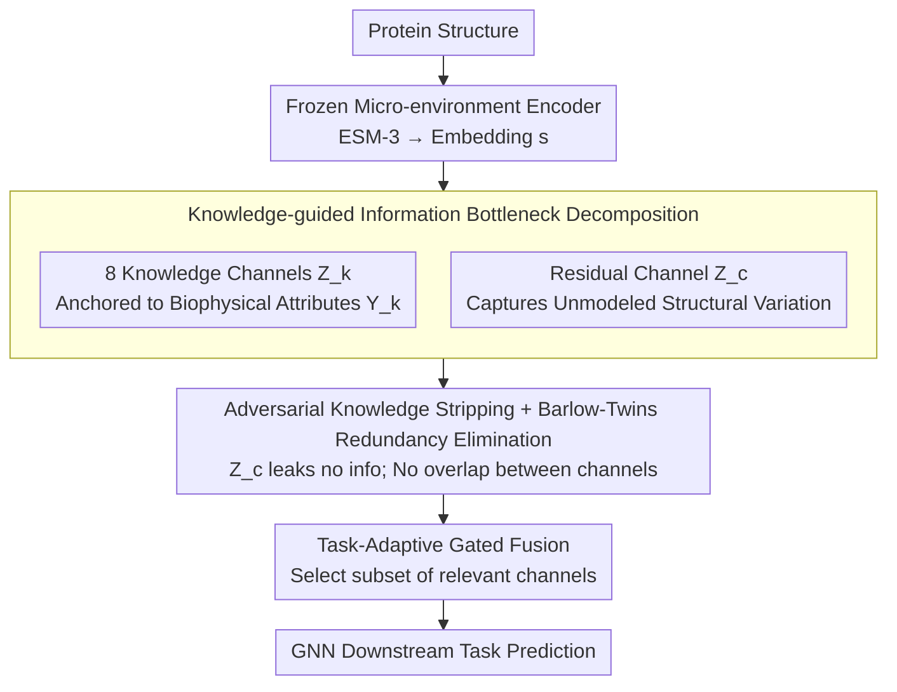

# Learning Protein Structure-Function Relationships through Knowledge-guided Representation Decomposition

**Conference**: ICML 2026  
**arXiv**: [2605.23960](https://arxiv.org/abs/2605.23960)  
**Code**: https://github.com/AI-HPC-Research-Team/ProtDiS (Available)  
**Area**: Scientific Computing / Protein Representation Learning / Disentangled Representation  
**Keywords**: Protein structure-function, Knowledge-guided disentanglement, Information Bottleneck, ESM-3, Redundancy elimination

## TL;DR
ProtDiS decomposes pre-trained protein micro-environment embeddings (e.g., ESM-3) via an information bottleneck and redundancy elimination into 8 biophysically interpretable "knowledge channels" and 1 residual channel. This approach consistently improves structural representations across twelve downstream tasks, particularly in scenarios where structures are similar but functions differ.

## Background & Motivation

**Background**: Current protein structural representations primarily rely on pre-trained micro-environment encoders like GearNet, ESM-3, or Foldseek. These tools compress 3D geometry, physicochemical properties, and topological information into a high-dimensional latent space, which is then passed to GNNs for downstream tasks such as enzyme classification, ligand binding site prediction, and PPI analysis.

**Limitations of Prior Work**: These latent spaces are highly entangled—geometric, physicochemical, and topological signals are squeezed into the same set of dimensions. This leads to two consequences: (1) lack of interpretability, as model decisions cannot be traced back to specific biophysical quantities; (2) representation collapse on protein pairs with similar structures but different functions—when the TM-score is high, cosine similarity saturates, making it impossible to distinguish functional differences.

**Key Challenge**: Protein function does not depend on the complete high-dimensional structural embedding but rather on a few semantically clear local micro-environment attributes (secondary structure, packing density, flexibility, curvature, etc.). However, pure structural similarity tends to dominate pre-training objectives, burying these fine-grained signals.

**Goal**: To decompose the entangled structural embedding $\mathbf{s}$ into $K$ knowledge-specific channels $Z_k$ (each aligned with a predefined biophysical attribute $Y_k$) plus 1 residual channel $Z_c$ (capturing unmodeled structural variations). The decomposition must ensure each $Z_k$ encodes only its corresponding $Y_k$, redundancy between different $Z_k$ is low, and the collective channels can fully reconstruct $\mathbf{s}$.

**Key Insight**: Rather than pursuing strict statistical independence (as biophysical attributes are inherently correlated, e.g., hydrophobicity and exposure), the authors adopt a "redundancy elimination" approach inspired by Barlow Twins. This penalizes only second-order linear correlations between channels while allowing non-linear biological relationships to persist.

**Core Idea**: Use knowledge supervision to explicitly anchor the information bottleneck to biophysical variables, combined with adversarial training, reconstruction, and redundancy elimination to ensure the residual channel does not "leak" information, knowledge channels do not overlap, and no information is lost overall.

## Method

### Overall Architecture
ProtDiS addresses the issue where geometric, physicochemical, and topological signals are entangled and uninterpretable within pre-trained protein structural embeddings. It treats this as a supervised information bottleneck decomposition task: taking the embedding $\mathbf{s} \in \mathbb{R}^d$ from a frozen micro-environment encoder (defaulting to the ESM-3 Structural Tokenizer) as input, it uses $K=8$ independent encoders to split it into 8 "knowledge channels." Each channel is anchored to a computable biophysical attribute (packing density, local complexity, curvature, shape, exposure, flexibility, stability, hydrophobicity), with a residual channel $Z_c$ capturing remaining structural variations. During training, each knowledge channel uses a supervision head to fit its label, while the residual channel uses a reconstruction head and an adversarial discriminator. For downstream tasks, relevant channels are selected and fused via a gated mechanism for GNN input.

### Key Designs

**1. Knowledge-guided Information Bottleneck Decomposition: Anchoring "Minimal Sufficient Statistics" to Biophysical Quantities**

The limitation of unsupervised disentanglement is that it identifies abstract latent factors, requiring post-hoc attribution for interpretability. ProtDiS instead aligns each channel $Z_k$ directly with a white-box label $Y_k$ (e.g., secondary structure via DSSP, hydrophobicity via Kyte-Doolittle, which are computationally free). The goal is to make $Z_k$ the minimal sufficient statistic of $\mathbf{s}$ regarding $Y_k$, formulated as $\min_{Z_k} I(Z_k;\mathbf{s}) - \beta_k I(Z_k;Y_k)$.

Since mutual information is not directly optimizable, the authors implement this via three surrogates: a supervision loss $\mathcal{L}_{\mathrm{kn}}^{(k)} = \mathbb{E}[\ell(h_k(Z_k), y_k)]$ as a variational lower bound for $I(Z_k;Y_k)$ to "select the right information"; a batch-level KL regularization $\mathcal{L}_{\mathrm{KL}} = \sum_k \mathrm{KL}(q(Z_k) \| \mathcal{N}(0, I))$ as an upper bound for $I(Z_k;\mathbf{s})$ to "compress redundancy" (using the aggregated posterior against a standard Gaussian for stability); and an $\ell_1$ reconstruction loss $\mathcal{L}_{\mathrm{rec}} = \|\hat{\mathbf{s}} - \mathbf{s}\|_1$ for the residual channel to ensure $(Z_1,\ldots,Z_K,Z_c)$ can reconstruct $\mathbf{s}$ without information loss.

**2. Adversarial Knowledge Stripping + Barlow-Twins Redundancy Elimination: Preventing Information Leakage and Overlap**

Supervised decomposition alone is insufficient, as the residual channel might still learn modeled knowledge, and knowledge channels might overlap. For the residual side, an adversarial loss with gradient reversal $\mathcal{L}_{\mathrm{adv}} = \sum_k \mathbb{E}[\ell(d_k(\mathcal{R}_\lambda(Z_c)), y_k)]$ is used to minimize $I(Z_c; Y_k)$. The discriminator $d_k$ attempts to predict $y_k$ from $Z_c$, while the gradient reversal layer $\mathcal{R}_\lambda$ forces $Z_c$ to be uninformative regarding these attributes.

To eliminate redundancy between channels, the authors avoid strict statistical independence (like FactorVAE) because biophysical attributes are naturally correlated. Instead, they use a Barlow Twins approach to penalize second-order linear redundancy: a variance regularization $\mathcal{L}_{\mathrm{var}} = \sum_k \mathbb{E}_d[(\mathrm{std}(Z_k^{(d)}) - 1)^2]$ prevents collapse, and the Frobenius norm of the cross-correlation matrix $\mathcal{L}_{\mathrm{cov}} = \frac{1}{|\mathcal{P}|}\sum_{(i,j)} \|C_{ij}\|_F^2$ (where $C_{ij} = \frac{1}{N}\tilde{Z}_i^\top \tilde{Z}_j$) suppresses linear correlations across channels. This removes redundancy while preserving real non-linear biological relationships.

**3. Task-Adaptive Gated Fusion: Enabling the Model to Select Relevant Biophysical Quantities**

Not all downstream tasks require all 8 channels. Forcing high-dimensional features into small-sample multi-class tasks (like SCOP-cf) can lead to overfitting. ProtDiS selects the most relevant channel subsets for each task based on feature importance—for instance, EC prediction might select only residual + secondary structure + local packing + contact entropy. These are fused via a gating network before the GNN. This step mitigates overfitting and provides an interpretable interface by showing which biophysical dimensions drive specific functional predictions.

### Loss & Training
The total loss is a weighted sum: $\mathcal{L}_{\mathrm{total}} = \mathcal{L}_{\mathrm{sup}} + \lambda_{\mathrm{KL}}\mathcal{L}_{\mathrm{KL}} + \lambda_{\mathrm{red}}(\lambda_{\mathrm{var}}\mathcal{L}_{\mathrm{var}} + \lambda_{\mathrm{cov}}\mathcal{L}_{\mathrm{cov}}) + \lambda_{\mathrm{rec}}\mathcal{L}_{\mathrm{rec}} + \lambda_{\mathrm{adv}}\mathcal{L}_{\mathrm{adv}}$. Pre-training data consists of 100,000 high-quality structures sampled from PDB and AlphaFoldDB. During downstream evaluation, the representations are frozen, and only the fusion layer and GNN head are trained to purely measure representation quality.

## Key Experimental Results

### Main Results
A comparison across 12 downstream tasks between ESM-3 ST and ProtDiS, evaluated under random and structure-based splits. The focus is on the more rigorous structure-based splits.

| Task (struct split) | Metric | ESM-3 ST | ProtDiS | Gain |
|---------------------|------|----------|---------|------|
| Enzyme Comm. (EC) | Acc | 78.7 | 83.5 | +6.05% |
| Ligand Affinity | Spr | 35.1 | 36.6 | +4.45% (rel) |
| SCOP-family | Acc | 75.0 | 78.0 | +3.91% |
| PPIs | AUROC | 82.1 | 84.6 | +3.0 |
| MF (Function) | Fmax | 61.1 | 61.2 | +0.1 |
| Ligand Binding Site | MCC | 61.7 | 62.3 | +0.6 |

The improvement is smaller under random splits (e.g., EC 88.2 → 89.0), which aligns with the author's expectation: in random splits, training and test structures are similar, so entangled representations suffice. The collapse of the original ESM-3 is only revealed in structure splits.

### Ablation Study

| Analysis Dimension | Key Metric | Description |
|----------|---------|------|
| Knowledge Specificity (MI Heatmap) | Diagonal Dominance | Each $Z_k$ has high MI with its $Y_k$ and low MI with others; $Z_c$ is low for all $Y_k$ → successful stripping. |
| Channel Independence (DCC) | Low cross-channel correlation | DCC between different $Z_k$ is near 0, but each $Z_k$ retains moderate correlation with $\mathbf{s}$. |
| Completeness (Prog. Recon) | Monotonic Loss Decrease | Adding $Z_k$ sequentially decreases reconstruction loss, indicating complementary information. |
| High TM-score Homologs | AUC | On high TM-score bins, ESM-3 achieves 0.868 while ProtDiS reaches 0.946. |
| Cosine vs TM-score | Dispersion | For negative pairs with TM-score > 0.5, ESM-3 cosine similarity saturates (collapse), while ProtDiS maintains low cosine. |

### Key Findings
- **Gains are significantly larger in structure splits than random splits**: EC improved by only +0.8 in random split but +6.05 in structure split. This suggests ProtDiS captures functionally relevant signals beyond global structural similarity.
- **Homologous protein pairs with high similarity** are the killer app for ProtDiS: On negative pairs with TM-score > 0.9, pure structural embedding similarity saturates to ~1, while knowledge-guided embeddings maintain discriminative power, increasing AUC by ~8 points.
- **Side effects of task-adaptive selection**: For small-sample tasks like SCOP-cf, include all channels leads to overfitting; this confirms that not all 8 biophysical dimensions are necessary for every task.
- **The residual channel is critical**: The authors emphasize that without $Z_c$, forcing all information into 8 knowledge channels would be "lossy or degenerate"; the reconstruction loss ensures total information preservation.

## Highlights & Insights
- **Explicitly binding Information Bottleneck with biophysical quantities** is a clean formalization. Traditional disentanglement relies on post-hoc mapping; here, $Y_k$ is a white-box quantity, making "disentanglement" and "interpretability" inherent to the training process.
- **Using Barlow Twins for redundancy elimination instead of rigid independence** is a pragmatic choice. Since protein attributes are naturally related, enforcing strict independence hurts representation capacity. This design trade-off—eliminating linear redundancy while keeping non-linear biological relationships—is highly transferable.
- **Batch-level KL over per-sample KL for IB**: Using the aggregated posterior against a standard normal distribution is noted by the authors as more stable. This engineering trick avoids reparameterization noise and is worth applying to other IB tasks.
- **"Using high-similarity homologous pairs as hard negatives"** as an evaluation protocol better exposes representation collapse and should become a standard for protein representation learning.

## Limitations & Future Work
- **Strong dependency on structural data**: The method relies on ESM-3 micro-environment embeddings and is less applicable to proteins without experimental structures or high-confidence AlphaFold predictions.
- **Manual selection of knowledge dimensions**: Attributes used as $Y_k$ must be computable by existing tools (DSSP/KD scale), limiting the extensibility to new biophysical dimensions without defined labels.
- **Offline task-channel selection**: The selection is based on manual importance analysis rather than end-to-end learning; new tasks require re-running the analysis.
- **Lack of direct comparison with Sparse Autoencoder (SAE) routes**: Approaches like Adams 2025 or Simon & Zou 2025 also perform interpretable decomposition of PLMs, but this paper only compares the underlying logic in related works without numerical benchmarks.
- **Future Directions**: (i) Applying ProtDiS logic to sequence space to estimate local structural knowledge from pure sequence input; (ii) Using knowledge channels for guided protein design, such as controlling hydrophobicity or packing density for generation.

## Related Work & Insights
- **vs FactorVAE / $\beta$-TCVAE**: These pursue strict statistical independence of unsupervised factors; ProtDiS uses supervised anchoring and redundancy elimination, which is more biologically grounded.
- **vs DisenIB / IMB**: Also perform supervised disentanglement in an IB framework, but ProtDiS uses multiple independent biophysical labels + a residual channel, offering a more symmetric and analyzable structure.
- **vs SAE Routes**: SAEs typically involve post-hoc sparse decomposition of PLM outputs on sequences; ProtDiS performs explicit training-time constraints on structural embeddings with information-theoretic completeness guarantees.

## Rating
- Novelty: ⭐⭐⭐⭐ The combination of IB, knowledge supervision, and Barlow Twins for protein representation is new, though individual components are established.
- Experimental Thoroughness: ⭐⭐⭐⭐ 12 downstream tasks, multi-faceted analysis (specificity/independence/completeness), and hard negative evaluation; lacks direct SAE comparison.
- Writing Quality: ⭐⭐⭐⭐ Clear mapping between motivation, methodology, and theoretical surrogates; Figure 4's TM-score analysis is highly convincing.
- Value: ⭐⭐⭐⭐ The +3~6 point gain in structure splits is practically significant, and disentangled representations offer a clear path toward controllable protein design.

<!-- RELATED:START -->

## Related Papers

- [\[AAAI 2026\] S2Drug: Bridging Protein Sequence and 3D Structure in Contrastive Representation Learning for Virtual Screening](../../AAAI2026/computational_biology/s2drug_bridging_protein_sequence_and_3d_structure_in_contrastive_representation_.md)
- [\[ICML 2026\] Learning the Interaction Prior for Protein-Protein Interaction Prediction: A Model-Agnostic Approach](learning_the_interaction_prior_for_protein-protein_interaction_prediction_a_mode.md)
- [\[ICML 2026\] Protein Autoregressive Modeling via Multiscale Structure Generation](protein_autoregressive_modeling_via_multiscale_structure_generation.md)
- [\[CVPR 2026\] Deciphering Genotype-Phenotype Mechanisms from High-Content Profiling via Knowledge-Guided Multi-modal Graph Learning](../../CVPR2026/computational_biology/deciphering_genotype-phenotype_mechanisms_from_high-content_profiling_via_knowle.md)
- [\[ICML 2026\] SIGMA: Structure-Invariant Generative Molecular Alignment for Chemical Language Models via Autoregressive Contrastive Learning](sigma_structure-invariant_generative_molecular_alignment_for_chemical_language_m.md)

<!-- RELATED:END -->
