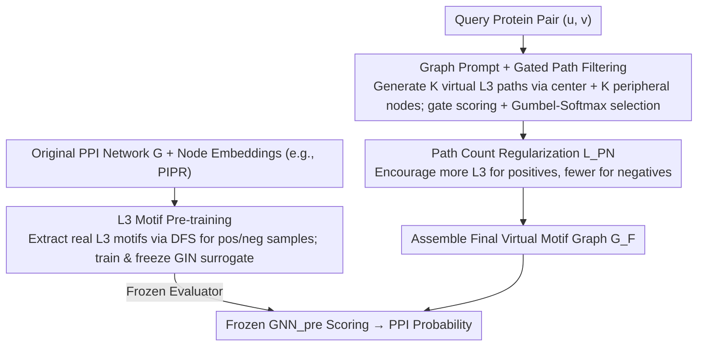

# Learning the Interaction Prior for Protein-Protein Interaction Prediction: A Model-Agnostic Approach

**Conference**: ICML 2026  
**arXiv**: [2605.09964](https://arxiv.org/abs/2605.09964)  
**Code**: Not mentioned  
**Area**: Protein-Protein Interaction Prediction / Graph Prompt Learning / Biological Priors  
**Keywords**: PPI Prediction, L3 Rule, Graph Prompt Learning, Complementarity Prior, Plug-and-play Classification Head

## TL;DR
L3-PPI transforms the biological "L3 rule" (where more length-3 paths between protein pairs indicate a higher likelihood of interaction) into a learnable graph prompt. It utilizes a pre-trained GNN to recognize L3 patterns and a gated network to generate virtual L3 paths, regularizing the path count based on PPI labels. This serves as a plug-and-play classification head that improves the performance of various PPI representation models by 2-4 percentage points on average.

## Background & Motivation
**Background**: Deep learning for PPI prediction has recently achieved high performance using CNNs, RNNs, GNNs, and Protein Language Models (PLMs). Most efforts have focused on "learning stronger protein representations" using models such as RCNN, GearNet, and ESM2.

**Limitations of Prior Work**: (1) Classification heads are predominantly generic "concat / Hadamard / sum" aggregations adopted from link prediction, **lacking inductive biases specific to protein interactions**. Core mechanisms like interfacial geometric complementarity and chemical compatibility are not explicitly modeled. (2) Directly utilizing the "L3 path count" as a handcrafted feature is ineffective because, under strict data splits (DFS / BFS), test protein pairs are often disconnected from the primary PPI network, resulting in an `#L3 paths` of nearly zero.

**Key Challenge**: Complementarity priors are abstract and difficult to quantify, and cannot be directly replaced by network topology features; existing classification heads discard significant prior signals regarding which biological motifs correspond to interactions.

**Goal**: (1) Empirically verify the robustness of the L3 rule on mainstream PPI data; (2) Design a classification head that injects L3 priors without relying on the connectivity of protein pairs in the original PPI network.

**Key Insight**: Since test pairs do not have L3 paths in the original graph, **the model is allowed to generate virtual L3 motif graphs**. The classification problem is reformulated from "protein pair binary classification" to "motif graph-level binary classification." The prior that "positives have many L3s and negatives have few L3s" is injected into the gating network's output via path count regularization.

**Core Idea**: Utilize graph prompt learning to generate motif graphs with a controllable number of L3 paths, then use a pre-trained L3 pattern recognition GNN as a frozen evaluator to explicitly encode biological priors into the PPI classification head.

## Method

### Overall Architecture
The core challenge L3-PPI addresses is that existing PPI classification heads are generic aggregations borrowed from link prediction without interaction-specific priors, and handcrafted "#L3 path count" features fail due to network disconnection in strict data splits. The strategy is to **reformulate protein pair binary classification as motif graph-level binary classification**. Since test pairs lack L3 paths in the original graph, the model generates virtual L3 paths, which are then evaluated by a pre-trained, frozen GNN to determine if these virtual motifs resemble real interactions. This system is implemented as a plug-and-play classification head for any PPI representation model (e.g., PIPR, SemiGNN-PPI, DPPI, DNN-PPI, S2F), while the base models remain frozen.

### Key Designs

**1. L3 Pattern Pre-training: Establishing a fixed measurement for "interaction-like" L3 motifs**

To evaluate virtual L3 paths, an evaluator that understands the structure of real L3 motifs is required; otherwise, the prompt distribution may deviate from the real distribution. Starting from the original PPI network $G=(V, E)$, node embeddings are obtained (e.g., via PIPR). L3 paths found via DFS for interacting pairs $(u, v) \in E$ serve as positive samples $\mathcal{D}_{\text{pre}}^+$, while paths for non-interacting pairs serve as negative samples, forming a graph-level binary classification dataset. A model consisting of a GIN backbone, readout, and MLP head is pre-trained to learn $\tilde y_{\text{pre}} = \text{GNN}_{\text{pre}}(\mathcal{G}_{\text{pre}}; \theta, \phi) \approx y_{\text{pre}}$ using BCE loss. Once trained, it is frozen to ensure the downstream prompt aligns with realistic interaction patterns rather than collapsing with a co-trained evaluator.

**2. Graph Prompt + Gated Path Filtering: Generating controllable virtual L3 motifs for each query**

The pre-trained surrogate requires a motif graph tailored to the current protein pair with a controllable number of L3 paths, handled by the gating mechanism. The prompt structure consists of one central virtual node $v_0^P$ and $K$ peripheral virtual nodes $\{v_1^P, \ldots, v_K^P\}$. Each peripheral node carries a learnable embedding $x_i^P \in \mathbb{R}^d$ shared across all queries to maintain specificity without parameter explosion. The central node connects to $v$, and peripheral nodes connect to $u$, forming $K$ independent L3 paths $\{path_k\}$. A gating network assigns an activation probability $p_i = \text{GNN}_{\text{gpt}}(path_i)$ to each path, using Gumbel-Softmax reparameterization to make the discrete "keep or discard" decision differentiable:

$$g(path_i) = \text{Sigmoid}\Big(\frac{\log p_i + \epsilon - \log(1-p_i) - \epsilon'}{\tau}\Big)$$

During inference, paths are binarized at a 0.5 threshold. Discarded paths have edge weights set to 0, while kept paths are assigned the weight $g(path_i)$, forming the final motif graph $\mathcal{G}_F$ for the frozen $\text{GNN}_{\text{pre}}$.

**3. Path Number Regularization $\mathcal{L}_{PN}$: Hard-coding the L3 rule into the gate**

This is the core innovation. To ensure the model learns to open more paths for positive samples and fewer for negatives, a hinge constraint is applied to the number of activated paths $\sum_i p_i$. For positive samples $y_{gpt}=1$, $\mathcal{L}_{PN} = \max(0, K(1 - 1/\gamma) - \sum_i p_i)$, forcing the count $\geq K(1-1/\gamma)$. For negative samples $y_{gpt}=0$, $\mathcal{L}_{PN} = \max(0, \sum_i p_i - K/\gamma)$, forcing the count $\leq K/\gamma$. The hyperparameter $\gamma$ controls the margin. Hinge loss provides a soft constraint that only penalizes boundary violations, preventing the gate from collapsing into a binary all-on or all-off state.

### Loss & Training
The total loss is $\mathcal{L} = \mathcal{L}_{BCE} + \mathcal{L}_{PN}$. Training follows a two-stage process: Stage 1 uses only $\mathcal{L}_{BCE}$ to update virtual node embeddings $X^P$; Stage 2 jointly optimizes $X^P$ and the gating network parameters with $\mathcal{L}_{PN}$. The Gumbel temperature $\tau$ is annealed during training. The base predictor remains frozen throughout, ensuring the plug-and-play property.

## Key Experimental Results

### Main Results (Interaction Type Prediction, F1)

| Method | SHS27k Random | SHS27k DFS | SHS27k BFS | SHS148k Random | STRING DFS | Avg Gain |
|---|---|---|---|---|---|---|
| DPPI | 70.45 | 43.69 | 43.87 | 76.10 | 63.41 | — |
| DPPI + L3-PPI | 75.62 | 46.79 | 47.46 | 79.37 | 66.93 | **+3.05** |
| SemiGNN-PPI | 85.57 | 69.25 | 67.94 | 91.40 | 84.85 | — |
| SemiGNN-PPI + L3-PPI | 83.21 | **77.49** | **71.92** | **91.69** | 84.66 | **+2.26** |
| DNN-PPI | 75.18 | 48.90 | 51.59 | 85.44 | 61.34 | — |
| DNN-PPI + L3-PPI | 79.39 | 52.96 | 51.97 | 89.03 | 65.39 | **+3.27** |
| S2F | 73.71 | 44.68 | 46.32 | 80.67 | 55.07 | — |
| S2F + L3-PPI | 75.60 | 46.60 | 49.03 | 84.35 | — | **(+Pos)** |

The method demonstrates consistent positive transfer across four different backbones, with an average gain of +2.0 to +3.3 points. The most significant improvements occur in DFS/BFS strict splits, where the "test set disconnection" problem is most severe.

### Ablation Study

| Configuration | Impact |
|---|---|
| Full L3-PPI | Optimal performance |
| w/o $\mathcal{L}_{PN}$ (No path regularization) | Performance degrades to near the level of the base predictor plus a simple prompt head |
| w/o gating (All paths open) | Performance drops; all protein pairs appear identical, losing query-specific information |
| w/o L3 pre-training (Random surrogate) | Significant drop; confirms pre-training and prompt tuning must be task-aligned |
| Variation of path count $K$ | Follows a bell curve; too small lacks diversity, too large introduces noise |

### Key Findings
- Improvements are most pronounced in DFS/BFS settings where test-train connectivity is low. This is precisely where handcrafted #L3 paths fail, proving that prompt-as-graph virtual L3 paths compensate for missing connectivity.
- Empirical evidence shows #L5 paths and #L7 paths are also strongly correlated (as extensions of L3), whereas #L4 / #L6 are weakly correlated, supporting the geometric complementarity interpretation of the L3 rule.
- Consistent plug-in gains suggest that the long-neglected "classification head" in PPI research is a performance bottleneck.

## Highlights & Insights
- Translating "known, interpretable biological rules" into learnable graph prompts provides a new paradigm; this "domain rules → prompt regularizer" framework could be applied to drug-target, antigen-antibody, or enzyme-substrate interactions.
- The path number hinge constraint $\mathcal{L}_{PN}$ is simple but effective, offering a transferable trick for injecting rules into gating probabilities for sparse path selection.
- Using a pre-trained surrogate with a frozen evaluator is a classic "task alignment" approach in GPL, here specifically instantiated for biological rules.

## Limitations & Future Work
- Currently only covers the L3 rule; other biological priors (e.g., motif patterns, sequence conservation, 3D structural complementarity) have not yet been injected, suggesting potential for multi-rule hybrid prompts.
- Virtual node embeddings are shared across all queries, which might be insufficiently granular for large-scale heterogeneous PPI networks; query-conditioned prompts could be explored.
- Experiments are concentrated on SHS27k / SHS148k / STRING / Yeast; performance in OOD scenarios like cross-species or novel pathogens remains unassessed.
- $\gamma$ is a global hyperparameter; different samples might require adaptive path count targets.

## Related Work & Insights
- **vs. handcrafted #L3 paths features**: Handcrafted features are concatenated to inputs and fail during network disconnection; this work generates L3 paths via virtual nodes to bypass disconnection.
- **vs. General GPL (e.g., All-in-one)**: General prompts often use non-interpretable implicit patterns, whereas these prompts are strictly constructed based on L3 topology, enhancing interpretability.
- **vs. Representation Models (e.g., SemiGNN-PPI)**: These models modify backbones for better representations; this work modifies the head to inject priors, making the two approaches orthogonal and stackable.

## Rating
- Novelty: ⭐⭐⭐⭐ (Specific implementation of biological rules as learnable prompts is novel, though the GPL framework is established)
- Experimental Thoroughness: ⭐⭐⭐⭐ (Consistent gains across 4 backbones, 3 datasets, and 3 split types)
- Writing Quality: ⭐⭐⭐⭐ (Empirical support for the L3 rule is clear; motivation is well-structured)
- Value: ⭐⭐⭐⭐ (Establishes a path for "domain prior injection" in PPI classification heads; plug-and-play and easy to reuse)

<!-- RELATED:START -->

## Related Papers

- [\[ICML 2026\] Cross-Chirality Generalization by Axial Vectors for Hetero-Chiral Protein-Peptide Interaction Design](cross-chirality_generalization_by_axial_vectors_for_hetero-chiral_protein-peptid.md)
- [\[ICML 2026\] iLoRA: Bayesian Low-Rank Adaptation with Latent Interaction Graphs for Microbiome Diagnosis](ilora_bayesian_low-rank_adaptation_with_latent_interaction_graphs_for_microbiome.md)
- [\[NeurIPS 2025\] GFlowNets for Learning Better Drug-Drug Interaction Representations](../../NeurIPS2025/computational_biology/gflownets_for_learning_better_drug-drug_interaction_representations.md)
- [\[ICML 2026\] Protein Language Model Embeddings Improve Generalization of Implicit Transfer Operators](protein_language_model_embeddings_improve_generalization_of_implicit_transfer_op.md)
- [\[ICML 2026\] Learning Protein Structure-Function Relationships through Knowledge-guided Representation Decomposition](learning_protein_structure-function_relationships_through_knowledge-guided_repre.md)

<!-- RELATED:END -->
