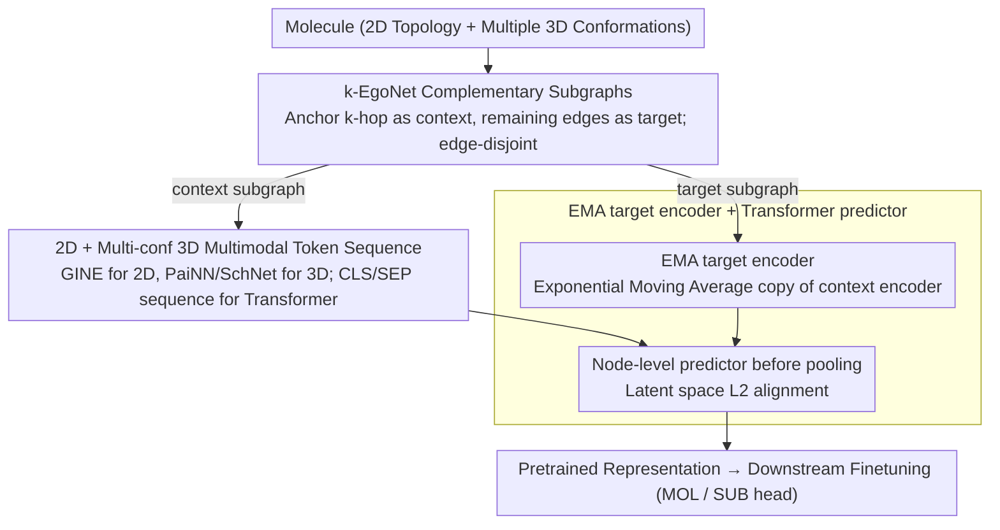

# Learning the Neighborhood: Contrast-Free Multimodal Self-Supervised Molecular Graph Pretraining

**Conference**: ICML 2026  
**arXiv**: [2509.22468](https://arxiv.org/abs/2509.22468)  
**Code**: https://github.com/ariguiba/C-FREE  
**Area**: Molecular Representation / Self-Supervised Pretraining / Graph Neural Networks  
**Keywords**: Multimodal Molecular Graphs, Ego-Net, JEPA, Contrast-Free, 3D Conformation

## TL;DR
C-FREE decomposes molecules into k-EgoNet subgraphs of fixed radii. 2D topology and multiple 3D conformations are encoded via GINE + PaiNN + Transformer, followed by JEPA-style latent space prediction for pretraining. Without negative samples, augmentations, or positional encodings, it outperforms multimodal baselines like UniMol and MolFM (trained on 19M–77M molecules) on 8 MoleculeNet tasks using only 0.33M molecules (GEOM).

## Background & Motivation
**Background**: Self-supervised learning (SSL) for molecular representation is generally categorized into contrastive (GraphCL / GraphMVP / 3D InfoMax), generative (AttrMask / GROVER / MoleBlend), and latent space predictive methods (BGRL / LaGraph / GraphJEPA). Recently, multimodal fusion incorporating 3D conformations (UniMol, GEM, MolFM) has gained traction.

**Limitations of Prior Work**: Contrastive methods rely heavily on the manual design of "positive/negative samples." Molecular stereoisomers have near-identical structures but vastly different properties, making augmentation-based positive samples problematic. Generative methods require reconstructing nodes/edges/attributes in discrete graph space, while autoregressive models suffer from arbitrary node ordering. GraphJEPA adapts JEPA to graphs but requires complex engineering like METIS clustering, hyperbolic positional encodings, and hierarchical targets.

**Key Challenge**: The "neighborhood structure" of a molecule is the true carrier of its properties. Existing SSL frameworks spend excessive computation on "view generation," which dilutes the modeling of the neighborhood itself. Furthermore, mainstream methods often use only 2D or only 3D, neglecting their complementarity.

**Goal**: (i) Eliminate negative samples and complex augmentations; (ii) Unify 2D topology and multiple 3D conformations into a single predictive objective; (iii) Surpass UniMol (19M molecules) using only the 0.33M GEOM dataset.

**Key Insight**: Treat molecules like "image patches"—the fixed-radius k-EgoNet serves as a molecular patch. Let context patches predict complementary target patches in the latent space. This brings the I-JEPA paradigm to graphs while removing all "unnecessary complexity."

**Core Idea**: Utilize "k-EgoNet subgraphs + their complementary subgraphs" as context-target pairs for L2 prediction in latent space. The target encoder uses EMA, and 2D/3D modalities are concatenated into a multimodal token sequence processed by a Transformer. No negative samples, positional encodings, or graph reconstructions are required.

## Method

### Overall Architecture
C-FREE addresses the excessive cost of view generation and the isolation of 2D/3D modalities in molecular SSL. It treats molecules like image patches: starting from an anchor atom, the k-hop neighborhood is extracted as the context subgraph, and the remaining edges form the complementary target subgraph. The model encourages the context to predict the target's representation in latent space, eliminating the need for negative samples or augmentations. Each atom carries 2D topology (graph $G=(V,E)$) and coordinates from multiple 3D conformations $r_v \in \mathbb{R}^3$. These are encoded by GINE and PaiNN/SchNet, respectively, and concatenated into a multimodal token sequence for a Transformer. An EMA target encoder with an asymmetric predictor is used for L2 alignment. Context and target roles are swapped during training to avoid directional bias, and multiple anchors are sampled per molecule to enrich pretraining signals.

### Key Designs

**1. k-EgoNet Complementary Subgraphs: Replacing View Generation with BFS**

While JEPA for images uses fixed-size patches, graphs lack natural patches, leading GraphJEPA to use METIS clustering. C-FREE simplifies this by using k-EgoNets: from node $v$, the k-hop induced subgraph is the context, and the remaining edges form the target. Boundary edges are assigned to one side, while boundary nodes are shared, ensuring the subgraphs are **edge-disjoint** but jointly cover the whole graph. Despite molecular size variation, local chemical environments are finite; fixed radii ensure each subgraph captures comparable local information. Complementary construction naturally pairs context and target, removing manual "positive sample" definitions. Sampling $n$ anchors per molecule generates $n$ complementary pairs, acting as an unsupervised "intra-molecule mini-batch." The partitioning is $O(|V|)$ via BFS, incurring negligible cost compared to METIS.

**2. 2D + Multi-conf 3D Multimodal Token Sequence: Topology Meets Geometry**

Molecular properties often depend on the weighted contribution of multiple high-probability conformations rather than a single one (Cao et al. 2022). Thus, C-FREE incorporates multiple 3D views. It generates 2D embeddings $\{\mathbf{h}^{2D}_v\}$ via GINE (multi-layer average) and 3D embeddings $\{\mathbf{h}^{3D}_{v,c}\}$ for each conformation $c$ via PaiNN/SchNet. These are concatenated into a BERT-style sequence $\mathbf{H}=[\mathbf{h}_{CLS}, \mathbf{h}_{SEP}, \{\mathbf{h}^{2D}_v\}, \mathbf{h}_{SEP}, \{\mathbf{h}^{3D}_{v,c}\}, \mathbf{h}_{SEP}]$, with learnable modality embeddings distinguishing 2D from 3D. Self-attention aggregates within and across modalities, using $\mathbf{h}_{CLS}^{out}$ as the single subgraph representation. Notably, no positional encodings are used—the inductive biases of GINE and PaiNN already encode topological and spatial information into the tokens. Adding PE could disrupt the equivariance of the 3D encoder.

**3. EMA target encoder + Transformer predictor: Preventing Collapse without Negatives**

The main risk of latent space prediction is representation collapse to a constant. C-FREE adopts the BYOL/I-JEPA recipe: the target encoder $f_{\bar{\theta}}$ is an Exponential Moving Average of the context encoder $\bar{\theta}^{(t)} = \tau \bar{\theta}^{(t-1)} + (1-\tau)\theta^{(t)}$, where $\tau$ linearly increases from $\tau_0=0.995$ to $\tau_T=1$. The loss is latent L2: $\frac{1}{M}\sum_i \sum_j \|\hat{\mathbf{s}}_{y_j} - \mathbf{s}_{y_j}\|^2$. Crucially, the predictor is a node-level Transformer + MLP that operates **before pooling**, preserving more structural information. Ablations show EMA alone is insufficient—removing the predictor causes the SSL loss to drop to zero (complete collapse), whereas a Transformer predictor achieves the lowest MAE on Kraken.

### Loss & Training
The pretraining loss is the latent L2 distance described above. During finetuning, two heads are provided: C-FREE$_{\text{MOL}}$ uses the whole graph embedding with a linear layer, while C-FREE$_{\text{SUB}}$ extracts multiple subgraph embeddings and aggregates them via DeepSets. Theoretically, C-FREE$_{\text{SUB}}$ + DeepSets is equivalent to ESAN, and is therefore **strictly stronger than 1-WL** (Lemma 1 in the paper). Pretraining is conducted on 330K molecules from GEOM. The 2D-only backbone has 4M parameters, and the multimodal backbone has 9.1M. If conformations are missing during finetuning, three are generated using RDKit.

## Key Experimental Results

### Main Results

**MoleculeNet 8 Tasks, frozen backbone + linear probing, ROC-AUC ↑**

| Setup | Category | Representative Method | Avg |
|------|------|---------|-----|
| 2D Contrastive | CL | GraphCL | 65.04 |
| 2D Non-contrastive | Non-CL | ContextPred | 60.36 |
| **Ours 2D-MOL** | Non-CL | C-FREE$_{\text{2D-MOL}}$ | **66.63** |
| **Ours 2D-SUB** | Non-CL | C-FREE$_{\text{2D-SUB}}$ | **67.27** |
| **Ours MM-MOL** | Multi | C-FREE$_{\text{MM-MOL}}$ | **71.07** |
| **Ours MM-SUB** | Multi | C-FREE$_{\text{MM-SUB}}$ | 70.92 |

MM-MOL achieves first or second place in 6 out of 8 tasks. Even the 2D-only version outperforms the average of all 2D baselines.

**MoleculeNet Full Finetuning (Comparison with 19M+ molecule multimodal models)**

| Method | Pretraining Scale | MoleculeNet Avg ROC-AUC ↑ |
|------|-----------|--------------------------|
| MoleBlend | PCQM4Mv2 (3M) | 76.16 |
| GEM | ZINC-20M | 78.11 |
| UniMol | 19M molecules / 209M confs | 78.56 |
| **C-FREE$_{\text{PaiNN-3C}}$** | **GEOM 0.33M** | **79.81** |

Ours outperforms UniMol by 1 point using only 1/60 of the pretraining data, achieving SOTA results on BBBP, Tox21, ToxCast, and HIV.

### Ablation Study

**(a) Modality Ablation (Kraken, MAE ↓, FFT = fine-tune from pretrain, RND = random initialization)**

| Modality | Init | B5 | L | BurB5 | BurL |
|------|--------|-----|----|-------|------|
| 2D | RND | 0.297 | 0.396 | 0.205 | 0.152 |
| 2D | FFT | 0.276 | 0.340 | 0.176 | 0.146 |
| 3D | FFT | 0.194 | 0.329 | 0.134 | 0.131 |
| **MM** | **FFT** | **0.193** | **0.306** | **0.134** | **0.126** |

**(b) Predictor / EMA / k Ablation Summary**

| Configuration | Key Metric | Description |
|------|---------|------|
| Full Model (Transformer predictor + EMA τ₀=0.995 + k∈{3,4}) | Lowest Kraken MAE | Baseline |
| w/o predictor | SSL loss → 0, worst downstream MAE | Complete collapse; EMA alone is insufficient |
| MLP predictor | Intermediate performance | Predictor capacity matters |
| τ₀=1.0 (No EMA decay) | Kraken Avg 0.502, worse than RND (0.496) | No momentum teacher, no learning occurs |
| τ₀=0.5 (Aggressive) | Kraken Avg 0.428 (Best) | 0.995 was chosen for stability trade-offs |
| k=1 (1-hop only) | Equal to RND | Too local; insufficient structural signal |
| k=5 | Best | Balanced context/target size yields richest representations |

**(c) Drugs-75K Label Efficiency (MAE ↓ for IP/EA/χ at 1% labels)**

| Data Scale | RND | FFT | Gain |
|--------|------|------|---------|
| 1% IP | 0.638 | **0.608** | -4.7% |
| 1% EA | 0.613 | **0.583** | -4.9% |
| 1% χ | 0.334 | **0.317** | -5.1% |
| 100% IP | 0.419 | 0.419 | Parity |

Pretraining provides a clear advantage in low-label scenarios, while results converge with full data—validating the core value of SSL in label-efficient regimes.

### Key Findings
- **3D is more critical than 2D**: Modality ablations show 3D-only nearly matches multimodal performance, while 2D-only lags significantly. Molecular properties are inherently sensitive to geometry.
- **Predictor prevents collapse**: Removing the predictor causes the loss to collapse to zero; the combination of "EMA + asymmetric predictor" from BYOL is essential.
- **Small data + strong inductive bias beats 60× larger data**: C-FREE trained on 0.33M GEOM molecules outperforms UniMol on 19M, suggesting that "conformational diversity + subgraph prediction" is more sample-efficient than pure data scaling.
- **Optimal k exists**: k=1 is equivalent to random initialization (weak signal), while k=5 is optimal (matched context/target difficulty), aligning with JEPA's philosophy that targets should be neither too trivial nor too abstract.
- **SUB head is mainly necessary for 2D**: When 3D information is rich, the gain from DeepSets aggregation is marginal, though it still improves training efficiency and convergence speed.

## Highlights & Insights
- **"Minimalist" JEPA-on-Graph implementation**: Compared to GraphJEPA, it removes METIS clustering, hyperbolic positional encodings, and hierarchical targets. It demonstrates that these graph-specific complexities are not essential for the JEPA paradigm.
- **Conformation as Natural Augmentation**: Unlike contrastive methods that struggle with stereoisomers, C-FREE feeds multiple conformations into the 3D encoder, treating conformational diversity as a signal rather than noise—a strategy applicable to protein or material SSL.
- **Unified Multimodal Tokenization**: The format `[CLS][SEP] 2D [SEP] 3D-conf1 ... 3D-confN [SEP]` acts as a plug-and-play template, allowing arbitrary numbers of geometric views to fit into a single Transformer without architectural changes.
- **Theory-Experiment Linkage**: Lemma 1 provides a formal guarantee that C-FREE$_{\text{SUB}}$ is strictly stronger than 1-WL. Combined with empirical verification on the EXP dataset, it offers a robust "theoretical upper bound + empirical lower bound" argument.

## Limitations & Future Work
- **Conformation generation as a bottleneck**: Underperformance on SIDER is attributed to RDKit failure for large molecules; future work could integrate stronger diffusion-based generators (e.g., Torsional Diffusion).
- **Under-explored scaling laws**: While sample efficiency is proven on 0.33M GEOM, scaling law experiments on 3M+ PCQM4Mv2 or 20M+ ZINC are missing.
- **Lack of SMILES/Text modality**: The authors intentionally omitted 1D representations, though recent work like MolT5/ChemBERTa shows text can be beneficial in low-data regimes.
- **Handcrafted EgoNet radius**: Although k=5 is optimal in ablations, the model uses k∈{3,4}. Adaptive k or multi-scale ego-net concatenation could be pursued.
- **Derivative theoretical analysis**: Lemma 1 primarily leverages the expressive power of ESAN. The specific impact of the "predictive objective" on expressivity lacks formal analysis.

## Related Work & Insights
- **vs GraphJEPA (Skenderi 2025)**: Both apply JEPA to graphs, but GraphJEPA uses METIS + hyperbolic PE + hierarchical targets. C-FREE simplifies this to "complementary EgoNet + EMA + predictor," outperforming it on ZINC and proving "complexity ≠ necessity."
- **vs UniMol / GEM / MoleBlend (Multimodal Generative)**: These rely on masked reconstruction or cross-modal alignment. C-FREE uses latent L2 prediction and surpasses UniMol with 1/60 of the data, suggesting "predictive ≥ generative" for molecules.
- **vs GraphMVP / 3D InfoMax (2D-3D Contrastive)**: These align 2D/3D views via contrastive loss, which is difficult for stereoisomers. C-FREE avoids defining negatives by learning cross-modal dependencies via the Transformer sequence.
- **vs ESAN / Bevilacqua 2022**: ESAN is a supervised method using subgraph decomposition. C-FREE extends this to SSL and reproduces ESAN's expressive power via the DeepSets head—essentially "SSL for ESAN."
- **vs I-JEPA / BYOL (Vision JEPA)**: C-FREE directly adopts the EMA + predictor + latent L2 recipe, replacing "image patches" with "k-EgoNets" and discarding positional encodings, serving as a template for minimal JEPA adaptation.

## Rating
- Novelty: ⭐⭐⭐⭐ While JEPA on graphs is not new (GraphJEPA), the "minimalist simplification" + unified multi-conf tokenization is a significant engineering contribution.
- Experimental Thoroughness: ⭐⭐⭐⭐⭐ Comprehensive coverage across MoleculeNet (frozen + FFT), QM9, Kraken, ZINC, and Drugs-75K, plus four-way ablations and theoretical lemmas.
- Writing Quality: ⭐⭐⭐⭐ Clear motivation and a single clarifying method diagram (Figure 1), though clarifying the MOL vs SUB finetuning heads requires careful reading.
- Value: ⭐⭐⭐⭐⭐ Outperforming UniMol (19M) with 0.33M data strongly challenges the "data-only" scaling myth in molecular SSL. The pretrained backbone is immediately useful.

<!-- RELATED:START -->

## Related Papers

- [\[ICML 2025\] scSSL-Bench: Benchmarking Self-Supervised Learning for Single-Cell Data](../../ICML2025/computational_biology/scssl-bench_benchmarking_self-supervised_learning_for_single-cell_data.md)
- [\[ICML 2026\] SIGMA: Structure-Invariant Generative Molecular Alignment for Chemical Language Models via Autoregressive Contrastive Learning](sigma_structure-invariant_generative_molecular_alignment_for_chemical_language_m.md)
- [\[ICML 2026\] CARD: Coarse-to-fine Autoregressive Modeling with Radix-based Decomposition for Transferable Free Energy Estimation](card_coarse-to-fine_autoregressive_modeling_with_radix-based_decomposition_for_t.md)
- [\[ICML 2026\] Stein Diffusion Guidance: Training-Free Posterior Correction for Sampling Beyond High-Density Regions](stein_diffusion_guidance_training-free_posterior_correction_for_sampling_beyond_.md)
- [\[ICML 2026\] Protein Fold Classification at Scale: Benchmarking and Pretraining](protein_fold_classification_at_scale_benchmarking_and_pretraining.md)

<!-- RELATED:END -->
