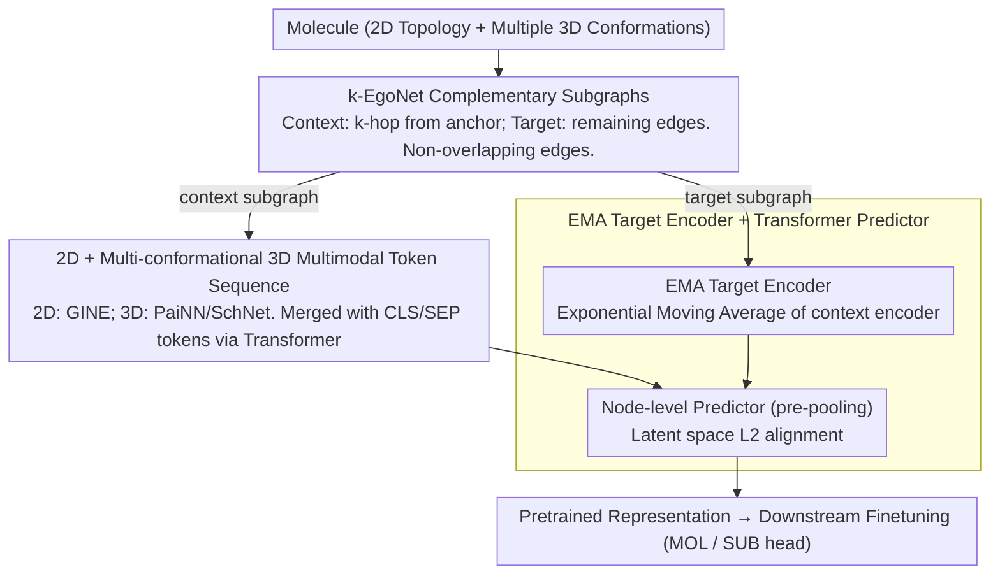

# Learning the Neighborhood: Contrast-Free Multimodal Self-Supervised Molecular Graph Pretraining

**Conference**: ICML 2026  
**arXiv**: [2509.22468](https://arxiv.org/abs/2509.22468)  
**Code**: https://github.com/ariguiba/C-FREE  
**Area**: Molecular Representation / Self-Supervised Pretraining / Graph Neural Networks  
**Keywords**: Multimodal Molecular Graphs, Ego-Net, JEPA, Contrast-Free, 3D Conformations

## TL;DR
C-FREE decomposes molecules into $k$-EgoNet subgraphs with fixed radii. It encodes 2D topology and multiple 3D conformations using GINE, PaiNN, and Transformer architectures, followed by pretraining via JEPA-style latent space prediction. Without negative samples, data augmentation, or positional encodings, it outperforms multimodal baselines like UniMol and MolFM (trained on 19M–77M molecules) on 8 MoleculeNet tasks using only 0.33M molecules (GEOM).

## Background & Motivation
**Background**: Self-supervised learning (SSL) for molecular representation generally falls into three categories: contrastive (GraphCL / GraphMVP / 3D InfoMax), generative (AttrMask / GROVER / MoleBlend), and latent-space predictive (BGRL / LaGraph / GraphJEPA). Recently, multimodal fusion using 3D conformations (UniMol, GEM, MolFM) has gained traction.

**Limitations of Prior Work**: Contrastive methods rely heavily on the manual design of "positive/negative samples." Molecular chiral isomers have nearly identical structures but vastly different properties, making augmentation-based positive samples problematic. Generative methods must reconstruct nodes/edges/attributes in discrete graph spaces, and auto-regressive approaches require an artificial node ordering. GraphJEPA brought JEPA to graphs but required complex METIS clustering, hyperbolic positional encodings, and hierarchical objectives, resulting in a heavy engineering pipeline.

**Key Challenge**: The "neighborhood structure" of a molecule is the true carrier of its properties. Existing SSL frameworks spend too much compute on "how to create views," which dilutes the modeling of the neighborhood itself. Furthermore, mainstream methods often use only 2D or 3D information, ignoring their complementarity.

**Goal**: (i) Eliminate negative samples and complex augmentations; (ii) Unify 2D topology and multiple 3D conformations into a single predictive objective; (iii) Surpass models like UniMol (19M molecules) using only the 0.33M molecules in GEOM.

**Key Insight**: Treat molecules like "image patches"—a $k$-EgoNet with a fixed radius acts as a patch within a molecule. Predict complementary target patches from context patches in the latent space. This adapts the I-JEPA paradigm to graphs while stripping away unnecessary complexity.

**Core Idea**: Use "$k$-EgoNet subgraphs + their complements" as context-target pairs for L2 prediction in the latent space. The target encoder uses EMA. 2D/3D modalities are concatenated into a multimodal token sequence for a Transformer. The process involves no negative samples, no positional encodings, and no graph reconstruction.

## Method

### Overall Architecture
C-FREE addresses the issues of compute-heavy view generation and the underutilization of 2D/3D complementarity in molecular SSL. It treats molecules like image patches: starting from an anchor atom, a $k$-hop neighborhood is taken as the context subgraph, and the remaining edges form the complementary target subgraph. The model predicts the target representation from the context in the latent space, eliminating the need for negative samples or augmentations. Each atom carries 2D topology (graph $G=(V, E)$) and coordinates for multiple 3D conformations $r_v \in \mathbb{R}^3$. These are encoded by GINE and PaiNN/SchNet, respectively, and concatenated into a multimodal token sequence for a Transformer. Finally, an EMA target encoder and an asymmetric predictor are used for L2 alignment. The roles of context and target alternate during training to avoid directional bias, and multiple anchors are sampled per molecule to augment pretraining signals.

### Key Designs

**1. $k$-EgoNet Complementary Subgraphs: Replacing "View Generation" with BFS**

JEPA for images relies on fixed-size patch pairs, but graphs lack natural patches. GraphJEPA introduced heavy engineering like METIS clustering for this. C-FREE instead uses $k$-EgoNets: starting from a node $v$, the $k$-hop induced subgraph is the context, and the remaining edges form the target. Boundary edges are strictly assigned to one side while boundary nodes are shared, ensuring the subgraphs have **disjoint edges** but collectively cover the full graph. While molecular sizes vary, local chemical environments are finite; a fixed radius ensures each subgraph captures a comparable amount of local information. The complementary construction naturally pairs context and target, removing the need to manually define positive instances. Sampling $n$ anchors per molecule yields $n$ complementary pairs, acting as an unsupervised "intra-molecular mini-batch." The partition is an $O(|V|)$ BFS, incurring nearly zero overhead compared to METIS.

**2. Integrating 2D + Multi-conformational 3D into Multimodal Token Sequences**

Molecular properties often depend on a weighted average of high-probability conformations rather than a single one (Cao et al. 2022). Thus, C-FREE utilizes multiple 3D conformations. It generates 2D embeddings $\{\mathbf{h}^{2D}_v\}$ for each atom via GINE and 3D embeddings $\{\mathbf{h}^{3D}_{v,c}\}$ for each conformation $c$ via PaiNN/SchNet. These are concatenated into a BERT-style sequence $\mathbf{H}=[\mathbf{h}_{CLS}, \mathbf{h}_{SEP}, \{\mathbf{h}^{2D}_v\}, \mathbf{h}_{SEP}, \{\mathbf{h}^{3D}_{v,c}\}, \mathbf{h}_{SEP}]$ with learnable modality embeddings. This allows self-attention to aggregate information within and across modalities. The final $\mathbf{h}_{CLS}^{out}$ serves as the subgraph representation. Notably, no positional encodings (PE) are used; the inductive biases of GINE and PaiNN already encode topological and spatial information into tokens, and adding PE could break the equivariance of the 3D encoder.

**3. EMA Target Encoder + Transformer Predictor: Preventing Collapse Without Negatives**

The biggest risk in latent space prediction is representation collapse into a constant. C-FREE adopts the proven combination from BYOL/I-JEPA: the target encoder $f_{\bar{\theta}}$ is an exponential moving average (EMA) of the context encoder $\bar{\theta}^{(t)} = \tau \bar{\theta}^{(t-1)} + (1-\tau)\theta^{(t)}$, where $\tau$ increases linearly from $\tau_0=0.995$ to $\tau_T=1$. The prediction loss is L2 in the latent space: $\frac{1}{M}\sum_i \sum_j \|\hat{\mathbf{s}}_{y_j} - \mathbf{s}_{y_j}\|^2$. Crucially, the predictor is a node-level Transformer + MLP that operates **before pooling**, preserving more structural information. Ablations show that EMA alone is insufficient—removing the predictor causing the SSL loss to drop to 0 (total collapse). While an MLP predictor helps, a Transformer predictor achieves the lowest MAE on Kraken, suggesting that node-level prediction followed by pooling is superior to direct graph-level prediction for capturing fine-grained structures.

### Loss & Training
The pretraining loss is the latent space L2 mentioned above. For finetuning, two heads are provided: C-FREE$_{\text{MOL}}$ uses the full graph embedding with a linear layer, and C-FREE$_{\text{SUB}}$ takes multiple subgraph embeddings and aggregates them via DeepSets. Theoretically, C-FREE$_{\text{SUB}}$ + DeepSets is equivalent to ESAN and thus **strictly stronger than 1-WL** (Lemma 1). Pretraining is performed on 330K molecules from GEOM. The 2D-only backbone has 4M parameters, and the multimodal backbone has 9.1M. During finetuning, if conformations are missing, RDKit is used to generate 3 on the fly.

## Key Experimental Results

### Main Results

**MoleculeNet (8 tasks), Frozen Backbone + Linear Probing, ROC-AUC ↑**

| Setting | Category | Representative Method | Avg |
|---------|----------|-----------------------|-----|
| 2D Contrastive | CL | GraphCL | 65.04 |
| 2D Non-Contrastive | Non-CL | ContextPred | 60.36 |
| **Ours 2D-MOL** | Non-CL | C-FREE$_{\text{2D-MOL}}$ | **66.63** |
| **Ours 2D-SUB** | Non-CL | C-FREE$_{\text{2D-SUB}}$ | **67.27** |
| **Ours MM-MOL** | Multi | C-FREE$_{\text{MM-MOL}}$ | **71.07** |
| **Ours MM-SUB** | Multi | C-FREE$_{\text{MM-SUB}}$ | 70.92 |

MM-MOL achieved the first or second place in 6 out of 8 tasks. Even the 2D-only version outperfoms all 2D baseline averages.

**MoleculeNet Full Finetuning (Comparison with Multi-modal LLMs trained on 19M+ molecules)**

| Method | Pretraining Scale | MoleculeNet Avg ROC-AUC ↑ |
|--------|------------------|---------------------------|
| MoleBlend | PCQM4Mv2 (3M) | 76.16 |
| GEM | ZINC-20M | 78.11 |
| UniMol | 19M molecules / 209M conformations | 78.56 |
| **C-FREE$_{\text{PaiNN-3C}}$** | **GEOM 0.33M** | **79.81** |

Ours outperforms UniMol by 1 point with 1/60 of the pretraining data, achieving SOTA on BBBP, Tox21, ToxCast, and HIV.

### Ablation Study

**(a) Modality Ablation (Kraken, MAE ↓, FFT = fine-tune from pretrain, RND = random initialization)**

| Modality | Init | B5 | L | BurB5 | BurL |
|----------|------|-----|----|-------|------|
| 2D | RND | 0.297 | 0.396 | 0.205 | 0.152 |
| 2D | FFT | 0.276 | 0.340 | 0.176 | 0.146 |
| 3D | FFT | 0.194 | 0.329 | 0.134 | 0.131 |
| **MM** | **FFT** | **0.193** | **0.306** | **0.134** | **0.126** |

**(b) Predictor / EMA / $k$ Ablation Summary**

| Config | Key Metric | Description |
|--------|------------|-------------|
| Full Model (Transformer predictor + EMA $\tau_0=0.995$ + $k \in \{3,4\}$) | Lowest Kraken MAE | Baseline |
| w/o predictor | SSL loss → 0, worst downstream MAE | Total collapse; proves EMA alone is insufficient |
| MLP predictor | Intermediate | Predictor capacity matters |
| $\tau_0=1.0$ (No EMA decay) | Kraken Avg 0.502, worse than RND (0.496) | No decay = no momentum teacher; no learning occurs |
| $\tau_0=0.5$ (Aggressive) | Kraken Avg 0.428 (Best) | $\tau_0=0.995$ was chosen for stability |
| $k=1$ (1-hop only) | Similar to RND | Too local; insufficient structural signal |
| $k=5$ | Best | Richer representations when context/target sizes match |

**(c) Drugs-75K Label Efficiency (MAE ↓ on IP/EA/$\chi$ with 1% labels)**

| Data Amount | RND | FFT | Gain |
|-------------|------|------|------|
| 1% IP | 0.638 | **0.608** | -4.7% |
| 1% EA | 0.613 | **0.583** | -4.9% |
| 1% $\chi$ | 0.334 | **0.317** | -5.1% |
| 100% IP | 0.419 | 0.419 | Parity |

Pretraining advantage is significant in low-label scenarios but levels off with full data, confirming SSL's value in label-efficient regimes.

### Key Findings
- **3D is more important than 2D**: Modality ablations show 3D-only nearly matches multimodal results, while 2D-only lags significantly. Molecular properties are inherently sensitive to geometry, which maximizes representation quality.
- **Predictor is the true guardian against collapse**: Removing it causes loss to drop to zero. In the BYOL series, the "EMA + asymmetric predictor" combo is indispensable.
- **Small data + strong inductive bias beats 60× larger data**: C-FREE trained on 0.33M GEOM molecules outperforms 19M UniMol, proving that "conformational diversity + subgraph prediction" is more sample-efficient than brute-force data scaling.
- **Optimal $k$ exists**: $k=1$ is equivalent to random initialization (weak local signal), while $k=5$ is optimal (matching context/target scale balances task difficulty), echoing the JEPA philosophy that targets should be neither too trivial nor too abstract.
- **SUB head is mainly necessary for 2D scenarios**: When 3D information is rich, gain from DeepSets aggregation is marginal, though it speeds up convergence, indicating efficiency benefits from aligning pretraining and finetuning geometric forms.

## Highlights & Insights
- **"Minimalist" implementation of JEPA-on-graph**: Compared to GraphJEPA, this model removes METIS clustering, hyperbolic positional encodings, and hierarchical objectives. It proves these "graph-specific complexities" are not required for JEPA, serving as a successful "subtractive research" case.
- **Conformations as natural data augmentation**: Traditional contrastive methods struggle with chiral isomers, but C-FREE treats multiple conformations of the same molecule as tokens. This turns conformational diversity into a signal rather than noise—a concept that could benefit protein or material SSL.
- **Unified Multimodal Tokenization**: The `[CLS][SEP] 2D [SEP] 3D-conf1 ... 3D-confN [SEP]` format is a plug-and-play template for Transformers to learn cross-modal dependencies without architecture changes.
- **Theory + Experiment Linkage**: Lemma 1 provides a formal guarantee that C-FREE$_{\text{SUB}}$ is equivalent to ESAN and strictly stronger than 1-WL. Empirical validation on the EXP dataset further confirms this theoretical upper bound.

## Limitations & Future Work
- **Conformation generation as a bottleneck**: Poor performance on SIDER was due to RDKit failing to generate conformations for large molecules, necessitating dummy coordinates. This highlights dependency on generators like GEOM/RDKit; future work could integrate diffusion-based generators (e.g., Torsional Diffusion).
- **Unexplored Scaling Law**: While sample efficiency was proven on 0.33M GEOM molecules, the model hasn't been tested on 3M+ PCQM4Mv2 or 20M+ ZINC data to see if performance continues to scale.
- **Lack of SMILES/Text Modalities**: The authors omitted 1D representations (see A.4), but recent work (MolT5 / ChemBERTa) shows text modalities are helpful in low-data regimes.
- **Manual $k$-radius selection**: Although $k=5$ was best in ablations, the authors conservatively used $k \in \{3,4\}$. Future versions could use adaptive radii or multi-scale EgoNet concatenations.
- **Theoretical scope**: Lemma 1 primarily adopts ESAN's expressiveness; the specific impact of the "predictive objective" on expressiveness lacks formal analysis.

## Related Work & Insights
- **vs. GraphJEPA (Skenderi 2025)**: Both apply JEPA to graphs, but GraphJEPA uses METIS + Hyperbolic PE + Hierarchical objectives. C-FREE simplifies this to "Complementary EgoNet + EMA + Predictor." C-FREE outperforms GraphJEPA on ZINC, proving "complexity $\neq$ necessity."
- **vs. UniMol / GEM / MoleBlend (Multimodal Generative)**: These rely on mask reconstruction or cross-modal alignment losses. C-FREE uses latent space L2 prediction. Outperforming UniMol with 1/60 of the data suggests "Predictive $\geq$ Generative" for molecules.
- **vs. GraphMVP / 3D InfoMax (2D-3D Contrastive Alignment)**: These align 2D/3D via contrastive loss, which is hindered by negative sampling issues (e.g., chirality). C-FREE avoids "what is negative" by concatenating conformations into a sequence for self-attention.
- **vs. ESAN / Bevilacqua 2022**: ESAN is a supervised method using subgraph decomposition. C-FREE extends this to SSL and reproduces ESAN's expressiveness bound via a DeepSets head—essentially "SSL for ESAN."
- **vs. I-JEPA / BYOL (Visual JEPA)**: Directly adopts the EMA + Predictor + Latent L2 trio but replaces "image patches" with "$k$-EgoNets" and discards PE (since GNNs already encode topology), serving as a model for minimalist JEPA migration.

## Rating
- Novelty: ⭐⭐⭐⭐ Bringing JEPA to molecular graphs isn't new (following GraphJEPA), but "stripping unnecessary complexity" + unified multi-conformational tokenization is a significant contribution.
- Experimental Thoroughness: ⭐⭐⭐⭐⭐ Comprehensive coverage: MoleculeNet (frozen + FFT), QM9, Kraken, ZINC, Drugs-75K, four-way ablations, and theoretical lemmas.
- Writing Quality: ⭐⭐⭐⭐ Clear motivation and architecture diagrams (Figure 1), though clarifying the MOL vs. SUB finetuning heads requires careful reading.
- Value: ⭐⭐⭐⭐⭐ Outperforming UniMol (19M) with 0.33M data is a powerful rebuttal to the "more data is always better" myth in molecular SSL. The backbone is highly practical.

<!-- RELATED:START -->

## Related Papers

- [\[ICLR 2026\] Animal behavioral analysis and neural encoding with transformer-based self-supervised pretraining](../../ICLR2026/computational_biology/animal_behavioral_analysis_and_neural_encoding_with_transformer-based_self-super.md)
- [\[ICML 2026\] Supervised Graph Contrastive Learning for Gene Regulatory Networks](supervised_graph_contrastive_learning_for_gene_regulatory_networks.md)
- [\[ICML 2025\] scSSL-Bench: Benchmarking Self-Supervised Learning for Single-Cell Data](../../ICML2025/computational_biology/scssl-bench_benchmarking_self-supervised_learning_for_single-cell_data.md)
- [\[ICML 2026\] SIGMA: Structure-Invariant Generative Molecular Alignment for Chemical Language Models via Autoregressive Contrastive Learning](sigma_structure-invariant_generative_molecular_alignment_for_chemical_language_m.md)
- [\[ICML 2026\] CARD: Coarse-to-fine Autoregressive Modeling with Radix-based Decomposition for Transferable Free Energy Estimation](card_coarse-to-fine_autoregressive_modeling_with_radix-based_decomposition_for_t.md)

<!-- RELATED:END -->
