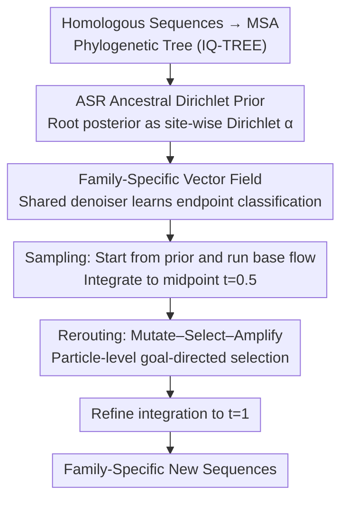

# LineageFlow: Flow Matching for High-Fidelity Family-Aware Protein Sequence Generation

**Conference**: ICML 2026  
**arXiv**: [2605.22252](https://arxiv.org/abs/2205.22252)  
**Code**: https://github.com/Jinx-byebye/LineageFlow (Available)  
**Area**: Protein Generation / Flow Matching / Phylogenetic Priors  
**Keywords**: Flow Matching, Dirichlet Prior, Ancestral Sequence Reconstruction, Protein Family, Directed Evolution

## TL;DR
The universal uniform/mask noise prior is replaced with a family-specific Dirichlet prior obtained via Ancestral Sequence Reconstruction (ASR). This allows Dirichlet flow matching to perform structured mutations starting from an "evolved scaffold," followed by a mutate–select–amplify rerouting at an intermediate timestep. Across 8,886 Pfam families, this approach pushes family recognition accuracy close to natural sequences (95.3% vs. 96.6%) while maintaining high novelty and folding confidence.

## Background & Motivation

**Background**: Protein sequence generation is dominated by two paradigms: large-scale protein language models (e.g., ESM, ProtT5, ProGen) and discrete diffusion/flow matching adapted to the amino acid simplex (e.g., EvoDiff, DFM, ProtBFN). When the goal is to "generate new sequences for a specific Pfam family," conventional methods typically provide a family label or an MSA prompt to the denoiser as a condition.

**Limitations of Prior Work**: Nearly all these discrete generative models default to a "universal prior"—starting either from a uniform distribution on the simplex or masking all original residues. However, protein families are characterized by **site-specific** evolutionary constraints: certain sites are highly conserved to maintain structure and catalysis, while others are highly variable to accommodate functional diversity. Universal priors erase this structure, forcing the denoiser to synthesize every conserved residue "from scratch" from a near-random state, which places immense pressure on early timesteps. This contradiction is stark in the paper’s experiments: even when explicitly fed family labels, the family recognition accuracy (via profile-HMM) for DFM and EvoDiff remains at **0%**, with pLDDT around 45. PoET, which uses MSA prompts, also achieves 0% accuracy.

**Key Challenge**: The absence of evolutionary structure in the prior $\leftrightarrow$ Family information exists only as a label or prompt and does not penetrate the generative trajectory. The conditional signal "shouts from the outside," while the internal denoiser still performs from-scratch synthesis.

**Goal**: To **bake family conditions into the prior itself**, ensuring that $t=0$ already resides on the family manifold. The model should only need to learn the mutation process from "ancestor $\to$ extant sequence" rather than the synthesis process from "noise $\to$ protein."

**Key Insight**: Molecular evolution provides existing tools: building MSAs for a family of homologous sequences, inferring phylogenetic trees with IQ-TREE, and performing Ancestral Sequence Reconstruction (ASR) at the root node using PAML. This yields a **site-wise** amino acid posterior. This posterior is near one-hot at conserved sites and maintains high entropy at variable sites—the exact "family scaffold" desired.

**Core Idea**: Use the ASR root posterior as a family-specific Dirichlet prior $q_0^{(h)}$ to initiate flow matching on the simplex towards extant sequences. Additionally, insert a mutate–select–amplify intermediate step, directly mimicking directed evolution, for goal-directed sampling.

## Method

### Overall Architecture
LineageFlow addresses the generation of protein sequences that are both family-consistent and sufficiently novel. Its key transformation is mapping the flow matching generative timeline $t \in [0, 1]$ directly onto the evolutionary timeline from "family ancestor to extant leaf node." The starting point is no longer universal noise but a family scaffold calculated via Ancestral Sequence Reconstruction (ASR). The endpoint is an extant sequence, and the denoiser learns "how an ancestor mutates into an extant sequence" rather than "how noise is synthesized into a protein." In the preprocessing stage, MSAs are built for each family, phylogenetic trees are inferred using IQ-TREE, and ASR is performed at the root using PAML. During training, all families share a single denoiser that learns endpoint classification from intermediate states sampled from family-specific Dirichlet paths. During sampling, the base flow is run to the midpoint $t_{\mathrm{int}}=0.5$, where a particle-level mutate–select–amplify rerouting is inserted for goal-directed selection, followed by refined integration to the endpoint.

### Key Designs

**1. ASR Ancestral Dirichlet Prior: Embedding evolutionary constraints in the starting point**

Universal discrete flow matching (e.g., DFM) starts from a uniform Dirichlet $\mathrm{Dir}(\mathbf{1})$ on the simplex. Without evolutionary info in the prior, the denoiser is forced to synthesize conserved residues from zero. LineageFlow maintains a set of Dirichlet concentration parameters $\boldsymbol{\alpha}^{(h,l)} \in \mathbb{R}^K_{>0}$ ($K=20$) for each site $l$ of family $h$, encoding the ASR root posterior. The family prior for the entire sequence is the product of site-independent Dirichlets $q_0^{(h)}(\mathbf{X}) = \prod_l \mathrm{Dir}(\mathbf{x}^{(l)}; \boldsymbol{\alpha}^{(h,l)})$. The conditional path shifts from DFM's $\mathrm{Dir}(\mathbf{x}; \mathbf{1} + t_{\max} t \cdot \mathbf{e}_i)$ to the family-specific $\mathrm{Dir}(\mathbf{x}; \boldsymbol{\alpha}^{(h,l)} + t_{\max} t \cdot \mathbf{e}_i)$. The transport velocity $c_h^{(l)}(z, t)$ derived from the continuity equation thus takes a closed-form specific to both the family and target residue.

**2. Classifier-parameterized family-specific vector field: A shared denoiser for all Pfam families**

With family-specific analytical velocities $c_h^{(l)}$, the only remaining task is learning the endpoint distribution. The training objective is standard average cross-entropy $\mathcal{L}(\theta) = \mathbb{E}[-\frac{1}{|\mathcal{V}|}\sum_l \log \hat{p}_\theta(\mathbf{x}_1^{(l)} \mid \mathbf{X}_t, t)]$. During inference, the classifier posterior and family analytical velocity are combined into the drift $\hat{\mathbf{v}}^{(h,l)}$. Gap columns in MSAs are masked.

This design delegates "family specificity" entirely to the analytical $\boldsymbol{\alpha}^{(h,l)}$ and $c_h^{(l)}$. The denoiser itself requires neither family labels nor family-specific heads; a single network covers all 8,886 families.

**3. Rerouting: Intermediate mutate–select–amplify for goal-directed sampling**

Unconditional base flow generates "family-like" sequences, but users often desire high-fitness variants. LineageFlow pauses the ODE at $t_{\mathrm{int}}=0.5$ and maintains a population of particles to perform: (i) **mutate**—injecting diversity via a proposal kernel $\mathcal{K}$; (ii) **select**—reweighting by $\exp(\beta J)$; and (iii) **amplify**—resampling according to weights. This is proven to be the optimal solution under KL constraints. Integration then continues to $t=1$. Placing this "artificial selection" at the midpoint ensures family trajectories are preserved while receiving a goal-oriented bias.

### Loss & Training
A single average cross-entropy $\mathcal{L}(\theta)$ is used. $t \sim \mathcal{U}[0,1]$ is sampled uniformly with $t_{\max}=6$. Data consists of 8,886 Pfam-A RP35 families (8.94M aligned sequences), with 5% within-family hold-out. Training took 26 hours for 1 epoch on 4×RTX 4090 with a learning rate of $10^{-5}$ and an effective batch size of 128.

## Key Experimental Results

### Main Results (Pfam unconditional, 1024 sequences/method)

| Method | $\mathrm{Acc}_{\mathrm{fam}}$↑ | pLDDT↑ | scPPL↓ | Novelty@0.6↑ | Diversity↑ |
|------|------|------|------|------|------|
| Pfam held-out (Ceiling) | 96.6 | 86.4 | 5.02 | 12.6 | 806 |
| DFM (Uniform Prior) | 0.0 | 46.2 | 12.62 | — | 90 |
| EvoDiff (Mask Prior) | 0.0 | 45.4 | 12.60 | — | 54 |
| PoET (MSA prompt) | 0.0 | 52.0 | 13.76 | — | 47 |
| ProtBFN† (8× Corpus) | — | 71.9 | 5.91 | 64.0 | 604 |
| ASR-PSSM iid (Prior only) | 92.8 | 70.8 | 7.08 | 32.0 | 378 |
| LineageFlow w/o rerouting | 93.0 | 69.6 | 7.96 | 52.0 | 440 |
| **LineageFlow (Full)** | **95.3** | **76.6** | **6.67** | **48.9** | **587** |

### Key Findings
- **Prior determines everything**: DFM/EvoDiff fail to recognize families even with labels. Simply replacing the prior with the ASR root posterior (without learning any flow) jumps family recognition to 92.8%.
- **Rerouting acts as a plausibility lever**: The base flow inherits family signals but struggles with folding confidence. Inserting mutate–select–amplify increases pLDDT by 7 points.
- **Midpoint $t_{\mathrm{int}}$ is optimal**: Selection is meaningless if too early (unformed samples) or too late (near one-hot). 0.5 provides the best trade-off between plasticity and structure.
- **Zero-shot enzyme generation**: On held-out enzyme families (e.g., RNase_HII), Ours preserves catalytic motifs and improves predicted solubility and thermal stability.

## Highlights & Insights
- **"Changing the Prior" is more fundamental than "Adding Guidance"**: For structured conditions like protein families, embedding the condition in the prior is more effective than feeding it to the denoiser.
- **Leveraging Biological Toolchains**: Directly using PAML/IQ-TREE root posteriors as Dirichlet concentrations is a clever way to package evolutionary inductive biases.
- **Rerouting Formalizes Directed Evolution**: The single-step mutate–select–amplify is equivalent to KL-regularized exponential tilting, providing a sample-efficient alternative to continuous guidance.

## Limitations & Future Work
- **Reliance on MSA Quality**: Family-specific parameters depend on MSAs and trees, making it inapplicable to orphan proteins or entirely de novo families.
- **Fixed Alignment Coordinates**: Does not explicitly model indels, limiting generation to aligned column coordinates.
- **Computational Proxies**: folding and fitness rely on pLDDT or ESM-2 scores rather than wet-lab validation.
- **Increased Sampling Time**: Rerouting increases the 512-sequence sampling time from 759s to 1047s.

## Related Work & Insights
- **vs. DFM (Stark et al., 2024)**: DFM uses a uniform prior. Ours proves the prior is the true performance bottleneck for family conditioning.
- **vs. ProtBFN (Atkinson et al., 2025)**: BFN relies on 71M sequences. Ours achieves higher pLDDT on an 8× smaller corpus by using the "correct" prior.
- **vs. Classifier Guidance**: Rerouting offers a lightweight alternative to step-wise guidance with theoretical KL-regularization guarantees.

## Rating
- Novelty: ⭐⭐⭐⭐⭐ 
- Experimental Thoroughness: ⭐⭐⭐⭐ 
- Writing Quality: ⭐⭐⭐⭐⭐ 
- Value: ⭐⭐⭐⭐⭐ 

## Related Papers

- [\[ICLR 2026\] EvoFlows: Evolutionary Edit-Based Flow-Matching for Protein Engineering](../../ICLR2026/computational_biology/evoflows_evolutionary_edit-based_flow-matching_for_protein_engineering.md)
- [\[NeurIPS 2025\] Prior-Guided Flow Matching for Target-Aware Molecule Design with Learnable Atom Number](../../NeurIPS2025/computational_biology/prior-guided_flow_matching_for_target-aware_molecule_design_with_learnable_atom_.md)
- [\[ICML 2025\] Flexibility-conditioned Protein Structure Design with Flow Matching](../../ICML2025/computational_biology/flexibility-conditioned_protein_structure_design_with_flow_matching.md)
- [\[NeurIPS 2025\] Energy Matching: Unifying Flow Matching and Energy-Based Models for Generative Modeling](../../NeurIPS2025/computational_biology/energy_matching_unifying_flow_matching_and_energy-based_models_for_generative_mo.md)
- [\[ICML 2025\] Improving Flow Matching by Aligning Flow Divergence](../../ICML2025/computational_biology/improving_flow_matching_by_aligning_flow_divergence.md)

<!-- RELATED:END -->

<!-- RELATED:START -->

## Related Papers

- [\[ICML 2026\] Flow Sampling: Learning to Sample from Unnormalized Densities via Denoising Conditional Processes](flow_sampling_learning_to_sample_from_unnormalized_densities_via_denoising_condi.md)
- [\[ICML 2026\] Scalable Single-Cell Gene Expression Generation with Latent Diffusion Models](scalable_single-cell_gene_expression_generation_with_latent_diffusion_models.md)
- [\[ICML 2026\] Protein Language Model Embeddings Improve Generalization of Implicit Transfer Operators](protein_language_model_embeddings_improve_generalization_of_implicit_transfer_op.md)
- [\[ICML 2026\] Protein Autoregressive Modeling via Multiscale Structure Generation](protein_autoregressive_modeling_via_multiscale_structure_generation.md)
- [\[ICML 2026\] Demystifying Multimodal Biomolecular Co-design with Intrinsic Geodesic Coupling](demystifying_multimodal_biomolecular_co-design_with_intrinsic_geodesic_coupling.md)

<!-- RELATED:END -->
