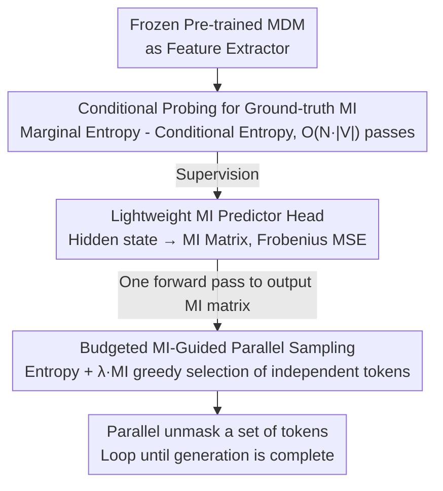

# Neural Estimation of Pairwise Mutual Information in Masked Discrete Sequence Models

**Conference**: ICML2026  
**arXiv**: [2605.20187](https://arxiv.org/abs/2605.20187)  
**Code**: To be confirmed  
**Area**: Computational Biology  
**Keywords**: Masked Diffusion Models, Mutual Information, Parallel Sampling, ESM-C, Sudoku

## TL;DR
Starting from the hidden states of a pre-trained masked diffusion model (MDM), this paper trains a lightweight "mutual information (MI) predictor head" that outputs the full matrix of conditional MI between all token pairs in a single forward pass. This MI matrix guides parallel decoding by selecting "conditionally independent" token subsets, reducing inference NFE by 3–5x on Sudoku and protein (ESM-C) tasks while maintaining or exceeding the quality of sequential decoding.

## Background & Motivation
**Background**: Masked Diffusion Models (MDMs) are now considered powerful alternatives to Autoregressive (AR) models for discrete sequence generation. They model the generation process as a reverse diffusion process from a fully masked state to an unmasked sequence. To avoid $L$ steps, standard acceleration strategies like Mask-Predict use parallel decoding based on "marginal confidence (entropy)," unmasking the top-$k$ tokens with the lowest entropy simultaneously.

**Limitations of Prior Work**: Relying solely on marginal confidence for parallel token selection fails on structured data. If two tokens have high confidence but are highly correlated, sampling them simultaneously can violate hard constraints (e.g., placing two "3"s in the same row in Sudoku) or destroy global consistency in protein generation. Works like EB-Sampler attempt to bound joint entropy using the sum of marginal entropies, but this compresses dependency structures into an aggregate uncertainty value, failing to characterize conditional and asymmetric dependencies between tokens.

**Key Challenge**: During training, MDMs only explicitly learn the marginal $p(x^i \mid x_t)$ and do not directly provide the joint $p(x^i, x^j \mid x_t)$. However, the correctness of parallel decoding specifically requires knowing which positions are conditionally independent—information that marginal distributions cannot provide.

**Goal**: (1) "Read out" the conditional mutual information $I(X_i; X_j \mid C)$ for any two positions $i, j$ from the MDM’s hidden states. (2) Use this MI matrix to guide parallel decoding, unmasking only tokens with low MI (conditionally independent) in the same step.

**Key Insight**: The hidden layers of an MDM already encode joint information—the standard output heads simply do not expose it. Therefore, a lightweight predictor head can be trained using the MDM as a "feature extractor," with supervision signals derived from the "ground-truth MI" defined by the model itself through brute-force conditional probing.

**Core Idea**: Use a neural mutual information estimator to predict the full $N \times N$ MI matrix in one forward pass, then use a budgeted greedy selection based on entropy + $\lambda \cdot$ MI to unmask conditionally independent token sets.

## Method

### Overall Architecture
This paper addresses the "wrong token selection" issue in MDM parallel decoding: existing methods only consider the marginal confidence of each position and cannot determine if two high-confidence positions are correlated, leading to constraint violations when unmasking simultaneously. The authors hypothesize that the pre-trained MDM's hidden states already encode joint dependencies among tokens. They train a lightweight predictor head to explicitly output these dependencies as a conditional MI matrix, which is then used to select conditionally independent tokens. The supervision signal comes not from the true data distribution but from the "model-believed MI" obtained via probing the MDM itself.

### Key Designs

**1. Ground-truth MI based on conditional probing: Extracting joint dependencies from marginal-only MDMs**

The predictor head requires a regression target. Since MDMs only learn $p(x^i \mid x_t)$, the authors use the identity $I(X_i; X_j \mid C) = H(X_j \mid C) - H(X_j \mid X_i, C)$ to decompose MI into "marginal entropy - conditional entropy." This requires $1 + N \cdot |V|$ forward passes: one base pass to get $P(X_i \mid C)$ and $H(X_j \mid C)$, and then one pass for each position $i$ and each vocabulary token $v \in V$ by temporarily fixing $X_i = v$. The conditional entropy is then the weighted sum based on $P(X_i = v \mid C)$. Using the "model-probed MI" ensures the estimator learns exactly what the model "believes," matching the downstream use case.

**2. Lightweight MI predictor head on hidden states: Compressing MI estimation into one forward pass**

Conditional probing is too expensive for the inference loop. The authors treat the frozen MDM as a feature extractor, taking the final layer hidden states $h \in \mathbb{R}^{N \times D}$ and feeding them into a small head $f_\phi$ that outputs a symmetric matrix $\hat{I} = f_\phi(\text{MDM}(X_t))$. The training objective is the Frobenius MSE on masked positions: $\mathcal{L}_{MI} = \|M_{GT} - \hat{I}\|_F^2$. This head is extremely small (~100K parameters for Sudoku, ~810K for ESM-C).

**3. Budgeted MI-Guided Parallel Sampling: Unmasking conditionally independent sets**

With the MI matrix, a greedy algorithm with a budget decides which tokens to unmask simultaneously. Candidates are sorted by marginal entropy $h_i$. For each candidate $i$, the dependency cost relative to the already selected set $U$ is calculated as $d(i \mid U) = \sum_{j \in U} \hat{I}_{i,j}$. The total cost is $\text{cost} = h_i + \lambda \cdot d(i \mid U)$. If $\text{cost} \le B$, token $i$ is added to $U$. This ensures that highly correlated tokens (high $\hat{I}_{i,j}$) are deferred to later steps, where their distributions will be updated based on already unmasked tokens.

### Loss & Training
The estimator only computes Frobenius MSE on masked positions, while the original MDM remains frozen. For Sudoku, a 4.16M parameter MDM with a 0.10M head was trained for 10 epochs. For ESM-C, a 300M parameter ESM-Cambrian backbone with an 810K head was trained for 5 epochs.

## Key Experimental Results

### Main Results: Sudoku Parallel Decoding

| Method | Avg. NFE | Solve Acc. |
|------|---------|-----------|
| Sequential | 53.9 | 61.6% |
| Naive ($k=4$) | 14.9 | 52.4% |
| Naive ($k=7$) | 9.0 | 36.8% |
| EB-Sampler ($\gamma=0.2$) | 15.3 | 61.0% |
| EB-Sampler ($\gamma=0.5$) | 9.9 | 51.2% |
| **MI-Guided ($\gamma=0.3$)** | 15.2 | **63.6%** |
| **MI-Guided ($\gamma=0.6$)** | 9.7 | 56.2% |

MI-Guided outperforms EB-Sampler at low NFEs and even exceeds Sequential accuracy by 2% at $\gamma=0.3$ using only 1/3 of the NFE.

### Main Results: ESM-C Protein Generation

| Method | Avg. NFE | JSD to Ref. ↓ |
|------|---------|---------------|
| Sequential | 74.8 | 0.093 |
| Naive ($k=4$) | 19.1 | 0.185 |
| Naive ($k=8$) | 9.8 | 0.196 |
| Naive ($k=12$) | 6.2 | 0.218 |
| **MI-guided ($\gamma=2, \lambda=1$)** | 15.3 | **0.136** |
| **MI-guided ($\gamma=4, \lambda=1$)** | 10.0 | 0.174 |

MI-guided achieves significantly lower JSD compared to the Naive approach at similar NFEs.

### Key Findings
- **Interpretability**: On Sudoku, the MI matrix naturally recovers row/column/3x3 block constraints without explicit supervision.
- **MI vs. Entropy Gap**: The advantage of MI-guided sampling increases in scenarios with long-range dependencies, such as protein generation.
- **$\lambda$ as a Switch**: $\lambda = 0$ reduces to Mask-Predict; $\lambda = 1$ provided a balanced "sweet spot" in experiments.

## Highlights & Insights
- **"Model's own MI" as supervision**: Using the model's conditional probing instead of data statistics eliminates the distribution gap and perfectly aligns the estimator with the model it guides.
- **Acceleration as a representation problem**: Reframing the selection of parallel tokens as reading the hidden states acknowledges that MDMs internalize joint distributions.
- **Free Interpretability**: Visualizing the MI matrix allows researchers to probe what "structural knowledge" the MDM has learned.

## Limitations & Future Work
- **High Training Cost**: Calculating ground-truth MI via $O(N \cdot |V|)$ passes is expensive for large vocabularies.
- **Predictor Accuracy**: The simple MSE-based head might be less precise than more complex neural MI estimators (e.g., CLUB).
- **Evaluation Domains**: The method has primarily been tested on Sudoku and ESM-C; validation on large-scale text MDMs is needed.
- **Frozen Backbone**: The study does not explore whether joint training of the MI head and MDM would improve representation quality.

## Related Work & Insights
- **vs. Mask-Predict**: Corrects the error of unmasking correlated high-confidence tokens by adding an MI penalty.
- **vs. EB-Sampler**: While EB-Sampler uses an aggregate bound, this method uses explicit pairwise MI to capture asymmetric and conditional dependencies.
- **vs. Sequential AR**: Achieves comparable or superior quality with 1/5–1/7 of the NFE.

## Rating
- Novelty: ⭐⭐⭐⭐ Integrating neural MI estimation into the MDM inference loop is a novel perspective.
- Experimental Thoroughness: ⭐⭐⭐ Solid results on Sudoku and ESM-C, but lacks large-scale text MDM evaluation.
- Writing Quality: ⭐⭐⭐⭐ Clear motivation and well-defined algorithm description.
- Value: ⭐⭐⭐⭐ A general recipe for accelerating MDMs that is likely to be useful as discrete diffusion models grow in popularity.

<!-- RELATED:START -->

## Related Papers

- [\[CVPR 2026\] Cell-Type Prototype-Informed Neural Network for Gene Expression Estimation from Pathology Images](../../CVPR2026/computational_biology/cell-type_prototype-informed_neural_network_for_gene_expression_estimation_from_.md)
- [\[NeurIPS 2025\] Is Sequence Information All You Need for Bayesian Optimization of Antibodies?](../../NeurIPS2025/computational_biology/is_sequence_information_all_you_need_for_bayesian_optimization_of_antibodies.md)
- [\[NeurIPS 2025\] KLASS: KL-Guided Fast Inference in Masked Diffusion Models](../../NeurIPS2025/computational_biology/klass_kl-guided_fast_inference_in_masked_diffusion_models.md)
- [\[ICML 2025\] ExLM: Rethinking the Impact of \[MASK\] Tokens in Masked Language Models](../../ICML2025/computational_biology/exlm_rethinking_the_impact_of_mask_tokens_in_masked_language_models.md)
- [\[ICML 2026\] CARD: Coarse-to-fine Autoregressive Modeling with Radix-based Decomposition for Transferable Free Energy Estimation](card_coarse-to-fine_autoregressive_modeling_with_radix-based_decomposition_for_t.md)

<!-- RELATED:END -->
