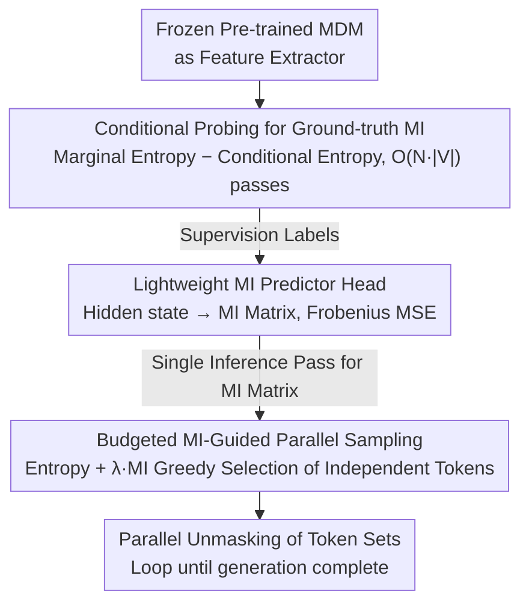

# Neural Estimation of Pairwise Mutual Information in Masked Discrete Sequence Models

**Conference**: ICML2026  
**arXiv**: [2605.20187](https://arxiv.org/abs/2605.20187)  
**Code**: TBD  
**Area**: Computational Biology  
**Keywords**: Masked diffusion models, mutual information, parallel sampling, ESM-C, Sudoku

## TL;DR
Starting from the hidden states of a pre-trained masked diffusion model (MDM), this paper trains a lightweight "mutual information predictor head" to output the full conditional mutual information matrix between all token pairs in a single forward pass. By selecting "conditionally independent" token subsets for parallel decoding based on this matrix, it reduces inference NFE by 3-5x on Sudoku and proteins (ESM-C) while maintaining or even exceeding sequential decoding quality.

## Background & Motivation
**Background**: Masked Diffusion Models (MDM) are now considered powerful alternatives to Autoregressive (AR) models for discrete sequence generation, modeling the generation process as a reverse diffusion from a "fully masked" state to an "unmasked" state. To avoid $L$ sequential steps, the mainstream acceleration strategy is Mask-Predict, a parallel decoding method based on "marginal confidence (entropy)"—unmasking the top-$k$ tokens that the model is most certain about (lowest entropy) at each step.

**Limitations of Prior Work**: Relying solely on marginal confidence to select parallel tokens fails on structured data. If two high-confidence but highly correlated tokens are sampled simultaneously, violations of hard constraints occur (e.g., placing two "3"s in the same row in Sudoku); in protein generation, this manifests as a destruction of global consistency. Works like EB-Sampler attempt to upper-bound joint entropy using the sum of marginal entropies, but this approach compresses the dependency structure into a single aggregated uncertainty value, failing to characterize conditional and asymmetric dependencies between tokens.

**Key Challenge**: During training, MDMs only explicitly learn the marginal $p(x^i \mid x_t)$, and do not directly provide the joint $p(x^i, x^j \mid x_t)$. However, the correctness of parallel decoding requires knowing which positions are conditionally independent—information that marginals cannot capture.

**Goal**: (1) "Read out" the conditional mutual information $I(X_i; X_j \mid C)$ for any two positions $i, j$ from the MDM's hidden states; (2) Use this MI matrix to guide parallel decoding, unmasking only token sets with low mutual information (conditionally independent) in the same step.

**Key Insight**: The hidden layers of an MDM inherently encode joint information—the head simply does not output it explicitly. Thus, one can train a lightweight predictor head, treating the MDM as a "feature extractor," with supervision signals derived from the "ground-truth MI" defined by the model itself (calculated via brute-force conditional probing).

**Core Idea**: Use a neural mutual information estimator to predict the entire $N \times N$ MI matrix in one forward pass, then select token sets for parallel unmasking using a budgeted greedy approach based on entropy + λ·MI.

## Method

### Overall Architecture
This paper addresses the "wrong token selection" issue in MDM parallel decoding: existing methods only consider marginal confidence at each position and cannot determine if two high-confidence positions are correlated, leading to constraint violations during simultaneous unmasking. The authors' approach assumes that "the hidden states of a pre-trained MDM already encode joint dependencies between tokens, but the output head lacks the mechanism to read them." Consequently, they train a lightweight predictor head to explicitly output these dependencies as a conditional mutual information matrix, which then guides each denoising step to unmask only conditionally independent tokens. The supervision signal is not derived from the true data distribution but from the "model-believed MI" obtained through probing the MDM itself.

### Key Designs

**1. Ground-truth MI based on conditional probing: Extracting joint dependencies from marginal-only MDMs**

The predictor head require a regression target, but MDMs only learn marginals $p(x^i \mid x_t)$ during training and do not provide joint distributions or ready-to-use MI labels. The authors treat the MDM as a probabilistic black box that can be conditioned on any "punched hole," using the identity $I(X_i; X_j \mid C) = H(X_j \mid C) - H(X_j \mid X_i, C)$ to decompose mutual information into "marginal entropy − conditional entropy" for probing. This requires $1 + N \cdot |V|$ forward passes: 1 base pass to obtain $P(X_i \mid C)$ and calculate $H(X_j \mid C)$; then, for each position $i$ and each vocabulary element $v \in V$, a pass is performed where $X_i$ is temporarily fixed to $v$ to obtain $P(X_j \mid X_i = v, C)$. These are finally weighted by $P(X_i = v \mid C)$ to get $H(X_j \mid X_i, C)$.

The reason for using "model-probed MI" rather than MI calculated from data statistics is that the estimator learns exactly "how much dependency the model believes exists between $i$ and $j$." This matches both the estimator's input (hidden states from the same model) and the downstream use (guiding the same model's decoding), eliminating the gap between data and model distributions. The cost is high at $O(N \cdot |V|)$ forward passes, but this is a one-time cost during the label generation phase of training.

**2. Lightweight MI predictor head on hidden states: Compressing MI estimation into one pass**

Conditional probing is too expensive for the inference loop, necessitating an approximator that outputs the entire MI matrix in a single forward pass. The authors use the frozen MDM as a feature extractor, feeding the final layer hidden state $h \in \mathbb{R}^{N \times D}$ into a small head $f_\phi$ to output a symmetric matrix $\hat{I} = f_\phi(\mathrm{MDM}(X_t))$. The training objective is the Frobenius MSE on masked positions: $\mathcal{L}_{MI} = \|M_{GT} - \hat{I}\|_F^2$. Training samples are generated by randomly sampling noise levels $t \sim \mathcal{U}[0,1]$ and masking original sequences, allowing the head to predict MI across various mask ratios. This head is tiny, with ~100K parameters for Sudoku and ~810K for ESM-C (300M backbone).

This step works because the MDM's hidden layers must model joint relationships between tokens to predict masked positions; "it knows the dependency structure, but the output head just doesn't say it." Adding a head to read this internal belief is sufficient. Replacing expensive probing with a single forward pass is the key to incorporating MI signals into the decoding loop for acceleration.

**3. Budgeted MI-Guided Parallel Sampling: Unmasking conditionally independent token sets**

With the MI matrix, a decoding rule is needed to decide which positions to unmask simultaneously without breaking global consistency. The authors use a budgeted greedy algorithm: first, all masked positions are sorted by marginal entropy $h_i$ (lowest uncertainty first), and a budget $B = \gamma$ is initialized. For each candidate $i$, the dependency cost relative to the currently selected set $U$ is calculated as $d(i \mid U) = \sum_{j \in U} \hat{I}_{i,j}$. The total cost is $\text{cost} = h_i + \lambda \cdot d(i \mid U)$. If $\text{cost} \le B$, $i$ is added to $U$, and the budget is reduced accordingly. Finally, all tokens in $U$ are sampled synchronously based on their marginals. Here, $\gamma$ controls the parallelism, and $\lambda$ is the dependency penalty coefficient.

This cost function integrates "confidence" and "independence" into a single budget constraint. When $\lambda = 0$, it degrades to entropy-only Mask-Predict, which may fail by unmasking highly correlated high-confidence tokens. With $\lambda \cdot d(i \mid U)$, if any $\hat{I}_{i,j}$ is large, the cost for candidate $j$ increases, forcing it to the next step—where $j$'s distribution will be updated based on the now-unmasked $i$, thus preserving chain-like conditional dependencies.

### Loss & Training
The estimator only calculates Frobenius MSE on masked positions, while the original MDM remains frozen. Sudoku uses a 4.16M parameter MDM with a 0.10M head, trained for 10 epochs on 100K random Sudoku puzzles. ESM-C uses a pre-trained 300M parameter ESM-Cambrian with an 810K head, trained for 5 epochs on 10K proteins.

## Key Experimental Results

### Main Results: Sudoku Parallel Decoding

| Method | Avg. NFE | Solve Acc. |
|------|---------|-----------|
| Sequential | 53.9 | 61.6% |
| Naive ($k=4$) | 14.9 | 52.4% |
| Naive ($k=7$) | 9.0 | 36.8% |
| EB-Sampler ($\gamma=0.2$) | 15.3 | 61.0% |
| EB-Sampler ($\gamma=0.5$) | 9.9 | 51.2% |
| **MI-Guided ($\gamma=0.3$)** | 15.2 | **63.6%** |
| **MI-Guided ($\gamma=0.6$)** | 9.7 | 56.2% |

In the low NFE range, MI-Guided outperforms EB-Sampler and even achieves a 2% higher accuracy than Sequential decoding at 1/3 the NFE with the $\gamma=0.3$ configuration.

### Main Results: ESM-C Protein Generation

| Method | Avg. NFE | JSD to Ref. ↓ |
|------|---------|---------------|
| Sequential | 74.8 | 0.093 |
| Naive ($k=4$) | 19.1 | 0.185 |
| Naive ($k=8$) | 9.8 | 0.196 |
| Naive ($k=12$) | 6.2 | 0.218 |
| **MI-guided ($\gamma=2, \lambda=1$)** | 15.3 | **0.136** |
| **MI-guided ($\gamma=4, \lambda=1$)** | 10.0 | 0.174 |

For 500 unconditional generation samples (length 50–100), the Jensen-Shannon divergence (JSD) relative to the UniRef50 reference set shows that MI-guided is significantly better than Naive sampling at similar NFE levels.

### Key Findings
- **Interpretability byproduct**: In Sudoku, the MI matrix naturally recovers hard constraints for rows, columns, and 3×3 blocks—the model was never explicitly told the rules, but its internal belief encoded these structures (Fig. 1).
- **MI vs. Entropy gap widens with structural complexity**: EB-Sampler performs decently on Sudoku's rigid constraints, but in scenarios like protein generation with long-range dependencies, Naive/Entropy-based quality collapses, while the MI-guided advantage expands.
- **$\lambda$ is the critical switch**: $\lambda = 0$ reverts to Mask-Predict; too large a $\lambda$ leads to excessive serialization. In experiments, $\lambda = 1$ typically hits the sweet spot.

## Highlights & Insights
- **"The model's own MI" as a supervision signal**: Instead of using the data distribution to calculate ground-truth MI, the authors use the model's own conditional probing. This is a brilliant design that eliminates the "data vs. model" distribution gap and naturally fits the downstream purpose of guiding that specific model's decoding. It is a clever variant of the MINE series applied to generative models.
- **Transforming "acceleration" into a "reading hidden states" problem**: The problem of selecting parallel tokens—traditionally reliant on heuristics or additional sampling—is converted into a simple prediction head on hidden states. This fundamentally acknowledges that the MDM is already computing joint distributions, just not exposing them. This perspective can be migrated to any marginal-only output model.
- **Zero-cost interpretability**: Visualizing the MI matrix reveals the "dependency structure understood by the model," such as row/col/box constraints in Sudoku. This approach can be used to probe what "structural knowledge" any MDM has acquired.

## Limitations & Future Work
- **High training overhead**: The ground-truth MI calculation requires $O(N \cdot |V|)$ forward passes, which is extremely expensive for long sequences or large vocabularies (manageable for proteins with a 20-token alphabet, but problematic for large ESM or LLM vocabularies). The authors acknowledge this and suggest curricula or alternative training strategies for future work.
- **Limited predictor precision**: MI estimation is essentially a regression task. The paper uses a small 100K–810K parameter head with MSE loss, without systematically comparing deeper architectures or contrastive objectives (e.g., CLUB, INFOLOG).
- **Validation limited to Sudoku + ESM-C**: The method has not been evaluated on large-scale text MDMs (e.g., SEDD, MD4) for language modeling parallel decoding. Generalization across common language or molecular tasks remains to be confirmed.
- **Reliance on frozen MDM**: The head is added post-hoc; the paper does not explore whether joint training of the MI head and the MDM could further improve the quality of MI representations.

## Related Work & Insights
- **vs. Mask-Predict (Ghazvininejad et al., 2019)**: Mask-Predict uses pure entropy for parallelism ($\lambda = 0$). This work effectively adds an MI penalty term $\lambda \cdot d(i \mid U)$, theoretically correcting the error of simultaneously unmasking correlated high-confidence tokens.
- **vs. EB-Sampler (Ben-Hamu et al., 2025)**: EB-Sampler uses the sum of marginal entropies as a joint entropy upper bound to delay correlated tokens, but only reflects aggregate uncertainty. This work predicts explicit pairwise MI, capturing conditional and asymmetric dependencies invisible to EB-Sampler, outperforming it in Sudoku experiments.
- **vs. MINE / CLUB (Belghazi 2018, Cheng 2020)**: Classic neural MI estimation focuses on "maximizing/minimizing MI during representation learning." This paper is the first to embed a neural MI estimator into the inference loop of a generative model, with supervision from the model itself rather than data.
- **vs. Sequential AR Decoding**: AR is forced into $O(L)$ steps, while MI-guided parallel decoding achieves 56.2% accuracy in 9.7 NFE on Sudoku (vs. 61.6% in 53.9 NFE) and a JSD of 0.174 in 10 NFE on proteins (vs. 0.093 in 74.8 NFE), compressing NFE to 1/5–1/7 while maintaining acceptable quality.

## Rating
- Novelty: ⭐⭐⭐⭐ The perspective of embedding neural MI estimation into the MDM inference loop is very fresh; using the model's own conditional probability for ground truth is a clever design.
- Experimental Thoroughness: ⭐⭐⭐ Conducted comparisons across two domains (Sudoku + ESM-C), but lacks large-scale text MDM evaluation and more diverse biological metrics for proteins beyond PCA/JSD.
- Writing Quality: ⭐⭐⭐⭐ Clear motivation, explicit algorithm descriptions, and persuasive Sudoku MI visualizations in Fig. 1.
- Value: ⭐⭐⭐⭐ MI-guided parallel decoding is a general recipe that has good reuse prospects, especially given the trend toward accelerating MDM inference (e.g., SEDD).

<!-- RELATED:START -->

## Related Papers

- [\[ICLR 2026\] PepTri: Physical, Evolutionary, and Mutual Information Tri-guided All-atom Diffusion Peptide Design](../../ICLR2026/computational_biology/peptri_tri-guided_all-atom_diffusion_for_peptide_design_via_physics_evolution_an.md)
- [\[ICLR 2026\] Uncovering Semantic Selectivity of Latent Groups in Higher Visual Cortex with Mutual Information-Guided Diffusion](../../ICLR2026/computational_biology/uncovering_semantic_selectivity_of_latent_groups_in_higher_visual_cortex_with_mu.md)
- [\[ICML 2026\] Insertion Based Sequence Generation with Learnable Order Dynamics](insertion_based_sequence_generation_with_learnable_order_dynamics.md)
- [\[NeurIPS 2025\] Is Sequence Information All You Need for Bayesian Optimization of Antibodies?](../../NeurIPS2025/computational_biology/is_sequence_information_all_you_need_for_bayesian_optimization_of_antibodies.md)
- [\[NeurIPS 2025\] KLASS: KL-Guided Fast Inference in Masked Diffusion Models](../../NeurIPS2025/computational_biology/klass_kl-guided_fast_inference_in_masked_diffusion_models.md)

<!-- RELATED:END -->
