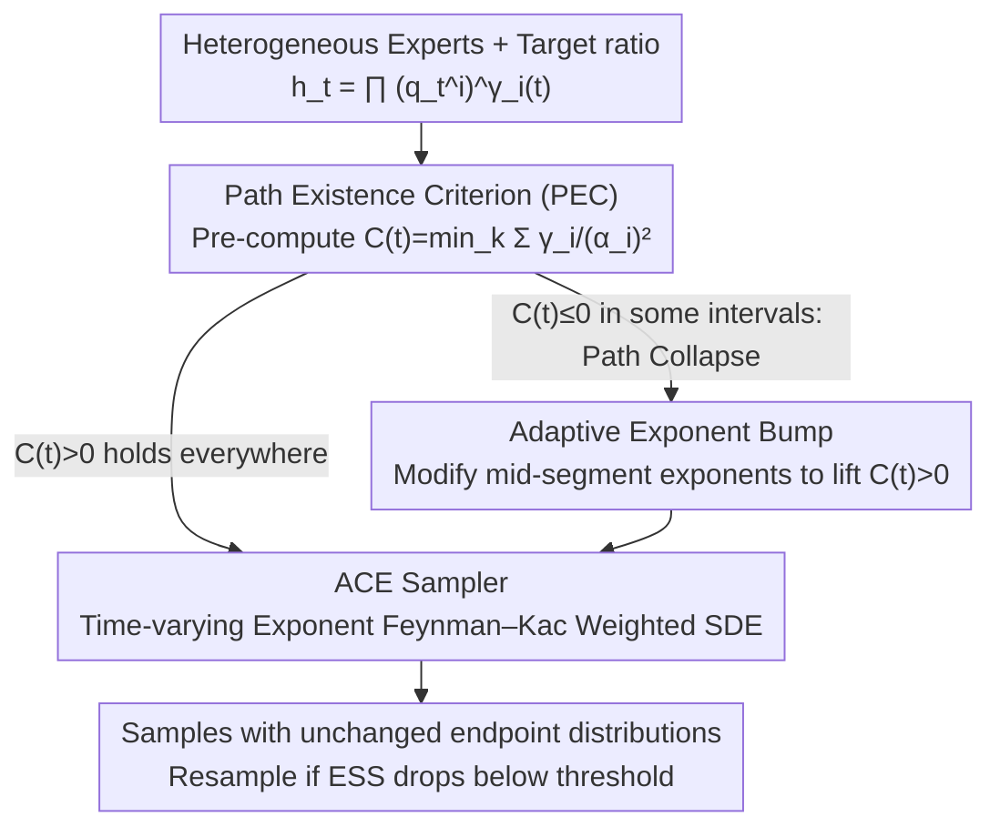

# On the Collapse of Generative Paths: A Criterion and Correction for Diffusion Steering

**Conference**: ICML 2026  
**arXiv**: [2512.10339](https://arxiv.org/abs/2512.10339)  
**Code**: https://ziseoklee.github.io/projects/ACE/ (Available, project page)  
**Area**: Computational Biology  
**Keywords**: Marginal Path Collapse, Path Existence Criterion, Adaptive Exponent Correction, Feynman–Kac Guidance, Heterogeneous Noise Scheduling

## TL;DR
This paper identifies **Marginal Path Collapse (MPC)**—where intermediate composite densities become non-integrable—as a silent failure in inference-time guidance that combines multiple heterogeneous diffusion/flow models via a ratio-of-densities. It proposes a necessary and sufficient **Path Existence Criterion (PEC)** $C(t)>0$ to diagnose collapse and introduces **ACE**, which dynamically corrects paths by applying bump functions to exponents $\gamma_i(t)$. By extending Feynman–Kac correctors to time-varying exponents, ACE significantly outperforms constant-exponent baselines like NR and FKC in synthetic Checkerboard, flexible pose scaffold decoration, and COCO-MIG multi-attribute generation tasks.

## Background & Motivation

**Background**: Inference-time guidance for diffusion and flow-matching models has become the de facto standard for modifying tasks without retraining. Whether through classifier-free guidance, product-of-experts, or Bayesian compositions, these methods can essentially be formulated as time-dependent ratio-of-densities $p^*_t \propto \prod_i (q^{(i)}_t)^{\gamma_i(t)}$. In homogeneous scenarios like CFG (same model, same schedule), constant exponents $\gamma$ almost always work well.

**Limitations of Prior Work**: Scientific applications—such as drug molecule scaffold decoration—naturally require combining heterogeneous experts: de-novo unconditional priors, conformer topology experts, and pocket-conditioned SBDD models. These are trained on different noise schedules and dimensions, each with its own optimal schedule shape (refinement requires fast decay, exploration requires slow decay). When their ratio is combined using constant exponents, the authors find that the intermediate path might **not exist at all**—the partition function diverges, and the score field becomes undefined. Crucially, numerical solvers can still produce "normal-looking" samples, leading users to follow a path that has silently deviated.

**Key Challenge**: The intersection of heterogeneous scheduling, negative exponents (denominator experts), and high guidance strength $\omega$ causes the variance in the numerator to shrink slower than in the denominator. This makes $h_t(x)$ explode at $\infty$ rather than decay, even when endpoints $h_0, h_1$ are valid densities. This is a **global normalizability** failure, not a local numerical crash, making it undetectable via standard numerical monitoring (NaNs, energy).

**Goal**: (i) Provide a necessary and sufficient criterion, computable before sampling, to determine the existence of composite intermediate densities; (ii) Provide a correction scheme when the criterion fails to "repair" invalid ratio paths into valid ones targeting the same endpoints, along with a weighted SDE for correct sampling.

**Key Insight**: The authors shift focus from "score numerical stability" to "integrability of $h_t$." Under the setting of Gaussian priors to compactly supported targets, all experts at time $t$ are Gaussian convolutions. By analyzing the quadratic coefficients of the ratio coordinate-wise, a closed-form criterion depending only on $\{\alpha^{(i)}_t, \gamma_i(t)\}$ is derived.

**Core Idea**: Define $C_k(t) = \sum_{i: k \in I_i} \gamma_i(t)/(\alpha^{(i)}_t)^2$. The path exists if $C(t) = \min_k C_k(t) > 0$ and collapses if $< 0$. Since $\gamma_i(t)$ is controllable, the authors **only adjust intermediate exponent values while preserving endpoints $\gamma_i(0), \gamma_i(1)$** by adding a bump function to lift $C(t)$ above zero. A Feynman–Kac weighted sampler supporting time-varying exponents is then used to execute the corrected path.

## Method

### Overall Architecture
ACE addresses the hidden failure where composite densities in ratio combinations $h_t(x) = \prod_i (\tilde q^{(i)}_t(x))^{\gamma_i(t)}$ become non-normalizable. The framework consists of diagnosis, path correction, and sampling: it uses a closed-form quantity to check path existence before sampling; if a violation is found, it "lifts" the path into the legal region by perturbing exponents mid-segment while keeping endpoints zeroed; finally, a weighted particle sampler correctly handles time-varying exponents. The input is a set of pre-trained heterogeneous experts and a target ratio; the output is samples from the corrected path with unchanged target endpoint distributions.

### Key Designs

**1. Path Existence Criterion: Identifying collapse with a single sum before sampling**
The most difficult aspect of heterogeneous composition is that the score field remains numerically finite during path collapse, so solvers continue without error while samples silently deviate. The authors define the existence criterion based on the integrability of the composite density $h_t$. Under stochastic interpolant settings from Gaussian priors to compactly supported targets, the quadratic coefficient of the log-density of each expert $\tilde q^{(i)}_t$ as $\|x\|\to\infty$ is determined by $1/(\alpha^{(i)}_t)^2$. Thus, the ratio's quadratic term is the sum of expert contributions: $C_k(t) = \sum_{i: k \in I_i} \gamma_i(t)/(\alpha^{(i)}_t)^2$, where $C(t) = \min_k C_k(t)$. $C_k(t) > 0$ implies sub-Gaussian decay (integrable), while $C_k(t) < 0$ implies explosion (non-integrable). This provides a sharp necessary and sufficient criterion (Theorem 2.1). Furthermore, $C(t)$ is linked to the concentration radius of the intermediate distribution $R_t(\varepsilon) \propto 1/\sqrt{C(t)}$ (Proposition 2.1). As $C(t)\to 0^+$, the radius diverges, meaning $C(t)$ acts as a continuous "quality knob."

**2. Adaptive Exponent Bump: Correcting paths by modifying only intermediate exponents**
When $C(t) \le 0$ is diagnosed, the common workaround is reducing the guidance strength $\omega$, but this weakens guidance even in valid intervals. ACE instead adds positive mass only to the middle of the exponents: $\tilde\gamma_i(t) = \gamma_i(t) + b(t)$, where $b(t) = B_1 \cdot t(1-t) + B_2 \cdot \min(t, \tau(1-t))$. This "bump" function ensures $b(0)=b(1)=0$, thereby keeping the target endpoint distributions $\tilde\gamma_i(0)=\gamma_i(0)$ and $\tilde\gamma_i(1)=\gamma_i(1)$ unchanged. The authors prove that if $C(0)>0$, $C(t)$ can always be lifted above zero by adding such bumps to experts covering all coordinates (Theorem 2.2). This effectively "softens" high guidance only when necessary.

**3. ACE Sampler: Correcting the Feynman–Kac term for time-varying exponents**
A corrected path requires a matching sampler to ensure the simulated marginal equals the corrected path marginal. The score and velocity fields are defined as $s^*_t = \sum \tilde\gamma_i(t) \tilde s^{(i)}_t$ and $v^*_t = \sum \tilde\gamma_i(t) \tilde v^{(i)}_t$. Particles evolve via $dX_t = (v^*_t + \tfrac{\sigma_t^2}{2} s^*_t)\, dt + \sigma_t\, dW_t$. Crucially, existing Feynman–Kac correctors (FKC) are mathematically incorrect when $\dot{\tilde\gamma}_i \neq 0$ as they omit a term induced by exponent change. ACE explicitly compensates by adding $\sum \dot{\tilde\gamma}_i(t) \log \tilde q^{(i)}_t(X_t)$ to the weight evolution (Theorem 2.3), using auxiliary SDEs to track log-densities. Resampling is triggered when the Effective Sample Size (ESS) drops. ACE is a strict generalization of FKC for time-varying exponents.

### Loss & Training
ACE is a **purely inference-time** framework requiring no expert retraining. Hyperparameters include bump coefficients $B_1, B_2, \tau$ and the ESS threshold. In scaffold decoration, $B_1 = 30$ and $B_2$ is selected based on $\omega \in [1.1, 1.4]$. 2D synthetic experiments use $B_2 = 1.5$ with $B_1 \in [0, 50]$.

## Key Experimental Results

### Main Results

**2D Synthetic Checkerboard**: Intersection of three experts (1D X constraint, 2D (X,Y) constraint, 1D X denominator) using schedulers designed to trigger collapse.

| Method | $W_1$ ↓ (mean±std) | $W_2$ ↓ | MMD(RBF) ↓ |
|------|----|----|----|
| NR (No resampling, constant $\gamma$) | 0.89 ± 0.02 | 1.18 ± 0.02 | 0.092 ± 0.004 |
| FKC (Skreta'25, constant $\gamma$) | 1.37 ± 1.09 | 1.59 ± 1.16 | 0.419 ± 0.579 |
| **ACE ($B_1=10, B_2=1.5$)** | **0.20 ± 0.04** | **0.29 ± 0.05** | **0.012 ± 0.003** |

ACE reduces error by ~4× compared to NR and by an order of magnitude compared to FKC, which suffers from massive variance under collapse.

**Flexible pose Scaffold Decoration (CrossDocked2020, DN+CONF+SBDD experts)**:

| Method | $\omega$ | PEC satisfied? | OSR(Top25%)↑ | Vina Avg↓ | QED↑ |
|------|----------|----|-----|------|-----|
| ACE | 1.4 | ✓ | **0.75** | **−7.10** | **0.53** |
| FKC | 1.4 | ✗ | 0.40 | −6.24 | 0.44 |
| NR  | 1.4 | ✗ | — | −6.32 | 0.42 |
| Reference | — | — | — | −6.77 | 0.48 |

ACE maintains valid PEC across $\omega = 1.1 \to 1.4$, with docking scores improving monotonically. **Ours is the first to surpass specialized monolithic baselines (Delete, AutoFragDiff) in optimization success rate using modular composition.**

### Ablation Study

| Configuration | Synthetic $W_1$↓ | Description |
|------|------|------|
| Full ACE ($B_1=10$) | 0.20 | Complete correction + resampling |
| ACE with $B_1=0$ | 0.78 | Time-varying FKC only, no bump |
| FKC (Constant $\gamma$ + resampling) | 1.37 | Weights diverge during collapse |
| NR (Constant $\gamma$, no resampling) | 0.89 | No correction; invalid samples remain |

### Key Findings
- **Collapse is the default, not the exception**: Scanning 125 schedule pairs reveals collapse rates jump from 41% at $\omega=1.0$ to 80% at $\omega=15$.
- **Instantaneous collapse is fatal**: Even if $C(t) < 0$ lasts for $<10\%$ of the sampling duration, FKC weights diverge. ACE restores the target distribution regardless of collapse duration.
- **Numerical finiteness $\neq$ validity**: Mixed score fields remain finite during collapse, but solvers transport samples to an unspecified distribution $p'_t \neq p^*_t$.
- **$C(t)$ as a quality knob**: Since $R_t \propto 1/\sqrt{C(t)}$, lifting $C(t)$ to a stable positive value acts as a "focusing force" for sample quality.

## Highlights & Insights
- **Decoupling numerical stability from path existence**: The community often uses NaNs as the standard for sampling failure. This paper highlights a stealthier failure where paths are mathematically non-existent despite finite scores.
- **PEC as an engineering tool**: Computing PEC is near-zero cost and can be used as a sanity check during the schedule design phase.
- **Bump-on-exponent vs rescheduling**: Instead of resizing $\alpha^{(i)}_t$ (which sacrifices expert optimality), ACE keeps experts fixed and modifies $\gamma_i(t)$ mid-stream, elegantly preserving endpoints.
- **Generalization of Feynman–Kac**: The inclusion of the $\dot\gamma$ term is a significant mathematical fix for any work pursuing time-varying guidance schedules.

## Limitations & Future Work
- **Reliance on Gaussian/Compact assumptions**: PEC's sufficiency is proven for Gaussian priors to compactly supported targets; extension to unbounded targets requires further derivation.
- **Manual bump tuning**: Parameters $B_1, B_2, \tau$ currently require grid search. Automating this via ESS feedback is a future direction.
- **Computational cost of resampling**: Full ACE requires particle weights, which might be expensive for high-resolution video/image generation (though ACE-lite offers a compromise).

## Related Work & Insights
- **vs FKC (Skreta et al., 2025a)**: ACE strictly generalizes FKC by accounting for $\dot\gamma \neq 0$ and explicitly diagnosing path existence.
- **vs Specialized Models**: ACE proves that modular composition with "path safety" can outperform specialized monolithic training.
- **vs CFG**: CFG is a homogeneous case where $C(t)>0$ always holds. ACE extends this "safety net" to heterogeneous multi-expert scenarios.

## Rating
- Novelty: ⭐⭐⭐⭐⭐ (Formulates MPC, PEC, and the ACE extension).
- Experimental Thoroughness: ⭐⭐⭐⭐ (Diverse domains but simplified bump tuning).
- Writing Quality: ⭐⭐⭐⭐⭐ (Excellent logical flow and geometric intuitions).
- Value: ⭐⭐⭐⭐⭐ (Critical for any future heterogeneous composition projects).

<!-- RELATED:START -->

## Related Papers

- [\[ICML 2026\] Stein Diffusion Guidance: Training-Free Posterior Correction for Sampling Beyond High-Density Regions](stein_diffusion_guidance_training-free_posterior_correction_for_sampling_beyond_.md)
- [\[NeurIPS 2025\] Steering Generative Models with Experimental Data for Protein Fitness Optimization](../../NeurIPS2025/computational_biology/steering_generative_models_with_experimental_data_for_protein_fitness_optimizati.md)
- [\[ICML 2026\] Plug-and-Play Guidance for Discrete Diffusion Models via Gradient-Informed Logit Correction](plug-and-play_guidance_for_discrete_diffusion_models_via_gradient-informed_logit.md)
- [\[ICML 2026\] Towards A Generative Protein Evolution Machine with DPLM-Evo](towards_a_generative_protein_evolution_machine_with_dplm-evo.md)
- [\[ICML 2025\] Steering Protein Language Models](../../ICML2025/computational_biology/steering_protein_language_models.md)

<!-- RELATED:END -->
