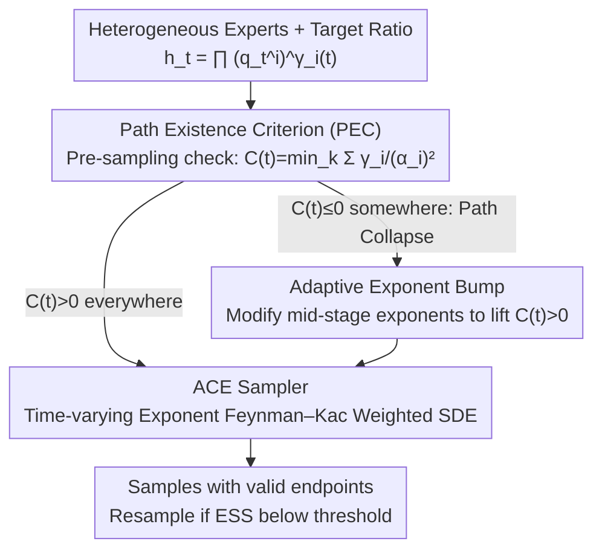

# On the Collapse of Generative Paths: A Criterion and Correction for Diffusion Steering

**Conference**: ICML 2026  
**arXiv**: [2512.10339](https://arxiv.org/abs/2512.10339)  
**Code**: https://ziseoklee.github.io/projects/ACE/ (Available, Project Page)  
**Area**: Computational Biology  
**Keywords**: Marginal path collapse, path existence criterion, adaptive exponent correction, Feynman–Kac steering, heterogeneous noise scheduling  

## TL;DR
This paper identifies **Marginal Path Collapse (MPC)** in inference-time steering when combining multiple heterogeneous diffusion/flow models via a "ratio-of-densities"—where the composite density at intermediate timesteps becomes non-integrable. It proposes a necessary and sufficient **Path Existence Criterion (PEC)** $C(t)>0$ to diagnose collapse and designs **ACE** to dynamically correct paths by adding a bump function to exponents $\gamma_i(t)$. This generalizes the Feynman–Kac corrector to time-varying exponents, significantly outperforming constant-exponent baselines like NR/FKC on synthetic Checkerboard, flexible pose scaffold decoration (combining DN/CONF/SBDD experts), and COCO-MIG multi-attribute generation.

## Background & Motivation

**Background**: Inference-time steering of diffusion and flow-matching models has become a de facto standard for task modification without retraining—from classifier-free guidance and product-of-experts to Bayesian compositions. These can essentially be formulated as time-dependent ratio-of-densities $p^*_t \propto \prod_i (q^{(i)}_t)^{\gamma_i(t)}$. In homogeneous scenarios like CFG (same model, same schedule), a constant exponent $\gamma$ almost always works well.

**Limitations of Prior Work**: Scientific applications—such as drug scaffold decoration—naturally require combining heterogeneous experts: a de-novo unconditional prior, a conformer topology expert, and a pocket-conditioned SBDD expert. These are trained on different noise schedules and possibly different dimensions, with different optimal schedule shapes (refinement requires fast decay, while exploration requires slow decay). The authors find that forcing a constant-exponent ratio of these experts often results in a path that **does not exist** at intermediate times—the partition function diverges, and the score field becomes undefined. Crucially, numerical solvers may still produce "seemingly normal" samples, leaving users with a silently drifted path.

**Key Challenge**: The combination of heterogeneous schedules, negative exponents (denominator experts), and high guidance strength $\omega$ can cause the variance in the numerator to shrink slower than in the denominator. This leads $h_t(x)$ to explode rather than decay at $\infty$, even if endpoints $h_0, h_1$ are valid densities. This is a failure of **global integrability**, not a local numerical crash, making it undetectable via numerical monitoring (NaN or energy).

**Goal**: (i) Provide a necessary and sufficient condition, computable before sampling, to determine the existence of a composite intermediate density; (ii) Propose a correction scheme to "repair" invalid ratio paths into valid ones targeting the same endpoints; (iii) Develop a weighted SDE sampler for correct execution of corrected paths.

**Key Insight**: The focus is shifted from "numerical stability of the score" to the "integrability of $h_t$". Under a Gaussian prior and compactly supported target distribution, all experts at time $t$ are Gaussian convolutions. By analyzing the quadratic form coefficients of the ratio coordinate-wise, a closed-form criterion depending only on $\{\alpha^{(i)}_t, \gamma_i(t)\}$ can be derived.

**Core Idea**: Define $C_k(t) = \sum_{i: k \in I_i} \gamma_i(t)/(\alpha^{(i)}_t)^2$. The path exists if $C(t) = \min_k C_k(t) > 0$ and collapses if $< 0$. Since $\gamma_i(t)$ is controllable, the authors **adjust intermediate exponent values while keeping endpoints $\gamma_i(0), \gamma_i(1)$ fixed** using a bump function to shift $C(t)$ above zero. A Feynman–Kac weighted sampler supporting time-varying exponents is then used to execute the corrected path.

## Method

### Overall Architecture
ACE solves the hidden failure where composite densities $h_t(x) = \prod_i (\tilde q^{(i)}_t(x))^{ \gamma_i(t)}$ become non-integrable. It decomposes the problem into diagnosis, path correction, and sampling: first, it uses a closed-form metric to check path existence; if a collapse is detected, it adds a bump to the exponents to lift the path back to the valid region; finally, a weighted particle sampler handles the time-varying exponents. The input is a set of heterogeneous experts and a target ratio, and the output is samples from the corrected path that preserve the original endpoint target distribution.

### Key Designs

**1. Path Existence Criterion: Detecting collapse before sampling with a simple summation**

The most difficult aspect of heterogeneous combinations is that the score field remains numerically finite during path collapse, so solvers keep running without NaN/energy triggers. The author redefines the standard from "score stability" to "integrability of $h_t$". In the stochastic interpolant setting with Gaussian priors, the logarithmic density's quadratic coefficient for each expert $\tilde q^{(i)}_t$ as $\|x\|\to\infty$ is determined by $1/(\alpha^{(i)}_t)^2$. The ratio's quadratic coefficient is the sum of contributions from all experts: $C_k(t) = \sum_{i: k \in I_i} \gamma_i(t)/(\alpha^{(i)}_t)^2$, where $C(t) = \min_k C_k(t)$. $C_k(t) > 0$ implies sub-Gaussian decay (integrable), while $C_k(t) < 0$ implies explosion (non-integrable). This provides a sharp necessary and sufficient criterion (Theorem 2.1). PEC is checked only at discrete sampling timesteps with negligible overhead. Furthermore, $C(t)$ relates to the concentration radius $R_t(\varepsilon) \propto 1/\sqrt{C(t)}$ (Proposition 2.1); thus, even if $C(t)$ is barely positive, samples can still drift significantly.

**2. Adaptive Exponent Bump: Correcting the path without altering endpoints**

Once $C(t) \le 0$ is detected, a common workaround is reducing guidance strength $\omega$, which weakens guidance across all timesteps. ACE instead adds positive mass only to the middle of the path: $\tilde\gamma_i(t) = \gamma_i(t) + b(t)$, where $b(t) = B_1 \cdot t(1-t) + B_2 \cdot \min(t, \tau(1-t))$. Both components naturally satisfy $b(0)=b(1)=0$, ensuring the target endpoints $\tilde\gamma_i(0)=\gamma_i(0)$ and $\tilde\gamma_i(1)=\gamma_i(1)$ remain unchanged. It is proven that if $C(0)>0$ at the prior (usually true), one can always find a bump to ensure $C(t)>0$ everywhere (Theorem 2.2). This allows high guidance to be "temporarily moderated" without sacrificing the target distribution.

**3. ACE Sampler: Extending Feynman–Kac for time-varying exponents**

Correcting the path requires a matching sampler to ensure the simulated marginal equals the corrected path marginal. The score and velocity fields are defined as weighted sums. A key contribution is noting that the standard Feynman–Kac corrector (FKC) is incorrect when $\dot{\tilde\gamma}_i \neq 0$, as it misses a term induced by exponent time-variation. ACE explicitly adds $\sum \dot{\tilde\gamma}_i(t) \log \tilde q^{(i)}_t(X_t)$ to the weight evolution (Theorem 2.3). Since $\log \tilde q^{(i)}_t(X_t)$ lacks a closed form, auxiliary SDEs track them online. Importance resampling occurs when the effective sample size (ESS) drops below a threshold. ACE is a strict generalization of FKC for time-varying exponents.

### Loss & Training
ACE is a **purely inference-time** framework requiring no expert retraining. Hyperparameters include bump coefficients $B_1, B_2, \tau$ and the ESS threshold. For scaffold decoration, $B_1 = 30$ and $B_2$ is scaled with $\omega$; for 2D synthetic tasks, $B_2 = 1.5$ with $B_1$ scanned in $[0, 50]$.

## Key Experimental Results

### Main Results

**2D Synthetic Checkerboard**: A mixture of three experts (1D X constraint, 2D (X,Y) constraint, 1D X denominator) using inconsistent schedulers like $\alpha^{(1)}_t = \cos(\pi t/2)$ and $\alpha^{(3)}_t = 1-t$ to trigger collapse.

| Method | $W_1$ ↓ (mean±std) | $W_2$ ↓ | MMD(RBF) ↓ |
|------|----|----|----|
| NR (No Resampling, Constant $\gamma$) | 0.89 ± 0.02 | 1.18 ± 0.02 | 0.092 ± 0.004 |
| FKC (Skreta'25, Constant $\gamma$) | 1.37 ± 1.09 | 1.59 ± 1.16 | 0.419 ± 0.579 |
| **ACE ($B_1=10, B_2=1.5$)** | **0.20 ± 0.04** | **0.29 ± 0.05** | **0.012 ± 0.003** |

ACE reduces error by ~4× compared to NR and an order of magnitude compared to FKC, which shows extreme variance under collapse conditions.

**Flexible Pose Scaffold Decoration (CrossDocked2020, DN+CONF+SBDD)**:

| Method | $\omega$ | PEC Satisfied? | OSR(Top25%)↑ | Vina Avg↓ | QED↑ |
|------|----------|----|-----|------|-----|
| ACE | 1.4 | ✓ | **0.75** | **−7.10** | **0.53** |
| FKC | 1.4 | ✗ | 0.40 | −6.24 | 0.44 |
| NR  | 1.4 | ✗ | — | −6.32 | 0.42 |
| Reference | — | — | — | −6.77 | 0.48 |

ACE maintains valid PEC from $\omega = 1.1$ to $1.4$, with docking scores improving monotonically. FKC/NR performance degrades as they collapse at $\omega \ge 1.1$. Notably, **ACE marks the first time a modular combination outperforms specialized monolithic baselines (Delete, AutoFragDiff)** in optimization success rate.

**COCO-MIG Multi-attribute Generation**: ACE improves attribute success rates by **+9.6 percentage points** over constant-exponent baselines, proving benefits even in homogeneous scenarios.

### Ablation Study

| Configuration | Synthetic $W_1$↓ | Description |
|------|------|------|
| Full ACE ($B_1=10$) | 0.20 | Full correction + resampling |
| ACE with $B_1=0$ | 0.78 | Time-varying FKC only, no bump |
| FKC (Constant $\gamma$ + resampling) | 1.37 | Constant exponent; weights diverge at collapse |
| NR (Constant $\gamma$ no resampling) | 0.89 | No correction; drifted samples remain in batch |

### Key Findings
- **Collapse is the default, not the exception**: A scan of 125 schedule combinations shows and MPC rate rising from 41% at $\omega=1.0$ to 80% at $\omega=15$.
- **Transient collapse is lethal**: Even if $C(t) < 0$ lasts for $<10\%$ of the duration, FKC weights diverge. ACE recovers the target distribution regardless of collapse duration.
- **Finite numerical values do not imply valid paths**: Mixed score fields may remain numerically finite during collapse, but the solver transports the batch to an unspecified distribution $p'_t \neq p^*_t$.
- **$C(t)$ as a quality knob**: Proposition 2.1 shows $R_t \propto 1/\sqrt{C(t)}$. As $C(t) \to 0^+$, the distribution radius explodes, leading to weight degradation. ACE stabilizes quality by lifting $C(t)$ to a robust positive value.

## Highlights & Insights
- **Decoupling Numerical Stability and Path Existence**: The community often relies on NaN/energy checks. This paper identifies a hidden failure—where paths vanish despite finite score values. This conceptual distinction is of high methodological value.
- **PEC as a Practical Engineering Tool**: PEC depends only on $\alpha^{(i)}_t$ and $\gamma_i$. It can be computed as a sanity check during early design phases with zero training cost.
- **Bump-on-Exponent Strategy**: Instead of rescheduling noise (which requires retraining or sacrificing expert optimality), ACE keeps optimal schedules and only perturbs $\gamma_i(t)$ in the mid-range.
- **Generalizing Feynman–Kac**: The inclusion of the $\sum \dot\gamma_i \log q^{(i)}$ correction term and its tracking via auxiliary SDEs is useful for any future work utilizing time-varying guidance schedules.

## Limitations & Future Work
- **Reliance on Gaussian Priors**: Necessary and sufficient proofs currently hold specifically for Gaussian priors and compact targets. Generalization to unbounded targets is not yet derived.
- **Manual Hyperparameter Tuning**: $B_1, B_2, \tau$ currently require scanning. An automated scheme to select the optimal bump from the infinite set of valid solutions is missing.
- **Computational Cost of Resampling**: Full ACE can be expensive for large-scale image/video generation; the "lite" version used in scientific tasks lacks the full theoretical guarantees.
- **Future Directions**: (i) Automated bump parameterization via ESS feedback; (ii) Expanding PEC to general exponential family priors; (iii) Integration with classifier guidance or Hessian-based steering.

## Related Work & Insights
- **vs Feynman–Kac Correctors (Skreta et al., 2025a)**: ACE generalizes FKC by identifying the path existence problem and correcting for $\dot\gamma \neq 0$.
- **vs Classifier-Free Guidance (Ho & Salimans, 2021)**: In homogeneous CFG, $C(t) = 1/\alpha_t^2 > 0$ always holds. ACE acts as a "safety net" for the heterogeneous case where CFG's assumptions fail.
- **vs Task-specific Baselines (Delete, AutoFragDiff)**: ACE allows plug-and-play combinations to surpass specialized models, suggesting that "path correctness" is more critical than task-specific training.

## Rating
- Novelty: ⭐⭐⭐⭐⭐ Formally defines MPC and provides the definitive PEC and ACE framework.
- Experimental Thoroughness: ⭐⭐⭐⭐ Extensive domain verification, though bump hyperparameter tuning could be more automated.
- Writing Quality: ⭐⭐⭐⭐⭐ Logical progression from diagnosis to sampling with clear theoretical and visual support.
- Value: ⭐⭐⭐⭐⭐ Critical engineering contribution for future heterogeneous multi-expert systems (scientific discovery, multi-modal agents).

<!-- RELATED:START -->

## Related Papers

- [\[ICML 2026\] Stein Diffusion Guidance: Training-Free Posterior Correction for Sampling Beyond High-Density Regions](stein_diffusion_guidance_training-free_posterior_correction_for_sampling_beyond_.md)
- [\[NeurIPS 2025\] Steering Generative Models with Experimental Data for Protein Fitness Optimization](../../NeurIPS2025/computational_biology/steering_generative_models_with_experimental_data_for_protein_fitness_optimizati.md)
- [\[ICML 2026\] Towards A Generative Protein Evolution Machine with DPLM-Evo](towards_a_generative_protein_evolution_machine_with_dplm-evo.md)
- [\[ICML 2025\] Steering Protein Language Models](../../ICML2025/computational_biology/steering_protein_language_models.md)
- [\[ICML 2026\] SIGMA: Structure-Invariant Generative Molecular Alignment for Chemical Language Models via Autoregressive Contrastive Learning](sigma_structure-invariant_generative_molecular_alignment_for_chemical_language_m.md)

<!-- RELATED:END -->
