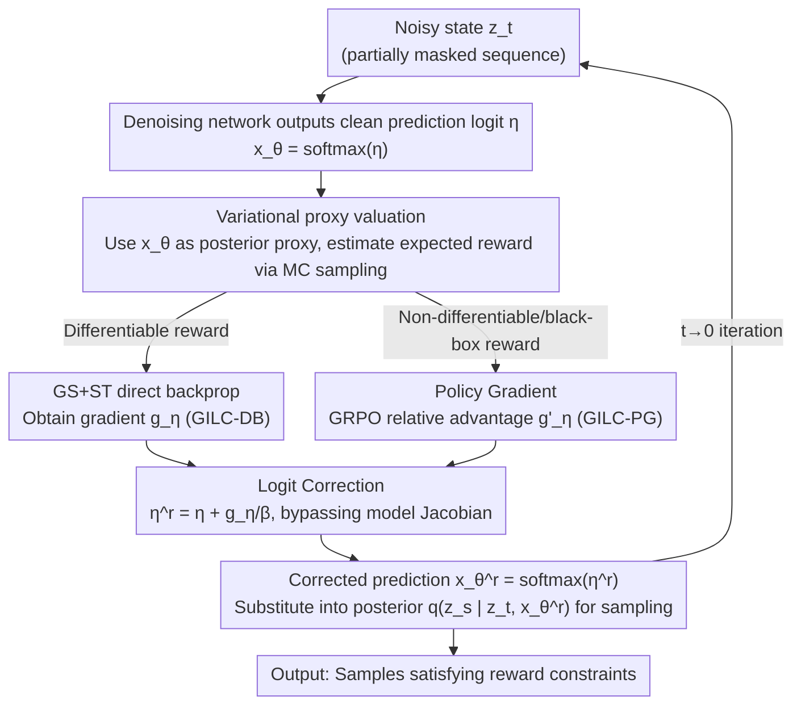

# Plug-and-Play Guidance for Discrete Diffusion Models via Gradient-Informed Logit Correction

**Conference**: ICML 2026  
**arXiv**: [2606.06303](https://arxiv.org/abs/2606.06303)  
**Code**: TBD  
**Area**: Diffusion Models / Controllable Generation / Computational Biology  
**Keywords**: Discrete Diffusion, Plug-and-Play Guidance, Logit Correction, Variational Proxy, Policy Gradient

## TL;DR
This paper proposes GILC (Gradient-Informed Logit Correction), which treats a pre-trained denoising network as a variational proxy for the value function. By employing a mechanism that "bypasses the model Jacobian and performs gradient correction directly on clean prediction logits," it achieves controllable generation for discrete diffusion **without any re-training**. It outperforms training-free baselines and matches or exceeds fine-tuning methods across DNA, protein, and molecular science tasks.

## Background & Motivation
**Background**: Diffusion models have become the standard for probabilistic modeling in continuous domains (images, video). Recently, they have been extended to discrete spaces for language generation, biological sequence synthesis, and molecular design. However, many scientific and industrial scenarios require **controllable generation** rather than unconditional sampling—e.g., generating more stable proteins or molecules with specific physicochemical properties.

**Limitations of Prior Work**: Controllable generation for discrete diffusion typically follows two paths: Classifier/Classifier-Free Guidance (CG/CFG) or fine-tuning the generative model (e.g., DRAKES). Both paths **require additional training**: either training a time-dependent classifier or re-training the generative model itself. Every new reward objective (new property constraint) necessitates re-collecting data and re-training, which is expensive and lacks generality. Fine-tuning is also prone to reward hacking (sacrificing distribution fidelity to maximize rewards).

**Key Challenge**: The mature "plug-and-play" paradigm in continuous domains (using off-the-shelf reward functions/property evaluators to guide sampling without modifying the generative model) fails in the discrete domain. Discrete data is inherently **non-differentiable**, making it impossible to compute reward gradients directly with respect to states as in continuous diffusion. Existing training-free attempts (SMC, importance sampling classes) either maintain multiple sampling trajectories—incurring prohibitive computational costs—or provide poor guidance.

**Goal**: To provide an efficient and effective guidance signal estimator for discrete diffusion with **zero training**, capable of handling both differentiable and non-differentiable (black-box) rewards.

**Key Insight**: The authors rephrase the guidance task as "estimating the gradient of a value function"—which measures the expected future reward from an intermediate state. There are two key observations: ① The negative log-likelihood loss used to train denoising networks is **exactly equivalent** to the objective minimized when treating the denoising network as a variational proxy for the posterior distribution $p_\theta(\mathbf{x}|\mathbf{z}_t)$; thus, pre-trained networks are ready-made value proxies. ② Taking derivatives directly with respect to the discrete noisy state $\mathbf{z}_t$ hits an ill-conditioned Jacobian, but taking derivatives in the continuous, smooth clean prediction logit space is stable.

**Core Idea**: Use a pre-trained denoising network as a variational proxy to estimate the value function, then "discard the unstable model Jacobian and perform gradient correction only in the logit space," adding reward gradients directly to clean prediction logits to guide sampling.

## Method

### Overall Architecture
GILC aims to replace the unguided transition $p_\theta(\mathbf{z}_s|\mathbf{z}_t)$ in standard discrete diffusion reverse sampling with an optimal transition $p^r_\theta(\mathbf{z}_s|\mathbf{z}_t)$ that implicitly maximizes reward. Theoretically, this optimal transition has a closed form (Eq. 6), but the denominator requires a summation over all $K^L$ states, which is intractable. The authors simplify this using a first-order Taylor expansion to "depend only on the value function gradient $\nabla_{\mathbf{z}_t} v(\mathbf{z}_t)$." Consequently, the pipeline becomes: **In each denoising step, first obtain clean prediction logits from the network, then calculate the reward guidance gradient and add it back to the logits to get a corrected clean prediction, and finally perform the original posterior sampling using this corrected prediction.**

The overall data flow is as follows (using DNA sequence denoising from a fully masked state as an example):

### Key Designs

**1. Variational Proxy for Value Function Estimation: Letting pre-trained denoising networks serve as free value estimators**

The value function $v(\mathbf{z}_t)\approx\mathbb{E}_{p_\theta(\mathbf{x}|\mathbf{z}_t)}[r(\mathbf{x})]$ requires an expectation over the true posterior of "unrolling multiple reverse trajectories from the current state to the final data $\mathbf{x}$," which is intractable to compute or differentiate. The authors introduce a variational proxy $\tilde{p}(\mathbf{x}|\mathbf{z}_t)$ to approximate the true posterior and prove that "minimizing the KL between the two" is equivalent to "minimizing the negative log-likelihood of the proxy." If the proxy takes a mean-field form $\tilde{p}(\mathbf{x}|\mathbf{z}_t)=\prod_\ell \mathrm{Cat}(\mathbf{x}^\ell;\mu^\ell(\mathbf{z}_t,t))$, this objective **is exactly the negative log-likelihood used to train discrete diffusion denoising networks (Eq. 4)**.

This step is the source of the training-free property: since the objectives align, one can set $\mu(\mathbf{z}_t,t)\leftarrow\mathbf{x}_\theta(\mathbf{z}_t,t)$, using the pre-trained network's clean prediction as the proxy distribution, and then perform MC sampling of $n$ samples from the proxy to estimate the expected reward $v(\mathbf{z}_t)\approx\frac1n\sum_i r(\mathbf{x}^{(i)})$. Compared to Deterministic Estimation (DE, where $v\approx r(\mathbf{x}_\theta)$), stochastic sampling ($n>1$) captures the uncertainty inherent in multi-step generation, reduces estimation bias, and improves accuracy predictably with sample size—experiments show DE has significant bias in the late sampling stages, while this estimator continues to approach the ground truth.

**2. Logit Correction: Discarding the ill-conditioned model Jacobian and guiding only in logit space**

Expanding the value gradient using the chain rule (Eq. 14) reveals two terms: the "logit sensitivity" of the reward $\partial r/\partial\hat{\mathbf{x}}\cdot\partial\hat{\mathbf{x}}/\partial\eta$, and the "model Jacobian" of the denoising network $\partial\eta/\partial\mathbf{z}_t$. The problem lies in the latter: the denoising network is trained to fit the clean data distribution and **does not guarantee smooth derivatives with respect to inputs**. Empirically, its Jacobian condition number is as high as $\mathcal{K}\approx10^4$–$10^5$ (severely ill-conditioned). Furthermore, $\mathbf{z}_t$ resides in a discrete, non-smooth token space; differentiating with respect to it injects massive noise, preventing guidance signals from accumulating coherently along the denoising trajectory.

Borrowing the idea from SDS (Score Distillation Sampling) of "dropping the unstable Jacobian term in continuous diffusion," the authors **bypass the model Jacobian entirely**, retaining only the logit sensitivity and defining guidance in the smooth, continuous logit space: $g_\eta\triangleq\frac1n\sum_i \frac{\partial r(\hat{\mathbf{x}}^{(i)})}{\partial\hat{\mathbf{x}}^{(i)}}\frac{\partial\hat{\mathbf{x}}^{(i)}}{\partial\eta}$. The final guidance is implemented interpretably: first correct the logit $\eta^r=\eta+g_\eta/\beta$, obtain the reward-corrected prediction $\mathbf{x}_\theta^r=\mathrm{softmax}(\eta^r)$, and substitute it back into the original posterior $q(\mathbf{z}_s|\mathbf{z}_t,\mathbf{x}_\theta^r)$ for sampling. Experiments (Fig. 2b) show that logit-space guidance converges faster and achieves higher cumulative rewards than guidance in the noisy state $\mathbf{z}_t$.

**3. Differentiable Rewards → GS+ST Direct Backpropagation (GILC-DB)**

When the reward is an off-the-shelf differentiable network, the MC sampling step itself breaks the computation graph (sampling is non-differentiable). The authors use Gumbel-Softmax (GS) reparameterization to provide differentiable soft samples $\mathbf{x}_{\text{soft}}$ (with temperature $\tau$ controlling sharpness), combined with a Straight-Through (ST) estimator: the forward pass uses hard one-hot $\mathbf{x}_{\text{hard}}=\mathrm{one\text{-}hot}(\arg\max \mathbf{x}_{\text{soft}})$ for the reward model (many of which only accept discrete inputs), while the backward gradient flows through the differentiable $\mathbf{x}_{\text{soft}}$. The composite input is written as $\hat{\mathbf{x}}=\mathbf{x}_{\text{hard}}-\mathrm{sg}(\mathbf{x}_{\text{soft}})+\mathbf{x}_{\text{soft}}$. This ensures the reward is calculated on true discrete inputs while allowing gradients to flow back stably. Since GILC-DB utilizes the internal gradients of the reward function, its guidance is more precise, and it requires only 1 denoising call + 5 reward calls per step, significantly outperforming multi-trajectory baselines.

**4. Non-differentiable Rewards → Policy Gradient + Relative Advantage (GILC-PG)**

Many real-world rewards are black-box and non-differentiable (e.g., aesthetic scores). The authors rewrite the value gradient using Policy Gradient (REINFORCE logic): $\nabla_\eta \mathbb{E}_{p_\theta(\mathbf{x}|\mathbf{z}_t)}[r(\mathbf{x})]=\mathbb{E}[r(\mathbf{x})\,\partial\log p_\theta(\mathbf{x}|\mathbf{z}_t)/\partial\eta]$, similarly using variational proxy sampling for estimation and replacing $\log p_\theta$ with the proxy's log-likelihood. To reduce variance and stabilize gradients, they further adopt GRPO by replacing absolute rewards with **intra-group relative advantages** $\mathcal{A}_i=\frac{r(\mathbf{x}^{(i)})-\mathrm{mean}}{\mathrm{std}}$, yielding $g'_\eta\triangleq\frac1n\sum_i\mathcal{A}_i\,\partial\log\langle\mathbf{x}_\theta,\mathbf{x}^{(i)}\rangle/\partial\eta$. This path is agnostic to reward differentiability and serves as a robust fallback for black-box guidance.

### Loss & Training
GILC **does not introduce any training**—it neither trains classifiers nor fine-tunes the generative model. It reuses the pre-trained denoising network and off-the-shelf reward functions throughout. The only "objective" is to implicitly solve the "reward − $\beta$·KL regularization" objective of Eq. 5 during sampling. Its closed-form solution $p^r_\theta(\mathbf{x})\propto p_\theta^{\text{pre}}(\mathbf{x})\exp(r(\mathbf{x})/\beta)$ is approximated in each denoising step through logit correction, where $\beta$ controls the trade-off between "satisfying reward" and "maintaining original distribution quality."

## Key Experimental Results

### Main Results
Evaluation across DNA, protein, and molecular scientific domains (using pre-trained discrete diffusion/flow models + independent guidance/evaluation double oracles to prevent leakage). Below is the result for regulatory DNA sequence design (Gosai enhancer dataset, 640 samples):

| Method | Type | Pred-Activity ↑ | ATAC-Acc(%) ↑ | JASPAR Corr ↑ |
|--------|------|------|------|------|
| Pretrained | Unconditional | 0.17 | 1.5 | 0.249 |
| CFG | Training-based | 5.04 | 92.1 | 0.864 |
| DRAKES | Fine-tuning | 5.61 | 92.5 | 0.911 |
| SVDD | Training-free | 4.84 | 51.9 | 0.826 |
| **Ours (GILC-DB)** | **Training-free** | **7.04** | **95.2** | 0.935 |
| **Ours (GILC-PG)** | **Training-free** | 5.21 | 84.0 | **0.937** |

Protein inverse folding (stability guidance; primary metric is success rate meeting both Pred-ddG > 0 and scRMSD < 2):

| Method | Pred-ddG ↑ | Success Rate (%) ↑ |
|--------|------|------|
| Pretrained | −0.544 | 34.4 |
| DRAKES (Fine-tuning) | 1.095 | 78.6 |
| SVDD (Training-free) | 0.694 | 65.0 |
| **Ours (GILC-DB)** | **1.430** | **82.4** |
| **Ours (GILC-PG)** | 0.719 | 69.8 |

The **Ours (GILC-DB)** success rate exceeds the fine-tuning method DRAKES by approximately 4 percentage points. On molecular generation (QM9, 6 quantum property MAEs), GILC-PG achieves the best results among training-free methods on most properties, with GILC-DB following closely. It also extends zero-shot to CIFAR-10 class-conditional generation and Meissonic text-to-image (using non-differentiable aesthetic score guidance).

### Efficiency Comparison (DNA Task, Calls per Step)

| Method | Denoising Calls ↓ | Reward Calls ↓ |
|------|------|------|
| Best-of-NN / SMC / SVDD | 20 | 20 |
| TFG-Flow | 1 | 20 |
| **Ours (GILC-DB)** | **1** | **5** |
| **Ours (GILC-PG)** | 1 | 20 |

### Key Findings
- **Jacobian removal is critical for stability**: Direct differentiation with respect to $\mathbf{z}_t$ leads to incoherent guidance signal accumulation due to ill-conditioned Jacobians ($10^4$–$10^5$). Switching to logit-space guidance results in faster convergence and higher accumulated rewards (Fig. 2b).
- **Stochastic variational estimation beats deterministic estimation**: Increasing MC samples from 5 to 50 monotonically decreases the $L_1$ error of value estimation. Deterministic Estimation (DE) remains significantly biased in the late sampling stages, reaching a performance plateau.
- **Each variant has strengths**: GILC-DB, utilizing internal reward gradients, excels in functional activity metrics and is more efficient (5 calls). GILC-PG, treating rewards as black boxes, is superior in sequence fidelity and molecular MAEs, showing stronger generality.

## Highlights & Insights
- **"Training loss = Variational objective" insight**: The realization that the denoising network's training objective precisely matches the variational proxy fitting objective is brilliant. It makes the pre-trained network a "free" value estimator—the foundation of this training-free paradigm, which is far more elegant than training a separate value network.
- **Transferring SDS "Jacobian dropping" to discrete domains**: While SDS dropping unstable Jacobians has precedents in continuous diffusion, this paper identifies that discrete diffusion suffers even more (discrete non-smooth token space plus ill-conditioned Jacobians). Providing a "smooth stand-in" in logit space is a clean and interpretable engineering solution.
- **Unified framework with dual fallbacks**: One path for differentiable rewards via GS+ST, another for non-differentiable via Policy Gradient + GRPO. Both unify under the single action of "logit correction," making it highly transferable—any discrete/flow diffusion + any reward (including black-box) can be plug-and-play.

## Limitations & Future Work
- The authors acknowledge that DB/PG still requires multiple MC sampling queries to the reward function. Further reducing the number of calls while maintaining guidance fidelity remains an open problem.
- The mean-field (token independence) assumption may introduce non-trivial errors in structured domains (e.g., natural language with strong token dependencies). Extending this to large-scale diffusion language models by relaxing independence constraints is a significant next step.
- Scalability to very large vocabularies or ultra-long sequences, and a more systematic report on sensitivity to $\beta$, $\tau$, and $n$, are still needed; text-to-image results are currently qualitative.

## Related Work & Insights
- **vs DRAKES (Fine-tuning)**: DRAKES re-trains the generative model to maximize rewards, which is prone to reward hacking and requires careful KL constraint tuning. GILC requires zero training and surpasses DRAKES in protein success rates by ~4 points.
- **vs SVDD / SMC / Best-of-NN (Training-free)**: These rely on importance sampling/filtering across multiple trajectories, requiring ~20 denoising and reward calls with limited guidance effectiveness. GILC is single-trajectory, calling denoising once, winning on both effect and efficiency.
- **vs CFG (Training-based)**: CFG depends heavily on labeled data and has limited generalization. GILC only requires an off-the-shelf reward function; changing goals requires no re-training.

## Rating
- **Novelty**: ⭐⭐⭐⭐⭐ The combination of "Training loss = Variational objective" and "Jacobian dropping in logit space" creates a truly plug-and-play discrete diffusion guidance with clean logic.
- **Experimental Thoroughness**: ⭐⭐⭐⭐⭐ DNA/Protein/Molecule scientific domains + Images, including multi-dimensional ablations on efficiency, value convergence, and Jacobian pathology.
- **Writing Quality**: ⭐⭐⭐⭐ Clear derivations and effective diagrams. Some key conclusions (e.g., images) are qualitative; sensitivity analysis for $\beta/\tau/n$ could be more systematic.
- **Value**: ⭐⭐⭐⭐⭐ Training-free, handles black-box rewards, and is single-trajectory efficient. High practical utility for controllable scientific generation like drug/gene design.

<!-- RELATED:START -->

## Related Papers

- [\[ICML 2026\] Stein Diffusion Guidance: Training-Free Posterior Correction for Sampling Beyond High-Density Regions](stein_diffusion_guidance_training-free_posterior_correction_for_sampling_beyond_.md)
- [\[ICLR 2026\] Clustering by Denoising: Latent Plug-and-Play Diffusion for Single-Cell Embeddings](../../ICLR2026/computational_biology/clustering_by_denoising_latent_plug-and-play_diffusion_for_single-cell_embedding.md)
- [\[ICML 2026\] On the Collapse of Generative Paths: A Criterion and Correction for Diffusion Steering](on_the_collapse_of_generative_paths_a_criterion_and_correction_for_diffusion_ste.md)
- [\[ICLR 2026\] Ultra-Fast Language Generation via Discrete Diffusion Divergence Instruct](../../ICLR2026/computational_biology/ultra-fast_language_generation_via_discrete_diffusion_divergence_instruct.md)
- [\[ICLR 2026\] Discrete Diffusion Trajectory Alignment via Stepwise Decomposition](../../ICLR2026/computational_biology/discrete_diffusion_trajectory_alignment_via_stepwise_decomposition.md)

<!-- RELATED:END -->
