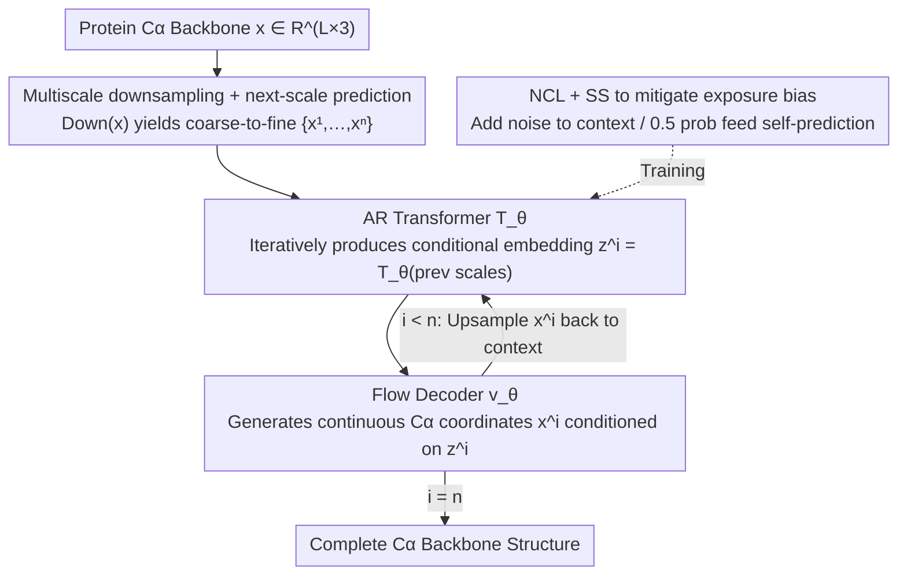

# Protein Autoregressive Modeling via Multiscale Structure Generation

**Conference**: ICML 2026 Spotlight  
**arXiv**: [2602.04883](https://arxiv.org/abs/2602.04883)  
**Code**: https://par-protein.github.io (Project Homepage)  
**Area**: Scientific Computing / Protein Structure Generation / Autoregressive Generative Models  
**Keywords**: Protein backbone generation, multiscale autoregressive, next-scale prediction, flow matching, exposure bias

## TL;DR
PAR adapts the "next-scale prediction" concept from the visual autoregressive (VAR) domain to protein $C\alpha$ backbone generation. By using multiscale downsampling, an autoregressive Transformer, and a flow-based decoder instead of single-scale diffusion models—combined with noisy context learning and scheduled sampling to mitigate exposure bias—it achieves an unconditional FPSD of 161.0 while unlocking zero-shot point-prompt generation and motif scaffolding with a 2.5× sampling speedup.

## Background & Motivation

**Background**: Protein backbone generation is largely dominated by diffusion/flow-matching models. One category predicts per-residue SE(3) frames (FrameDiff, RFDiffusion, Genie2), while another directly models $C\alpha$ coordinates (Proteina, etc.). These methods are **single-scale**, meaning they denoise the full structure of length $L$ in one go.

**Limitations of Prior Work**: Autoregressive (AR) models have demonstrated strong scaling and zero-shot capabilities in LLMs and image generation, but have seen limited success in protein structure generation. Two specific obstacles exist: (i) Continuous atomic 3D coordinates require discretization (e.g., VQ-VAE), which loses fine structural details and degrades designability; (ii) Strong bi-directional dependencies exist between residues—residues far apart in sequence may form hydrogen bonds or hydrophobic contacts in space, which directly conflicts with the **uni-directional next-token** assumption of standard AR. Previous token-based AR routes like ESM3 or Gaujac et al. show FPSD scores an order of magnitude worse than diffusion baselines.

**Key Challenge**: To use AR models for proteins, one must bypass the "precision loss from discretization" and the "destruction of bi-directional dependencies by uni-directional ordering," both of which stem from standard implementations of the AR paradigm.

**Goal**: Design an AR framework that (1) models continuous $C\alpha$ coordinates rather than discrete tokens, (2) unfolds in a direction other than residue-by-residue to preserve intra-scale bi-directional dependencies, and (3) inherits the zero-shot and scaling advantages inherent to AR models.

**Key Insight**: Proteins naturally possess a **hierarchical structure**—from coarse-grained tertiary topology and secondary structure arrangements to atomic coordinates. This multiscale granularity is isomorphic to the "next-scale prediction" proposed by VAR in image generation: shifting the AR expansion dimension from "spatial position" to "scale," while maintaining full bi-directional attention within each scale.

**Core Idea**: Proteins are hierarchically downsampled along the sequence dimension to obtain $\{\mathbf{x}^1, \dots, \mathbf{x}^n\}$ (e.g., scales of 64→128→256). An AR Transformer performs next-scale prediction to generate conditional embeddings for each scale, and a flow matching decoder generates continuous $C\alpha$ coordinates conditioned on these embeddings—AR "sculpts the contour," and flow "sculpts the details."

## Method

### Overall Architecture

PAR addresses how to make an AR model generate continuous $C\alpha$ backbones without losing to diffusion by shifting the AR dimension from "residue position" to "structural scale." A protein is first downsampled into several coarse-to-fine versions along the sequence dimension. The AR model iteratively predicts scale-by-scale, producing conditional embeddings for each level, while the actual generation of continuous coordinates is handled by a flow matching decoder. The framework is formulated as $p_\theta(\mathbf{x}) = \prod_{i=1}^n p_\theta(\mathbf{x}^i \mid \mathbf{z}^i = \mathcal{T}_\theta(X^{<i}))$, modeling only $C\alpha$ atoms $\mathbf{x} \in \mathbb{R}^{L\times 3}$. Coarse scales govern the contour while fine scales fill in details. The AR Transformer $\mathcal{T}_\theta$ provides the conditions, and the flow decoder $\mathbf{v}_\theta$ generates coordinates. During inference, the process iterates $n$ times starting from $\texttt{bos}$ until the complete structure is generated (accelerated by KV cache).

### Key Designs

**1. Multiscale Downsampling + Next-scale Prediction: Shifting AR Dimension from Residues to Scales**

The uni-directional next-token assumption of standard AR conflicts with the spatial bi-directional dependency of residues. Residue-by-residue generation inevitably destroys these dependencies. PAR represents structure as a set of coarse-to-fine scales $\{\mathbf{x}^1, \dots, \mathbf{x}^n = \mathbf{x}\}$. Each scale uses $\text{Down}(\mathbf{x}, \texttt{size}(i))$ to obtain $\texttt{size}(i)$ 3D centroids via sequence interpolation, paired with positional encodings $p^i = \text{linspace}(1, L, \texttt{size}(i))$. Coarse scales naturally manage global layout, while fine scales focus on local details. The AR expansion direction becomes "scale," and each scale employs full bi-directional attention (using a non-equivariant Transformer). This preserves intra-residue dependencies and compresses the AR chain from $L$ steps to $n=3$ steps, reducing error accumulation. The downsampling is deterministic and parameter-free, allowing the marginalization of intermediate scales in the likelihood to be simplified. Scales $\mathcal{S}$ can be configured by fixed length (e.g., $\{64, 128, 256\}$) or ratio ($\{L/4, L/2, L\}$); fixed length performed slightly better in experiments.

**2. AR Conditional + Flow Decoder for Continuous $C\alpha$: Bypassing VQ Discretization**

A major bottleneck in historical AR protein generation (e.g., ESM3) is the loss of precision and designability when discretizing coordinates into tokens. PAR utilizes an AR Transformer that outputs a conditional embedding $\mathbf{z}^i = \mathcal{T}_\theta([\texttt{bos}, \text{Up}(\mathbf{x}^1, \texttt{size}(2)), \dots, \text{Up}(\mathbf{x}^{i-1}, \texttt{size}(i))])$, which is fed into a flow matching decoder to generate coordinates in continuous space. During training, each scale is interpolated as $\mathbf{x}^i_{t^i} = t^i \mathbf{x}^i + (1-t^i)\boldsymbol{\epsilon}^i$, optimizing $\mathcal{L}(\theta) = \mathbb{E}[\frac{1}{n}\sum_i \frac{1}{\texttt{size}(i)} \|\mathbf{v}_\theta(\mathbf{x}^i_{t^i}, t^i, \mathbf{z}^i) - (\mathbf{x}^i - \boldsymbol{\epsilon}^i)\|^2]$. The condition $\mathbf{z}^i$ is injected via adaptive layer norm. Inference follows the ODE $d\mathbf{x}_t = \mathbf{v}_\theta dt$ or an SDE with a score term. This design avoids discretization loss and reduces to standard single-scale flow matching (i.e., Proteina) when $n=1$, ensuring backward compatibility with tricks like self-conditioning.

**3. Noisy Context Learning (NCL) + Scheduled Sampling (SS): Mitigating Exposure Bias**

AR training uses ground-truth context, while inference relies on model predictions. This train-inference mismatch causes scale-to-scale error accumulation. Preliminary experiments showed that pure teacher forcing leads to severe degradation in designability (sc-RMSD of 2.20). NCL adds noise to the context of previous scales during training: $\mathbf{x}^i_{\text{ncl}} = w^i_{\text{ncl}} \mathbf{x}^i + (1-w^i_{\text{ncl}}) \boldsymbol{\epsilon}^i_{\text{ncl}}$ (with weights $w^i_{\text{ncl}}$ sampled randomly from $[0, 1]$), forcing the model to learn to recover structure from corrupted contexts. SS replaces the ground-truth context with the flow decoder's own prediction $\mathbf{x}^i_{\text{pred}} = \mathbf{x}^i_t + (1-t^i)\mathbf{v}_\theta(\mathbf{x}^i_t, t^i, \mathbf{z}^i)$ with a 0.5 probability. Combining these techniques is crucial: NCL alone reduced sc-RMSD from 2.20 to 1.58 and PDB-FPSD from 99.66 to 89.70, with SS further improving sc-RMSD to 1.48.

### Loss & Training
A single flow matching objective (Eq. 5) is used for **joint end-to-end training** of the AR Transformer and flow decoder. Training occurs in two stages: pre-training on the AFDB representative dataset for 200K steps, followed by fine-tuning on a 21K designable PDB subset for 5K steps to obtain $\text{PAR}_{\text{pdb}}$. The default configuration uses 3 scales $\{64, 128, 256\}$, with model sizes spanning 60M, 200M, and 400M parameters.

## Key Experimental Results

### Main Results: Unconditional Backbone Generation

| Method | Params | Designability ↑ | sc-RMSD ↓ | FPSD vs PDB ↓ | FPSD vs AFDB ↓ |
|------|--------|----------------|-----------|---------------|----------------|
| FrameDiff | 17M | 65.4% | - | 194.2 | 258.1 |
| RFDiffusion | 60M | 94.4% | - | 253.7 | 252.4 |
| ESM3 (token AR) | 1.4B | 22.0% | - | 933.9 | 855.4 |
| Genie2 | 16M | 95.2% | - | 350.0 | 313.8 |
| Proteina | 400M | 92.6% | 1.09 | 271.3 | 272.6 |
| **PAR** | 400M | **96.0%** | **1.01** | 313.9 | 296.4 |
| **PAR$_{\text{pdb}}$** | 400M | **96.6%** | 1.04 | **161.0** | 228.4 |

PAR outperforms SOTA single-scale baselines like Proteina in both designability and sc-RMSD. After fine-tuning, its PDB-FPSD of 161.0 is significantly lower than RFDiffusion's 253.7 (a 36% improvement), proving that multiscale AR learns a distribution closer to real proteins. The 22% designability of the token-AR baseline ESM3 highlights the necessity of PAR's approach in avoiding discretization.

### Ablation Study: Exposure Bias Mitigation (60M, 100K steps)

| Training Strategy | sc-RMSD ↓ | FPSD vs PDB ↓ | FPSD vs AFDB ↓ |
|---------|-----------|---------------|----------------|
| Teacher Forcing | 2.20 | 99.66 | 37.64 |
| + NCL | 1.58 | 89.70 | 23.69 |
| + NCL + SS | **1.48** | 90.66 | 24.59 |

NCL is the key engineering factor, slashing sc-RMSD from 2.20 to 1.58 and AFDB-FPSD from 37.64 to 23.69. SS further improves sc-RMSD to 1.48.

### Ablation Study: Scale Configuration (60M)

| Scale Config | Designability ↑ | FPSD vs AFDB ↓ |
|---------|----------------|----------------|
| {64, 256} | 83.0% | 274.32 |
| **{64, 128, 256}** | **85.0%** | **267.35** |
| {64, 128, 192, 256} | 77.8% | 282.69 |
| {64, 96, 128, 192, 256} | 81.0% | 263.58 |
| {L/4, L/2, L} | 86.4% | 298.30 |

The 3-scale setup is the sweet spot. Performance drops with 4-5 scales, likely due to aggravated exposure bias from error accumulation. By-length configurations slightly outperform by-ratio ones.

### Key Findings
- **Breakthrough in Sampling Efficiency**: By limiting the SDE to the first scale (to establish global topology) and using only 2 ODE steps for subsequent scales, PAR achieves a **2.5×** speedup for length 200 compared to the 400-step Proteina baseline, while maintaining 94-98% designability. The coarse-scale SDE pushes samples into high-density regions, requiring only refinement via ODEs.
- **Zero-shot Point-Prompt Generation**: By injecting 16 3D points as prompts into the first scale, PAR generates complete structures matching the coarse layout fine-tuning-free, with TM-score consistency significantly better than direct input.
- **Zero-shot Motif Scaffolding**: By teacher-forcing motif coordinates at each scale, PAR generates diverse scaffolds that preserve the motif without needing extra training or mask conditions—tasks that usually require specialized training for diffusion models.
- **Scaling Friendly**: Increasing parameters from 60M to 400M and training steps from 200K to 600K consistently lowers FPSD and improves designability. Interestingly, a 60M AR Transformer suffices; scaling the flow decoder provides higher returns.
- **Attention Visualization**: Each scale primarily attends to the **previous scale**, but maintains non-zero attention to even earlier scales, confirming that PAR truly integrates information across scales rather than degenerating into a Markovian process.

## Highlights & Insights
- **Clean Paradigm Shift**: The adaptation of the VAR paradigm to proteins is well-motivated, specifically addressing "discretization loss" and "uni-directional dependency."
- **Elegant Hybrid Architecture**: Since PAR reduces to Proteina at $n=1$, it essentially generalizes flow matching to a multiscale context, maintaining compatibility with established tricks like self-conditioning.
- **Simplicity of NCL**: Adding noise to the context is a simple engineering trick with massive impact (28% reduction in sc-RMSD). This approach is applicable to any AR + continuous generator hybrid model facing distribution shifts.
- **Coarse-to-fine SDE/ODE Orchestration**: Providing "anchor points" at coarse scales allows subsequent scales to operate in refined density regions, enabling significant acceleration.
- **Zero-shot Point Prompts**: This advances human-computer interaction in protein design, allowing users to control global topology through intuitive 3D points rather than complex formulas.

## Limitations & Future Work
- Currently models only the **$C\alpha$ backbone**, lacking sidechains and full-atom detail (identified as future work).
- Scale configurations rely on heuristics: performance drops at 4+ scales without a deep theoretical explanation for the mechanism (error accumulation vs. overfitting).
- Evaluation is limited to standard PDB/AFDB unconditional generation and demos, with **no wet-lab validation** to confirm foldability or functional efficacy.
- High training costs: Two-stage training up to 400M parameters may be prohibitive for smaller labs.

## Related Work & Insights
- **vs Proteina (Single-scale Flow)**: Proteina is a special case of PAR ($n=1$). PAR provides zero-shot prompting, 2.5× acceleration, and lower FPSD by introducing the scale dimension.
- **vs RFDiffusion / FrameDiff (Frame-based Diffusion)**: While they use equivariant SE(3) frames, PAR uses non-equivariant direct $C\alpha$ modeling, relying on hierarchical priors to lead in designability and FPSD.
- **vs ESM3 (Token AR)**: ESM3's 22% designability validates the necessity of PAR's avoidance of discretization.
- **vs VAR (Images)**: VAR showed AR can outperform diffusion in images; PAR is its 3D structural counterpart. The key difference is PAR's use of a flow decoder instead of VQ-VAE.
- **vs Li et al. (Continuous-valued AR)**: PAR generalizes the paradigm of AR-conditioned small diffusion MLPs from image latents to 3D protein structures.

## Rating
- Novelty: ⭐⭐⭐⭐ Shifting the AR paradigm to the scale dimension in proteins is a successful application that breaks the "AR vs Diffusion" performance barrier.
- Experimental Thoroughness: ⭐⭐⭐⭐ Comprehensive baselines, ablations on NCL/SS and scales, scaling curves, and zero-shot tasks. Limited only by the lack of wet-lab validation.
- Writing Quality: ⭐⭐⭐⭐ Clear motivation, intuitive analogies, and rigorous visualization.
- Value: ⭐⭐⭐⭐ Provides a significant new technical route with practical gains in speed and zero-shot control.

<!-- RELATED:START -->

## Related Papers

- [\[ICML 2026\] Circuit Tracing in Autoregressive Protein Language Models](circuit_tracing_in_autoregressive_protein_language_models.md)
- [\[ICLR 2026\] FlexRibbon: Joint Sequence and Structure Pretraining for Protein Modeling](../../ICLR2026/computational_biology/flexribbon_joint_sequence_and_structure_pretraining_for_protein_modeling.md)
- [\[NeurIPS 2025\] Multiscale Guidance of Protein Structure Prediction with Heterogeneous Cryo-EM Data](../../NeurIPS2025/computational_biology/multiscale_guidance_of_protein_structure_prediction_with_heterogeneous_cryo-em_d.md)
- [\[ICML 2026\] CARD: Coarse-to-fine Autoregressive Modeling with Radix-based Decomposition for Transferable Free Energy Estimation](card_coarse-to-fine_autoregressive_modeling_with_radix-based_decomposition_for_t.md)
- [\[ICML 2026\] SIGMA: Structure-Invariant Generative Molecular Alignment for Chemical Language Models via Autoregressive Contrastive Learning](sigma_structure-invariant_generative_molecular_alignment_for_chemical_language_m.md)

<!-- RELATED:END -->
