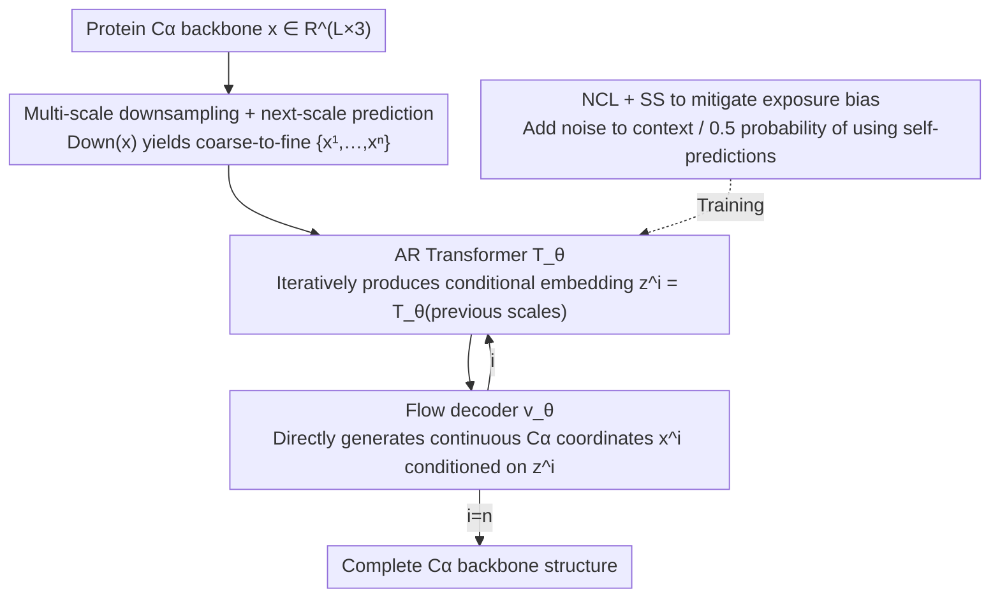

# Protein Autoregressive Modeling via Multiscale Structure Generation

**Conference**: ICML 2026 Spotlight  
**arXiv**: [2602.04883](https://arxiv.org/abs/2602.04883)  
**Code**: https://par-protein.github.io (Project Page)  
**Area**: Scientific Computing / Protein Structure Generation / Autoregressive Models  
**Keywords**: Protein backbone generation, multi-scale autoregression, next-scale prediction, flow matching, exposure bias

## TL;DR
PAR adapts the "next-scale prediction" concept from VAR in the image domain to protein $C_\alpha$ backbone generation. By replacing single-scale diffusion models with multi-scale downsampling, an autoregressive Transformer, and a flow-based decoder—combined with noisy context learning and scheduled sampling to mitigate exposure bias—it achieves an unconditional FPSD of 161.0, unlocks zero-shot point-prompt generation and motif scaffolding, and provides a 2.5$\times$ sampling speedup.

## Background & Motivation

**Background**: Protein backbone generation is dominated by diffusion and flow matching models. One category predicts per-residue $SE(3)$ frames (FrameDiff, RFDiffusion, Genie2), while the other directly models $C_\alpha$ coordinates (Proteina, etc.). These methods are **single-scale**, meaning they denoise the full structure of length $L$ in one pass.

**Limitations of Prior Work**: Autoregressive (AR) models have shown strong scaling and zero-shot capabilities in LLMs and image generation but have struggled in protein structure generation. Two specific obstacles exist: (i) continuous 3D atomic coordinates require discretization (e.g., VQ-VAE), which loses fine structural details and hurts designability; (ii) protein residues exhibit strong bidirectional dependencies—residues far apart in sequence may form hydrogen bonds or hydrophobic contacts in space, directly conflicting with the **unidirectional next-token** assumption of standard AR. Prior token-based AR routes like ESM3 or Gaujac et al. yield FPSD results an order of magnitude worse than diffusion baselines.

**Key Challenge**: To use AR models for proteins, one must bypass both "discretization accuracy loss" and "unidirectional order disrupting bidirectional dependencies," both of which stem from the standard implementation of the AR paradigm.

**Goal**: Design an AR framework that (1) models continuous $C_\alpha$ coordinates instead of discrete tokens, (2) unfolds in a direction other than residue-by-residue to preserve bidirectional dependencies within each scale, and (3) inherits the zero-shot and scaling advantages of AR models.

**Key Insight**: Proteins naturally possess **hierarchical structures**—from coarse-grained tertiary topologies and secondary structure arrangements to atomic coordinates. This multi-scale granularity is isomorphic to the "next-scale prediction" proposed by VAR in image generation: changing the AR expansion dimension from "spatial position" to "scale," while maintaining full bidirectional attention within each scale.

**Core Idea**: Downsample the protein hierarchically along the sequence dimension to obtain $\{\mathbf{x}^1, \dots, \mathbf{x}^n\}$ (e.g., scales of 64→128→256). Use an AR Transformer for next-scale prediction to generate conditional embeddings for each scale, then use a flow matching decoder to directly generate continuous $C_\alpha$ coordinates conditioned on these embeddings—AR "sculpts the silhouette," while flow "sculpts the details."

## Method

### Overall Architecture

PAR solves the problem of how to make AR models generate continuous $C_\alpha$ backbones without losing to diffusion by shifting the AR expansion dimension from "residue position" to "structural scale." A protein is first downsampled into several versions from coarse to fine. The AR model iteratively predicts each scale to produce conditional embeddings, and a flow matching decoder handles the generation of continuous coordinates. This is formulated as $p_\theta(\mathbf{x}) = \prod_{i=1}^n p_\theta(\mathbf{x}^i \mid \mathbf{z}^i = \mathcal{T}_\theta(X^{<i}))$, modeling only $C_\alpha$ atoms $\mathbf{x} \in \mathbb{R}^{L \times 3}$. Coarse scales define the global layout, while fine scales refine local details. The AR Transformer $\mathcal{T}_\theta$ provides the conditions, the flow decoder $\mathbf{v}_\theta$ generates coordinates, and inference iterates $n$ times from $\texttt{bos}$ (accelerated by KV cache).

### Key Designs

**1. Multi-scale downsampling + next-scale prediction: Shifting AR dimension from residue to scale**

The unidirectional next-token assumption of standard AR conflicts with the bidirectional spatial dependencies of protein residues (where distant residues may form contacts). PAR represents structure as a set of coarse-to-fine scales $\{\mathbf{x}^1, \dots, \mathbf{x}^n = \mathbf{x}\}$. Each scale uses $\text{Down}(\mathbf{x}, \texttt{size}(i))$ via sequence interpolation to obtain $\texttt{size}(i)$ 3D centroids, paired with positional encodings $p^i = \text{linspace}(1, L, \texttt{size}(i))$. Coarse scales naturally manage global layout, while fine scales focus on local details. The AR unfolding direction becomes "scale," and each scale employs full bidirectional attention (non-equivariant Transformer). This preserves bidirectional dependencies and compresses the AR chain from $L$ steps to $n=3$, reducing error accumulation. Since downsampling is deterministic and parameter-free, marginalization of intermediate scales in the likelihood can be omitted.

**2. AR Condition + Flow Decoder for Continuous $C_\alpha$: Bypassing VQ Discretization**

A major bottleneck in previous AR protein generation (e.g., ESM3) is that discretizing coordinates into tokens loses fine structural detail and lowers designability. PAR ensures the AR Transformer outputs a conditional embedding $\mathbf{z}^i = \mathcal{T}_\theta([\texttt{bos}, \text{Up}(\mathbf{x}^1, \texttt{size}(2)), \dots, \text{Up}(\mathbf{x}^{i-1}, \texttt{size}(i))])$ (upsampling and concatenating all prior scales). A flow matching decoder then generates coordinates in continuous space. During training, each scale is interpolated as $\mathbf{x}^i_{t^i} = t^i \mathbf{x}^i + (1-t^i)\boldsymbol{\epsilon}^i$, optimizing $\mathcal{L}(\theta) = \mathbb{E}[\frac{1}{n}\sum_i \frac{1}{\texttt{size}(i)} \|\mathbf{v}_\theta(\mathbf{x}^i_{t^i}, t^i, \mathbf{z}^i) - (\mathbf{x}^i - \boldsymbol{\epsilon}^i)\|^2]$. Conditions $\mathbf{z}^i$ are injected via adaptive layer norm. For $n=1$, this degrades to standard single-scale flow matching (Proteina), maintaining backward compatibility with tricks like self-conditioning.

**3. Noisy Context Learning (NCL) + Scheduled Sampling (SS): Mitigating Exposure Bias**

During training, AR models use ground-truth context, but during inference, they use their own predictions. This mismatch leads to error accumulation across scales. Preliminary experiments showed that pure teacher forcing causes severe degradation in designability (sc-RMSD 2.20). NCL adds noise to the previous scale's context during training: $\mathbf{x}^i_{\text{ncl}} = w^i_{\text{ncl}} \mathbf{x}^i + (1-w^i_{\text{ncl}}) \boldsymbol{\epsilon}^i_{\text{ncl}}$ (where $w^i_{\text{ncl}}$ is sampled from $[0,1]$), forcing the model to recover structures from corrupted contexts. SS replaces ground-truth context with the flow decoder's own prediction $\mathbf{x}^i_{\text{pred}} = \mathbf{x}^i_t + (1-t^i)\mathbf{v}_\theta(\mathbf{x}^i_t, t^i, \mathbf{z}^i)$ with a 0.5 probability. NCL alone reduced sc-RMSD from 2.20 to 1.58 and PDB-FPSD from 99.66 to 89.70; adding SS further improved sc-RMSD to 1.48.

### Loss & Training
A single flow matching objective (Eq. 5) is used for **joint end-to-end training** of the AR Transformer and flow decoder. Training occurs in two stages: pre-training on the AFDB representative dataset for 200K steps, followed by fine-tuning on a 21K designable PDB subset for 5K steps ($\text{PAR}_{\text{pdb}}$). The default uses 3 scales $\{64, 128, 256\}$, with model sizes covering 60M, 200M, and 400M parameters.

## Key Experimental Results

### Main Results: Unconditional Backbone Generation

| Method | Params | Designability ↑ | sc-RMSD ↓ | FPSD vs PDB ↓ | FPSD vs AFDB ↓ |
|------|--------|----------------|-----------|---------------|----------------|
| FrameDiff | 17M | 65.4% | - | 194.2 | 258.1 |
| RFDiffusion | 60M | 94.4% | - | 253.7 | 252.4 |
| ESM3 (token AR) | 1.4B | 22.0% | - | 933.9 | 855.4 |
| Genie2 | 16M | 95.2% | - | 350.0 | 313.8 |
| Proteina | 400M | 92.6% | 1.09 | 271.3 | 272.6 |
| **Ours (PAR)** | 400M | **96.0%** | **1.01** | 313.9 | 296.4 |
| **Ours (PAR$_{\text{pdb}}$)** | 400M | **96.6%** | 1.04 | **161.0** | 228.4 |

PAR outperforms SOTA single-scale baselines like Proteina in both designability and sc-RMSD. After fine-tuning, its PDB-FPSD of 161.0 is significantly lower (36% better than RFDiffusion's 253.7), proving that multi-scale AR learns a distribution closer to real proteins. Note that the token-AR baseline ESM3 achieves only 22% designability, validating the necessity of bypassing discretization.

### Ablation Study: Exposure Bias Mitigation (60M, 100K steps)

| Training Strategy | sc-RMSD ↓ | FPSD vs PDB ↓ | FPSD vs AFDB ↓ |
|---------|-----------|---------------|----------------|
| Teacher Forcing | 2.20 | 99.66 | 37.64 |
| + NCL | 1.58 | 89.70 | 23.69 |
| + NCL + SS | **1.48** | 90.66 | 24.59 |

NCL alone reduces sc-RMSD from 2.20 to 1.58 and AFDB-FPSD from 37.64 to 23.69, serving as the critical component for elevating PAR to SOTA performance.

### Ablation Study: Scale Configuration (60M)

| Scale Config | Designability ↑ | FPSD vs AFDB ↓ |
|---------|----------------|----------------|
| {64, 256} | 83.0% | 274.32 |
| **{64, 128, 256}** | **85.0%** | **267.35** |
| {64, 128, 192, 256} | 77.8% | 282.69 |
| {64, 96, 128, 192, 256} | 81.0% | 263.58 |
| {L/4, L/2, L} | 86.4% | 298.30 |

3 scales represent the "sweet spot"; 4-5 scales result in performance drops likely due to increased exposure bias from error accumulation.

### Key Findings
- **Sampling Efficiency**: By using SDE on the 1st scale (establishing global topology) and ODE for subsequent scales (only 2 steps each), PAR achieves a **2.5$\times$ speedup** for length 200 compared to the Proteina 400-step baseline, while maintaining 94-98% designability.
- **Zero-shot Point Prompt Generation**: By injecting 16 3D points as a prompt into the 1st scale, PAR generates complete structures consistent with the coarse layout without fine-tuning.
- **Zero-shot Motif Scaffolding**: By teacher-forcing motif coordinates at each scale, PAR generates diverse scaffolds without additional training or masking conditions.
- **Scaling Friendly**: Increasing from 60M to 400M and training longer consistently improves metrics. Interestingly, a 60M AR Transformer suffices; scaling the flow decoder provides higher returns.
- **Attention Visualization**: Each scale primarily attends to the **immediately preceding scale**, but retains non-zero attention on earlier scales, indicating multi-scale information integration rather than a Markovian decay.

## Highlights & Insights
- **Clean Paradigm Transfer**: The VAR paradigm is mapped to proteins not just by analogy, but specifically to resolve the "discretization loss" and "one-way dependency" bottlenecks.
- **Elegant Hybrid Architecture**: Since PAR reduces to Proteina at $n=1$, it effectively generalizes flow matching to a multi-scale context, maintaining compatibility with established tricks like self-conditioning.
- **Effectiveness of NCL**: Adding noise to the context is a simple trick but yielded a 28% reduction in sc-RMSD. This approach is applicable to any AR + continuous generator hybrid to bridge the training-inference distribution shift.
- **Coarse-to-Fine SDE/ODE**: Establish "anchors" at coarse scales via SDE, then use ODE for refinement. This offers a new perspective for diffusion acceleration by distributing steps across scales (e.g., 400, 2, 2).

## Limitations & Future Work
- Currently models only the **$C_\alpha$ backbone**; extending to full-atom models with sidechains is required for practical design.
- Scale configurations rely on heuristics: performance drops beyond 4 scales, and the mechanism behind this (error accumulation vs. over-fitting coarse scales) requires further study.
- Evaluation is limited to standard PDB/AFDB benchmarks; **lack of wet-lab validation** means biological activity is not yet proven.
- High training cost: Two-stage training up to 400M parameters might be prohibitive for smaller academic labs.

## Related Work & Insights
- **vs. Proteina (Single-scale Flow)**: Proteina is the $n=1$ special case of PAR. PAR adds zero-shot prompting, 2.5$\times$ speedup, and lower FPSD by introducing the scale dimension.
- **vs. RFDiffusion / FrameDiff (Frame-based Diffusion)**: While they use $SE(3)$ frames and equivariant paths, PAR uses direct $C_\alpha$ coordinates and hierarchical priors, outperforming them in designability and FPSD.
- **vs. ESM3 (Token-based AR)**: ESM3 achieves only 22% designability due to discretization; PAR's continuous multi-scale approach refutes the notion that AR is unsuitable for proteins.
- **Insight**: For any data with natural hierarchical structures (video, point clouds, meshes), the "multi-scale AR + continuous decoder" recipe is a strong candidate, especially when single-scale diffusion fails to ensure global consistency.

## Rating
- Novelty: ⭐⭐⭐⭐ Transferring the VAR paradigm to the 3D protein domain is structurally sound and challenges the dominance of diffusion models.
- Experimental Thoroughness: ⭐⭐⭐⭐ Extensive benchmarks, ablations (NCL/SS, scales, scaling curves), and zero-shot tasks are provided; wet-lab data is missing.
- Writing Quality: ⭐⭐⭐⭐ Clear motivation, intuitive analogies, and rigorous visualizations.
- Value: ⭐⭐⭐⭐ Provides a viable alternative to diffusion with practical benefits in speed and zero-shot control.

<!-- RELATED:START -->

## Related Papers

- [\[NeurIPS 2025\] Multiscale Guidance of Protein Structure Prediction with Heterogeneous Cryo-EM Data](../../NeurIPS2025/computational_biology/multiscale_guidance_of_protein_structure_prediction_with_heterogeneous_cryo-em_d.md)
- [\[ICML 2026\] CARD: Coarse-to-fine Autoregressive Modeling with Radix-based Decomposition for Transferable Free Energy Estimation](card_coarse-to-fine_autoregressive_modeling_with_radix-based_decomposition_for_t.md)
- [\[ICML 2026\] SIGMA: Structure-Invariant Generative Molecular Alignment for Chemical Language Models via Autoregressive Contrastive Learning](sigma_structure-invariant_generative_molecular_alignment_for_chemical_language_m.md)
- [\[ICLR 2026\] AntigenLM: Structure-Aware DNA Language Modeling for Influenza](../../ICLR2026/computational_biology/antigenlm_structure-aware_dna_language_modeling_for_influenza.md)
- [\[ICLR 2026\] Contact-Guided 3D Genome Structure Generation of E. coli via Diffusion Transformers](../../ICLR2026/computational_biology/contact-guided_3d_genome_structure_generation_of_e_coli_via_diffusion_transforme.md)

<!-- RELATED:END -->
