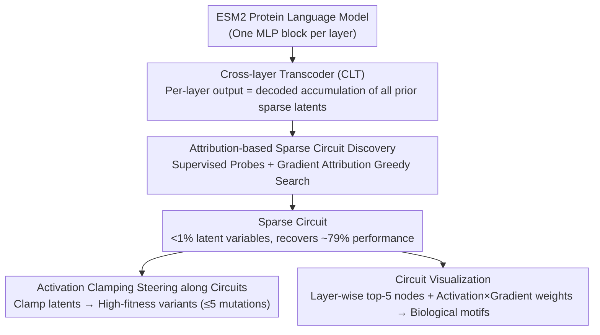

# Protein Circuit Tracing via Cross-layer Transcoders

**Conference**: ICML 2026  
**arXiv**: [2602.12026](https://arxiv.org/abs/2602.12026)  
**Code**: https://github.com/amirgroup-codes/ProtoMech  
**Area**: Protein Language Models / Mechanistic Interpretability / Circuit Discovery / Biological Foundation Models  
**Keywords**: pLM, ESM2, cross-layer transcoder, circuit tracing, steering

## TL;DR
The authors adapt cross-layer transcoders from NLP to the protein language model (pLM) ESM2, proposing the ProtoMech framework. This framework recovers 79% of downstream performance using sparse latent circuits composed of < 1% of total latents and enables designing high-fitness protein variants by steering along the discovered circuits, outperforming baselines in over 70% of cases.

## Background & Motivation

**Background**: Protein language models (pLMs) such as ESM2, ESMFold, and Boltz have achieved strong performance in structure prediction, function prediction, and sequence design, serving as "biological foundation models." Recently, sparse autoencoders (SAEs) have been employed to decompose pLM hidden states into interpretable features, such as those identifying binding sites or conserved motifs.

**Limitations of Prior Work**: SAEs perform sparse factorization of *single-layer representations* only, failing to express the computational process of passing information from one layer to the next. Per-layer transcoders (PLTs) attempt to approximate the input-output mapping of MLP layers, but since each layer is trained independently, errors accumulate, and cross-layer dependencies are completely ignored, resulting in poor reconstruction quality and unreliable circuits.

**Key Challenge**: Identifying a "computational circuit" in pLMs requires a *replacement model* that can holistically substitute the original model's MLP blocks while explicitly modeling information transfer between layers. SAEs lack "transfer," while PLTs lack "cross-layer" modeling.

**Goal**: (1) Construct a cross-layer model for pLMs that can entirely replace the MLP components of ESM2; (2) identify sparse circuits within the latent space of this model (< 1% size) that recover the majority of performance; (3) verify that these circuits correspond to interpretable biological motifs and use them for steering the design of high-fitness sequences.

**Key Insight**: Drawing inspiration from Anthropic’s Cross-Layer Transcoder (CLT)—where the output of each MLP layer is reconstructed by the decoded accumulation of all *preceding* sparse latent variables—the cumulative computation along the model depth is explicitly modeled.

**Core Idea**: ProtoMech replaces each ESM2 MLP layer with a CLT and uses greedy search based on gradient attribution to identify the subset of latent variables most critical for downstream tasks. These identified subsets constitute "protein circuits." When visualized, these circuits map to known biological structures such as the HRD catalytic motif, the Rossmann fold, and the hydrophobic core of GB1.

## Method

### Overall Architecture
ProtoMech integrates "circuit discovery + circuit application" into a unified pipeline consisting of four components: (i) CLT Replacement Model—a sparse TopK encoder and cross-layer decoder are implemented for each ESM2 MLP layer to create a replacement model that faithfully reproduces the original computation in a sparse, readable format; (ii) Sparse Circuit Discovery—gradient attribution and incremental greedy search are used within the replacement model to pick the minimal subset of latents that recovers $\ge 70\%$ of the original performance; (iii) Steering—activation clamping is applied to specific latents in the CLT to push wildtype sequences toward high-fitness regions (within 5 mutations); (iv) Visualization—the circuit is rendered as a readable graph using top-5 activated nodes per layer and edge weights calculated by activation $\times$ gradient, followed by manual cross-referencing with Swiss-Prot to identify biological motifs. The first three steps represent the core methodology (Key Designs), while the fourth is the presentation tool for interpretation.

### Key Designs

**1. Cross-layer Transcoder (CLT) to Replace ESM2 MLP**: SAEs only perform sparse decomposition of single-layer representations, and PLTs approximate layers independently (accumulating error and losing cross-layer dependencies); neither offers the computational process of information passing between layers. CLT addresses this: for the $\ell$-th layer residual stream $\mathbf x^\ell$, it encodes sparse latents $\mathbf a^\ell=\text{TopK}(\mathbf W_{\text{enc}}^\ell(\mathbf x^\ell-\mathbf b_{\text{pre}}^\ell)+\mathbf b_{\text{enc}}^\ell)$. The reconstructed output of the $\ell$-th MLP layer $\hat{\mathbf y}^\ell$ is the decoded sum of latents from **all preceding layers**: $\hat{\mathbf y}^\ell=\sum_{\ell'=1}^{\ell}\mathbf W_{\text{dec}}^{\ell'\to\ell}\mathbf a^{\ell'}+\mathbf b_{\text{pre}}^\ell$. The training objective combines reconstruction MSE $\mathcal L_{\text{MSE}}=\sum_\ell \|\mathbf y^\ell-\hat{\mathbf y}^\ell\|_2^2$ with an auxiliary loss $\mathcal L_{\text{aux}}$ to mitigate dead latents. This upgrades signals from "intra-layer reconstruction" to "cross-layer composition," faithfully replicating ESM2 calculation paths and allowing later latents to naturally represent "functional combinations of earlier latents."

**2. Attribution-based Sparse Circuit Discovery**: With the replacement model established, the next task is picking a minimal subset of critical latents from tens of thousands. The authors first train supervised probes (logistic regression for family, CNN for function) on the original ESM2 final MLP output $\mathbf y^L$. During inference, hybrid replacement is used: MLPs use CLT while attention layers maintain original ESM2 values. Latents are ranked by gradient attribution to the probe output and incrementally added to the candidate set until the circuit recovers $\ge 70\%$ of original performance or matches the full latent performance (evaluated via F1 for family and Spearman $\rho$ for function). Greedy attribution avoids the $2^{d_{\text{latent}}}$ brute-force search. Attention is kept fixed to prevent "error accumulation from attention reconstruction" (ablation shows that using CLT for attention leads to performance collapse), ensuring the circuit specifically explains the MLP computational path, consistent with Anthropic’s approach in LLMs.

**3. Activation Clamping Steering along Circuits**: Circuits serve not just as explanatory tools but as generative ones for designing high-fitness variants. During the forward pass of a wildtype sequence, specific latents in the target function circuit are "clamped"—their activation is set to the maximum observed across the sequence multiplied by a scalar factor. Following Eq. (2), $\hat{\mathbf y}^L$ is reconstructed at $\ell=L$, decoded to ESM2 logits, and mutations are selected via maximum probability. Variants are restricted to $\le 5$ mutations from the wildtype to ensure reliability of downstream CNN evaluators. Unlike CAA, which injects a global concept vector into the residual stream, this method only intervenes in sub-circuits attributed to the specific function, minimizing interference and providing a cleaner signal. It essentially drives protein design through mechanistic attribution (mechanism-guided protein design).

### Loss & Training
The CLT uses $\mathcal L_{\text{CLT}}=\mathcal L_{\text{MSE}}+\alpha\mathcal L_{\text{aux}}$ and is pre-trained on 5M sequences ($\le 1022$ aa) sampled from UniRef50. The CLT for ESM2-8M contains 28M parameters (3.5$\times$ the original model). To address the $\mathcal O(L^2)$ scaling bottleneck of the decoding matrix, the authors propose a "windowed CLT"—each layer only attends to the previous 4 layers. On ESM2-35M, this reduces parameters from 207M to 125M and speeds up training by 1.75$\times$, while family recovery only drops from 85% to 82%.

## Key Experimental Results

### Main Results

Circuit recovery capability on ESM2-8M for two downstream tasks:

| Task | Full Latents (PLT / ProtoMech) | Circuit (PLT / ProtoMech) | Circuit Latent Ratio |
|---|---|---|---|
| Protein family F1 | 0.50 ± 0.34 / **0.82 ± 0.19** | 0.49 ± 0.33 / **0.73 ± 0.19** | ~0.8% |
| Function Spearman $\rho$ | 0.38 ± 0.18 / **0.41 ± 0.19** | 0.35 ± 0.19 / **0.38 ± 0.18** | ~0.9% |
| Orig. ESM2 baseline | 0.92 (family F1) / 0.50 ($\rho$) | – | – |

Steering Mean scores across seven DMS assays (selected):

| Method | SPG1 | HIS7 | GFP | CAPSD | RASK |
|---|---|---|---|---|---|
| ProtoMech | 1.67 | **1.28** | 4.17 | **1.68** | -0.12 |
| PLT | **1.97** | 1.27 | **4.40** | 0.81 | -0.19 |
| CAA | 0.70 | 0.52 | 2.93 | -0.26 | -0.35 |
| Random | -2.76 | 0.56 | 2.74 | -1.04 | -0.64 |

### Ablation Study

| Configuration | Observation | Implication |
|---|---|---|
| Recursive replacement (CLT for Attn) | Significant performance collapse | Cross-layer error accumulation; attention must remain fixed |
| Windowed CLT (window=4) on ESM2-35M | family 82% vs vanilla 85% | Feasible trade-off for larger models |
| Sparsity control (Same as PLT) | PLT family F1 only 0.50 | Performance stems from cross-layer links, not tuning sparsity |

### Key Findings
- On families where the original ESM2 performs poorly (F1 < 0.5), ProtoMech circuits achieved a higher average F1 than the original model (0.43 vs. 0.39). This exhibits a "sparse denoising regularization" effect—the circuit filters out task-irrelevant noise, making it more reliable than the original model and a candidate for a mechanistic filter in protein screening.
- The circuit maintained 74% performance recovery for GFP variants at mutation levels $\ge 5$, suggesting ProtoMech captures *global* functional motifs rather than overfitting to local statistics.
- Visualization confirmed: In the Kinase circuit, L1 recognizes Arginine (R) $\rightarrow$ L3 identifies the HRD catalytic loop $\rightarrow$ L5 splits into ATP-binding sites and the G-loop. Deep layers re-activate early residues, consistent with the token reiteration phenomenon observed in NLP.

## Highlights & Insights
- This is the first work to adapt Anthropic’s CLT concepts to biological foundation models, completing the full pipeline of circuit discovery and steering, proving that "mechanistic interpretability" is a cross-domain paradigm rather than specific to LLMs.
- It introduces "mechanism-guided protein design": instead of relying on global concept vectors or time-consuming evolutionary algorithms, mutation selection is directly driven by "which latents are responsible for fitness," offering high efficiency and interpretability.
- The denoising phenomenon, where "circuits are more accurate than the original model," suggests that sparse latent spaces are inherently learnable regularizers, valuable for protein prediction tasks with small samples or high noise.

## Limitations & Future Work
- Circuit interpretation still relies on manual cross-referencing with Swiss-Prot, which lacks scalability; an automated motif annotation pipeline is urgently needed.
- Validation was only performed on masked LMs (ESM2); it remains unknown if CLT applies to autoregressive pLMs (ProGen) or diffusion-based pLMs (DPLM).
- While windowed CLT mitigates the $\mathcal O(L^2)$ bottleneck, scaling to ESM2-650M and beyond might still be computationally prohibitive.

## Related Work & Insights
- **vs Adams 2025 (SAE on pLM)**: While they use SAEs to explain single-layer representations, this work focuses on CLT to explain cross-layer computation, moving from "features" to "circuits."
- **vs Ameisen 2025 (CLT on LLM)**: This work marks the first biological application of Anthropic’s LLM circuit tracing, demonstrating the cross-domain transferability of these methods.
- **vs CAA (Huang 2025) for protein steering**: CAA relies on extensive fitness labeling and local mutations, making it prone to overfitting. ProtoMech enables sparse intervention via circuits, showing stronger data efficiency and extrapolation capability.

## Rating
- Novelty: ⭐⭐⭐⭐ First application of cross-layer transcoders for pLM circuit tracing and introduction of the protein steering paradigm.
- Experimental Thoroughness: ⭐⭐⭐⭐ Covers family, function, and steering tasks across two model sizes, with complementary quantitative results and biological case studies.
- Writing Quality: ⭐⭐⭐⭐ Clearly structured framework with intuitive layer-wise interpretations of biological cases (Kinase/NADP+/GB1).
- Value: ⭐⭐⭐⭐ Provides the mech-interp community with a cross-domain case and offers the protein design community a low-cost, mechanism-driven method.

<!-- RELATED:START -->

## Related Papers

- [\[ICML 2026\] Circuit Tracing in Autoregressive Protein Language Models](circuit_tracing_in_autoregressive_protein_language_models.md)
- [\[ICML 2026\] Cross-Chirality Generalization by Axial Vectors for Hetero-Chiral Protein-Peptide Interaction Design](cross-chirality_generalization_by_axial_vectors_for_hetero-chiral_protein-peptid.md)
- [\[ICLR 2026\] Tracing Pharmacological Knowledge in Large Language Models](../../ICLR2026/computational_biology/tracing_pharmacological_knowledge_in_large_language_models.md)
- [\[ICML 2026\] Learning the Interaction Prior for Protein-Protein Interaction Prediction: A Model-Agnostic Approach](learning_the_interaction_prior_for_protein-protein_interaction_prediction_a_mode.md)
- [\[ICML 2026\] Towards A Generative Protein Evolution Machine with DPLM-Evo](towards_a_generative_protein_evolution_machine_with_dplm-evo.md)

<!-- RELATED:END -->
