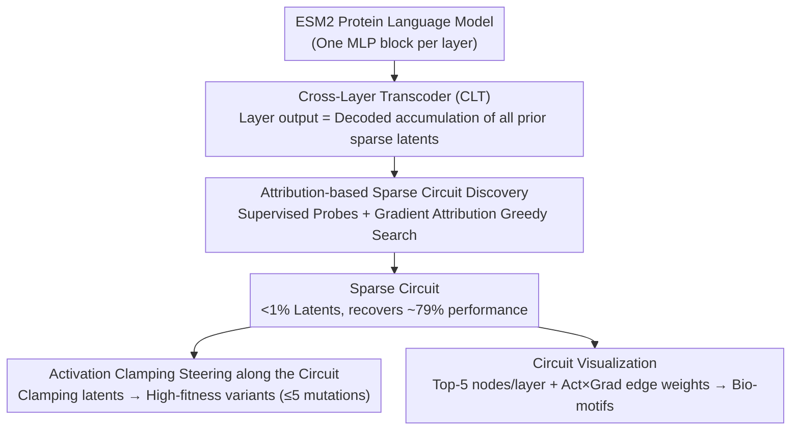

# Protein Circuit Tracing via Cross-layer Transcoders

**Conference**: ICML 2026  
**arXiv**: [2602.12026](https://arxiv.org/abs/2602.12026)  
**Code**: https://github.com/amirgroup-codes/ProtoMech  
**Area**: Protein Language Models / Mechanistic Interpretability / Circuit Discovery / Biological Foundation Models  
**Keywords**: pLM, ESM2, cross-layer transcoder, circuit tracing, steering

## TL;DR
The authors adapt cross-layer transcoders from NLP to the protein language model ESM2, proposing the ProtoMech framework. It recovers 79% of downstream performance using a sparse latent circuit of < 1% and enables steering along the circuit to design high-fitness protein variants, outperforming baselines in over 70% of cases.

## Background & Motivation

**Background**: Protein language models (pLMs) such as ESM2, ESMFold, and Boltz have achieved strong baseline performance in structure prediction, function prediction, and sequence design, serving as "foundation models for biology." Recently, sparse autoencoders (SAE) have been used to decompose pLM hidden states into interpretable features, such as identifying binding sites and conserved motifs.

**Limitations of Prior Work**: SAEs only provide a sparse factorization of *single-layer representations* and cannot express the computational process of passing information from one layer to the next. Per-layer transcoders (PLTs) attempt to approximate the input-output mapping of each MLP layer, but they are trained independently, leading to accumulated errors and a complete neglect of cross-layer dependencies, resulting in poor reconstruction quality and unreliable circuits.

**Key Challenge**: To identify the "computational circuits" of a pLM, a *replacement model* is required that can globally replace the MLP blocks of the original model while explicitly modeling information transfer between layers. SAEs lacks "transfer," and PLTs lack "cross-layer" modeling.

**Goal**: (1) Construct a cross-layer model for pLMs that can globally replace the MLP components of ESM2; (2) Identify sparse circuits in this model's latent space using < 1% of latents to recover most of the performance; (3) Verify that these circuits correspond to interpretable biological motifs and can be used to steer the design of high-fitness sequences.

**Key Insight**: Drawing inspiration from Anthropic’s Cross-Layer Transcoder (CLT), where the output of each MLP layer is reconstructed by the cumulative sum of sparse latents decoded from all *previous* layers, thereby explicitly modeling cumulative computation along the depth dimension.

**Core Idea**: Replace each MLP layer of ESM2 with a CLT, then use a greedy search based on gradient attribution to identify the subset of latents most critical for each downstream task. This subset defines the "protein circuit." Once visualized, these circuits can be mapped to known biological structures such as the HRD catalytic motif, Rossmann fold, and the GB1 hydrophobic core.

## Method

### Overall Architecture
ProtoMech strings together "circuit discovery + circuit application" into a pipeline consisting of four components: (i) CLT replacement model—writing a sparse TopK encoder and cross-layer decoder for each ESM2 MLP layer to create a replacement model that faithfully reproduces the original MLP computation in a sparse, readable way; (ii) Sparse circuit discovery—using gradient attribution and incremental greedy search within the replacement model to select the minimum subset of latents that recovers ≥70% of the original performance; (iii) steering—performing activation clamping on specific latents within the circuit on the CLT to push wildtype sequences toward high-fitness regions (within 5 mutations); (iv) Visualization—taking top-5 activated nodes per layer and calculating edge weights via activation × gradient to render the circuit as a readable graph for manual cross-referencing with Swiss-Prot. The first three steps represent the core methodology (three key designs below), while the fourth is a visualization tool for human interpretation.

### Key Designs

**1. Replacing ESM2 MLPs with Cross-Layer Transcoders (CLT)**: SAEs only perform sparse decomposition of single-layer representations, and PLTs approximate layers independently (accumulating error and losing cross-layer dependencies); neither captures the "layer-to-layer" computational process. CLT addresses this: for the $\ell$-th layer residual stream $\mathbf x^\ell$, it encodes sparse latents $\mathbf a^\ell=\text{TopK}(\mathbf W_{\text{enc}}^\ell(\mathbf x^\ell-\mathbf b_{\text{pre}}^\ell)+\mathbf b_{\text{enc}}^\ell)$. The $\ell$-th layer MLP output is reconstructed by decoding and summing latents from **all previous layers**: $\hat{\mathbf y}^\ell=\sum_{\ell'=1}^{\ell}\mathbf W_{\text{dec}}^{\ell'\to\ell}\mathbf{a}^{\ell'}+\mathbf b_{\text{pre}}^\ell$. The training objective includes the reconstruction MSE $\mathcal L_{\text{MSE}}=\sum_\ell \|\mathbf y^\ell-\hat{\mathbf y}^\ell\|_2^2$ and an auxiliary loss $\mathcal L_{\text{aux}}$ to mitigate dead latents. This upgrades signals from "intra-layer reconstruction" to "cross-layer composition," faithfully reproducing ESM2's actual computational paths and naturally allowing subsequent latents to be interpreted as functional compositions of prior latents.

**2. Attribution-based Sparse Circuit Discovery**: With the replacement model established, the next step is to select the tiny subset of latents critical for a specific task from tens of thousands. The authors first train supervised probes (logistic regression for family, CNN for function) on the original ESM2 final MLP output $\mathbf y^L$ to anchor performance. During inference, hybrid replacement is used—MLPs are run via CLT while attention modules retain original ESM2 values. Latents are ranked by gradient attribution to the probe output and added to the candidate set in small batches until the circuit recovers ≥70% of original performance or reaches full latent performance (evaluated by F1 for family and Spearman $\rho$ for function). Greedy search with attribution avoids $2^{d_{\text{latent}}}$ brute-force search. Fixed attention prevents "error accumulation from attention reconstruction" (ablations show performance collapses if attention also uses CLT), ensuring the circuit specifically explains the MLP computational path, consistent with Anthropic's approach in LLMs.

**3. Activation Clamping Steering along the Circuit**: Circuits are not just explanatory tools but can also serve as generative tools for designing high-fitness variants. During the forward pass of a wildtype sequence, specific latents in the target function circuit are "clamped"—setting the activation to the maximum observed amplitude for that node across the sequence, multiplied by a scalar multiplier. Then, using Eq. (2) to reconstruct $\hat{\mathbf y}^L$ at $\ell=L$, the result is decoded to ESM2 logits to select mutations based on maximum probability. Variants are restricted to ≤5 mutations from the wildtype to ensure reliability of downstream CNN evaluators. Compared to CAA, which injects a global concept vector into the residual stream, this approach only modifies sub-circuits "attributed to function," resulting in less interference and cleaner signals. This essentially uses mechanistic attribution to drive protein design (mechanism-guided protein design).

### Loss & Training
CLT uses $\mathcal L_{\text{CLT}}=\mathcal L_{\text{MSE}}+\alpha\mathcal L_{\text{aux}}$, pre-trained on 5M sequences (≤1022 aa) sampled from UniRef50. The CLT for ESM2-8M has 28M parameters, 3.5× the original model. To mitigate scaling bottlenecks from the $\mathcal O(L^2)$ decoding matrix, the authors propose a "windowed CLT" where each layer only looks at the previous 4 layers. On ESM2-35M, this reduces parameters from 207M to 125M and accelerates training by 1.75×, with family recovery only dropping from 85% to 82%.

## Key Experimental Results

### Main Results

Circuit recovery performance on two downstream tasks in ESM2-8M:

| Task | Full Latent (PLT / ProtoMech) | Circuit (PLT / ProtoMech) | Circuit Latent % |
|---|---|---|---|
| Protein family F1 | 0.50 ± 0.34 / **0.82 ± 0.19** | 0.49 ± 0.33 / **0.73 ± 0.19** | ~0.8% |
| Function Spearman $\rho$ | 0.38 ± 0.18 / **0.41 ± 0.19** | 0.35 ± 0.19 / **0.38 ± 0.18** | ~0.9% |
| Original ESM2 baseline | 0.92 (family F1) / 0.50 ($\rho$) | – | – |

Steering Mean scores across seven DMS assays (selected):

| Method | SPG1 | HIS7 | GFP | CAPSD | RASK |
|---|---|---|---|---|---|
| ProtoMech | 1.67 | **1.28** | 4.17 | **1.68** | -0.12 |
| PLT | **1.97** | 1.27 | **4.40** | 0.81 | -0.19 |
| CAA | 0.70 | 0.52 | 2.93 | -0.26 | -0.35 |
| Random | -2.76 | 0.56 | 2.74 | -1.04 | -0.64 |

### Ablation Study

| Configuration | Phenomenon | Meaning |
|---|---|---|
| Recursive replacement (attn via CLT) | Significant performance collapse | Cross-layer error accumulation; attention must remain fixed. |
| Windowed CLT (window=4) on ESM2-35M | Family 82% vs vanilla 85% | Viable trade-off strategy for larger models. |
| Comparison with PLT at same sparsity | PLT family F1 only 0.50 | Cross-layer connections, not sparsity tuning, drive performance. |

### Key Findings
- On protein families where original ESM2 performs poorly (F1 < 0.5), ProtoMech circuits achieved a higher average F1 than the original model (0.43 vs 0.39). This suggests a "sparse denoising regularization" effect—the circuit filters out task-irrelevant noise, potentially serving as a mechanistic filter for protein screening.
- For GFP variants with mutation depth ≥5, the circuit still recovers 74% performance, indicating that ProtoMech captures *global* functional motifs rather than over-fitting local statistics.
- Visualization confirmed: In the Kinase circuit, L1 identifies Arginine R → L3 identifies the HRD catalytic loop → L5 splits into the ATP binding site and G-loop. In the NADP+ circuit, L4 identifies the Rossmann fold → L5 narrows to the NADP+/FAD pocket. Deep layers reactivate early residues, consistent with the token reiteration phenomenon in NLP.

## Highlights & Insights
- This is the first work to adapt Anthropic’s CLT concepts to biological foundation models, completing a full pipeline of circuit discovery and steering. It validates that "mechanistic interpretability" is a cross-domain paradigm rather than specific to LLMs.
- It introduces "mechanism-guided protein design": instead of relying on global concept vectors or time-consuming evolutionary algorithms, mutation selection is directly driven by "which latents are responsible for high fitness," offering high efficiency and interpretability.
- The denoising phenomenon where "circuits are more accurate than the original model" suggests that sparse latent space acts as a learnable regularizer, which is highly valuable for protein prediction tasks with small samples or high noise.

## Limitations & Future Work
- Circuit interpretation still relies on manual cross-referencing with Swiss-Prot, which has poor scalability; automated motif annotation pipelines are urgently needed.
- Validation was limited to masked LMs (ESM2). Whether autoregressive pLMs (ProGen) or diffusion pLMs (DPLM) can utilize CLT remains unknown and is an open challenge.
- The $\mathcal O(L^2)$ parameter scaling bottleneck, though partially mitigated by windowed CLT, may still be prohibitive for models like ESM2-650M or larger.

## Related Work & Insights
- **vs Adams 2025 (SAE on pLM)**: They used SAEs for single-layer representation interpretation, while this work shifts to CLTs for cross-layer computation—moving from "features" to "circuits."
- **vs Ameisen 2025 (CLT on LLM)**: While Anthropic performed LLM circuit tracing on Claude, this work is the first application in biology, verifying the cross-domain transferability of the method.
- **vs CAA (Huang 2025) for protein steering**: CAA relies on extensive fitness annotations and local mutations, making it prone to overfitting. ProtoMech achieves sparse intervention via circuits, demonstrating stronger data efficiency and extrapolation.

## Rating
- Novelty: ⭐⭐⭐⭐ First use of cross-layer transcoders for pLM circuit tracing and introduction of a new protein steering paradigm.
- Experimental Thoroughness: ⭐⭐⭐⭐ Covers family, function, and steering tasks across two model sizes, with complementary quantitative and biological case studies.
- Writing Quality: ⭐⭐⭐⭐ Clear framework with intuitive layer-by-layer interpretation of biological cases (Kinase/NADP+/GB1).
- Value: ⭐⭐⭐⭐ Provides the mech-interp community with a cross-domain case and offers a low-cost, mechanism-driven method for protein design.

<!-- RELATED:START -->

## Related Papers

- [\[ICLR 2026\] Tracing Pharmacological Knowledge in Large Language Models](../../ICLR2026/computational_biology/tracing_pharmacological_knowledge_in_large_language_models.md)
- [\[ICML 2026\] Cross-Chirality Generalization by Axial Vectors for Hetero-Chiral Protein-Peptide Interaction Design](cross-chirality_generalization_by_axial_vectors_for_hetero-chiral_protein-peptid.md)
- [\[ICML 2026\] Learning the Interaction Prior for Protein-Protein Interaction Prediction: A Model-Agnostic Approach](learning_the_interaction_prior_for_protein-protein_interaction_prediction_a_mode.md)
- [\[ICML 2026\] Towards A Generative Protein Evolution Machine with DPLM-Evo](towards_a_generative_protein_evolution_machine_with_dplm-evo.md)
- [\[NeurIPS 2025\] Inferring Stochastic Dynamics with Growth from Cross-Sectional Data](../../NeurIPS2025/computational_biology/inferring_stochastic_dynamics_with_growth_from_cross-sectional_data.md)

<!-- RELATED:END -->
