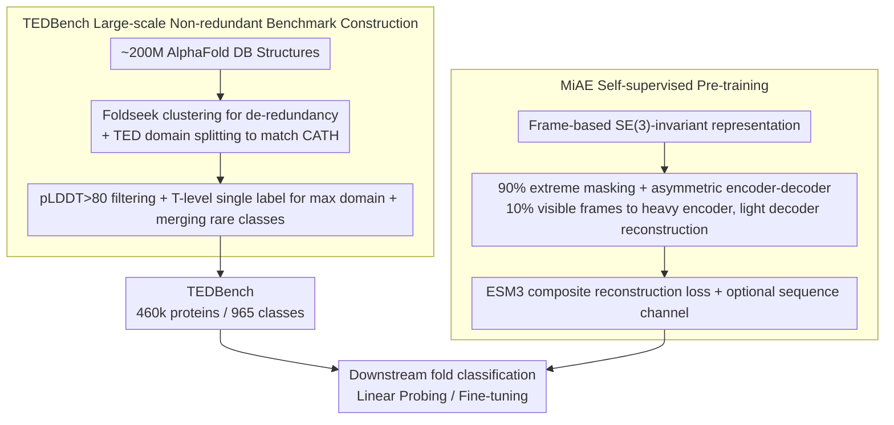

# Protein Fold Classification at Scale: Benchmarking and Pretraining

**Conference**: ICML 2026 Spotlight  
**arXiv**: [2605.18552](https://arxiv.org/abs/2605.18552)  
**Code**: https://github.com/BorgwardtLab/TEDBench  
**Area**: Scientific Computing / Protein Structure Representation Learning  
**Keywords**: Protein Fold Classification, Large-scale Benchmark, Masked Autoencoder, SE(3) Invariant, Self-supervised Pre-training

## TL;DR
The authors constructed TEDBench, a large-scale non-redundant protein fold classification benchmark (~490k entries, 965 classes) based on TED + Foldseek clustering of AlphaFold structures. They further proposed MiAE, an SE(3)-invariant Masked Autoencoder utilizing an extreme 90% masking rate and an asymmetric architecture. With only 100M parameters, MiAE outperforms significantly larger models like ESM2-650M and SaProt-650M in linear probing and fine-tuning.

## Background & Motivation

**Background**: Structural classification systems like CATH/SCOP organize protein domains into hierarchical labels (class→architecture→topology→homology). Traditionally, fold transfer is achieved via structural alignment (DALI, Foldseek). Recent geometric deep learning (E3NN, MACE, GotenNet) and protein representation learning (ESM2, ProteinMPNN, SaProt) treat fold recognition as a supervised classification or representation learning task.

**Limitations of Prior Work**: Supervised benchmarks for protein fold classification have long been stagnant at the 15k scale (e.g., SCOPe, PDB-fold), suffering from high redundancy and noisy labels. Existing methods either rely on brute-force large sequence models (ESM2-15B) or suffer from limited performance on structure-only models. In other words, the protein domain has yet to reach its "ImageNet moment."

**Key Challenge**: While the AlphaFold Database contains hundreds of millions of predicted structures, it lacks a large-scale, non-redundant, and reliably labeled standard classification task to drive architectural iterations. Furthermore, mainstream geometric GNNs do not scale well to hundreds of thousands of samples, while sequence models ignore 3D structural information.

**Goal**: (1) To construct a fold classification benchmark scaled up by an order of magnitude with controlled redundancy; (2) To provide a scale-friendly, structure-only self-supervised strong baseline to prove that structural representation alone is sufficient.

**Key Insight**: MAE in CV (He et al. 2022) uses 75% masking + asymmetric encoder-decoder to learn transferable visual representations. Protein backbones similarly possess local redundancy akin to a "tertiary alphabet" (Mackenzie et al. 2016), which can withstand more aggressive masking. By applying the MAE paradigm to SE(3)-invariant frame representations, one can efficiently encode sparse visible frames and let a lightweight decoder reconstruct coordinates from latent vectors and mask tokens.

**Core Idea**: Each residue is represented as an SE(3) local frame. The MiAE model utilizes 90% masking and an asymmetric architecture (heavy encoder/light decoder) to learn structural representations. Simultaneously, TEDBench is constructed at a scale of 460k entries across 965 classes using TED + Foldseek clustering + pLDDT filtering.

## Method

### Overall Architecture

The core problem addressed is that protein fold classification has been hindered by small benchmarks (15k samples), high redundancy, and noise. The authors address this in two parts: first, distilling the AlphaFold Database into TEDBench (460k samples, 965 classes) via Foldseek clustering and TED domain matching; second, porting the MAE paradigm to SE(3)-invariant residue frame representations to create MiAE, a structure-only, scale-friendly self-supervised model. The data pipeline involves Foldseek clustering for de-redundancy, TED domain splitting to match CATH topology, and pLDDT filtering. The model encodes backbones as frames, applies extreme masking, processes only visible residues through a heavy encoder, and reconstructs coordinates via a light decoder.

### Key Designs

**1. TEDBench: Large-scale, Non-redundant, and Reliably Labeled Fold Classification Benchmark**: Fold classification has been stuck on small benchmarks like SCOPe/PDB-fold. The authors distilled ~200M structures from the AlphaFold Database into a standard classification task: initially clustering with Foldseek to ~2.27M representatives, then split into domains via TED (Encyclopedia of Domains) and matched to CATH topologies (T-level). Structures were filtered for pLDDT > 80, using the max domain's T-level as a single unambiguous label. The final benchmark contains 462,175 proteins across 965 classes (8:1:1 stratified split), with 27,638 CATH v4.4 experimental structures as an external test set. This pipeline addresses four pain points: de-redundancy (Foldseek), scalable annotation (TED), unambiguous targets (single label), and reliability (pLDDT).

**2. Frame-based SE(3)-invariant Representation: Structure Awareness at Low Cost**: Since CATH labels are defined by 3D structures, models must be geometrically aware. However, general equivariant GNNs (E3NN/MACE) are computationally expensive due to high-order tensor products. The authors encode each residue as a local frame $\mathbf{T}_i = [\mathbf{R}_i, \mathbf{t}_i] \in \mathrm{SE}(3)$, where $\mathbf{t}_i$ is the $C_\alpha$ global coordinate and $\mathbf{R}_i$ is an orthogonal basis constructed from backbone atoms $(N, C_\alpha, C)$. All attention operations are computed in local coordinate systems: mapping a global point $p$ to the local frame $i$ via $p_{\text{local}} = \mathbf{R}_i^\top (p - \mathbf{t}_i)$, ensuring invariance to global rigid body transformations while avoiding the complexity of equivariant tensors. Unlike ESM3, global attention is used on visible frames; since only 10% of residues remain after masking, global attention is more efficient than dense variants.

**3. 90% Extreme Masking + Asymmetric Encoder-Decoder**: Protein backbones exhibit high local redundancy (e.g., repeating motifs in $\alpha$-helices). Low masking rates result in trivial tasks; at 70% masking, the reconstruction RMSD is only 0.57. Thus, the authors increase the masking rate to 90%. Visible sets (10% frames) are randomly sampled, while the remaining 90% are **completely removed** (without mask tokens) from the encoder. The heavy encoder (up to 24 layers / 339M) operates only on these 10%, while a very light decoder (2 layers, width 512) reconstructs all coordinates. This forces the model to perform "long-range geometric reasoning" rather than local interpolation. Ablations show that 0% masking (pure AE) drops linear probing F1 from 58.5 to 45.7 (test).

**4. ESM3 Composite Reconstruction Loss + Optional Sequence Channel**: CATH labels are defined by both geometry and evolution. The training uses the ESM3 composite loss $\mathcal{L}_{\text{ESM3}}$, comprising five terms: geometric distance, geometric orientation (primary), binned distance/orientation classification (stability), and inverse folding token prediction (to preserve sequence information). Since pairwise distances/orientations are inherently SE(3)-invariant, the loss is applied to **all** backbone atoms. Removing the inverse folding term drops linear probing F1 from 58.5 to 52.5. An optional sequence channel adds the amino acid embeddings of visible residues to the frame representations, pushing fine-tuned F1 to 74.6 (exceeding SaProt-650M's 73.5).

### Loss & Training

- Optimizer: AdamW with cosine learning rate; layer-wise lr decay for fine-tuning.
- Pre-training Data: 749,679 unlabeled structures from Foldseek clusters with pLDDT > 80 (non-overlapping with TEDBench).
- Model Scales: MiAE-S (29M / 6 layers), MiAE-B (102M / 12 layers), MiAE-L (339M / 24 layers).
- Metrics: Macro-F1 (due to 965 long-tailed classes) and accuracy; external test set consists of CATH v4.4 40% non-redundant experimental structures.

## Key Experimental Results

### Main Results

| Protocol | Model | Params | test F1 | external F1 | Notes |
| :--- | :--- | :--- | :--- | :--- | :--- |
| Supervised (from scratch) | GotenNet | 1.9M | 64.02 | 65.44 | Strongest equivariant baseline |
| Supervised (from scratch) | E3NN | 1.9M | 57.63 | 42.40 | Significant drop on external test |
| Supervised (from scratch) | MACE | 1.5M | 50.58 | 44.73 | — |
| Supervised (from scratch) | **MiAE-B** | 102M | **71.60** | **75.02** | +7.6 / +9.6 over GotenNet |
| Pre-train + Fine-tune | ESM2-650M | 650M | 66.19 | 72.29 | Sequence-only LLM |
| Pre-train + Fine-tune | SaProt-650M | 650M | 73.48 | 76.78 | Mixed seq+struct SOTA |
| Pre-train + Fine-tune | **MiAE-B+seq** | 102M | **74.56** | **77.34** | Outperforms SaProt with 6.4x fewer params |
| Linear Probing | ESM2-15B | 15B | 70.85 | 76.27 | Strongest but 44x params |
| Linear Probing | MiAE-L | 339M | 63.50 | 70.44 | Strongest structural model in ≤650M class |

### Ablation Study (MiAE-B default, linear probing F1, test/external)

| Configuration | test F1 | external F1 | Description |
| :--- | :--- | :--- | :--- |
| Default (90% mask + invf + seq + dec 2L×512) | 62.14 | 68.88 | — |
| 0% mask (pure AE) | 45.70 | 23.90 | Loss of "sparse reconstruction" challenge |
| w/o invf loss | 52.55 | — | Sequence-level supervision is crucial |
| w/o AA sequence | 58.52 | 66.18 | Seq channel contributes ~3.6 / 2.7 |
| Decoder width 256 / 768 | 35.50 / 27.83 | — | Performance collapses away from 512 |
| Decoder depth 1L / 2L / 4L (mean pool) | 46.61 / 58.52 / 59.65 | — | Deeper is better with mean pooling |
| Models S / B / L | 49.43 / 58.52 / 63.50 | — | Clean scaling with linear probing |

### Key Findings

- **Higher masking is better, opposite to CV MAE**: While MAE is optimal at 75% for images and BERT at 15% for text, proteins require **90%** masking. This is due to the extreme local redundancy of the backbone; only at 90% is the model forced to learn "global geometric reasoning."
- **Structure > Sequence + Structure > Sequence**: Pure structural MiAE outperforms pure sequence ESM2 at equivalent parameter budgets. CATH topology, being a geometric label, finds structural signals sufficient; sequence is a secondary benefit.
- **MiAE benefits more from fine-tuning than SaProt/ESM2**: MiAE-B+seq gains 12.5/8.5 F1 points from linear probing to fine-tuning, whereas ESM2 gains 4/2 and SaProt 7/6, suggesting better alignment between MiAE's pre-training and supervised fold classification.
- **Scaling is clean in linear probing but saturates in fine-tuning**: Linear probing F1 increases significantly from S to L, but fine-tuning B to L is nearly flat, suggesting 102M is sufficient for the downstream task and future gains lie in larger pre-training data.
- **Higher performance on external test sets**: Models generally score ~10 points higher on experimental structures (CATH v4.4) compared to AFDB predictions, likely due to lower diversity in experimental structures and cleaner labels.

## Highlights & Insights

- **Materializing the "ImageNet Moment"**: Combining TED + Foldseek clustering + pLDDT filtering into a reusable pipeline provides a high-utility infrastructure for protein folding classification.
- **Optimal masking rate reflects modal redundancy**: The trajectory of 75% for images, 15% for text, and 90% for proteins reveals the "compressibility" of each modality. This provides a diagnostic metric for future MAE work: find the masking rate near the RMSD "cliff."
- **Asymmetric design + SE(3)-invariant frames as a practical solution**: By avoiding high-order tensor products and using "attention in local coordinates," the authors offer an engineering-friendly path for scaling geometric models.
- **Transferable tricks**: (a) High masking rates to break local shortcuts can be applied to other redundant geometric modalities like point clouds; (b) Synchronized sequence/text masking can be reused in multi-modal biological tasks.

## Limitations & Future Work

- **Limitations**: (1) TEDBench currently handles protein-level recognition based on the largest domain, ignoring smaller domains—domain segmentation is needed; (2) MiAE has only been validated on fold classification, not functional or interaction tasks; (3) Pre-training remains expensive.
- **Observations**: (a) The single-label setting ignores CATH's hierarchical structure; incorporating hierarchical loss could be beneficial; (b) The external test set covers only 880/965 classes, leaving the AFDB/experimental domain gap not fully stressed.
- **Future Directions**: Extend MiAE pre-training to ESM Atlas scale (hundreds of millions of structures); introduce cross-domain segmentation pretext tasks to learn localization and classification simultaneously.

## Related Work & Insights

- **vs ESM2 / SaProt**: ESM2 uses sheer sequence scale; SaProt adds discrete Foldseek tokens. MiAE prioritizes continuous 3D structure, proving that for structure-defined tasks like CATH, "structure-first" beats "sequence-first" at equal parameter budgets.
- **vs ProteinMPNN / MIF**: These models use inverse folding but are very small (~1.6M-3.4M). MiAE integrates inverse folding into a scalable MAE framework, significantly leading in linear probing.
- **vs CV MAE**: Similar architecture, but MiAE's loss applies to **all** atoms to ensure SE(3) invariance, and the optimal masking rate is much higher (90%).
- **vs Equivariant GNNs**: While GNNs saturate at small scales, MiAE uses frame-based attention to bypass tensor product costs, scaling to 339M. This suggests that for protein tasks, "scaling Transformers + geometric priors" is currently more effective than "strict high-order equivariance + small models."

## Rating
- Novelty: ⭐⭐⭐⭐ Porting the MAE paradigm to protein geometry and building the large-scale benchmark represents high original value despite known components.
- Experimental Thoroughness: ⭐⭐⭐⭐⭐ Comprehensive protocols across baselines, extensive ablations (masking, decoder, size, sequence), and external test sets.
- Writing Quality: ⭐⭐⭐⭐ Clear structure and high information density; however, some geometric attention formulas are relegated to the appendix.
- Value: ⭐⭐⭐⭐⭐ TEDBench is likely to become a standard for fold classification, and MiAE provides a strong, scale-friendly baseline.

<!-- RELATED:START -->

- **ESM3**: [Simulating 500 million years of evolution with a language model for protein design](https://arxiv.org/abs/2406.17619)
- **SaProt**: [Protein Language Modeling with Structure-Aware Vocabulary](https://arxiv.org/abs/2403.04631)
- **MAE**: [Masked Autoencoders Are Scalable Vision Learners](https://arxiv.org/abs/2111.06377)

<!-- RELATED:END -->

## Related Papers

- [\[AAAI 2026\] Investigating Data Pruning for Pretraining Biological Foundation Models at Scale](../../AAAI2026/computational_biology/investigating_data_pruning_for_pretraining_biological_foundation_models_at_scale.md)
- [\[ICML 2025\] Protein Structure Tokenization: Benchmarking and New Recipe](../../ICML2025/computational_biology/protein_structure_tokenization_benchmarking_and_new_recipe.md)
- [\[ICML 2026\] Learning the Neighborhood: Contrast-Free Multimodal Self-Supervised Molecular Graph Pretraining](learning_the_neighborhood_contrast-free_multimodal_self-supervised_molecular_gra.md)
- [\[ICLR 2026\] HeurekaBench: A Benchmarking Framework for AI Co-scientist](../../ICLR2026/computational_biology/heurekabench_a_benchmarking_framework_for_ai_co-scientist.md)
- [\[ICML 2026\] Protein Autoregressive Modeling via Multiscale Structure Generation](protein_autoregressive_modeling_via_multiscale_structure_generation.md)

<!-- RELATED:END -->
