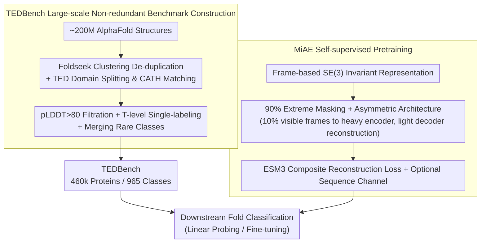

# Protein Fold Classification at Scale: Benchmarking and Pretraining

**Conference**: ICML 2026 Spotlight  
**arXiv**: [2605.18552](https://arxiv.org/abs/2605.18552)  
**Code**: https://github.com/BorgwardtLab/TEDBench  
**Area**: Scientific Computing / Protein Structure Representation Learning  
**Keywords**: Protein fold classification, Large-scale benchmark, Masked Autoencoder, SE(3) invariant, Self-supervised pretraining

## TL;DR
The authors constructed TEDBench, an unprecedentedly large (approx. 490k entries, 965 classes) and non-redundant protein fold classification benchmark based on AlphaFold structures clustered via TED + Foldseek. They further proposed MiAE, an SE(3)-invariant Masked Autoencoder. Utilizing an extreme masking rate of 90% and an asymmetric architecture with a heavy encoder and light decoder, MiAE outperforms significantly larger models like ESM2-650M and SaProt-650M in linear probing and fine-tuning with only 100M parameters.

## Background & Motivation

**Background**: Protein structural classification systems like CATH/SCOP organize protein domains into a class→architecture→topology→homology hierarchical structure. Traditionally, nearest neighbor transfer is performed through structural alignment (DALI, Foldseek). Recent geometric deep learning (E3NN, MACE, GotenNet) and protein representation learning (ESM2, ProteinMPNN, SaProt) treat fold identification as a supervised classification or representation learning task.

**Limitations of Prior Work**: Supervised benchmarks for protein fold classification have long been limited to the scale of 15k proteins (e.g., SCOPe, PDB-fold), which suffer from high redundancy and significant label noise. Existing methods either rely on massive sequence models (ESM2-15B) or face performance constraints with structure-only models. In other words, the protein domain has yet to reach its "ImageNet moment."

**Key Challenge**: While the AlphaFold Database contains hundreds of millions of predicted structures, it lacks a large-scale, non-redundant standard classification task with reliable labels to drive architectural iteration. Simultaneously, mainstream geometric GNNs do not scale well to the magnitude of hundreds of thousands of samples, while sequence-based models ignore 3D structural information.

**Goal**: (1) Construct a non-redundant fold classification benchmark one order of magnitude larger than previous ones; (2) Provide a scale-friendly, purely structural self-supervised strong baseline to demonstrate that structural representation alone is sufficient.

**Key Insight**: MAE (He et al. 2022) in CV uses a 75% mask rate and an asymmetric encoder-decoder to learn transferable visual representations. Protein backbones similarly possess local redundancy akin to a "tertiary alphabet" (Mackenzie et al. 2016) and can withstand even more aggressive masking. By applying the MAE paradigm to SE(3)-invariant frame representations, one can efficiently encode using sparse visible frames and allow a lightweight decoder to reconstruct coordinates from latent plus mask tokens.

**Core Idea**: Represent each residue as an SE(3) local frame and learn structural representations using a 90% mask rate and an asymmetric MAE. Simultaneously, construct TEDBench (460k scale, 965 classes, non-redundant) based on TED + Foldseek clustering + pLDDT filtering.

## Method

### Overall Architecture

The core problem addressed in this work is that protein fold classification has been stalled on small benchmarks of 15k samples characterized by high redundancy and label noise. The authors decompose the solution into two parts: first, distilling the AlphaFold Database into TEDBench (a non-redundant standard benchmark with 460k entries and 965 classes) using TED + Foldseek clustering + pLDDT filtering; and second, adapting the MAE paradigm to SE(3)-invariant residue frame representations to produce MiAE, a structure-only, scale-friendly self-supervised model. On the data side, approximately 200 million structures are de-duplicated via Foldseek clustering, decomposed into domains via TED to match CATH topology, and distilled into TEDBench through pLDDT filtering and single-label assignment. On the model side, backbones are encoded as frames, subjected to extreme masking, processed by a heavy encoder on visible residues only, and reconstructed via a light decoder.

### Key Designs

**1. TEDBench: A Large-scale, Non-redundant, and Reliably Labeled Fold Classification Benchmark**: Fold classification has been stagnating on small benchmarks like SCOPe or PDB-fold (~15k samples). The authors distilled approx. 200 million structures from the AlphaFold database into a standard classification task: first using Foldseek clustering to reduce the set to ~2.27 million representative proteins, then using TED (Encyclopedia of Domains) to split structures into domains and match them to CATH topology (T-level). After filtering low-confidence structures (pLDDT > 80), selecting T-levels of major domains as unambiguous labels, and merging rare classes, the final set contains 462,175 proteins across 965 classes (split 8:1:1), with an additional 27,638 CATH v4.4 experimental structures as an external test set. This pipeline addresses four pain points: redundancy (Foldseek), scalable domain annotation (TED), ambiguity (single-labeling), and reliability (pLDDT).

**2. Frame-based SE(3) Invariant Representation: Gaining Structural Awareness at Low Cost**: Fold categories are defined by CATH based on 3D structures, necessitating geometric awareness. However, general equivariant GNNs (E3NN/MACE) are too computationally expensive to scale. The authors encode each residue as a local frame $\mathbf{T}_i = [\mathbf{R}_i, \mathbf{t}_i] \in \mathrm{SE}(3)$, where $\mathbf{t}_i$ is the $C_\alpha$ global coordinate and $\mathbf{R}_i$ is an orthogonal basis constructed from backbone atoms $(N, C_\alpha, C)$. All attention mechanisms are performed in the local coordinate system: global points $p$ are mapped to the local frame $i$ via $p_{\text{local}} = \mathbf{R}_i^\top (p - \mathbf{t}_i)$. This ensures invariance to global rigid body transformations while avoiding the complexity of high-order tokens, allowing the model to scale to 339M parameters. Unlike ESM3, this work performs global attention on visible frames, which is more efficient given the high mask rate.

**3. 90% Extreme Masking + Asymmetric Encoder-Decoder**: Protein backbones exhibit high local redundancy (e.g., repeating alpha-helix or beta-sheet motifs). Training with low mask rates is trivial—at 70% masking, the reconstruction RMSD is only 0.57, as models can easily interpolate from neighbors. The authors thus increase the mask rate to 90%: 10% of frames are sampled as visible, and the remaining 90% are **completely removed** from the encoder (no mask tokens). The heavy encoder (up to 24 layers / 339M) processes only these visible frames; the light decoder (2 layers, 512 width) reconstructs all coordinates after reinserting mask tokens. High masking forces "long-range geometric reasoning" rather than local interpolation. Ablations show that 0% masking (pure AE) causes F1 to drop from 58.5 to 45.7 (test), and decoder width is extremely sensitive—deviations from 512 cause performance collapse.

**4. ESM3 Composite Reconstruction Loss + Optional Sequence Channel**: CATH labels are defined by a mix of geometry and evolution. Pure geometric reconstruction might learn "geometrically accurate but biologically meaningless" representations. The training target uses the ESM3 composite loss $\mathcal{L}_{\text{ESM3}}$, consisting of 5 terms: geometric distance, geometric direction, binned distance/direction classification, and inverse folding token prediction. The inverse folding term encourages the latent representation to retain amino acid information; removing it drops linear probing F1 from 58.5 to 52.5. An optional sequence channel can be enabled by adding amino acid embeddings of unmasked residues to the visible frame representations, pushing fine-tuning F1 to 74.6, surpassing SaProt-650M.

### Loss & Training

- **Optimizer**: AdamW with Cosine LR; layer-wise learning rate decay for fine-tuning.
- **Pretraining Data**: 749,679 unlabeled structures with pLDDT > 80 (not overlapping with supervised TEDBench).
- **Model Size**: MiAE-S (29M / 6 layers), MiAE-B (102M / 12 layers), MiAE-L (339M / 24 layers).
- **Evaluation**: Due to the long-tail distribution of the 965 classes, Macro-F1 is the primary metric. The external test set consists of CATH v4.4 40% non-redundant experimental structures.

## Key Experimental Results

### Main Results

| Protocol | Model | Params | test F1 | external F1 | Remarks |
|----------|-------|--------|---------|-------------|---------|
| Supervised-from-scratch | GotenNet | 1.9M | 64.02 | 65.44 | Strongest equivariant baseline |
| Supervised-from-scratch | E3NN | 1.9M | 57.63 | 42.40 | Sig. drop on external test |
| Supervised-from-scratch | MACE | 1.5M | 50.58 | 44.73 | — |
| Supervised-from-scratch | **MiAE-B** | 102M | **71.60** | **75.02** | +7.6 / +9.6 over GotenNet |
| Pretrain + Fine-tune | ESM2-650M | 650M | 66.19 | 72.29 | Sequence-only LLM |
| Pretrain + Fine-tune | SaProt-650M | 650M | 73.48 | 76.78 | SOTA Seq+Struct hybrid |
| Pretrain + Fine-tune | **MiAE-B+seq** | 102M | **74.56** | **77.34** | Outperforms SaProt-650M with 6.4× fewer params |
| Linear Probing | ESM2-15B | 15B | 70.85 | 76.27 | Strongest in scale but 44× params |
| Linear Probing | MiAE-L | 339M | 63.50 | 70.44 | Strongest structural model in ≤650M class |

### Ablation Study (MiAE-B default, linear probing F1, test/external)

| Configuration | test F1 | external F1 | Description |
|---------------|---------|-------------|-------------|
| Default (90% mask + invf + seq + dec 2L×512) | 62.14 | 68.88 | — |
| 0% Mask (Pure AE) | 45.70 | 23.90 | Dropped 16.4 / 45.0 without sparse reconstruction challenge |
| w/o invf loss | 52.55 | — | Sequence-level supervision is indispensable (-6.0) |
| w/o AA sequence | 58.52 | 66.18 | seq channel contributes approx. 3.6 / 2.7 |
| Decoder Width 256 / 768 | 35.50 / 27.83 | — | Severe collapse when deviating from 512 |
| Decoder Depth 1L / 2L / 4L (mean pool) | 46.61 / 58.52 / 59.65 | — | Deeper is better with mean pooling |
| Model S / B / L | 49.43 / 58.52 / 63.50 | — | Clean scaling in linear probing |

### Key Findings

- **Higher mask rates are better, contrary to CV MAE**: While MAE is optimal at 75% for images and 15% for BERT, proteins require **90%**. This is due to extreme local redundancy; only at 90% is the model forced to learn "global geometric reasoning" rather than local interpolation.
- **Structure > Structure+Sequence > Sequence**: MiAE (structure-only) significantly outperforms ESM2 (sequence-only) under the same parameter budget. Structural signals are sufficient for CATH topology labels; sequences are a "nice-to-have."
- **MiAE benefits more from fine-tuning than SaProt/ESM2**: MiAE-B+seq gains 12.5/8.5 points from linear probing to fine-tuning, whereas ESM2 and SaProt gain much less, indicating higher alignment between MiAE pretraining and the downstream task.
- **Scaling works for linear probing but saturates for fine-tuning**: F1 grows by 14 points from MiAE-S to L in linear probing, but fine-tuning results are flat between B and L, suggesting 102M is sufficient for the task and future gains lie in larger datasets.
- **External test scores are generally higher**: All models perform approx. 10 points better on experimental structures (CATH v4.4) than on AFDB predictions, likely due to cleaner human-annotated labels and lower diversity in the experimental set.

## Highlights & Insights

- **Materializing the "ImageNet moment" for proteins**: Combining TED, Foldseek clustering, and pLDDT filtering into a reproducible pipeline creates a high-utility infrastructure that is arguably more important than the MiAE method itself.
- **Mask rates reflect modal redundancy**: The figures of 75% for images, 15% for text, and 90% for protein backbones represent the "compressibility" of each modality. This provides a diagnostic metric for MAE in new modalities: find the mask rate near the steep rise in reconstruction RMSD.
- **Asymmetric design + SE(3)-invariant frames as a practical solution**: Avoiding high-order tensor products in favor of frame-based attention provides an engineering-friendly path for scaling geometric models beyond the limitations of equivariant GNNs.
- **Transferable tricks**: (a) High mask rates to break local shortcuts can be applied to other redundant geometric modalities like point clouds; (b) Synchronized sequence/structure masking as a joint supervision task can be reused in multi-modal biological tasks.

## Limitations & Future Work

- The authors acknowledge: (1) TEDBench focuses on protein-level identification, missing small domains; (2) MiAE was only validated on fold classification, not on functional prediction or interactions; (3) Pretraining remains expensive.
- Observations: (a) The single-label setting discards CATH's hierarchical structure; (b) The AFDB ↔ experimental domain gap hasn't been stress-tested; (c) MiAE-L still trails ESM2-15B in linear probing, suggesting structure-only models struggle in "weak-label-correlation" regions; (d) High sensitivity to decoder width suggests hyperparameter brittleness.
- Future directions: Expanding TEDBench to hierarchical tasks; pretraining at the scale of 10^8 structures; and introducing cross-domain segmentation pretext tasks.

## Related Work & Insights

- **vs ESM2 / SaProt**: ESM2 is sequence-only; SaProt uses discrete Foldseek tokens. MiAE proves that for structure-defined tasks like CATH topology, a "structure-first" approach is significantly more efficient.
- **vs ProteinMPNN / MIF**: These use inverse folding as a target but remain small (1-3M). MiAE incorporates inverse folding into a scalable MAE framework, leading in linear probing.
- **vs CV MAE**: While the architecture is analogous, the loss in MiAE applies to **all** atoms (to maintain SE(3) invariance) rather than just masked ones, and the optimal mask rate is significantly higher (90% vs 75%).
- **vs Equivariant GNNs**: Traditional equivariant GNNs saturate at small scales. MiAE's frame-based attention trades strict high-order equivariance for scalability, demonstrating that "scaling Transformers with geometric priors" is a more viable path for massive protein datasets.

## Rating
- Novelty: ⭐⭐⭐⭐ Serious adaptation of MAE to protein geometry and foundation of a large-scale benchmark.
- Experimental Thoroughness: ⭐⭐⭐⭐⭐ Comprehensive evaluation across three protocols, numerous baselines, and six types of ablations.
- Writing Quality: ⭐⭐⭐⭐ Clear structure and high information density.
- Value: ⭐⭐⭐⭐⭐ TEDBench is likely to become a standard benchmark for fold classification; MiAE provides a strong, scale-friendly baseline.

<!-- RELATED:START -->

## Related Papers

- [\[AAAI 2026\] Investigating Data Pruning for Pretraining Biological Foundation Models at Scale](../../AAAI2026/computational_biology/investigating_data_pruning_for_pretraining_biological_foundation_models_at_scale.md)
- [\[ICML 2025\] Protein Structure Tokenization: Benchmarking and New Recipe](../../ICML2025/computational_biology/protein_structure_tokenization_benchmarking_and_new_recipe.md)
- [\[ICML 2026\] Learning the Neighborhood: Contrast-Free Multimodal Self-Supervised Molecular Graph Pretraining](learning_the_neighborhood_contrast-free_multimodal_self-supervised_molecular_gra.md)
- [\[ICLR 2026\] PoinnCARE: Hyperbolic Multi-Modal Learning for Enzyme Classification](../../ICLR2026/computational_biology/poinncare_hyperbolic_multi-modal_learning_for_enzyme_classification.md)
- [\[ICLR 2026\] HeurekaBench: A Benchmarking Framework for AI Co-scientist](../../ICLR2026/computational_biology/heurekabench_a_benchmarking_framework_for_ai_co-scientist.md)

<!-- RELATED:END -->
