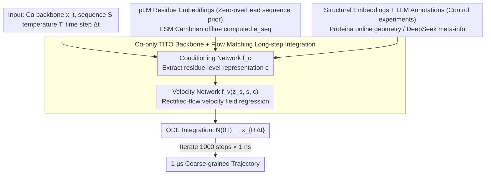

# Protein Language Model Embeddings Improve Generalization of Implicit Transfer Operators

**Conference**: ICML 2026  
**arXiv**: [2602.11216](https://arxiv.org/abs/2602.11216)  
**Code**: https://github.com/PanosAntoniadis/platito (Available)  
**Area**: Scientific Computing / Molecular Dynamics / Generative Models / Protein Representation  
**Keywords**: Protein Language Models, Implicit Transfer Operators, Flow Matching, Coarse-grained MD, Cross-system Generalization

## TL;DR
This paper integrates residue embeddings from pre-trained protein language models (pLM) directly into Transferable Implicit Transfer Operators (TITO). The resulting PLaTITO, trained on mdCATH using only 56 ms of trajectories and 1100 GPU hours, allows a coarse-grained $C_\alpha$ model with as few as 19M parameters to outperform BioEmu in equilibrium sampling of outlier systems such as fast-folding proteins.

## Background & Motivation
**Background**: Molecular Dynamics (MD) is a core tool in computational biology, requiring sampling from the Boltzmann distribution $\mu(x)\propto\exp(-\beta U(x))$ to estimate thermodynamic and kinetic observables. Classical MD is limited by femtosecond integration steps, making it nearly impossible to bridge to microsecond or second-scale relaxation times. Recent Generative MD (GenMD) follows two paths: Boltzmann Generators/Emulators (BG/BE, e.g., BioEmu) directly learn $p(x|S,T)$, while Implicit Transfer Operators (ITO/TITO) learn long-time transition densities $p(x_{t+\Delta t}|x_t,\Delta t,S,T)$.

**Limitations of Prior Work**: BG/BE requires compressing the entire monomer folding space into a neural network, necessitating massive trajectories and structural supervision to achieve cross-system generalization (BioEmu uses 31M parameters, 216 ms of trajectories, 9216 GPU hours, plus 131k AFDB structures and 502k experimental $\Delta G$ supervision). TITO leverages the temporal autocorrelation of MD to be more data-efficient, but small models focusing only on coordinates still struggle with novel sequences due to a lack of priors regarding residue identity.

**Key Challenge**: Generalization capability vs. training cost—covering the vast protein sequence space requires either massive data/parameters or an efficient inductive bias injection channel.

**Goal**: (i) Verify if the TITO framework is more data-efficient than BE; (ii) find an auxiliary conditioning signal that significantly improves outlier generalization without increasing inference-time computation; (iii) check if temperature conditioning allows the model to spontaneously learn realistic non-Arrhenius folding kinetics.

**Key Insight**: pLMs (e.g., ESM Cambrian) pre-trained on billions of unlabeled sequences have been shown to implicitly encode evolutionary, structural, stability, and even thermodynamic information within residue embeddings. This provides the "physical prior" TITO lacks, and embeddings can be pre-computed offline at near-zero cost.

**Core Idea**: Feeding pLM residue embeddings $e_{\text{seq}}=\phi_{\text{pLM}}(S)$ as a condition into the TITO transition density network allows the coarse-grained $C_\alpha$ model to "integrate dynamics guided by evolutionary priors," achieving stronger cross-protein generalization with much less trajectory data.

## Method

### Overall Architecture
PLaTITO solves the problem of training a coarse-grained MD generator that generalizes to novel proteins using minimal trajectory data. Instead of learning the Boltzmann distribution directly, it follows the Implicit Transfer Operator (ITO/TITO) route: given the current $C_\alpha$ backbone $x_t\in\mathbb{R}^{3L}$, sequence $S$, temperature $T$, and time step $\Delta t$, it learns the long-time transition density $p(x_{t+\Delta t}|x_t,\Delta t,S,T)$, which is then iteratively rolled out to form long trajectories. The core modification is the addition of three plug-and-play auxiliary embeddings (pLM sequence embeddings, structural embeddings, and LLM annotations), allowing small models to borrow evolutionary/geometric priors when protein-specific trajectories are unavailable.

The network consists of two stages: a conditioning network $f_c$ extracts residue-level condition representations $c\in\mathbb{R}^{L\times d}$ from $(x_t,\Delta t,S,T,e_{\text{seq}},e_{\text{struct}},A_{LLM})$; the velocity network $f_v(z_s,s,c)$ then predicts the velocity $v\in\mathbb{R}^{3L}$ over the flow-matching time $s\in[0,1]$. Both are Proteina-style non-equivariant Transformers using residue-pair representations as attention bias. During inference, starting from $\mathcal{N}(0,I)$, the learned velocity field is used for ODE integration to obtain $x_{t+\Delta t}$. Iterative roll-outs of 1000 steps with $\Delta t=1\,\mathrm{ns}$ produce a 1 µs trajectory.

### Key Designs

**1. Coarse-grained $C_\alpha$-only TITO backbone + Flow Matching: Trading temporal autocorrelation for data efficiency**

The BE route (e.g., BioEmu) samples $p(x|S,T)$ directly, discarding the temporal autocorrelation of MD and wasting expensive signals from trajectories. PLaTITO discards side chains, retaining only $C_\alpha$, allowing 4482 mdCATH domains to fit into a unified architecture. The time step $\Delta t$ is treated as a learnable embedding, shared with sequence and temperature, enabling one network to share parameters across multiple time scales from nanoseconds to microseconds. Training utilizes rectified-flow linear interpolation $z_s=s\,z_1+(1-s)\,z_0$ ($z_0\sim\mathcal{N}(0,I),\ z_1=x_{t+\Delta t}$), minimizing the conditional flow matching loss $\mathcal{L}(\theta)=\mathbb{E}_{x_t,x_{t+\Delta t},s,z_0}\|v^{\theta}(z_s;s,x_t,\Delta t,S,T)-(x_{t+\Delta t}-z_0)\|^2$. Sampling uses a constant velocity field $u_s=z_1-z_0$ where the ODE step is controlled by $s$ rather than physical time, converting dynamical sampling into a low-noise generative problem. This is effective because TITO extracts numerous $(x_t,x_{t+\Delta t})$ training pairs from adjacent frames, allowing a 3M-parameter model to match BE performance with equivalent data.

**2. pLM residue embeddings as zero-overhead sequence priors: Supplementing missing evolutionary/chemical info**

Coarse-grained $C_\alpha$ models see only coordinates and lack priors on residue characteristics, leading to poor generalization on new sequences. PLaTITO injects residue-level embeddings $e_{\text{seq}}\in\mathbb{R}^{L\times d_{\text{pLM}}}$ from ESM Cambrian (300M for PLaTITO, 6B for PLaTITO-19M) into the conditioning network $f_c$. Embeddings are pre-cached after a single forward pass, incurring no pLM calls during training or inference. These are fused with coordinates via attention, allowing the network to "know" which residues favor $\beta$-sheets or disordered loops before seeing any MD trajectories. pLM embeddings have been proven to hide variant stability and functional information, providing the specific prior coarse-grained models lack. By using a pluggable conditioning channel rather than replacing the backbone, PLaTITO remains lightweight, with negligible inference overhead ($\le 5\%$) while improving outlier protein MAE from 1.068 to 0.949.

**3. Structural embeddings and LLM annotations as control experiments: Locating the boundaries of useful priors**

To isolate gains from sequence, geometry, and data quality priors, the authors tested two additional auxiliary conditions. First, structural embeddings $e_{\text{struct}}=\phi_{\text{PSM}}(x_t)$ from Proteina 60M—specifically chosen as a lightweight model because it must be computed online (dependent on current $x_t$). Second, LLM annotations providing binary judgments $S_{LLM}$ and confidence $C_{LLM}$ from DeepSeek Reasoner on whether a protein simulation is "reasonable." Quality metadata (domain length, sub-cellular location, known function, missing partners) were prompted to the LLM. Results showed that sequence and geometric priors are complementary (PLaTITO+Struct slightly improved all metrics), whereas LLM annotations degraded performance, revealing that current prompt engineering cannot extract signals stronger than the model's own inductive bias from metadata.

### Loss & Training
The objective is the conditional flow matching regression loss described above. Training data comprises 4471 domains from mdCATH with $\le 200$ residues (filtered at 40% sequence similarity to avoid test set overlap), totaling ~56 ms of aggregate trajectories. Random uniform sampling across temperatures and time steps allows the model to implicitly learn temperature-dependent dynamics. Models were trained on a single A100 80GB for 1100 GPU hours. PLaTITO-19M utilizes larger ESM Cambrian 6B embeddings and a 19M-parameter backbone within the same data and compute budget.

## Key Experimental Results

### Main Results
Evaluation was performed on 12 fast-folding proteins (Lindorff-Larsen et al. 2011), with no sequence overlap with the training set. Metrics include MAE, RMSE, and Coverage relative to reference MD free energy landscapes.

| Model | MAE ↓ | RMSE ↓ | Coverage ↑ | Parameters | GPU Hours | MD Data |
|------|------|------|------|------|------|------|
| TITO (baseline) | 1.068 | 1.382 | 0.590 | 3 M | 1100 | 56 ms |
| TITO + Struct | 1.004 | 1.310 | 0.560 | 3 M | 1100 | 56 ms |
| **PLaTITO** | 0.949 | 1.228 | 0.651 | 3 M | 1100 | 56 ms |
| PLaTITO + Struct | 0.938 | 1.213 | 0.655 | 3 M | 1100 | 56 ms |
| PLaTITO + Struct + LLM | 1.066 | 1.346 | 0.570 | 3 M | 1100 | 56 ms |
| **PLaTITO-19M** | **0.824** | **1.099** | **0.666** | 19 M | 1100 | 56 ms |
| Emu (BE arch) | 1.305 | 1.639 | 0.529 | 3 M | 1100 | 56 ms |
| BioEmu | 1.110 | 1.389 | 0.594 | 31 M | 9216 | 216 ms + structures/$\Delta G$ |

PLaTITO-19M achieves a 26% lower MAE than BioEmu with ~4x less training data and 8x fewer GPU hours.

### Ablation Study

| Configuration | Key Observation |
|------|---------|
| TITO vs. Emu (Same arch/compute) | MAE 1.068 vs. 1.305; proves leveraging MD temporal autocorrelation is more data-efficient than learning Boltzmann distributions. |
| +Struct (Proteina 60M) | Consistent slight improvements; structural priors complement sequence priors but introduce online overhead. |
| +Seq (ESM Cambrian 300M) | MAE 1.068→0.949, Cov 0.590→0.651; pLM embeddings are the largest single contribution with zero test-time cost. |
| +LLM Annotations | MAE regressed to 1.066; current prompts/metadata fail to provide useful conditions and introduce noise. |
| Cambrian 300M→6B + 3M→19M | MAE dropped to 0.824; shows additive benefits of scaling both representation and model capacity. |

### Key Findings
- **pLM Embeddings as the Best Lever**: Reverting PLaTITO to TITO caused the largest performance drop (+0.119 MAE), highlighting that "cheap pre-trained priors + physical backbone" is an optimal path for GenMD.
- **Complementarity**: Sequence and structural embeddings work better together, though structural embeddings require expensive per-step re-calculation.
- **LLM Annotation Counter-example**: Performance degradation with DeepSeek stability judgments warns that LLMs cannot yet reliably translate protein context into dynamically useful inductive biases.
- **Physical Temperature Dependence**: PLaTITO-19M predicted folding time-scales across 320–440 K that deviate from Arrhenius curves, matching the "rugged landscape" of real folding dynamics (e.g., BBA, Villin).
- **Cryptic Pocket Formation**: The model sampled apo-like conformations starting from holo states on 4 cryptic pocket benchmarks, succeeding in 1 case where BioEmu failed.

## Highlights & Insights
- **"Cheap Priors + Compact Backbone > Giant E2E"**: Using ESM Cambrian embeddings as zero-overhead conditions allowed a 19M $C_\alpha$ TITO to outperform a 31M all-atom BioEmu with an order of magnitude less data; this suggests a paradigm of freezing large protein foundation models and attaching task-specific TITOs.
- **MD Autocorrelation $\neq$ Boltzmann Distribution**: The Emu vs. TITO comparison directly demonstrates that discarding temporal correlation wastes supervision signals, a fact often overlooked in BE work.
- **Rare Negative Results**: Explicitly reporting the failure of LLM annotations is a cautionary signal against "LLM-for-everything" approaches, suggesting metadata information density must be verified first.
- **Flow Matching + Multi-timestep Conditioning**: Treating $\Delta t$ as a learnable embedding allows a single network to serve multiple sampling scales, a paradigm borrowable for video diffusion or trajectory generation.

## Limitations & Future Work
- Coarse-grained $C_\alpha$ modeling ignores side chains, limiting performance on ligand specificity or allosteric regulation; all-atom expansion is necessary.
- The ITO framework lacks formal guarantees for detailed balance, Chapman-Kolmogorov consistency, or long-term stability.
- Training data is limited to monomeric mdCATH; generalization to complexes, small molecules, or extreme thermodynamic conditions is unverified.
- Dependency on external pre-training (pLM, Proteina) creates a "modular" pipeline; future end-to-end self-training designs may be needed for reusable embeddings.

## Related Work & Insights
- **vs. BioEmu (Lewis et al., 2025)**: BioEmu is a pure BE learning $p(x|S,T)$ using 31M parameters/extra structures. PLaTITO is smaller and more accurate by using TITO + pLM, but lacks BE's reweighting properties.
- **vs. TITO (Diez et al., 2026)**: While the original TITO generalized to small peptides, PLaTITO proves that injecting pLM embeddings unlocks significant extra generalization potential.
- **vs. ESMFold/AlphaFold**: Those models provide a static energy minimum; PLaTITO provides dynamic ensembles. They can be complementary: using AF for the minimum and PLaTITO for sampling the landscape.

## Rating
- Novelty: ⭐⭐⭐⭐ Systematic verification of three auxiliary conditions in ITO is novel and clearly controlled.
- Experimental Thoroughness: ⭐⭐⭐⭐⭐ Covers five models, multiple pLM families, scaling, temperature dependence, and cryptic pockets.
- Writing Quality: ⭐⭐⭐⭐ Formulas and structure are clear, though appendices are heavily referenced.
- Value: ⭐⭐⭐⭐⭐ Outperforming BioEmu with 1/8 compute and identifying the LLM annotation failure is highly influential for the GenMD community.

<!-- RELATED:START -->

## Related Papers

- [\[ICLR 2026\] Reverse Distillation: Consistently Scaling Protein Language Model Representations](../../ICLR2026/computational_biology/reverse_distillation_consistently_scaling_protein_language_model_representations.md)
- [\[ICLR 2026\] How to Make the Most of Your Masked Language Model for Protein Engineering](../../ICLR2026/computational_biology/how_to_make_the_most_of_your_masked_language_model_for_protein_engineering.md)
- [\[ICML 2026\] Cross-Chirality Generalization by Axial Vectors for Hetero-Chiral Protein-Peptide Interaction Design](cross-chirality_generalization_by_axial_vectors_for_hetero-chiral_protein-peptid.md)
- [\[ICML 2026\] Learning the Interaction Prior for Protein-Protein Interaction Prediction: A Model-Agnostic Approach](learning_the_interaction_prior_for_protein-protein_interaction_prediction_a_mode.md)
- [\[ICLR 2026\] Protein as a Second Language for LLMs](../../ICLR2026/computational_biology/protein_as_a_second_language_for_llms.md)

<!-- RELATED:END -->
