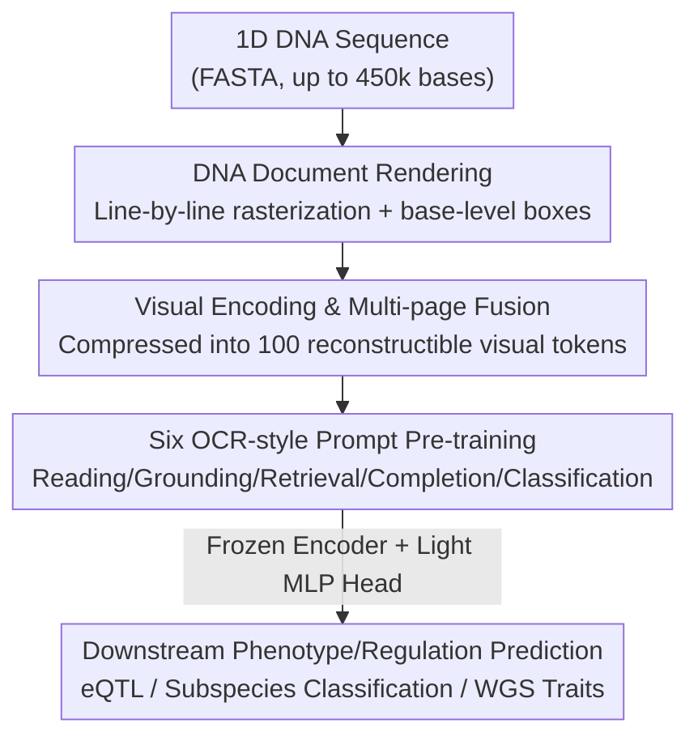

# Rethinking Genomic Modeling Through Optical Character Recognition

**Conference**: ICML 2026  
**arXiv**: [2602.02014](https://arxiv.org/abs/2602.02014)  
**Code**: See OpenReview / Project Page (Code links annotated in the paper)  
**Area**: Computational Biology / Genomic Foundation Models / Vision-Language Models  
**Keywords**: Genomic Modeling, OCR, Visual Token Compression, Long Sequences, eQTL Prediction

## TL;DR
OpticalDNA **renders 1D DNA sequences into multi-page "document images"**, which are then "read" by an OCR-style vision-language model. By compressing nucleotide content into a few reconstructible visual tokens, it outperforms genomic foundation models that are $985\times$ larger on long-sequence tasks of up to 450k bases, using approximately $20\times$ fewer effective tokens and only 256K trainable parameters.

## Background & Motivation
**Background**: Current mainstream genomic foundation models (Nucleotide Transformer, HyenaDNA, Caduceus, Evo-2, JanusDNA, etc.) almost entirely follow the Large Language Model (LLM) paradigm—treating DNA as a **1D token sequence** over the A/T/C/G alphabet and performing masked language modeling or autoregressive modeling to learn contextual representations.

**Limitations of Prior Work**: The authors point out a structural mismatch between this "sequential token-by-token reading" and genomic semantics, manifested in two ways. First is the **lack of structure-aware reading**: Genomic functional signals are sparse and discontinuous, separated by large non-informative background regions, with "jumpy" dependencies between distant sites. Sequential models inherit the "dense semantics, token-by-token reading" inductive bias of natural language, wasting significant computation scanning background instead of modeling critical functional areas. Second is the **lack of understanding-driven compression**: Genomic information density is low, making compression essential for long-sequence modeling. High-fidelity compression requires "understanding before compressing"—identifying sparse, task-relevant structures while suppressing background. Token-level LLMs allocate compute equally to background and functional regions, causing runtime and memory to explode with sequence length.

**Key Challenge**: 1D sequence representations can neither express first-class operations like genomic coordinates/intervals (interval localization and retrieval rely on implicit position embeddings) nor perform "compression after understanding," leading to simultaneous constraints on efficiency and accuracy in long contexts.

**Key Insight**: The authors made a crucial observation—**OCR-style document understanding is highly isomorphic to genomic analysis**. Operations like "grounding, retrieval, and span completion" in document OCR correspond exactly to "variant localization, subsequence retrieval, and missing interval inference" in genomics. By treating DNA as a "document" that allows **selective skipping** rather than a "sentence" that must be read verbatim, region-aware visual inductive biases can be used to handle sparse signals.

**Core Idea**: Reformulate genomic modeling as **OCR-style document understanding**—rendering 1D DNA into structured 2D multi-page images, using a vision encoder to compress nucleotide content into compact, reconstructible visual tokens, and training a document decoder to learn "layout-aware" DNA representations through six types of OCR-style prompt tasks.

## Method

### Overall Architecture
The input to OpticalDNA is a DNA sequence $S=(s_1,\dots,s_N)$ ($s_i\in\{A,C,G,T,N\}$) from a FASTA file; the output is the downstream phenotype/regulation prediction. The process follows three stages: "Rendering into document images → Visual encoding compression → Prompt-conditioned decoding." Specifically, $S$ is **rasterized line-by-line** into multi-page images $\mathcal{D}(S)$ at approximately 1800 bases per page, with pixel-level bounding boxes recorded for each base to establish a bidirectional mapping $\Phi$ between "sequence intervals ↔ pixel regions." The vision encoder $E_\theta$ processes the page images and fuses multiple pages into a fixed-length segment of visual tokens $Z\in\mathbb{R}^{L\times d}$ (where $L=100$ in the implementation). Finally, the document decoder $G_\psi$ autoregressively generates outputs for tasks under six OCR-style prompt categories. After pre-training, the **frozen encoder serves as a general representation extractor**, with a lightweight MLP head $g_\phi$ attached for downstream prediction.

### Key Designs

**1. DNA Document Rendering: Mapping Jumpy Long-range Dependencies to 2D Spatial Structures**

To address the inefficiency of sequential reading and jumpy long-range dependencies, OpticalDNA avoids feeding token sequences. Instead, it **writes out** $S$ using a fixed-width font on a fixed-resolution canvas (page $H=W=640$): left-to-right within lines and top-to-bottom across lines. The rendered content only contains A/C/G/T/N, without indices, delimiters, or coordinate markers. Sequences wrap to the next page automatically, with default `font_size=14` and `line_spacing=1.6`, yielding ~1800 bases per page. Each page includes ordered base-level annotations $\mathcal{B}^{(p)}=[b_0^{(p)},\dots]$, where each $b_k^{(p)}=(c_k^{(p)},g_k^{(p)},\mathbf{r}_k^{(p)})$ records the character, its **global index** $g_k$ in $S$, and its pixel box $\mathbf{r}_k=(x_1,y_1,x_2,y_2)$. This establishes an interval-to-region mapping $\Phi:(i,j)\mapsto b_{ij}$ (where the box includes $[img\_id,x_1,y_1,x_2,y_2]$). Interval-level operations like "extracting a DNA segment by coordinates" or "localizing an interval" become explicit geometric objects for supervision on images, rather than relying on implicit position embeddings. Controlled experiments show that 2D CNN backbones achieve a superior accuracy-efficiency trade-off on eQTL compared to 1D CNNs, suggesting that the 2D layout itself provides better inductive bias.

**2. Six OCR-style Prompt Tasks: Aligning Genomic Primitives to Document Understanding Primitives**

Images alone are insufficient; the model must learn to "understand" them. The authors decompose genomic understanding into four core primitives—reading, grounding, retrieval, and completion—instantiated into six prompt families T1–T6. Each training sample is a **two-turn multimodal conversation** $\mathcal{C}=[m^{(u)},m^{(a)}]$, where the user turn provides page images and a task prompt, and the assistant turn provides the target. Tasks include: T1 Freestyle DNA transcription (pure OCR), T2 Transcription + Spatial grounding (output sequence-box pairs), T3 ROI-based transcription, T4 ROI-based masked interval completion, T5 Query-driven subsequence grounding (returning all hit boxes), and T6 Chromosome-level document classification. Each task has a formalized supervision space (e.g., $\mathcal{Y}_2=(\Sigma^*\times\mathbb{B})^*$ for variable-length "DNA string + box" pairs, $\Sigma=\{A,C,G,T,N\}$). The elegance of this design lies in the natural correspondence: grounding ↔ variant localization, retrieval ↔ subsequence search, and completion ↔ missing interval inference. OCR primitives align with real genomic workflows, ensuring that prompt supervision learns **region-level interpretable and base-level understandable** representations.

**3. Visual Encoder + Document Decoder: Compressing Bases into Compact, Reconstructible Visual Tokens**

To achieve "understanding-driven compression," the encoder must compress aggressively while remaining reconstructible. OpticalDNA reuses the SAM–Conv–CLIP-L visual frontend from DeepSeek-OCR: each page is split into $16\times16$ patches, followed by a fixed $16\times$ downsampling along the token axis in the Conv stage. A projector $\Pi_\theta$ aligns the tokens to the decoder width, resulting in per-page tokens $\tilde{U}\in\mathbb{R}^{P\times T\times d}$ (where $T=T_0/16$). Since DNA can span multiple pages, a multi-page fusion module $\mathcal{F}_\theta$ (single-layer, 20-head self-attention + mean reduction across the page dimension) aggregates them into a fixed-length document representation $Z=\mathcal{F}_\theta(\tilde{U})\in\mathbb{R}^{L\times d}$ with $L=100$. The document decoder $G_\psi$ is a DeepSeek-3B MoE (570M active parameters). Prompts include an `<image>` placeholder and `NUM_IMAGES=P` metadata, and the model autoregressively generates outputs conditioned on $Z$ and task prompt $q$: $P_\psi(\hat Y\mid Z,q)=\prod_t P_\psi(\hat y_t\mid \hat y_{<t},Z,q)$. This "nucleotide → visual token" path reduces the effective token count by ~20$\times$ compared to base/$k$-mer tokenization while ensuring compression is **reconstructible without losing fine-grained information** via transcription and completion supervision (T1/T3/T4).

### Loss & Training
Pre-training uses a unified prompt-conditioned generation objective. Given prompt $q$ and fused visual tokens $Z$, a teacher-forcing autoregressive loss is applied only on the assistant's response spans:

$$\mathcal{L}_{\mathrm{pt}}=-\sum_{t=1}^{T}\log P_\psi\!\left(y_t\mid y_{<t},Z,q\right).$$

Task indices are sampled from a distribution $t\sim\mathrm{Cat}(\boldsymbol\pi)$ to balance T1–T6. Robustness is enhanced for region-dependent tasks (T2/T3/T5) through tail truncation, randomizing line/block spans, and random query lengths for T5. Parameter settings: The SAM–Conv–CLIP-L visual frontend is frozen, decoder $G_\psi$ is fine-tuned with LoRA, multi-page fusion $\mathcal{F}_\theta$ undergoes full parameter updates, and projector $\Pi_\theta$ uses LoRA or full parameters depending on the setting. Training was conducted on HG38 using a two-stage schedule (Stage 1: ~8 days for $\mathcal{F}_\theta$+LoRA; Stage 2: ~3 days for $\Pi_\theta$) on 8×H100 GPUs.

## Key Experimental Results

### Main Results
OpticalDNA was evaluated on three long-sequence benchmarks: DNALONGBENCH (eQTL, up to 450k bases), RiceSubBench (subspecies cross-distribution generalization), and RiceWGPB (~400M base whole-genome trait prediction). The table below shows the average AUROC across nine GTEx tissues in DNALONGBENCH:

| Model | Trainable Params | Avg AUROC | Relative to Ours |
|------|-----------|-----------|----------|
| HyenaDNA | 1.6M | 0.514 | −65.8% (Relative) |
| Caduceus-Ph | 7.7M | 0.750 | OpticalDNA +13.6% |
| NT-v2-500M* | 1.03K | 0.772 | +10.4% |
| GENERator-1.2B* | 10.24K | 0.782 | +9.0% |
| JanusDNA (w/o mid-Attn) | 7.66M | 0.791 | +7.7% |
| Expert: Enformer | 252M (active) | 0.681 | — |
| **OpticalDNA (Linear Probe)** | **256K** | **0.852** | SOTA |
| **OpticalDNA (MLP)** | **1.3M–2.3M** | **0.867** | Best in 5/9 tissues |

Using only a 256K linear probe, OpticalDNA achieved an average AUROC of 0.852, outperforming JanusDNA while using ~30$\times$ fewer trainable parameters. With a lightweight MLP head, it reached 0.867, significantly leading in WB (0.927 vs 0.821) and Thyroid (0.876 vs 0.793). Compared to Enformer (252M active parameters), OpticalDNA won with up to $985\times$ fewer active parameters.

Subspecies generalization (RiceSubBench, Accuracy/AUROC):

| Model | Params | In-Domain japonica | Far-OOD glaberrima |
|------|------|--------------------|--------------------|
| Evo-2 | 7B | 0.486 / 0.700 | 0.489 / 0.705 |
| LucaOne | 1.8B | 0.510 / 0.703 | 0.526 / 0.736 |
| **OpticalDNA** | **409M** | **0.590 / 0.739** | **0.599 / 0.731** |

OpticalDNA achieved the best accuracy across all splits, with increasing advantages as the distribution shift intensified (rufipogon +8.49%, barthii +9.35%, glaberrima +13.88%). In RiceWGPB (~400M bases), it recorded the lowest RMSE for TGW (2.952) and LRI (9.531). For a representative genome of 389.8M bases, it reduced inference time from 5h40m (Evo-2) and 32.5m (LucaOne) to **12.3 minutes**.

### Ablation Study
OpticalDNA was compared against its backbone, DeepSeek-OCR, using the same protocol:

| Configuration | Key Metrics | Description |
|------|---------|------|
| DeepSeek-OCR Backbone | eQTL AUROC Baseline | General OCR model applied directly to downstream tasks |
| **OpticalDNA (Q1 Downstream)** | Avg **+5.37%** Gain | DNA-specific documentation + pre-training; gains in all 9 tissues, strongest in Thyroid (+16.86%) and SNSES (+14.30%). |
| DeepSeek-OCR (Q2 Transcr.) | EM ≈ 0 (throughout) | General OCR fails to transcribe DNA accurately |
| **OpticalDNA (Q2 Transcr.)** | EM 79.6/74.9 (Full), CS 90.6–100.0 | Near-perfect short prefix transcription on HG38/rice (10% prefix EM 97.3/98.5). |

### Key Findings
- Rendering genomes as documents + OCR-style pre-training provides more than just architectural novelty: Downstream eQTL AUROC improved by +5.37% on average, with the largest gains in difficult tissues (Thyroid, SNSES), indicating that region-aware representations significantly benefit weak-signal scenarios.
- Reconstructability is the prerequisite for effective compression: While the general DeepSeek-OCR had nearly zero DNA transcription Exact Match (EM), OpticalDNA maintained 90%+ character similarity even under severe tail truncation, proving its 100 visual tokens truly compress without loss.
- Extreme parameter/token efficiency: Outperforms 7B-scale multi-species foundation models using 256K trainable parameters and ~20$\times$ fewer effective tokens, reducing long genome inference from hours to minutes—a true scale advantage for deployment.

## Highlights & Insights
- **Paradigm-level reframing**: The first work to treat genomic modeling as OCR-style document understanding. The "aha" moment lies in realizing that document primitives (grounding/retrieval/completion) align perfectly with genomic primitives (variant localization/subsequence search/missing span inference), enabling the direct use of mature OCR models and supervision formats.
- **Reconstructible visual tokens are the key to compression**: By forcing the encoder to learn "reconstructible" compression through transcription and completion tasks (T1/T3/T4), it avoids the trap of information loss common in general token compression. This approach is transferable to any "low-information density long-sequence" task (e.g., proteins, time-series, logs).
- **Coordinates as first-class citizens**: Explicitly mapping sequence intervals to pixel boxes transforms interval localization/retrieval from "implicit position encoding" into "supervisable geometric outputs," providing a natural interface for the numerous region-based operations in genomic analysis.

## Limitations & Future Work
- Rendering configurations (approx. 1800 bases per page, fixed font/spacing) are empirical. The paper notes transcription degradation near full page capacity, suggesting "page density" is an under-explored hyperparameter; excessive density may damage precision.
- Training costs remain significant: ~11 days on 8×H100 for HG38 two-stage training. While inference is efficient, the pre-training entry barrier is higher than for lightweight sequential models.
- Evaluation focused on eQTL, subspecies classification, and WGS traits; finer-grained tasks like regulatory element annotation or mutation effect prediction remain to be covered. Robustness of OCR rendering to sequences with many `N` (unknown bases) or repetitive regions requires further validation.
- Whether visualization is superior to sequence modeling for all genomic semantics remains an open question—this work primarily demonstrates advantages in long-context scenarios, with less discussion on relative gains for short-sequence tasks.

## Related Work & Insights
- **vs. Sequential Genomic Foundation Models (NT, HyenaDNA, Caduceus, JanusDNA, Evo-2)**: These models treat DNA as a flat token stream where coordinates and interval operations are implicitly encoded. OpticalDNA treats the genome as a coordinate-indexed object, elevating interval localization/retrieval/regional reasoning to first-class primitives, while winning with far fewer parameters and tokens.
- **vs. OCR / Document Understanding Models (Donut, Nougat, DeepSeek-OCR)**: These models designed for natural documents had never been applied to genomics. This paper bridges OCR and genomic modeling for the first time, designing six DNA-specific prompt tasks and multi-page fusion to transform a general OCR backbone into a DNA representation extractor (general DeepSeek-OCR fails at DNA transcription, highlighting the necessity of specialized pre-training).

## Rating
- Novelty: ⭐⭐⭐⭐⭐ Paradigm innovation in reframing genomic modeling as OCR document understanding with primitive-level alignment.
- Experimental Thoroughness: ⭐⭐⭐⭐⭐ Three long-sequence benchmarks + strong baselines (including 7B scale) + dual ablation on transcription/downstream + contamination analysis.
- Writing Quality: ⭐⭐⭐⭐ Clear motivation and methodology, though some key configurations are relegated to the appendix.
- Value: ⭐⭐⭐⭐⭐ Extreme parameter/token efficiency + practical inference for long genomes, providing a new transferable approach for long-sequence modeling.

<!-- RELATED:START -->

## Related Papers

- [\[AAAI 2026\] MergeDNA: Context-aware Genome Modeling with Dynamic Tokenization through Token Merging](../../AAAI2026/computational_biology/mergedna_context-aware_genome_modeling_with_dynamic_tokenization_through_token_m.md)
- [\[AAAI 2026\] Efficient Chromosome Parallelization for Precision Medicine Genomic Workflows](../../AAAI2026/computational_biology/efficient_chromosome_parallelization_for_precision_medicine_genomic_workflows.md)
- [\[ICML 2026\] Learning Protein Structure-Function Relationships through Knowledge-guided Representation Decomposition](learning_protein_structure-function_relationships_through_knowledge-guided_repre.md)
- [\[ICML 2025\] ExLM: Rethinking the Impact of \[MASK\] Tokens in Masked Language Models](../../ICML2025/computational_biology/exlm_rethinking_the_impact_of_mask_tokens_in_masked_language_models.md)
- [\[ICML 2026\] Protein Autoregressive Modeling via Multiscale Structure Generation](protein_autoregressive_modeling_via_multiscale_structure_generation.md)

<!-- RELATED:END -->
