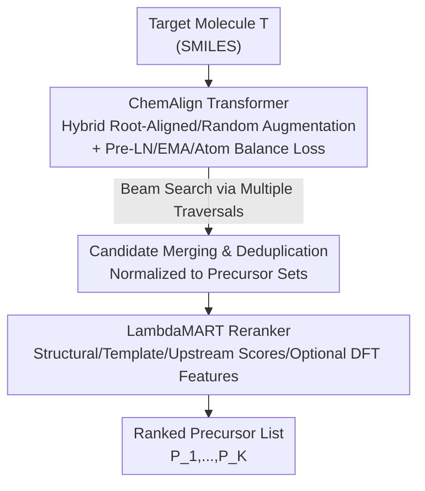

# RETROSPECT: RETROsynthesis via Sequential Prediction, and Chemically Transformed-ranking

**Conference**: ICML2026  
**arXiv**: [2606.07181](https://arxiv.org/abs/2606.07181)  
**Code**: To be confirmed  
**Area**: Computational Biology / Computational Chemistry / Retrosynthesis Prediction  
**Keywords**: Single-step Retrosynthesis, SMILES Augmentation, Transformer Generator, LambdaMART Reranking, USPTO-50K

## TL;DR
Single-step retrosynthesis is decomposed into two independent modules: "proposal" and "selection." A single ChemAlign Transformer, optimized through enhanced training, generates candidate precursors. Subsequently, LambdaMART performs Learning to Rank (LTR) on the merged and deduplicated candidate pool. On the USPTO-50K dataset, the single-model top-1 accuracy reaches 55.00%, increasing to 59.4% after reranking, while honestly attributing the reranking gains to specific feature sets.

## Background & Motivation

**Background**: Retrosynthesis addresses the question "Which precursor molecules can synthesize the target molecule?" It is a core component of computer-aided synthesis planning, where single-step models are repeatedly invoked by multi-step search algorithms. A high-quality single-step model must simultaneously satisfy two requirements: **placing correct bond disconnections at the top of the candidate list** and **providing a sufficiently diverse candidate list** to allow fallback options for chemists or planners when preferred routes are unavailable or unsafe. Dominant methods include template-based (classification/retrieval) and template-free (direct SMILES or graph generation) approaches.

**Limitations of Prior Work**: Many systems **bundle "candidate proposal" and "candidate ranking" into a single stage**. Whether using template-based methods or seq2seq generators, the output is a pre-ranked list. However, the mechanism for enumerating reasonable disconnections differs from the mechanism for determining their relative order. This bundling prevents clear answers to two questions: How well can a meticulously trained **single-model** Transformer proposer perform independently? And which **feature groups** truly improve ranking once the candidate pool exists?

**Key Challenge**: Current SOTA performance (e.g., RetroChimera) relies on **ensembling multiple complementary proposal models + LTR**. Such ensembles mix the strengths of the proposers with the contributions of the ranker, making scientific attribution difficult and engineering reuse of individual components challenging.

**Goal**: (1) Develop an optimized **single-model** proposer without relying on ensembles to determine its upper performance bound; (2) Conduct independent LTR research on the candidate pool to clarify the sources of reranking signals; (3) Provide a **modular, interpretable retrosynthesis framework** that can serve as a plug-and-play component for ensemble systems.

**Key Insight**: The authors intentionally design the proposer as a single model rather than an ensemble to decouple "proposal" from "selection," allowing for separate investigation and ablation of each.

**Core Idea**: Proposal-selection decoupling—a powerful single-model ChemAlign Transformer generates a diverse candidate pool, while a LambdaMART reranker reorders the pool. The two modules complement rather than replace each other.

## Method

### Overall Architecture
RETROSPECT takes a target molecule $T$ and outputs a ranked list of precursor sets $P_1, \dots, P_K$. The pipeline follows a two-stage process: the **Generator** produces candidates using multiple SMILES traversals $\rightarrow$ candidates are **merged and deduplicated** into a proposal pool $\rightarrow$ the **listwise reranker** reorders the pool. Each module has a specific role: the generator determines whether a reasonable candidate enters the pool, while the reranker determines how candidates within the pool are ordered.

### Key Designs

**1. ChemAlign Transformer: Maximizing Single-Model Proposal via Hybrid SMILES Augmentation and Enhanced Optimization**

A major challenge in seq2seq retrosynthesis is the large edit distance between source (product) and target (precursor) SMILES, which complicates alignment learning. The generator uses a standard 6-layer encoder/decoder Transformer (based on Augmented Transformer) with 512 hidden dimensions, 8 heads, and a 2048 FFN, but introduces three chemical enhancements. The most critical is **hybrid SMILES augmentation**: 40,008 training reactions are augmented 20-fold offline. **16 copies use root-aligned SMILES**, where both product and precursor traversals start from corresponding atoms to minimize edit distance. **4 copies use random SMILES** to maintain traversal invariance. Randomly augmented multi-component precursors are sorted by canonical fragments to reduce output variance, while root-aligned versions maintain alignment order. Ablation shows root-aligned augmentation is the dominant design, improving top-1 accuracy by **9.23 percentage points** in a 15K reaction subset. Additional optimization techniques include **Pre-LayerNorm** (stable optimization), **three-way weight tying** (shared encoder/decoder embeddings and output projection), and **EMA weights** (decay 0.999 for inference), which collectively contribute another **1.54 percentage points**.

**2. Differentiable Atom Balance Auxiliary Loss: Soft-Constraining "Mass Conservation"**

Precursors generated for retrosynthesis should satisfy atom conservation with the product. Since this hard constraint is non-differentiable, the authors design a **differentiable atom balance auxiliary loss**. Let $z_t$ be the decoder logits at position $t$ and matrix $A$ map each token to its count for 12 elements. The **expected element count** under softmax is $\hat{a}=\sum_t \mathrm{softmax}(z_t)A$. An L1 penalty (coefficient 0.1) is applied to the deviation between $\hat{a}$ and the ground truth element proportions. This serves as a soft push to steer the model away from mass-imbalanced outputs while remaining differentiable, reducing conservation violations while maintaining a 99.86% top-1 validity rate.

**3. LambdaMART Candidate Pool Reranking: Listwise Learning on Existing Pools**

The reranker employs **XGBoost LambdaMART** with a listwise `rank:ndcg` objective. The candidate pool is formed by running beam search on the generator across multiple product traversals and deduplicating the results (averaging ~**111 candidates** per product). For each "target-candidate" pair, four feature blocks are calculated: **structural descriptors** (pharmacophore counts, functional group indicators, atom count differences, Morgan/MACCS similarity), **reaction template descriptors** (template extractability, multi-radius hash identifiers, and **frozen training set** template frequency statistics), **upstream proposal scores**, and **optional DFT-derived features** (HOMO/LUMO gaps, dipole, hardness/softness, etc.). Reranking is trained groupwise per product; training labels use graded relevance—exact matches receive the highest gain, while partial fragment overlaps receive weaker positive labels. A critical engineering detail is that **all frequency-based statistics are frozen on the training set** before application to validation/test sets to prevent data leakage.

### Mechanism: Candidate Pool Flow
Given a product, the generator produces numerous precursor hypotheses across ~111 candidates using traversal diversity. These hypotheses are normalized into uniform precursor set representations and merged. If the same precursor set is proposed multiple times, only one entry is kept, retaining its origin information and its **best upstream score**. LambdaMART then reorders this group using its four feature categories. This step elevates top-1 accuracy from 55.00% to 59.4% and top-10 from 86.18% to 93.06%, with an MRR of 0.7171, demonstrating that re-selection provides independent gains even with a strong proposer.

### Loss & Training
The generator is trained using token-normalized cross-entropy (without label smoothing) plus the atom balance L1 auxiliary loss. Optimization uses Adam ($\beta_1=0.9, \beta_2=0.998, \epsilon=10^{-9}$) with a Noam scheduler (factor 2.0, 8000 warmup). Batches are packed to 16,384 tokens with 2-step gradient accumulation and AMP mixed precision. Validation occurs every 2000 steps, with the best EMA checkpoint found at 20,000 steps. The reranker uses XGBoost LambdaMART with `rank:ndcg` and graded relevance labels.

## Key Experimental Results

### Main Results
Standard USPTO-50K split (40,008 train / 5,000 val / 5,007 test) with reaction classes unknown at test time. Reported as top-$k$ exact match accuracy after normalization. The table compares the single-model proposer and reranked RETROSPECT against representative SOTA (TB: Template-based, ST: Semi-template, TF: Template-free):

| Type | Method | Top-1 | Top-3 | Top-5 | Top-10 |
|------|------|-------|-------|-------|--------|
| TB | LocalRetro | 53.4 | 77.5 | 85.9 | 92.4 |
| TF | R-SMILES | 56.3 | 79.2 | 86.2 | 91.0 |
| TF | RetroChimera (Ensemble) | 59.6 | 82.8 | 89.2 | 94.2 |
| TF | Retro SynFlow | 60.0 | 77.9 | 82.7 | 85.3 |
| TF | EditRetro | 60.8 | 80.6 | 86.0 | 90.3 |
| Ours | ChemAlign Transformer (Generator Only) | 55.00 | 76.13 | 81.33 | 86.18 |
| Ours | RETROSPECT (Structural Reranking) | **59.4** | 82.02 | 87.51 | 93.06 |

The single-model generator (55.00% top-1) outperforms multiple baselines. After reranking, RETROSPECT achieves 59.4% top-1 and 93.06% top-10, approaching the ensemble system RetroChimera while using only one proposal model. The authors argue that the components are competitive and serve as effective plug-and-play modules for larger systems.

### Ablation Study

| Configuration | Effect | Description |
|------|------|------|
| Full Generator | top-1 55.00 / top-10 86.18 / Validity 99.86% | Baseline configuration |
| − Hybrid Root-Aligned SMILES | top-1 ↓9.23pp | Root-aligned augmentation is the primary design driver |
| − Pre-LN/EMA/Atom Balance | top-1 ↓1.54pp | Combined contribution of optimization and regularization |
| Reranking: Structural Features | top-1 55.00→59.4 / top-10 →93.06 / MRR 0.7171 | LambdaMART gain on ~111 candidate pool |
| Reranking: + DFT / Rxn-Center DFT | <1pp, inconsistent | DFT feature gains are marginal and unstable |

### Key Findings
- **Stronger proposals do not eliminate the value of selection**: Even with a powerful generator, reranking improves top-1 by 4.4pp and top-10 by ~6.9pp. Proposal determines pool entry, while ranking uses auxiliary signals to reorder.
- **Reranking signals primarily stem from upstream scores and template priors**: Upstream scores are the strongest single feature, followed by template frequency/ID features. This suggests focusing on better candidate scoring and training set statistics rather than complex DFT stacks.
- **DFT features are exploratory, not core**: DFT and reaction-center DFT show minor improvements in high-$k$ metrics but are inconsistent across settings.
- **Honest attribution is the core scientific contribution**: The authors emphasize that end-to-end single-model accuracy and pool-based ranking quality address related but distinct questions.

## Highlights & Insights
- **Decoupled Experimental Design**: By using a single model rather than an ensemble, the authors clarify the sources of improvement for proposal and selection independently.
- **Leverage of Root-Aligned Augmentation**: A single design choice yielded a 9.23pp top-1 gain, quantifying the importance of reducing source-target SMILES edit distance.
- **Differentiable Atom Balance Loss**: A reusable trick for injecting domain knowledge (conservation laws) into cross-entropy training for sequence generation.
- **Frozen Frequency Statistics**: Highlights a critical engineering discipline—freezing training set statistics before evaluation to prevent data leakage in ranking systems.
- **Plug-and-play Positioning**: Explicitly positions the ChemAlign Transformer as a high-quality candidate source for ensemble systems.

## Limitations & Future Work
- **Evaluation limited to USPTO-50K**: A standard but relatively small benchmark with patent bias. If the correct precursor is not in the pool, reranking cannot recover it.
- **Exact Match Bias**: The metric rewards replicating patent records even if other chemically plausible disconnections exist.
- **Insufficient DFT Validation**: Gains from DFT features remain marginal and require more systematic verification.
- **Inconsistent Benchmarks**: End-to-end test results and reranking pool results use different scales, requiring careful interpretation.

## Related Work & Insights
- **vs. RetroChimera (Ensemble + LTR)**: RetroChimera uses an ensemble of models; this work achieves similar performance with a single model by decoupling and optimizing the proposal-selection components.
- **vs. R-SMILES / Augmented Transformer (Template-free seq2seq)**: This work improves upon the Augmented Transformer baseline through hybrid root-alignment and atom balance loss.
- **vs. LocalRetro / GLN (Template-based)**: While template-based methods are interpretable, their proposal mechanism is limited by the template library. This work uses a template-free generator but reintroduces template priors as ranking signals.
- **vs. Retro-Rank-In (Inorganic Retrosynthesis Ranking)**: Similar to "candidate ranking" concepts but applied to USPTO-50K organic reactions using listwise LambdaMART.

## Rating
- Novelty: ⭐⭐⭐⭐ The proposal–selection decoupling is well-executed with clear scientific attribution and effective combined losses.
- Experimental Thoroughness: ⭐⭐⭐⭐ Generator and reranker are ablated separately, though limited to the USPTO-50K benchmark.
- Writing Quality: ⭐⭐⭐⭐⭐ Excellent clarity in distinguishing benchmarks and attributing gains.
- Value: ⭐⭐⭐⭐ Provides a strong single-model proposer and actionable insights for reranking systems.

<!-- RELATED:START -->

## Related Papers

- [\[ICML 2026\] Transformed Latent Variable Multi-Output Gaussian Processes](transformed_latent_variable_multi-output_gaussian_processes.md)
- [\[ICML 2026\] Constrained Flow Optimization via Sequential Fine-Tuning for Molecular Design](constrained_flow_optimization_via_sequential_fine_tuning_for_molecular_design.md)
- [\[ICML 2025\] Scalable Equilibrium Sampling with Sequential Boltzmann Generators](../../ICML2025/computational_biology/scalable_equilibrium_sampling_with_sequential_boltzmann_generators.md)
- [\[ICML 2026\] Flexible Kernels for Protein Property Prediction](flexible_kernels_for_protein_property_prediction.md)
- [\[NeurIPS 2025\] Retrosynthesis Planning via Worst-path Policy Optimisation in Tree-structured MDPs](../../NeurIPS2025/computational_biology/retrosynthesis_planning_via_worst-path_policy_optimisation_in_tree-structured_md.md)

<!-- RELATED:END -->
