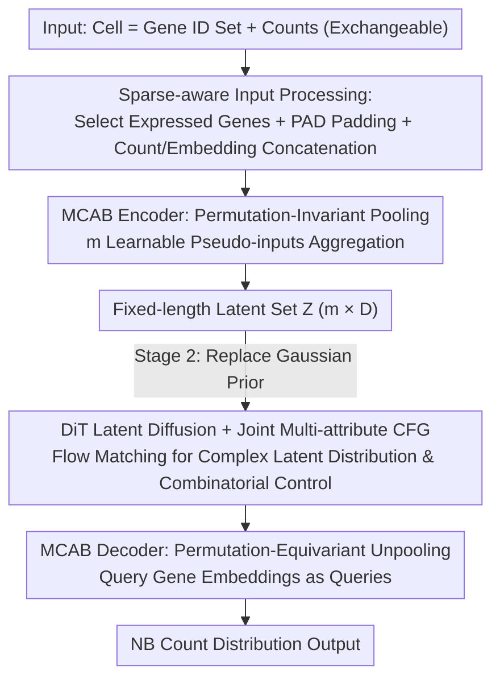

# Scalable Single-Cell Gene Expression Generation with Latent Diffusion Models

**Conference**: ICML 2026  
**arXiv**: [2511.02986](https://arxiv.org/abs/2511.02986)  
**Code**: https://github.com/czi-ai/scldm (Available)  
**Area**: Computational Biology / Single-cell Transcriptomics / Latent Diffusion Models / Transformer VAE  
**Keywords**: Single-cell RNA-seq, exchangeability, multi-head cross-attention, latent diffusion, flow matching, multi-conditional CFG

## TL;DR
scLDM utilizes a unified Multi-head Cross-Attention Block (MCAB) to encode exchangeable gene expression data into sets of fixed-length, permutation-invariant latent variables. By replacing Gaussian priors with DiT + Flow Matching + joint multi-attribute classifier-free guidance, it significantly outperforms scVI, scDiffusion, and CFGen in reconstruction, (un/conditional) generation, and perturbation response prediction tasks across multiple scRNA-seq datasets.

## Background & Motivation

**Background**: Single-cell RNA-seq allows for the simultaneous measurement of expressions for tens of thousands of genes across millions of cells, facilitating research into cell differentiation, disease progression, and drug perturbations. Mainstream generative modeling approaches include: (i) VAE-based (scVI / scVAEDer), (ii) GAN-based (scGAN), (iii) Diffusion-based (scDiffusion), and recent latent diffusion + flow matching methods such as CFGen.

**Limitations of Prior Work**:

- Almost all existing methods treat gene expression as "fixed-order vectors"—rigidly binding the $i$-th dimension to gene $g_i$, setting the input dimension equal to the gene vocabulary size. This requires pre-selecting a "Highly Variable Gene" (HVG) subset; cross-tissue or cross-species applications necessitate retraining or surgical weight replacement.
- This "position-based encoding" contradicts biological reality: gene expression constitutes an **exchangeable set**, where the ordering is arbitrary.
- GAN routes suffer from inherent training instability and mode collapse; pure MLP-based autoencoders have limited capacity, leading to rapidly diminishing returns when scaling.
- Over 70% of scRNA-seq data consists of zeros (dropout). Feeding all zeros into a Transformer is computationally wasteful and dilutes signals.

**Key Challenge**: To simultaneously achieve (a) a truly exchangeable probabilistic model, (b) a transformer architecture scalable to large vocabularies/contexts, (c) precise modeling of count data (NB distribution), and (d) support for multi-attribute controllable generation. Existing methods typically only satisfy one or two of these requirements.

**Goal**:

1. Design a **permutation-invariant (encoding) + permutation-equivariant (decoding) transformer-based VAE** where the number of latent variables is fixed and decoupled from the number of input genes.
2. Train an LDM using **DiT + linear interpolation + flow matching** in the latent space to replace simple Gaussian priors, supporting joint multi-attribute CFG.
3. Comprehensively validate the model on reconstruction, unconditional generation, conditional generation, perturbation response prediction, and downstream classification tasks.

**Key Insight**: The authors noted that SetTransformer and Perceiver IO already provide tools to pool variable-length inputs into fixed-length token sets using learnable pseudo-inputs. By replacing pseudo-inputs with gene embeddings, one can simultaneously achieve (i) permutation-invariant pooling on the encoder side and (ii) permutation-equivariant unpooling on the decoder side—**reusing the same block** to bypass the separate pool/unpool architectures of SetTransformer (PMA + ISAB).

**Core Idea**: A **unified Multi-head Cross-Attention Block (MCAB)** serves as both the "permutation-invariant pooling" for the encoder and "permutation-equivariant unpooling" for the decoder. By running DiT-based latent diffusion on a fixed-size latent space, the model becomes naturally invariant to gene order, scalable to vocabulary size, precise in count distribution modeling, and capable of multi-conditional controllable generation.

## Method

### Overall Architecture

The core problem scLDM addresses is that gene expression is inherently an exchangeable set where order is irrelevant, yet mainstream models treat it as a fixed-order vector. The proposed solution represents each cell as a "set of gene IDs + corresponding counts" $(\mathbf{x}_{\mathcal{I}}, \mathcal{I})$. A permutation-invariant transformer-VAE compresses this into a fixed-length set of latent variables decoupled from the gene count. Subsequently, DiT diffusion is applied in this clean latent space for controllable generation. Training occurs in two stages: Stage 1 learns the VAE (encoding NB count likelihood), and Stage 2 freezes the VAE to train a flow-matching diffusion model in the latent space, replacing the naive Gaussian prior. During sampling, the diffusion model generates latent variables, which are then decoded by the VAE to produce counts.

### Key Designs

**1. Unified MCAB: Achieving Invariance and Equivariance in One Block**

The challenge of exchangeable set modeling lies in the duality: encoding should be "invariant to shuffled gene order" (permutation invariance), while decoding should be "equivariant to shuffled query genes" (permutation equivariance). Traditional solutions like SetTransformer use separate PMA (pooling) and ISAB (unpooling) blocks, leading to inconsistent inductive biases. scLDM observes that both symmetries can be expressed by the same multi-head cross-attention block, differing only in the query. It defines $\mathrm{MCAB}_{\mathbf{S}}(\mathbf{X}) = F(\mathbf{X},\mathbf{S}) + \mathrm{MLP}(\mathrm{LN}(F(\mathbf{X},\mathbf{S})))$, where $F$ performs cross-attention with $\mathbf{S}$ as queries and the input set $\mathbf{X}$ as keys/values.

For the encoder, $\mathbf{S}$ consists of $m$ **gene-ID-independent** learnable pseudo-inputs: any permutation of $\mathbf{X}$ leaves $\mathbf{S}$ and the attention aggregation unchanged, making latent variables $\mathbf{Z}$ (fixed $m \times D$) naturally permutation-invariant. For the decoder, replacing $\mathbf{S}$ with query gene embeddings $\mathbf{E}_{\mathcal{I}}$ means a permutation of $\mathcal{I}$ is equivalent to a row permutation of $\mathbf{S}$, resulting in an equivalently permuted output (permutation equivariance). An additional benefit is that the latent space size $m$ is entirely decoupled from the gene vocabulary—the latter enters the model only via the embedding matrix $\mathbf{E}$. Transferring across tissues or species requires only extending $\mathbf{E}$ without modifying the core network.

**2. Sparse-aware Input Processing: Transformer focus on "Signals"**

With over 70% of scRNA-seq data being zero dropouts, feeding tens of thousands of dimensions into a transformer wastes $O(D^2)$ computation and dilutes effective signals. scLDM performs sparse cropping $G(\mathbf{x},\mathcal{I})$ at the encoder input: it selects the set of expressed genes $\mathcal{J} = \{i : x_i > 0\}$, and if $|\mathcal{J}|$ is less than the target length $d$, it pads with a PAD token (count 0, index PAD). The final input is $\mathrm{Out} = \{(x_i, i)\}_{i \in \mathcal{J}} \cup \{(0, \mathrm{PAD})\}^{d - |\mathcal{J}|}$. Counts and gene embeddings are then concatenated: $\mathrm{Emb}(\bar{\mathbf{x}}_{\mathcal{J}}, \mathcal{J}) = \mathrm{Linear}(\mathrm{repeat}_d(\bar{\mathbf{x}}_{\mathcal{J}}) \,\Vert\, \mathbf{E}_{\mathcal{J}})$.

Critically, this is only **context cropping on the encoding side** and does not weaken the model's ability to express structural zeros: the decoder still outputs NB distribution parameters for the full $\mathcal{I}$. Since NB naturally places high probability mass at 0, cropped zeros are recovered during decoding (confirmed by $R^2$ Zeros experiments in Tables 15 and 17). This concentrates computation on signal-carrying genes—a purely beneficial optimization.

**3. DiT Latent Diffusion + Joint Multi-attribute CFG: Strong Priors and Combinatorial Generation**

The true aggregated posterior of a trained VAE is far more complex than a standard Gaussian $\mathcal{N}(0, I)$. Sampling directly from a Gaussian prior leads to "prior-posterior mismatch," collapsing generation quality (Tomczak 2024). scLDM treats the $m$ latent tokens as a DiT input sequence and uses linear interpolation + flow matching to train a velocity field $v_{t,\epsilon}(\mathbf{Z}; y)$ to approximate this complex latent distribution, effectively replacing the naive Gaussian prior with a learned strong prior.

For multi-attribute controllable generation, attribute vectors $\mathbf{y} \in \{0,1\}^J$ (cell type / perturbation / batch, etc.) are treated **entirely** as a single condition for joint CFG: $\tilde{v}_{t,\epsilon}(\mathbf{Z}, y) = v_{t,\epsilon}(\mathbf{Z}; \mathrm{Null}) + \omega [v_{t,\epsilon}(\mathbf{Z}; y) - v_{t,\epsilon}(\mathbf{Z}; \mathrm{Null})]$. This differs from the additive decomposition $\sum_j \omega_j [v(\mathbf{Z}; y_j) - v(\mathbf{Z}; \mathrm{Null})]$ used in CFGen. Additive CFG implicitly assumes mutually exclusive one-hot attributes ($\sum_j y_j = 1$), failing to express combinations like "perturbation A + cell type B." Joint CFG encodes combinations into the same condition embedding, capturing attribute interactions crucial for perturbation benchmarks.

### Loss & Training

- **Stage 1**: $\beta$-VAE ELBO: $\mathcal{L} = \mathbb{E}_q[\ln p(\mathbf{x}_{\mathcal{I}} | \eta(\mathbf{Z}, \mathcal{I}))] - \beta \cdot \mathrm{KL}(q(\mathbf{Z}|\mathbf{x}_{\mathcal{I}}) \,\Vert\, p(\mathbf{Z}))$. Count likelihood uses NB; the extreme case $\beta = 0$ reduces to a deterministic autoencoder (similar to Stable Diffusion).
- **Stage 2**: Freeze VAE. DiT uses flow matching loss $\mathcal{L}_{\mathrm{FM}} = \mathbb{E}_{t, \mathbf{Z}_0, \mathbf{Z}_1, \mathbf{y}} \| v_{t,\epsilon}(\mathbf{Z}_t; \mathbf{y}) - (\mathbf{Z}_1 - \mathbf{Z}_0) \|^2$ to fit the linear interpolation $\mathbf{Z}_t = (1-t)\mathbf{Z}_0 + t \mathbf{Z}_1$. CFG drop-out probability $\rho$ determines the null-conditioning frequency in mini-batches. Sampling utilizes the SiT library (Scalable Interpolant Transformers).

## Key Experimental Results

### Main Results

**Table 1: Cell Reconstruction (NB Likelihood + Pearson + MSE)**

| Dataset | Model | RE ↓ | PCC ↑ | MSE ↓ |
|--------|------|------|-------|-------|
| Dentate Gyrus | scVI | 5193.2 | 0.058 | 0.378 |
| Dentate Gyrus | CFGen | 5468.8 | 0.076 | 0.253 |
| Dentate Gyrus | **scLDM (NB)** | **4571.6** | **0.273** | **0.206** |
| Tabula Muris | scVI | 5588.2 | 0.221 | 0.132 |
| Tabula Muris | CFGen | 5547.6 | 0.136 | 0.127 |
| Tabula Muris | **scLDM (NB)** | **4993.6** | **0.376** | **0.106** |
| HLCA | scVI | 5659.2 | 0.125 | 0.238 |
| HLCA | CFGen | 5428.7 | 0.146 | 0.117 |
| HLCA | **scLDM (NB)** | **4898.9** | **0.310** | **0.095** |

PCC on Tabula Muris is 0.376 vs CFGen 0.136, **nearly a 3-fold improvement**—demonstrating that transformer-VAEs reconstruct complex cell populations significantly better than MLP-based VAEs.

**Table 2: (Un)conditional Generation (HVG, Wasserstein-2 / MMD / 1-NN accuracy → 0.5 / Precision / Recall)**

| Dataset | Setting | Model | W2 ↓ | MMD² RBF ↓ | 1-NN →0.5 | Prec ↑ | Rec ↑ |
|--------|------|------|------|-----------|----------|--------|-------|
| Dentate Gyrus | Uncond | CFGen | 12.617 | 0.022 | 0.856 | 0.278 | **0.385** |
| Dentate Gyrus | Uncond | **scLDM (NB)** | **10.710** | **0.017** | **0.709** | **0.664** | 0.291 |
| Tabula Muris | Uncond | CFGen | 11.658 | 0.008 | 0.773 | 0.255 | 0.591 |
| Tabula Muris | Uncond | **scLDM (NB)** | **7.267** | **0.002** | **0.596** | **0.539** | **0.608** |
| HLCA | Uncond | CFGen | 12.433 | 0.007 | 0.760 | 0.272 | 0.583 |
| HLCA | Uncond | **scLDM (NB)** | **9.272** | **0.004** | **0.605** | — | — |

W2 on Tabula Muris is nearly halved (7.27 vs 11.66), and 1-NN classifier accuracy dropped from 0.77 to 0.60 (closer to 0.5 indicates higher realism). scLDM leads across all conditional categories as well.

### Ablation Study

| Configuration | Key Finding | Description |
|------|---------|------|
| scLDM (NB) | W2 = 10.71 / 7.27 / 9.27 (DG/TM/HLCA, uncond) | Complete model |
| scLDM (Gauss) | W2 = 17.68 / 14.67 / — | Replacing NB with Gaussian likelihood → performance collapse; count modeling is essential |
| w/o LDM (Gaussian Prior) | Massive drop in generation quality (see Appendix K) | Confirms "aggregated posterior ≠ standard Gaussian" is the bottleneck |
| Additive CFG vs Joint CFG | Joint CFG superior for perturbation benchmarks (Appendix K.4) | Jointly encoding attributes outperforms independent additive handling |
| Input Filtering vs Full Context | Metric stability or improvement after filtering (Table 15) | Sparse filtering is a compute optimization, not a loss of expressivity |
| MCAB vs SetTransformer pooling ops | MCAB superior (Appendix K.1) | Validates unified block design |

### Key Findings

- **NB Likelihood is non-negotiable**: scLDM (Gauss) collapsed to scDiffusion levels or worse. Count data **requires discrete distributions like NB** that support zero-inflation; continuous modeling (log-normalize then Gaussian) loses critical discrete structure.
- **PCC gain exceeds W2 gain**: The leap from 0.14 to 0.38 in PCC suggests that MCAB Transformers are qualitatively better at "preserving relative differences between cells," directly benefiting downstream classification (Appendix K).
- **Joint CFG > Additive CFG**: When conditions involve "attribute combinations" rather than mutually exclusive ones, joint encoding captures interactions, which is vital for perturbation prediction.
- **Sparse filtering is a free lunch**: Removing 70% of zeros actually **improved** reconstruction because the decoder recovers structural zeros via NB probability mass while the encoder focuses compute on genuine signals.

## Highlights & Insights

- **Dual-use MCAB Block**: The same attention mechanism toggles between invariant and equivariant semantics based on whether pseudo-inputs remain static relative to input permutations. This elegant design could theoretically be transferred to any set-to-set task (e.g., point clouds, atomic coordinates).
- **Decoupling Genes from "Positional Dimensions" to "Embedding Dimensions"**: This is the fundamental difference between scLDM and scVI/CFGen/scDiffusion. Gene IDs enter via $\mathbf{E}$; adding genes or cross-species transfer requires only extending the embedding matrix, not the architecture—mirroring mature NLP paradigms where tokenizers decouple vocabulary from the backbone.
- **Successful Port of the Stable Diffusion Paradigm**: VAE compression → Latent DiT diffusion → CFG control. This framework works perfectly for scRNA-seq and beats specialized baselines, suggesting that **latent diffusion + transformer is a near-universal recipe for high-dimensional sparse scientific data generation**.
- **Engineering Value of Joint CFG**: Correctly identifying that additive CFG fails for combinatorial perturbations and replacing it with joint CFG provides a valuable lesson for future multi-attribute controllable generation tasks.

## Limitations & Future Work

- **High Two-stage Training Cost**: VAE and LDM are trained separately; end-to-end feasibility (e.g., ELBO + flow matching joint optimization) is not discussed.
- **Static Latent Count $m$**: A fixed $m$ must handle both small HVG sets and full genome scales; it may not be optimally compact or expressive for extreme cases.
- **Missing Cross-species Transfer Experiments**: Although the architecture supports it via extending $\mathbf{E}$, no "train on mouse → transfer to human" experiments were shown.
- **PAD Token Semantic Bias**: All non-expressed genes map to one token, losing the distinction between dropout zeros and biological zeros.
- **Compute and Wall-clock Benchmarking**: Transformers are significantly slower than scVI's MLPs; a fair comparison under equal training "GPU-hours" is missing.

## Related Work & Insights

- **vs CFGen** (Palma 2025a): Also uses scVI + latent flow matching, but CFGen’s backbone remains MLP-based with fixed gene ordering and additive CFG. scLDM’s transformer + joint CFG upgrades result in clear wins.
- **vs scDiffusion** (Luo 2024): Performs diffusion in the raw expression space. Lacks a latent space, is computationally expensive, and models count discreteness poorly.
- **vs SetTransformer / SetVAE** (Lee 2019, Kim 2021): Shares the goal of permutation invariant/equivariant modeling, but MCAB is simpler and more parameter-efficient than the split PMA/ISAB or hierarchical VAE structures.
- **vs Perceiver IO** (Jaegle 2022): The encoder side of MCAB is essentially a Perceiver IO block, but scLDM's novelty lies in **reusing the same block** for the decoder by swapping queries.
- **vs Stable Diffusion / DiT**: Directly inherits the architecture paradigm, essentially "Stable Diffusion for scRNA-seq."
- **Insight**: (i) Any "high-dimensional sparse + exchangeable + count" scientific data (metagenomics, ATAC-seq) should use the MCAB + latent DiT template; (ii) Joint CFG should be the default for multi-attribute control; (iii) Correctly encoding natural data symmetries into the architecture is fundamentally more powerful than relying on data augmentation.

## Rating
- Novelty: ⭐⭐⭐⭐ Dual-use MCAB + Joint CFG are genuine architectural contributions; the overall paradigm is a successful domain transfer.
- Experimental Thoroughness: ⭐⭐⭐⭐⭐ 3 datasets × 5 tasks + extensive ablations.
- Writing Quality: ⭐⭐⭐⭐ Mathematically rigorous regarding exchangeability, though MCAB formulas are dense and would benefit from an intuitive attention diagram.
- Value: ⭐⭐⭐⭐⭐ Provides a SOTA, scalable open-source generative model and a clean reference for set-structured latent diffusion.

<!-- RELATED:START -->

## Related Papers

- [\[ICML 2026\] Towards Universal Gene Regulatory Network Inference: Unlocking Generalizable Regulatory Knowledge in Single-cell Foundation Models](towards_universal_gene_regulatory_network_inference_unlocking_generalizable_regu.md)
- [\[CVPR 2026\] HINGE: Adapting a Pre-trained Single-Cell Foundation Model to Spatial Gene Expression Generation from Histology Images](../../CVPR2026/computational_biology/adapting_a_pre-trained_single-cell_foundation_model_to_spatial_gene_expression_g.md)
- [\[AAAI 2026\] Gene Incremental Learning for Single-Cell Transcriptomics](../../AAAI2026/computational_biology/gene_incremental_learning_for_single-cell_transcriptomics.md)
- [\[CVPR 2026\] Cell-Type Prototype-Informed Neural Network for Gene Expression Estimation from Pathology Images](../../CVPR2026/computational_biology/cell-type_prototype-informed_neural_network_for_gene_expression_estimation_from_.md)
- [\[ICML 2026\] What Makes a Representation Good for Single-Cell Perturbation Prediction?](what_makes_a_representation_good_for_single-cell_perturbation_prediction.md)

<!-- RELATED:END -->
