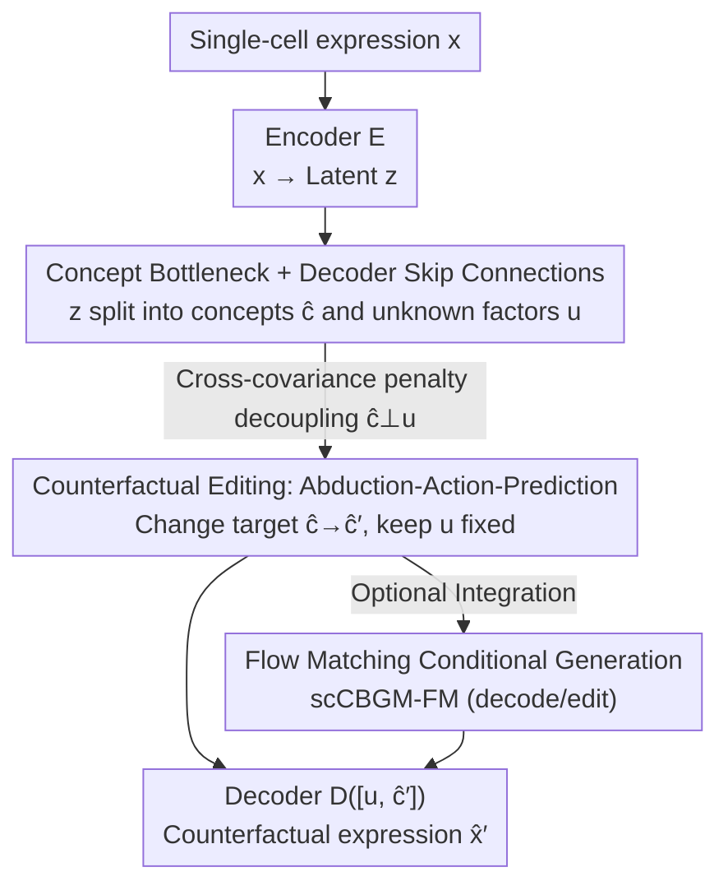

# scCBGM: Interpretable Single-Cell Counterfactual Editing

**Conference**: ICML 2026  
**arXiv**: [2606.07760](https://arxiv.org/abs/2606.07760)  
**Code**: None (No open-source link provided in the paper)  
**Area**: Computational Biology / Single-cell / Counterfactual Generation  
**Keywords**: Single-cell, Concept Bottleneck, Counterfactual Editing, Flow Matching, Interpretability

## TL;DR
This paper proposes scCBGM, a single-cell concept bottleneck generative model. By transferring the "concept bottleneck" architecture to scRNA-seq data and employing decoder skip connections along with cross-covariance decoupling penalties, it achieves interpretable and controllable counterfactual editing of "what would happen if a biological concept were changed" for individual cells. It can also be integrated into flow matching models to enhance generation quality.

## Background & Motivation
**Background**: Single-cell RNA sequencing (scRNA-seq) can characterize cell states, trajectories, and disease mechanisms at cellular resolution. However, the combinatorial space of "cell populations × conditions (drugs, doses, exposures)" is too vast for exhaustive experimental exploration. Consequently, computational models are used to predict cellular responses to unseen conditions.

**Limitations of Prior Work**: An ideal "cell editing" model needs to satisfy two requirements: performing counterfactuals for **individual cells** (e.g., how this specific T-cell would change under anti-PD-1) and allowing interventions on **biologically interpretable concepts** (gene programs, cell types, pathway activities) rather than opaque latent variables. Existing methods tend to address only one side: early methods (scGen, scVIDR, etc.) model conditional distributions and provide population average effects but fail at single-cell counterfactuals; newer cell-level counterfactual methods lack explicit interpretable control; existing interpretable methods are merely "descriptive," explaining correlations without the ability to simulate or edit cellular responses.

**Key Challenge**: There is a fundamental difference between editing and conditional generation—the latter asks "what any cell looks like under a given condition," while the former asks "what this specific cell looks like if the condition changes, with everything else staying the same." To achieve the latter, the cell's unique identity (exogenous noise $U$) must be preserved while only modifying the intervened concept, which standard conditional generative models cannot do.

**Goal**: To achieve cell-level, concept-controllable, and identity-preserving counterfactual editing in the context of single-cell data, which is characterized by high heterogeneity, strong technical noise, and unreliable concept annotations.

**Key Insight**: The authors leverage Pearl’s Structural Causal Models to decompose cell expression into "observable concepts $C$ + unobservable residual factors $U$," formalizing editing as the three-step counterfactual inference of abduction-action-prediction. They then adapt the Concept Bottleneck Generative Model (CBGM) for the single-cell domain.

**Core Idea**: Use a concept bottleneck to explicitly separate interpretable concepts as "control knobs" and employ decoder skip connections with cross-covariance penalties to ensure decoupling between concepts and residual factors. This allows for counterfactual editing by "turning a specific concept knob" while keeping everything else unchanged for a single cell.

## Method

### Overall Architecture
scCBGM is an encoder-decoder (VAE) generative model with a concept bottleneck. The input consists of single-cell gene expression $\mathbf{x}\in\mathbb{R}^d$ and a set of $K$ biological concepts $\mathbf{c}$ (which can be binary like cell types/stimulus states or continuous like drug doses/pathway activity scores). The output is the counterfactual expression $\hat{\mathbf{x}}'$—representing the same cell after the concepts have been modified to $\mathbf{c}'$.

The encoder $E(\cdot)$ maps $\mathbf{x}$ to a latent variable $\mathbf{z}$, which is decomposed into two parts: a concept network $f_c$ that outputs interpretable known factors $\hat{\mathbf{c}}=f_c(\mathbf{z})$, and another branch $f_u$ that outputs unknown factors $\mathbf{u}=f_u(\mathbf{z})$ (capturing variation beyond the concepts, such as batch effects or cell identity). These are concatenated and fed into the decoder $D(\cdot)$ to reconstruct $\mathbf{x}$. Editing follows the abduction-action-prediction process: first, encode to obtain $(\hat{\mathbf{c}},\mathbf{u})$; second, modify only the concept dimensions targeted for intervention to get $\hat{\mathbf{c}}'$; third, decode $[\mathbf{u},\hat{\mathbf{c}}']$ to obtain the counterfactual. This framework can further serve as a condition for flow matching models to combine interpretable control with high generation quality.

### Key Designs

**1. Concept Bottleneck + Decoder Skip Connections: Maintaining Persistent Concept Conditioning Under Noisy Annotations**

Concept annotations in single-cell data are often noisy (mislabeled, irrelevant, missing, or redundant). If concepts are injected only at the decoder input, downstream layers may "forget" or bypass them. This work first adopts a standard Concept Bottleneck Model (CBM)—where the bottleneck maps the input to scalar predictions corresponding one-to-one with interpretable concepts—rather than the Concept Embedding Model (CEM) used in the original CBGM. Second, it adds skip connections to the decoder, concatenating the previous layer's hidden state with the known concepts $\hat{\mathbf{c}}$ at every layer $\ell>1$:

$$\mathbf{h}_\ell = D_\ell\big([\mathbf{h}_{\ell-1},\,\hat{\mathbf{c}}]\big),\quad \hat{\mathbf{x}}=D_{\text{final}}(\mathbf{h}_L)$$

This ensures that the concept signal is repeatedly and forcibly conditioned throughout the decoding path. This approach is significantly more robust than single-point injection, especially when concept annotations are noisy—ablation studies show this is a key source of noise resistance.

**2. Cross-Covariance Decoupling Penalty: Unconstrained Dimensionality for Concept and Residual Factors**

To ensure editing "changes only the concept without altering identity," the known concepts $C$ and unknown factors $U$ must be decoupled. The original CBGM used cosine similarity loss to enforce orthogonality, which requires the two embedding dimensions to be identical ($K=d_u$), a major limitation for single-cell scenarios. This work utilizes a cross-covariance penalty: for a minibatch of size $B$, it penalizes the squared Frobenius norm of the empirical cross-covariance between predicted concepts $\hat{C}\in\mathbb{R}^{B\times K}$ and unknown factors $U\in\mathbb{R}^{B\times d_u}$:

$$\mathcal{L}_{\text{cc}}=\Big\|\tfrac{1}{B-1}(\hat{C}-\mathbf{1}\bm{\mu}_{\hat c}^\top)^\top(U-\mathbf{1}\bm{\mu}_u^\top)\Big\|_F^2$$

This allows $K\neq d_u$ (arbitrary embedding dimensions). It prevents the "unknown factor collapsing to near-zero" degenerate solution by applying ReLU to $U$ and relying on the concept loss to implicitly scale $\hat{C}$. This pushes non-concept variations (like batch and cell type) into $\mathbf{u}$, while $\hat{\mathbf{c}}$ carries only the supervised concept semantics. The overall training objective adds this penalty to the $\beta$-VAE ELBO (reconstruction + concept supervision $\mathcal{L}_{\text{concept}}$ + KL): $\mathcal{L}=\mathcal{L}_{\text{VAE}}+\lambda_{\text{cc}}\mathcal{L}_{\text{cc}}$. $\mathcal{L}_{\text{concept}}$ uses BCE for binary concepts and MSE for continuous ones, handling missing labels via a binary mask $\mathbf{m}$.

**3. Abduction-Action-Prediction Counterfactual Editing: Manipulating Target Knobs while Preserving Identity**

The paper strictly maps single-cell editing to Pearl's three counterfactual steps. Given an observed cell $\mathbf{x}$, the counterfactual edit is defined as the posterior expectation:

$$\mu_{\mathbf{x},\mathbf{c}'}:=\mathbb{E}_U\big[f_X(\mathbf{c}',U)\,\big|\,X=\mathbf{x}\big]$$

In the context of the model, these steps are: **Abduction**—encode $\mathbf{z}=E_\mu(\mathbf{x})$ and decompose into $(\hat{\mathbf{c}},\mathbf{u})$, where $\mathbf{u}$ locks the cell identity (exogenous factors); **Action**—assign values only to dimensions where $\hat{\mathbf{c}}$ differs from target $\mathbf{c}'$ ($\hat{\mathbf{c}}'_k\leftarrow\mathbf{c}'_k,\ \forall k:\mathbf{c}'_k\neq\mathbf{c}_k$), leaving other dimensions untouched; **Prediction**—decode $\hat{\mathbf{x}}'=D([\mathbf{u},\hat{\mathbf{c}}'])$. This corresponds to the semantics of "editing = changing conditions while keeping everything else equal," contrasting with conditional generation that only looks at population averages. The authors provide a proof of consistency for this estimator in the appendix.

**4. Flow Matching Extension: Connecting Interpretable Control to High-Quality Generators**

While scCBGM can be used independently, its VAE decoder limited generation quality. This work uses the trained scCBGM embeddings as conditions to train a flow matching model, learning a conditional vector field $v_\theta(\mathbf{x}_t,t;[\mathbf{u},\hat{\mathbf{c}}])$. This combines the quality of SOTA generators with the interpretability/controllability of concept bottlenecks. It supports two counterfactual strategies: **decode**—starting from noise $\mathbf{x}_0\sim\mathcal{N}(0,I)$ and following the conditional flow $\hat{\mathbf{x}}'=\varphi_1(\mathbf{x}_0,[\mathbf{u},\hat{\mathbf{c}}'])$ based on the edited concept $\hat{\mathbf{c}}'$, suitable for diverse sampling; **edit**—more precise, first mapping $\mathbf{x}$ back to noise $\mathbf{x}_0=\varphi_1^{-1}(\mathbf{x},[\mathbf{u},\hat{\mathbf{c}}])$ using the original concept $\hat{\mathbf{c}}$ (abduction), then decoding forward with the edited concept $\hat{\mathbf{c}}'$ (action+prediction). This directly imports Pearl’s three steps into flow matching.

### Loss & Training
The total objective is $\mathcal{L}=\mathcal{L}_{\text{VAE}}+\lambda_{\text{cc}}\mathcal{L}_{\text{cc}}$, where $\mathcal{L}_{\text{VAE}}$ includes a reconstruction term, a concept supervision term $\lambda_c\mathcal{L}_{\text{concept}}$, and $\beta$-KL regularization; $\mathcal{L}_{\text{concept}}$ uses BCE/MSE for binary/continuous concepts normalized by a mask. The flow matching version is trained using a conditional flow matching loss $\mathcal{L}_{\text{FM}}$ for the vector field.

## Key Experimental Results

### Main Results
On the Kang et al. (2017) PBMC dataset (IFN-$\beta$ stimulus vs. control), predicting stimulus response was evaluated using rMMD (<1 indicates better performance than the trivial baseline of "mapping to the most similar existing population," lower is better). The table below shows rMMD for various immune cell subtypes (selected representative columns):

| Model | B cells | T cells (CD4) | T cells (CD8) | Dendritic | NK cells |
|------|---------|---------------|---------------|-----------|----------|
| scCBGM | 0.112 | 0.169 | 0.171 | 0.375 | 1.167 |
| scCBGM-FM (decode) | 0.106 | 0.162 | 0.138 | 0.288 | 0.093 |
| scCBGM-FM (edit) | **0.093** | **0.156** | **0.119** | **0.231** | 0.084 |
| CBGM (Original) | 0.902 | 2.228 | 1.914 | 1.503 | 1.270 |
| Vanilla-FM (edit) | 0.492 | 0.487 | 0.364 | 1.307 | 0.082 |
| biolord | 2.622 | 5.514 | 4.829 | 3.904 | 2.355 |
| CINEMA-OT | 2.259 | 7.042 | 5.362 | 1.367 | 3.707 |
| scGen | 1.830 | 5.117 | 4.748 | 1.133 | 2.436 |

scCBGM/scCBGM-FM significantly outperformed existing conditional generative methods in 5 out of 7 experiments, with scCBGM-FM (edit) typically performing best.

### Ablation Study
Ablations on three components were conducted on three synthetic datasets (5 intervention types × 2 seeds × multiple noise settings)—decoder type (skip vs. direct), concept head (CBM vs. CEM), and orthogonal loss (cross-covariance vs. cosine):

| Configuration | Conclusion |
|------|------|
| CBM vs. CEM | Concept Bottlenecks (CBM) outperform Concept Embeddings (CEM) on single-cell data. |
| + Cross-covariance loss | Further improves performance within the CBM family. |
| + Skip-connection decoder | Provides gains only when paired with both cross-covariance loss and CBM. |

### Key Findings
- **Synergy between the three components**: The skip-connection decoder is not beneficial in isolation; it only takes effect when combined with the cross-covariance loss and the concept bottleneck, indicating that "persistent concept conditioning + decoupling" must work together.
- **Flow matching expansion benefits from the structured latent space**: To verify that the advantage of scCBGM-FM stems from the structured latent space of scCBGM rather than flow matching itself, comparisons were made with CVAE-FM and biolord-FM. scCBGM-FM remained superior, highlighting the interpretable concept bottleneck as the key.
- **Zero-shot combinatorial generalization**: On the Kang dataset, when "stimulated Naive CD4 T cells" were entirely left out during training, scCBGM successfully predicted the stimulated state from control Naive CD4 T cells, demonstrating clear superiority in zero-shot generalization over Vanilla-FM and CINEMA-OT.

## Highlights & Insights
- **Decoupling "editing" from "conditional generation" causally**: By locking identity with $U$ and modifying only concept dimensions, it implements Pearl’s three steps—this is the fundamental reason it achieves single-cell counterfactuals rather than population averages. This logic is transferable to any controllable generation task requiring "identity preservation while property modification."
- **Cross-covariance penalty removes dimension constraints**: Unlike cosine orthogonality which requires $K=d_u$, the Frobenius-norm-based cross-covariance allows for arbitrary embedding dimensions and uses ReLU + concept loss for implicit scaling to prevent collapse, serving as a lightweight and effective decoupling trick.
- **Construction of synthetic benchmarks with ground truth counterfactuals**: Single-cell data cannot be measured repeatedly on the same cell, making ground truth counterfactuals naturally absent. The authors used hierarchical overdispersed Poisson processes to separate exogenous noise from conditions, creating controllable ground truths and injecting four types of annotation noise to fill the gap in rigorous evaluation for this field.
- **Concept bottleneck as an "interpretable control layer" for flow matching/diffusion**: Decoupling interpretability from SOTA generation quality and then recombining them represents a general "control layer + generator" paradigm.

## Limitations & Future Work
- **Reliance on proxy metrics for real data**: Since exogenous noise cannot be controlled in real data, the authors use cell subtypes as hidden $U$ and population-level proxies like rMMD for counterfactual evaluation. Cell-level accuracy still relies heavily on synthetic verification; the sim-to-real gap is not fully closed.
- **Dependence on concept annotation quality and causal assumptions**: The method assumes $U\perp U_C$ and that concepts can be supervisedly learned. If key concepts are missing or annotations are systematically biased, edit reliability will decrease.
- **High variance in some subpopulations**: For instance, all methods showed high rMMD and high variance on Monocytes (FCGR3A) (scCBGM 1.845±1.776), suggesting editing remains unstable for some rare or noisy subpopulations.
- **Future Directions**: Incorporating more mechanistic priors (pathway topology, dose-response curves) into the concept structure and developing evaluation protocols that are closer to cell-level ground truth on real data.

## Related Work & Insights
- **vs. Original CBGM (Ismail et al., 2023)**: The original used CEM + cosine orthogonality, which is dimension-restricted and fragile against noisy annotations. This work switches to standard CBM + decoder skip connections + cross-covariance, specifically addressing the high noise and unreliable concepts of single-cell data.
- **vs. biolord / scDisInFac (Piran/Zhang 2024)**: These learn decoupled representations but assume factors are mutually independent or handle latent spaces additively, which is unrealistic in this context. scCBGM does not impose additive/independence assumptions and explicitly supports concept-level intervention.
- **vs. scGen / scVIDR (Lotfollahi/Kana)**: These cell editing methods rely on strong perturbation mechanism assumptions (e.g., additive effects in latent space) and lack interpretable representations. This work supports diverse biological interventions with interpretable concept knobs.
- **vs. CINEMA-OT (Dong et al., 2023)**: This maps data into causal/confounding factors to predict treatment effects but can only map cells to existing observations in the training data, limiting generalization. scCBGM enables zero-shot combinatorial generalization.

## Rating
- Novelty: ⭐⭐⭐⭐⭐ First framework to bring Concept Bottleneck + Pearl counterfactuals to single-cell editing and extend it to flow matching.
- Experimental Thoroughness: ⭐⭐⭐⭐ Synthetic ground truth + three real datasets + thorough ablation, though real data evaluation is limited to proxy metrics.
- Writing Quality: ⭐⭐⭐⭐ Causal formalization is clear, motivation is well-structured, and formulas match the architecture well.
- Value: ⭐⭐⭐⭐⭐ Provides a practical paradigm and benchmark for interpretable, controllable single-cell counterfactual reasoning.

<!-- RELATED:START -->

## Related Papers

- [\[ICML 2026\] What Makes a Representation Good for Single-Cell Perturbation Prediction?](what_makes_a_representation_good_for_single-cell_perturbation_prediction.md)
- [\[AAAI 2026\] Gene Incremental Learning for Single-Cell Transcriptomics](../../AAAI2026/computational_biology/gene_incremental_learning_for_single-cell_transcriptomics.md)
- [\[ICML 2026\] Scalable Single-Cell Gene Expression Generation with Latent Diffusion Models](scalable_single-cell_gene_expression_generation_with_latent_diffusion_models.md)
- [\[ICLR 2026\] scDFM: Distributional Flow Matching for Robust Single-Cell Perturbation Prediction](../../ICLR2026/computational_biology/scdfm_distributional_flow_matching_model_for_robust_single-cell_perturbation_pre.md)
- [\[ICML 2026\] Towards Universal Gene Regulatory Network Inference: Unlocking Generalizable Regulatory Knowledge in Single-cell Foundation Models](towards_universal_gene_regulatory_network_inference_unlocking_generalizable_regu.md)

<!-- RELATED:END -->
