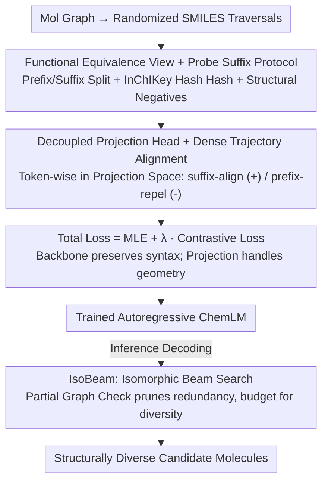

# SIGMA: Structure-Invariant Generative Molecular Alignment for Chemical Language Models via Autoregressive Contrastive Learning

**Conference**: ICML 2026  
**arXiv**: [2603.25062](https://arxiv.org/abs/2603.25062)  
**Code**: None  
**Area**: Graph Learning / Chemical Language Models / Autoregressive Generation  
**Keywords**: SMILES, Contrastive Learning, Trajectory Alignment, Isomorphism Beam Search, Molecular Generation

## TL;DR
SIGMA uses token-level contrastive loss to force the hidden states of different SMILES permutations of the same molecule onto the same trajectory. It further introduces IsoBeam to prune isomorphic redundant paths during the decoding stage, enabling sequence models to truly "think by graph rather than by string" in chemical space.

## Background & Motivation

**Background**: Current Chemical Language Models (ChemLMs) serialize molecular graphs into SMILES strings and use Transformers for autoregressive generation. This "linguistic modeling" leverages massive unlabeled corpora such as PubChem, ChEMBL, and ZINC for pre-training, and is widely utilized in de novo drug design, property prediction, and activity modeling.

**Limitations of Prior Work**: A single molecular graph corresponds to **factorial numbers** of valid SMILES permutations (depending on the traversal order), yet models treat these equivalent representations as entirely different sequences. Consequently, different prefixes of the same molecule are mapped to mutually orthogonal positions in the latent space—a phenomenon the authors term "Trajectory Divergence." This results in "Manifold Fragmentation," where the chemical space is partitioned by syntax rather than structure. This is particularly harmful for reinforcement learning-driven molecular optimization: agents may become trapped in a syntactic region, repeatedly sampling the same scaffold, leading to mode collapse.

**Key Challenge**: Graph models (e.g., MPNN, GraphAF) possess built-in permutation invariance but sacrifice the scalability of Transformers. Conversely, sequence models offer scalability but lack geometric inductive biases. Existing Randomized SMILES data augmentation only exposes the model to variants passively; the model often memorizes high-frequency permutations rather than learning structural equivalence. What is required is a method that retains sequential efficiency while enforcing geometric invariance.

**Goal**: (1) Explicitly align structure-equivalent prefixes to the same hidden state during training without abandoning SMILES representations; (2) Eliminate the waste of "multiple paths decoding to the same molecule" during inference; (3) Maintain a training pipeline compatible with existing Transformers without introducing extra encoders.

**Key Insight**: The authors observe that if two different SMILES prefixes can be appended with the **exact same suffix** to yield the same molecule, they point to the same intermediate subgraph in a chemical sense. This provides a rigorous criterion for "Functional Equivalence," avoiding pseudo-positive samples that "look similar but are chemically incompatible."

**Core Idea**: Use a token-level contrastive loss to align prefixes that "share the same suffix" to the same latent trajectory, while pushing away chemically distinct prefixes as structural negatives. This forces the autoregressive model to "behave like a graph model" within the latent space.

## Method

### Overall Architecture
SIGMA addresses the fundamental misalignment where sequence models treat equivalent SMILES representations as unrelated. The approach embeds "structural equivalence" into both the training objective and the decoding strategy without changing the SMILES representation or adding extra encoders. During training, a token-level contrastive loss forces equivalent prefixes to follow the same latent trajectory, while pushing chemically distinct prefixes apart. During inference, a beam search variant capable of identifying "different paths leading to the same molecule" is used to recover the budget wasted on redundant representations for truly distinct scaffolds. The total training objective is a weighted sum of the MLE loss and the contrastive loss, and standard beam search is replaced by IsoBeam during decoding.

### Key Designs

**1. Functional Equivalence View and Probe Suffix Protocol: Ensuring Positives are "Structurally Identical" rather than "String Similar"**

The success of contrastive learning depends on clean positive pairs. Standard randomized data augmentation often introduces syntactic false positives. SIGMA provides a strict criterion: from an original molecule, two traversals $S^u, S^v$ are randomized and split into prefix-suffix pairs $(p, s)$ at a shared point. It is required that prefixes diverge syntactically ($p_u \neq p_v$), but their structure must be equivalent when the same suffix is appended, verified by an InChIKey hash oracle $\mathcal{H}$: $\mathcal{H}(\text{Mol}(p_u \oplus s)) \equiv \mathcal{H}(\text{Mol}(p_v \oplus s)) \equiv \mathcal{H}(\mathcal{G})$. This is far cleaner than heuristics like edit distance.

Since incomplete SMILES prefixes are often chemically invalid, the authors introduce the **Probe Suffix Protocol**: if a split point creates dangling bonds, a stable cap fragment $s_{probe}$ (e.g., methyl or ring closure) is temporarily attached for structural verification. This ensures equivalence is judged on stable topology rather than transient invalid intermediates. To distinguish fine-grained differences, **Structural Negatives** are explicitly sampled from the batch where $\mathcal{H}(\text{Mol}(p_{neg} \oplus s)) \neq \mathcal{H}(\mathcal{G})$ (e.g., stereoisomers or scaffold hops), forcing the model to learn the difference between true isomorphism and superficial similarity.

**2. Decoupled Projection Head and Dense Trajectory Alignment: Erasing Syntactic Variance without Hurting MLE**

Applying contrastive loss directly to the backbone hidden states $\mathbf{H}$ conflicts with MLE; while MLE must distinguish syntactic details (e.g., ring index 1 vs. 2), contrastive learning aims to erase these differences. SIGMA resolves this by adding a two-layer MLP projection head $\mathbf{z}_t = W^{(2)} \sigma(W^{(1)} \mathbf{h}_t + b^{(1)}) + b^{(2)}$ and placing the contrastive loss in the projection space $\mathcal{Z}$. This allows the backbone to retain syntactic information while the projection space handles geometric alignment.

The alignment is "dense": the contrastive objective acts at every token position of the matching suffix (suffix-align, positive signal) and at non-matching prefix positions (prefix-repel, negative signal). This aligns both token output distributions and cross-attention weights. Unlike global [CLS] alignment (e.g., SimCLR), this token-level approach is necessary because autoregressive generation requires geometrically consistent hidden states at every step.

**3. IsoBeam: Utilizing Learned Equivalence During Decoding**

Even if a model learns equivalence during training, standard beam search suffers from redundant paths during large-molecule generation (e.g., multiple SMILES of acetophenone occupying top-k slots). **IsoBeam** performs a **Partial Graph Check** at each decoding step: if two prefixes correspond to isomorphic subgraphs with identical open connection points, only the path with higher probability is retained. The saved budget is reallocated to explore different scaffolds (e.g., switching from a benzene ring to a pyridine ring). This closes the loop between training for equivalence and utilizing it during inference.

### Loss & Training
The total loss is $\mathcal{L} = \mathcal{L}_{\text{MLE}} + \lambda \mathcal{L}_{\text{contrast}}$, where the contrastive term includes suffix-align (InfoNCE style alignment for positive pairs) and prefix-repel (structural negative repulsion), controlled by a temperature parameter $\tau$. Pairs of randomized SMILES are sampled online and hash-verified; failed pairs are discarded. The projection head and backbone are trained jointly.

## Key Experimental Results

### Main Results
The paper benchmarks SIGMA against strong baselines (standard ChemLM, Randomized SMILES, CONSMI global contrastive, SimCTG self-contrastive, LO-ARM graph generator) on standard Multi-Parameter Optimization (MPO).

| Task Category | Metric | SIGMA | Prev. SOTA | Gain Summary |
| :--- | :--- | :--- | :--- | :--- |
| Multi-Parameter Optimization | High-score molecules | Significantly Leads | Randomized SMILES | Large improvement in sample efficiency |
| Structural Diversity | Unique Scaffolds | Significantly Leads | Standard Beam Search | IsoBeam reallocates budget to distinct scaffolds |
| Latent Space Alignment | Cosine Sim. (Isomorphic) | Near 1.0 | < 0.5 | Confirms Manifold Fragmentation is fixed |

### Ablation Study

| Configuration | Key Metric | Description |
| :--- | :--- | :--- |
| Full SIGMA (suffix-align + prefix-repel + IsoBeam) | Best | - |
| w/o Structural Negatives | Diversity drops | In-batch random negatives cannot distinguish stereoisomers |
| w/o Projection Head | MLE Perplexity rises | Direct contrast on backbone hurts generation quality |
| w/o IsoBeam (SIGMA training, standard beam) | Unique scaffolds drop | Training alignment alone cannot fully eliminate inference redundancy |
| w/o suffix-align (Global CLS only) | Weaker alignment | Confirms necessity of dense token-level alignment |

### Key Findings
- **Projection heads are mandatory**: Directly applying contrastive loss to the backbone creates competition between MLE and alignment, degrading token prediction accuracy.
- **IsoBeam and training alignment are complementary**: Alignment solves "whether the model knows equivalence," while IsoBeam solves "whether the output avoids redundancy."
- **Structural negatives** significantly enhance fine-grained discriminative power compared to standard in-batch negatives.
- **Probe Suffix** ensures equivalence is based on stable topologies, avoiding false judgments caused by invalid intermediates.

## Highlights & Insights
- **Geometric consistency as latent space constraint**: Explicitly encoding graph symmetry—which sequence models should respect—into the latent space using token-level contrast is an elegant way to inject graph inductive biases into Transformers.
- **Training-Inference Duality**: The combination of suffix-align (learning equivalence) and IsoBeam (using equivalence) forms a complete loop, avoiding the common pitfall where learned properties are not utilized during inference.
- **InChIKey Hash Oracle**: Using hash oracles for equivalence is clean and rigorous, avoiding heuristics based on edit distance or substring matching.
- The "trajectory alignment" concept is transferable to any "one-to-many serialization" problem, such as equivalent AST expressions in code generation or different point cloud orderings in 3D shapes.

## Limitations & Future Work
- Hash verification relies on cheminformatics tools (e.g., RDKit), which may fail for macrocycles or unconventional molecules and introduces computational overhead per batch.
- The choice of **Probe Suffix** (e.g., methyl vs. ring closure) can affect the boundaries of equivalence.
- IsoBeam's **Partial Graph Check** adds computational complexity, potentially becoming a bottleneck for long sequences or large beams without optimization.
- The study focuses on SMILES; effectiveness on more robust representations like SELFIES or DeepSMILES requires further verification.

## Related Work & Insights
- **vs. Randomized SMILES (Bjerrum 2017)**: They **passively** expose equivalent permutations; SIGMA **actively** enforces equivalence via contrastive loss, resulting in much higher sample efficiency.
- **vs. CONSMI / SimSon (Global Contrastive)**: They align [CLS] embeddings; SIGMA aligns at the token level, providing consistent hidden states needed for each step of autoregressive decoding.
- **vs. SimCTG (Intra-sequence Contrastive)**: SimCTG focuses on anisotropy within a sequence; SIGMA focuses on structural equivalence **across sequences**.
- **vs. LO-ARM / GraphAF (Graph Generators)**: Graph models have built-in invariance but lack Transformer scalability; SIGMA "simulates" graph geometric properties within a sequence model.

## Rating
- Novelty: ⭐⭐⭐⭐⭐ "Trajectory alignment" is a fresh and elegant path to inject graph geometry into sequence models.
- Experimental Thoroughness: ⭐⭐⭐⭐ Comprehensive analysis of latent space and property optimization; however, it lacks coverage of alternative representations like SELFIES.
- Writing Quality: ⭐⭐⭐⭐⭐ The "Manifold Fragmentation" concept is well-defined, and the methodology is rigorous.
- Value: ⭐⭐⭐⭐⭐ Simultaneously improves training and inference, offering direct value to the ChemLM community.

<!-- RELATED:START -->

## Related Papers

- [\[ICML 2026\] Circuit Tracing in Autoregressive Protein Language Models](circuit_tracing_in_autoregressive_protein_language_models.md)
- [\[ICML 2026\] Protein Autoregressive Modeling via Multiscale Structure Generation](protein_autoregressive_modeling_via_multiscale_structure_generation.md)
- [\[AAAI 2026\] S2Drug: Bridging Protein Sequence and 3D Structure in Contrastive Representation Learning for Virtual Screening](../../AAAI2026/computational_biology/s2drug_bridging_protein_sequence_and_3d_structure_in_contrastive_representation_.md)
- [\[AAAI 2026\] Dual-Path Knowledge-Augmented Contrastive Alignment Network for Spatially Resolved Transcriptomics](../../AAAI2026/computational_biology/dual-path_knowledge-augmented_contrastive_alignment_network_for_spatially_resolv.md)
- [\[NeurIPS 2025\] Beyond Chemical QA: Evaluating LLM's Chemical Reasoning with Modular Chemical Operations](../../NeurIPS2025/computational_biology/beyond_chemical_qa_evaluating_llms_chemical_reasoning_with_modular_chemical_oper.md)

<!-- RELATED:END -->
