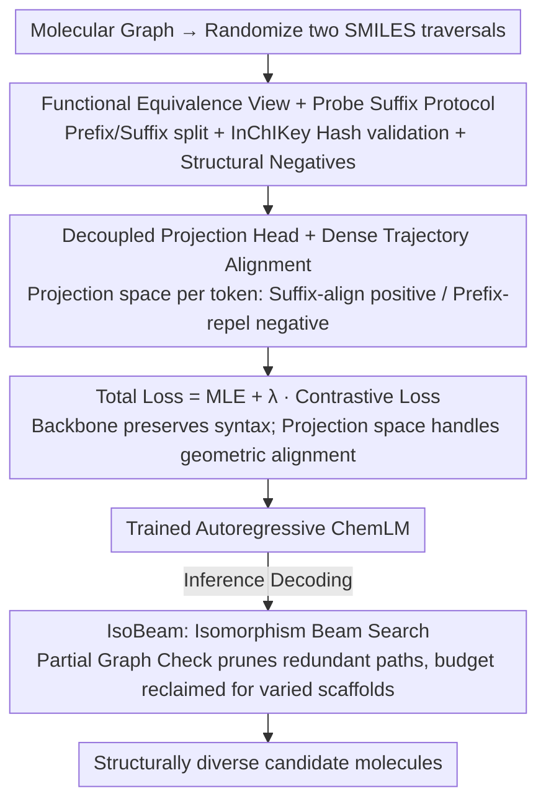

# SIGMA: Structure-Invariant Generative Molecular Alignment for Chemical Language Models via Autoregressive Contrastive Learning

**Conference**: ICML 2026  
**arXiv**: [2603.25062](https://arxiv.org/abs/2603.25062)  
**Code**: None  
**Area**: Graph Learning / Chemical Language Models / Autoregressive Generation  
**Keywords**: SMILES, Contrastive Learning, Trajectory Alignment, Isomorphism Beam Search, Molecular Generation

## TL;DR
SIGMA uses token-level contrastive loss to force the hidden states of different SMILES permutations of the same molecule onto the same trajectory, complemented by IsoBeam to prune isomorphic redundant paths during decoding, enabling sequence models to "think in graphs" rather than strings in chemical space.

## Background & Motivation

**Background**: Current Chemical Language Models (ChemLM) serialize molecular graphs into SMILES strings and use Transformers for autoregressive generation. This "linguistic modeling" leverages pre-training on billion-scale unlabeled corpora like PubChem, ChEMBL, and ZINC, and is widely used for de novo drug design, property prediction, and activity modeling.

**Limitations of Prior Work**: A single molecular graph corresponds to **factorially many** valid SMILES strings (depending on the traversal order), yet models treat these equivalent representations as completely different sequences. Consequently, different prefixes of the same molecule are mapped to orthogonal positions in the latent space, a phenomenon termed "Trajectory Divergence" by the authors. This leads to "Manifold Fragmentation," where chemical space is partitioned into isolated islands based on syntax rather than structure. This is particularly harmful for reinforcement learning-driven molecular optimization: agents may get trapped in a syntactic region, repeatedly sampling the same scaffold, leading to mode collapse.

**Key Challenge**: Graph models (MPNN/GraphAF) possess built-in permutation invariance but sacrifice the scalability of Transformers; sequence models offer scalability but lack geometric inductive biases. Existing Randomized SMILES data augmentation only provides passive exposure, where models often memorize high-frequency permutations instead of learning structural equivalence. A method is needed that retains sequence efficiency while enforcing geometric invariance.

**Goal**: (1) Explicitly align structurally equivalent prefixes to the same hidden state during training without discarding the SMILES representation; (2) Eliminate the waste caused by "multiple paths decoding to the same molecule" in beam search during inference; (3) Maintain compatibility with existing Transformer pipelines without introducing extra encoders.

**Key Insight**: The authors observe that if two different SMILES prefixes can be appended with the **exact same suffix** to yield the same molecule, they point to the same intermediate subgraph in a chemical sense. This provides a strict criterion for "Functional Equivalence," avoiding "look-alike but chemically incompatible" false positives.

**Core Idea**: Use a token-level contrastive loss to align prefixes "sharing the same suffix" to the same latent trajectory, while pushing away chemically distinct prefixes as structural negatives, making the autoregressive model "behave like a graph model" in the latent space.

## Method

### Overall Architecture
SIGMA addresses the fundamental misalignment where sequence models treat different SMILES representations of the same molecule as unrelated. It embeds "structural equivalence" into both the training objective and the decoding strategy without changing the SMILES format or adding encoders. During training, a token-level contrastive loss forces equivalent prefixes to follow the same trajectory while repelling distinct ones. During inference, an isomorphism-aware beam search identifies redundant paths and reallocates the search budget to distinct scaffolds. The training objective is a weighted sum of MLE and contrastive losses, and standard beam search is replaced by IsoBeam.

### Key Designs

**1. Functional Equivalence View and Probe Suffix Protocol: Ensuring Positives are "Structurally Identical" not just "String Similar"**

The success of contrastive learning depends on clean positive pairs. Traditional randomized augmentation suffers from syntactic false positives—strings may look different and might not be chemically equivalent. SIGMA proposes a strict criterion: from an original molecule, randomize two traversals $S^u, S^v$, find a common split point to divide them into prefix and suffix $(p, s)$, and require that prefixes diverge syntactically $p_u \neq p_v$, but their structure must be equivalent when concatenated with the same suffix. This is validated by an InChIKey hash oracle $\mathcal{H}$: $\mathcal{H}(\text{Mol}(p_u \oplus s)) \equiv \mathcal{H}(\text{Mol}(p_v \oplus s)) \equiv \mathcal{H}(\mathcal{G})$.

However, incomplete SMILES prefixes are often chemically invalid. The authors introduce the **Probe Suffix Protocol**: if a split point creates dangling bonds, a stable cap fragment $s_{probe}$ (like a methyl group or ring closure) is temporarily attached for structure validation. This ensures equivalence is determined by stable topologies rather than transient invalid intermediates. To distinguish fine-grained differences, **Structural Negatives** are explicitly selected from the batch where $\mathcal{H}(\text{Mol}(p_{neg} \oplus s)) \neq \mathcal{H}(\mathcal{G})$ (e.g., stereoisomers or scaffold hops), forcing the model to distinguish "true isomorphism" from "look-alikes."

**2. Decoupled Projection Head and Dense Trajectory Alignment: Removing Syntactic Variance without Hurting MLE**

Applying contrastive loss directly to the backbone hidden states $\mathbf{H}$ conflicts with MLE—MLE must distinguish syntactic details (like ring index 1 vs 2), while contrastive alignment aims to erase them. SIGMA solves this by adding a two-layer MLP projection head $\mathbf{z}_t = W^{(2)} \sigma(W^{(1)} \mathbf{h}_t + b^{(1)}) + b^{(2)}$. The contrastive loss is computed in the projection space $\mathcal{Z}$, allowing the backbone to retain syntactic information while the projection space handles geometric alignment.

The alignment is "dense": the contrastive objective acts at every token position of the matching suffix (suffix-align, positive signal) and performs prefix-repel at non-matching positions. Unlike SimCLR/MoCo which use global [CLS] alignment, autoregressive generation requires geometrically consistent hidden states at every step; a global vector cannot supervise intermediate trajectory steps.

**3. IsoBeam: Utilizing Learned Equivalence during Decoding**

Even if a model learns equivalence during training, standard beam search still fails on large molecules: several top-k paths may decode to the same molecule (e.g., different SMILES for acetophenone), wasting the search budget. IsoBeam performs a **Partial Graph Check** at each decoding step: if two prefixes correspond to isomorphic subgraphs with identical open connection points, only the higher-probability path is kept. The redundant path's budget is reclaimed for other scaffolds (e.g., switching from a benzene ring to a pyridine ring). This closes the loop between "learning equivalence" and "using equivalence."

### Loss & Training
The total loss is $\mathcal{L} = \mathcal{L}_{\text{MLE}} + \lambda \mathcal{L}_{\text{contrast}}$, where the contrastive term includes suffix-align (InfoNCE-style positive alignment) and prefix-repel (structural negative repulsion), controlled by a temperature parameter $\tau$. Randomized SMILES pairs are sampled online and validated via hash equivalence; invalid pairs are discarded. The projection head and backbone are trained jointly.

## Key Experimental Results

### Main Results
The paper compares SIGMA against strong baselines (standard ChemLM, Randomized SMILES, CONSMI global contrastive, SimCTG self-contrastive, LO-ARM graph generator) on Multi-Parameter Optimization (MPO) benchmarks.

| Task Category | Metric | SIGMA | Prev. SOTA | Gain Description |
| :--- | :--- | :--- | :--- | :--- |
| MPO | Top-K High-scoring Mol | Significant Lead | Randomized SMILES | Large improvement in sample efficiency |
| Diversity | Unique Scaffolds | Significant Lead | Standard Beam Search | IsoBeam reclaims budget for different scaffolds |
| Latent Alignment | Cosine Sim of Iso-Prefixes | Near 1.0 | < 0.5 | Confirms Manifold Fragmentation is fixed |

### Ablation Study

| Configuration | Key Metric | Description |
| :--- | :--- | :--- |
| Full SIGMA | Optimal | — |
| w/o Structural Negatives | Diversity drop | Random in-batch negatives fail to distinguish stereoisomers |
| w/o Projection Head | Higher MLE Perplexity | Direct contrastive on backbone hurts generation quality |
| w/o IsoBeam | Lower Unique Scaffolds | Training alignment alone doesn't fully eliminate inference redundancy |
| w/o suffix-align | Weak Latent Alignment | Confirms necessity of dense token-level alignment |

### Key Findings
- **Projection heads are essential**: Contrastive objectives on the backbone compete with MLE, degrading token prediction accuracy.
- **IsoBeam complements training alignment**: Alignment addresses whether the model *knows* equivalence; IsoBeam addresses whether the output *avoids* redundancy.
- **Structural negatives** significantly improve fine-grained discrimination where random negatives fail.
- **Probe Suffix** ensures equivalence judgments are based on stable topologies rather than transient states.

## Highlights & Insights
- **Geometric Invariance as Latent Constraint**: Encoding graph symmetries into the latent space of a sequence model via token-level contrast is an elegant way to inject graph inductive biases into Transformers.
- **Training-Inference Duality**: The combination of suffix-align (learning) and IsoBeam (using) creates a complete loop, avoiding the "learned but not utilized" pitfall.
- **InChIKey Hash Oracle**: Provides a clean and strict criterion for equivalence, avoiding heuristics based on edit distance or substring matching.
- **Trajectory Alignment**: This concept is transferable to any "one-to-many serialization" problem, such as equivalent AST expressions in code generation or point cloud ordering in 3D shapes.

## Limitations & Future Work
- Hash validation depends on chemoinformatics tools like RDKit, which may fail for macrocycles or unconventional molecules and adds computational overhead per batch.
- Choice of **Probe Suffix** (methyl vs. ring closure) can affect the boundaries of equivalence.
- **IsoBeam** introduces computational complexity via Partial Graph Checks; optimizations are needed for large beams or long sequences.
- While focused on SMILES, the effectiveness on more robust representations like SELFIES or DeepSMILES remains to be verified.

## Related Work & Insights
- **vs. Randomized SMILES (Bjerrum 2017)**: They rely on passive exposure through data augmentation; SIGMA actively enforces equivalence via contrastive loss, yielding higher sample efficiency.
- **vs. CONSMI / SimSon (Global Contrastive)**: They align [CLS] embeddings; SIGMA performs dense token-level alignment necessary for every step of autoregressive decoding.
- **vs. SimCTG (Intra-sequence Contrastive)**: SimCTG focuses on anisotropy within a sequence; SIGMA focuses on structural equivalence **across** sequences.
- **vs. LO-ARM / GraphAF (Graph Generators)**: Graph models have built-in invariance but lack Transformer scalability; SIGMA "simulates" graph geometric properties within a sequence model.

## Rating
- Novelty: ⭐⭐⭐⭐⭐ "Trajectory alignment" is an elegant path to inject graph geometric properties into sequence models.
- Experimental Thoroughness: ⭐⭐⭐⭐ Covers latent space analysis, optimization, and diversity; could be improved by testing on alternative representations like SELFIES.
- Writing Quality: ⭐⭐⭐⭐⭐ Well-defined concepts like "Manifold Fragmentation" and clear methodology.
- Value: ⭐⭐⭐⭐⭐ Improves both training and inference; directly applicable to the ChemLM ecosystem.

<!-- RELATED:START -->

## Related Papers

- [\[ICML 2026\] Protein Autoregressive Modeling via Multiscale Structure Generation](protein_autoregressive_modeling_via_multiscale_structure_generation.md)
- [\[AAAI 2026\] S2Drug: Bridging Protein Sequence and 3D Structure in Contrastive Representation Learning for Virtual Screening](../../AAAI2026/computational_biology/s2drug_bridging_protein_sequence_and_3d_structure_in_contrastive_representation_.md)
- [\[AAAI 2026\] Dual-Path Knowledge-Augmented Contrastive Alignment Network for Spatially Resolved Transcriptomics](../../AAAI2026/computational_biology/dual-path_knowledge-augmented_contrastive_alignment_network_for_spatially_resolv.md)
- [\[NeurIPS 2025\] Beyond Chemical QA: Evaluating LLM's Chemical Reasoning with Modular Chemical Operations](../../NeurIPS2025/computational_biology/beyond_chemical_qa_evaluating_llms_chemical_reasoning_with_modular_chemical_oper.md)
- [\[ICML 2026\] Learning Protein Structure-Function Relationships through Knowledge-guided Representation Decomposition](learning_protein_structure-function_relationships_through_knowledge-guided_repre.md)

<!-- RELATED:END -->
