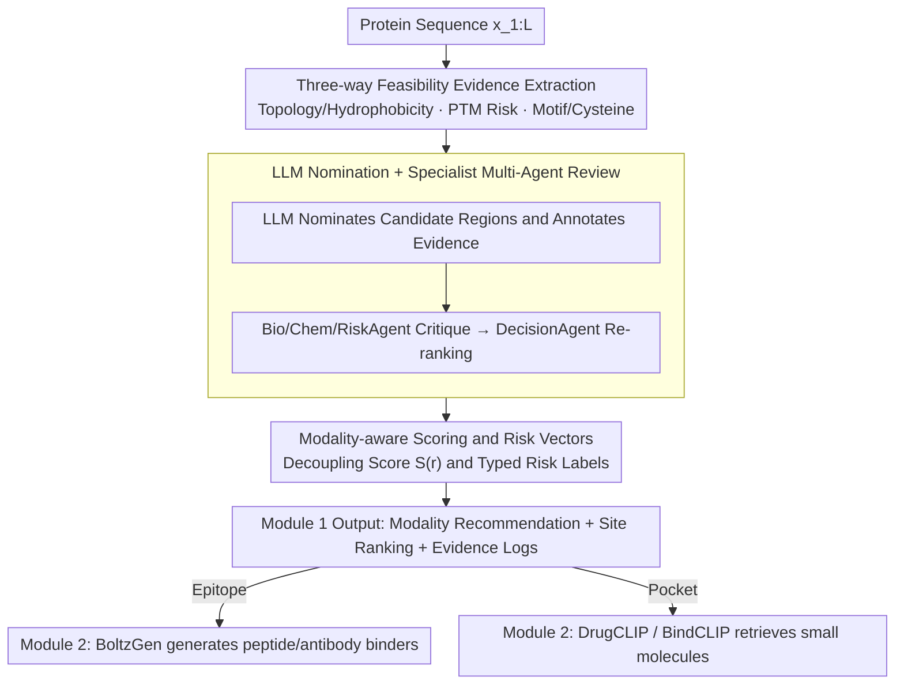

# Site4Drug: Predicting Drug-Binding Target Sites with an AI Agent

**Conference**: ICML 2026  
**arXiv**: [2606.01816](https://arxiv.org/abs/2606.01816)  
**Code**: https://github.com/winterrykim/Site4Drug_Demo  
**Area**: Scientific Computing / Drug Discovery / LLM Agent  
**Keywords**: Drug targets, Epitope discovery, Pocket discovery, LLM Agent, Auditability  

## TL;DR
Site4Drug reformulates the upstream bottleneck of "where to target on a protein" as a constraint-first evidence integration problem. An LLM Agent derives feasibility signals such as topology, PTM, Motif, and cysteine networks from sequences, outputting ranked candidate sites with scores, risk labels, and traceable logs, while automatically recommending whether to use antibody/peptide or small molecule modalities.

## Background & Motivation

**Background**: Existing drug design pipelines mostly assume the "binding site is known." Major efforts are concentrated on docking, virtual screening, or binder generation (e.g., BoltzGen, DrugCLIP, BindCLIP). The sites themselves are either taken from residues within $\le 4\text{Å}$ of ligands in deposited co-crystal structures or extracted from structures via geometric tools (fpocket, RAPID-Net).

**Limitations of Prior Work**: In real-world scenarios, the early stage of "selecting a site before a binder" often stalls. Membrane proteins have regions that are physically inaccessible, topology predictions can be contradictory, and PTMs like glycosylation can mask or disrupt candidate epitopes. When downstream screening fails, teams often cannot distinguish whether the issue lies with the binder model or the site selection because the reasoning for site choice is typically not recorded. Geometric methods only find canonical pockets, cannot incorporate heterogeneous metadata, and do not cover non-small molecule modalities.

**Key Challenge**: Feasibility evidence (topology, PTM, cysteine networks, Motif context) is discrete, heterogeneous, and cross-modal, whereas downstream tools require a single, comparable, and interpretable ranking of sites.

**Goal**: Without relying on fixed ground truth, output (i) recommended binding modality, (ii) ranked candidate sites, and (iii) evidence summaries, risk labels, and decision logs for each candidate from any protein sequence.

**Key Insight**: LLMs are naturally capable of fused unstructured evidence and generating traceable reasoning chains; letting an LLM score small molecule pockets and antibody epitopes simultaneously on unified evidence avoids false positives that are "chemically plausible but biologically masked."

**Core Idea**: Replace single geometric/learned scoring with "Constraint-first + Evidence Aggregation + Multi-Agent Review," turning site selection into an auditable multi-agent decision process.

## Method

### Overall Architecture
The method addresses the bottleneck in the early "site then binder" stage by aggregating discrete, heterogeneous, and cross-modal feasibility evidence into a single comparable site ranking. The input is only the protein amino acid sequence $x_{1:L}$. The output is a structured report containing modality recommendation $\hat{m}\in\{\text{epitope}, \text{pocket}, \text{other}\}$, $K$ candidate regions $\{r_k\}$ with their scores $S(r_k)$, accessibility/topology labels, evidence summaries, and typed risk labels. The entire workflow is split into two modules: Module 1 extracts evidence from the sequence, lets the LLM nominate candidates, performs scoring and ranking, and then uses specialized Agents for adversarial review; Module 2 shunts high-scoring candidates to downstream design tools based on modality (epitopes to BoltzGen, pockets to DrugCLIP/BindCLIP).

### Key Designs

**1. Three-way feasibility evidence extraction: Making "why this cannot be chosen" explicit**

Geometric methods only find canonical pockets and cannot incorporate heterogeneous metadata like PTMs or Motifs; if these constraints are buried in the LLM's implicit priors, they cannot be audited. Site4Drug therefore extracts three-way signals in parallel from the raw sequence, all converted into enumerable labels. For topology/hydrophobicity, Kyte–Doolittle sliding window values and heuristic TM detection provide coarse labels like `tmd/restricted` or `outside/exposed`, with confidence determined by the margin between the hydrophobic value and the TM threshold. For PTM risk, MusiteDeep predicts sites for phosphorylation, glycosylation, etc., and each site is expanded into a typed local mask (e.g., phosphorylation at site 211 expands to 208–214), recording overlaps and type counts. Motifs and cysteines use ScanProsite to mark `motif-overlap` and use local cysteine counts as lightweight proxies for disulfide constraints. By explicitly enumerating these multi-source biological constraints, subsequent Agents can provide traceable critiques.

**2. LLM Nomination + Specialist Multi-Agent Review: Suppressing hallucinations with consistent evidence**

A single LLM is prone to "self-persuasion," so Site4Drug introduces a group of Agents that perform adversarial peer review on the same evidence. The LLM first receives the sequence and a compressed evidence summary to output a JSON of ranked candidate regions. After filtering invalid entries, each candidate is tagged with topology labels, PTM/Motif overlap, cysteine counts, risk labels, and heuristic scores. Subsequently, BioAgent, ChemAgent, and RiskAgent return critiques in a "claim $\rightarrow$ evidence $\rightarrow$ impact" format. DecisionAgent synthesizes all critiques for the final modality determination and re-ranking. A key constraint is that DecisionAgent is forced to only cite evidence already present in the context—directly embedding traceability into the decision paradigm and ensuring any conclusion can be traced back to a specific line of evidence.

**3. Modality-aware scoring function and risk vectors: Decoupling scores from risks**

If risks such as "TM involvement" or "overlapping glycosylation clusters" are mixed directly into the score, the ranking remains comparable but the reason for failure is obscured. Site4Drug therefore separates the two: the candidate score is conceptually written as:

$$S_0(r) = s_{\text{mode}}(r) - p_{\text{TM}}(r) - p_{\text{PTM}}(r) - p_{\text{motif}}(r)$$

where $s_{\text{mode}}$ is the modality base preference—epitopes prefer polar, non-TM, low-PTM windows, while pockets prefer hydrophobic cores and have weaker PTM penalties. Simultaneously, a typed risk vector $g(r)$ is maintained, outputting labels such as `TM-overlap`, `PTM-overlap`, `glyco-mask-overlap`, `PTM-dense`, `disulfide-constrained`, `hydrophobic-core`, and `motif-overlap`. This allows operators to clearly distinguish between candidates that "never touched TM" and those "pressed into a glycosylation cluster" under the same score, making rankings comparable and failures explainable.

### Loss & Training
The authors initially attempted SFT using structured demonstrations (Qwen3-235B Instruct) but found that while SFT checkpoints improved output formatting, they exhibited shortcut behavior by "repeatedly picking similar N-terminal windows." Therefore, the results reported in the main text are based entirely on base model inference. The authors suggest that "biologically grounded reward or preference signals" will be needed for post-training in the future.

## Key Experimental Results

### Main Results

| Dataset | Setting | Site4Drug Top-1 | Site4Drug Top-5 | Baseline Comparison |
|---------|---------|-----------------|-----------------|----------------------|
| RCSB Co-crystal Pockets (n=63) | $p<0.05$ Significance Rate | 20/63 | 18/63 | fpocket+AlphaFold3: 20/63; fpocket+RCSB w/ ligand: 62/63 |
| ABCD Antibody Epitopes (n=26) | $p<0.05$ Significance Rate | 8/26 | 11/26 | — |

Without direct access to structures, Site4Drug matched the performance of "feeding AlphaFold3 structures to fpocket." The 62/63 result for fpocket on ligand-containing RCSB structures occurs because the ligand's presence leaks the answer to the geometric detector. GO enrichment shows that Top-1 significant targets are mainly concentrated in the kinase family, consistent with the biological prior that kinases possess recurrent small-molecule accessible pockets.

### Ablation Study

| Configuration | Top-1 Sig. Rate | Top-5 Sig. Rate | Description |
|---------------|-----------------|-----------------|-------------|
| Site4Drug Full Pipeline | 20/63 | 18/63 | Incl. Topology/PTM/Motif/Cys Evidence + Specialists |
| Sequence Only + $k=1$ (No Evidence) | 3/63 | 3/63 | Only general ID and sequence provided |
| Sequence Only + $k=3$ Self-Consistency | 7/63 | 6/63 | Three nomination votes |
| Structural Confidence (AF3 pLDDT) | — | — | Top-1 mean pLDDT > Top-5 set mean, only 9 inverse cases |

### Key Findings
- The explicit evidence pipeline is an order of magnitude more effective than "prompt engineering + sequence input" (20 vs. 3–7), proving that Site4Drug's gains come from enforced feasibility constraints rather than the LLM's general sequence patterns.
- Even without direct 3D structure input, the average pLDDT of predicted sites is higher than the mean of the Top-5 regions, indicating that aggregated sequence evidence implicitly recovers "structurally reliable regions."
- End-to-end demo on EGFR: Small molecules retrieved by DrugCLIP for the Top-1 pocket showed a hypergeometric test $p < 10^{-11}$ overlap with the lapatinib binding site. For the Top-1 epitope fed to BoltzGen, only the rank-1 peptide binder could calculate an LIS under the PAE $<12$ threshold, falling in Domain III targeted by known antibodies.
- Kinases dominate Top-1 significant samples (e.g., pralsetinib targets 11 kinases including DDR1/FGFR/FLT3/JAK/RET), matching biological priors and suggesting Site4Drug identifies family-level features rather than random hits.
- Automatic modality recommendation identifies mixed-modality targets like EGFR and HER2, which have both small molecule and antibody drugs, avoiding pitfalls of pre-defined modalities.

## Highlights & Insights
- **Auditability as a Design Goal**: Scoring functions, risk labels, and Agent critiques are all forced to be based on an explicit evidence list, allowing errors to be traced to a specific line of evidence—a style crucial for highly regulated drug discovery.
- **Rejecting Ground Truth as Absolute**: The authors note that IEDB epitopes and RCSB "4Å ligand neighborhoods" are task-related rather than exhaustive labels. Using hypergeometric tests for relative comparison rather than absolute regression is a paradigm worth migrating to other scientific discovery tasks lacking gold standards.
- **Modality Before Site**: Instead of requiring users to specify the modality first, letting the same evidence recommend the modality avoids typical errors like forcing antibody design on the intracellular segment of a membrane protein.

## Limitations & Future Work
- Data scale is limited (63 pockets, 26 epitopes), and there is a risk of data leakage with structural models like RAPID-Net trained on scPDB, making fair head-to-head comparisons difficult.
- It only processes single sequences and cannot handle quaternary structures—though many channel protein drugs target multi-subunit assemblies. The authors believe LLM-Agents are easier to extend to such "multi-chain metadata" scenarios than geometric tools.
- SFT post-training causes N-terminal window shortcuts, suggesting a need for biological reward signals. Topology inversion risks under partial sequence input also remain unaddressed.

## Related Work & Insights
- **vs. fpocket / RAPID-Net**: Geometric/structural methods approach the ceiling on ligand-containing structures but cannot incorporate heterogeneous metadata like PTMs or Motifs, nor can they perform epitope discovery. Site4Drug's advantage is a unified framework and traceable logs; its disadvantage is a significance ceiling limited by sequence evidence.
- **vs. DrugCLIP / BindCLIP / BoltzGen**: These works assume the site is known. Site4Drug is orthogonal and situated upstream, with its integration demonstrated in the Module 2 demo.
- **vs. AI Scientist / AI co-scientist**: While all are "LLM Agents for scientific decision-making," Site4Drug defines domain-specific feasibility constraints most granularly, representing a specialized application of agentic science in drug targeting.

## Rating
- Novelty: ⭐⭐⭐⭐ Redefines "site selection" as an auditable Agent decision problem.
- Experimental Thoroughness: ⭐⭐⭐ Dataset size is limited; only one target has a full end-to-end demo.
- Writing Quality: ⭐⭐⭐⭐ Smooth narrative on evidence flow, modality recommendation, and auditability.
- Value: ⭐⭐⭐⭐ Provides practical interface and logging standards for real-world drug discovery pipelines.

<!-- RELATED:START -->

## Related Papers

- [\[ACL 2025\] Retrieve to Explain: Evidence-driven Predictions for Explainable Drug Target Identification](../../ACL2025/computational_biology/retrieve_to_explain_drug_target_identification.md)
- [\[ICLR 2026\] HeurekaBench: A Benchmarking Framework for AI Co-scientist](../../ICLR2026/computational_biology/heurekabench_a_benchmarking_framework_for_ai_co-scientist.md)
- [\[ICML 2026\] From Holo Pockets to Electron Density: GPT-style Drug Design with Density](from_holo_pockets_to_electron_density_gpt-style_drug_design_with_density.md)
- [\[ICML 2026\] EvoEGF-Mol: Evolving Exponential Geodesic Flow for Structure-based Drug Design](evoegf-mol_evolving_exponential_geodesic_flow_for_structure-based_drug_design.md)
- [\[ICLR 2026\] Retrieval-Augmented Generation for Predicting Cellular Responses to Gene Perturbation](../../ICLR2026/computational_biology/retrieval-augmented_generation_for_predicting_cellular_responses_to_gene_perturb.md)

<!-- RELATED:END -->
