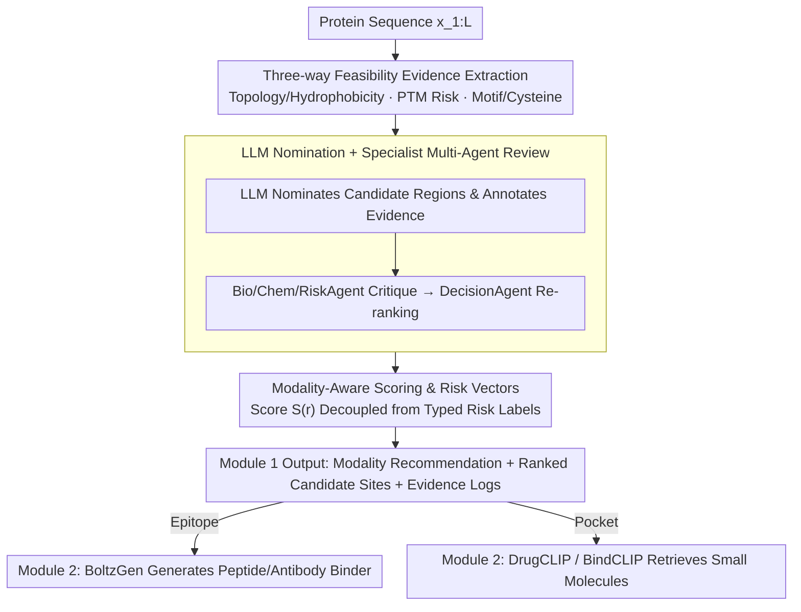

# Site4Drug: Predicting Drug-Binding Target Sites with an AI Agent

**Conference**: ICML 2026  
**arXiv**: [2606.01816](https://arxiv.org/abs/2606.01816)  
**Code**: https://github.com/winterrykim/Site4Drug_Demo  
**Area**: Scientific Computing / Drug Discovery / LLM Agent  
**Keywords**: Drug targets, Epitope discovery, Pocket discovery, LLM Agent, Auditability  

## TL;DR
Site4Drug reframes the upstream bottleneck of "where to target on a protein" as a constraint-prioritized evidence integration problem. The LLM Agent derives feasibility signals such as topology, PTMs, motifs, and cysteines from sequences, outputting ranked candidate sites with scores, risk labels, and traceable logs, while automatically recommending whether to use antibody/peptide or small molecule modalities.

## Background & Motivation

**Background**: Existing drug design pipelines mostly assume "known binding sites." Primary efforts focus on docking, virtual screening, or binder generation (e.g., BoltzGen, DrugCLIP, BindCLIP). Sites are typically extracted from residues within $\le 4\text{Å}$ of a ligand in deposited co-crystal structures or identified from structures using geometric tools (fpocket, RAPID-Net).

**Limitations of Prior Work**: In real-world scenarios, the early phase of "selecting a site before a binder" often stalls. Membrane proteins have only specific physically accessible regions, topology predictions may contradict each other, and PTMs like glycosylation can mask or disrupt candidate epitopes. When downstream screening fails, teams often struggle to distinguish whether the issue lies with the binder model or the site selection, as the rationale for site selection is rarely documented. Geometric methods are limited to canonical pockets, cannot incorporate heterogeneous metadata, and fail to cover non-small-molecule modalities.

**Key Challenge**: Feasibility evidence (topology, PTMs, cysteine networks, motif context) is discrete, heterogeneous, and cross-modal, whereas downstream tools require a single, comparable, and interpretable ranking of sites.

**Goal**: To output (i) recommended binding modalities, (ii) ranked candidate sites, and (iii) evidence summaries, risk labels, and decision logs for each candidate for any protein sequence without relying on a fixed ground truth.

**Key Insight**: LLMs are naturally capable of fused unstructured evidence and generating traceable reasoning chains. Allowing an LLM to simultaneously score small-molecule pockets and antibody epitopes based on unified evidence avoids "chemically plausible but biologically shielded" false positives.

**Core Idea**: Replace single geometric/learning scoring with "constraint-priority + evidence aggregation + multi-agent peer review," transforming site selection into an auditable multi-agent decision process.

## Method

### Overall Architecture
The method addresses the bottleneck in early-stage site selection by consolidating discrete, heterogeneous, and cross-modal feasibility evidence into a single comparable site ranking. The input is solely the protein amino acid sequence $x_{1:L}$. The output is a structured report consisting of modality recommendation $\hat{m}\in\{\text{epitope}, \text{pocket}, \text{other}\}$, $K$ candidate regions $\{r_k\}$ with their scores $S(r_k)$, accessibility/topology labels, evidence summaries, and typed risk labels. The workflow is divided into two modules: Module 1 extracts evidence from the sequence, allows the LLM to nominate candidates, performs scoring and ranking, and uses specialized agents for adversarial review. Module 2 shunts high-scoring candidates to downstream design tools based on modality (epitopes to BoltzGen, pockets to DrugCLIP/BindCLIP).

### Key Designs

**1. Three-way Feasibility Evidence Extraction: Explicitly defining "why a site cannot be chosen"**

Geometric methods only identify canonical pockets and cannot incorporate heterogeneous metadata like PTMs or motifs. If these constraints are buried in the LLM's latent priors, they cannot be audited. Site4Drug extracts three threads of signals in parallel from the raw sequence, all converted into enumerable labels. Topology/hydrophobicity uses Kyte–Doolittle sliding window values with heuristic TM detection to provide coarse labels like `tmd/restricted` or `outside/exposed`, with confidence determined by the margin between the hydrophobicity and the TM threshold. PTM risk utilizes MusiteDeep to predict sites for phosphorylation or glycosylation, expanding each site into a typed local mask (e.g., residue 211 phosphorylation expands to 208–214) and recording candidate overlaps. Motifs and cysteines are identified via ScanProsite, marking `motif-overlap` and using local cysteine counts as lightweight proxies for disulfide constraints. Explicitly enumerating these multi-source biological constraints allows subsequent agents to provide traceable critiques.

**2. LLM Nomination + Specialist Multi-Agent Review: Using Consistent Evidence to Suppress Hallucination**

A single LLM is prone to "self-persuasion." Therefore, Site4Drug introduces a group of agents that perform adversarial reviews using the same evidence. The LLM receives the sequence and a compressed evidence summary to output ranked candidate regions in JSON format. After filtering invalid entries, each candidate is annotated with topology labels, PTM/motif overlaps, cysteine counts, risk labels, and heuristic scores. BioAgent, ChemAgent, and RiskAgent then provide critiques in a claim→evidence→impact format. Finally, the DecisionAgent synthesizes all critiques for the final modality determination and re-ranking. A key constraint is that the DecisionAgent is restricted to citing evidence already present in the context, embedding traceability directly into the decision paradigm.

**3. Modality-Aware Scoring Function and Risk Vectors: Decoupling Scores from Risks**

If risks such as "TM overlap" or "glycosylation cluster interference" are mixed directly into the score, the ranking remains comparable, but the reason for failure is obscured. Site4Drug separates the two: the candidate score conceptually follows:

$$S_0(r) = s_{\text{mode}}(r) - p_{\text{TM}}(r) - p_{\text{PTM}}(r) - p_{\text{motif}}(r)$$

where $s_{\text{mode}}$ represents modality-based preference—epitopes favor polar, non-TM, low-PTM windows, while pockets favor hydrophobic cores with weaker PTM penalties. Simultaneously, a typed risk vector $g(r)$ is maintained, outputting labels such as `TM-overlap`, `PTM-overlap`, `glyco-mask-overlap`, `PTM-dense`, `disulfide-constrained`, `hydrophobic-core`, and `motif-overlap`. This allows operators to distinguish between a candidate that "never touches TM" and one "submerged in a glycosylation cluster" under the same score, making rankings comparable and failures interpretable.

### Loss & Training
The authors initially attempted SFT using structured demonstrations (Qwen3-235B Instruct). However, they found that while SFT checkpoints improved output formatting, they exhibited shortcutting behavior by "repeatedly selecting similar N-terminal windows." Thus, all results reported are based on base model inference. The authors suggest that "biologically grounded reward or preference signals" will be necessary for post-training in the future.

## Key Experimental Results

### Main Results
| Dataset | Setting | Site4Drug Top-1 | Site4Drug Top-5 | Baseline |
|--------|------|-----------------|-----------------|----------|
| RCSB Co-crystal Pocket Set (n=63) | $p<0.05$ Significance Rate | 20/63 | 18/63 | fpocket+AlphaFold3: 20/63; fpocket+RCSB with Ligand: 62/63 |
| ABCD Antibody Epitope Set (n=26) | $p<0.05$ Significance Rate | 8/26 | 11/26 | — |

Without directly processing structures, Site4Drug matched the performance of "providing AlphaFold3 structures to fpocket." The 62/63 performance of fpocket on ligand-containing RCSB structures is due to ligand positions leaking the answer to the geometric detector. GO enrichment shows that Top-1 significant targets are concentrated in the kinase family, aligning with the biological prior that kinases possess recurrent small-molecule accessible pockets.

### Ablation Study
| Configuration | Top-1 Significance Rate | Top-5 Significance Rate | Description |
|------|--------------|--------------|------|
| Site4Drug Full Pipeline | 20/63 | 18/63 | Includes Topology/PTM/Motif/Cys evidence + Specialists |
| Sequence Only + $k=1$ (No Evidence) | 3/63 | 3/63 | Only universal ID and sequence provided |
| Sequence Only + $k=3$ Self-consistency | 7/63 | 6/63 | Three nomination votes |
| Structural Confidence (AlphaFold3 pLDDT) | — | — | Top-1 avg pLDDT > Top-5 avg, only 9 reverse cases |

### Key Findings
- The explicit evidence pipeline outperforms "prompt engineering + sequence input" by an order of magnitude (20 vs. 3–7), proving that Site4Drug's gains come from mandatory feasibility constraints rather than general LLM sequence patterns.
- Even without direct 3D structure input, the average pLDDT of predicted sites is higher than the mean of the corresponding Top-5 regions, indicating that aggregated sequence evidence implicitly recovers "structurally reliable regions."
- An end-to-end demo on EGFR: Passing Top-1 pockets to DrugCLIP yielded small molecules whose overlap with the lapatinib binding site had a hypergeometric test $p < 10^{-11}$. Passing Top-1 epitopes to BoltzGen for peptide binder generation showed that only rank-1 could calculate LIS under the PAE $<12$ threshold; rank-2 fell into Domain III, a known antibody target.
- Kinases dominated the Top-1 significant samples (e.g., pralsetinib targets 11 kinases including DDR1/FGFR1/FGFR2/FLT3/JAK1/JAK2/KDR/NTRK1/NTRK3/PDGFRB/RET). This aligns with biological priors of recurrent pockets in kinases, suggesting Site4Drug captures family-level geometric/sequence features rather than random hits.
- Automatic modality recommendation identifies mixed-modality targets like EGFR and HER2, where both small-molecule and antibody drugs exist, avoiding common pitfalls in pre-specifying modalities manually.

## Highlights & Insights
- "Auditability" is upgraded from a post-hoc report to a design goal: scoring functions, risk labels, and agent critiques are all strictly based on explicit evidence lists. This ensures errors can be traced to specific evidence, a style crucial for strictly regulated drug discovery.
- Rejecting ground truth as absolute truth: The authors correctly note that IEDB immune epitopes and RCSB "4Å ligand neighborhoods" are task-dependent rather than exhaustive labels. Thus, they use hypergeometric tests for relative comparisons rather than absolute regression—a paradigm worth transferring to other scientific discovery tasks lacking gold standards.
- Modality before site: Instead of requiring users to specify "antibody or small molecule" upfront, the same evidence is used to recommend the modality. This avoids classic errors like designing antibodies for intracellular segments of membrane proteins.

## Limitations & Future Work
- Data scale is limited (63 pockets, 26 epitopes), and there is a risk of data leakage with structural models like RAPID-Net trained on scPDB, preventing fair head-to-head comparisons.
- Only processes single sequences and cannot handle quaternary structures—yet many channel protein drugs target multi-subunit assemblies. The authors argue that LLM-Agents are easier to extend to "multi-chain metadata" scenarios than single-sequence geometric tools.
- SFT post-training leads to N-terminal shortcuts, suggesting a need for biological reward signals. Topology inversion risks under concentration dependence and partial sequence inputs were also not covered in the current evaluation.

## Related Work & Insights
- **vs. fpocket / RAPID-Net**: Geometric/structural methods approach the ceiling on ligand-containing structures but cannot incorporate heterogeneous metadata like PTMs, motifs, or modalities, nor can they perform epitope discovery directly. Site4Drug's advantage lies in its unified framework and traceable logs; its disadvantage is a significance ceiling limited by sequence-only evidence.
- **vs. DrugCLIP / BindCLIP / BoltzGen**: These works assume known sites for binder scoring or generation. Site4Drug is orthogonal and upstream, as demonstrated by the Module 2 integration.
- **vs. AI Scientist / AI co-scientist / Virtual Lab Agents**: All belong to "LLM Agents for scientific decision-making," but Site4Drug defines domain-specific feasibility constraints with the highest granularity, representing a flagship application of Agentic science in drug targeting.

## Rating
- Novelty: ⭐⭐⭐⭐ Redefines "site selection" as an auditable agent decision problem with a clear framework.
- Experimental Thoroughness: ⭐⭐⭐ Limited dataset size; only one target underwent a full end-to-end demo.
- Writing Quality: ⭐⭐⭐⭐ Smooth narrative on evidence flow, modality recommendation, and auditability with sufficient appendix details.
- Value: ⭐⭐⭐⭐ High value for real-world drug discovery pipelines regarding interface and logging standards.

<!-- RELATED:START -->

## Related Papers

- [\[ACL 2025\] Retrieve to Explain: Evidence-driven Predictions for Explainable Drug Target Identification](../../ACL2025/computational_biology/retrieve_to_explain_drug_target_identification.md)
- [\[ICLR 2026\] HeurekaBench: A Benchmarking Framework for AI Co-scientist](../../ICLR2026/computational_biology/heurekabench_a_benchmarking_framework_for_ai_co-scientist.md)
- [\[ICML 2026\] From Holo Pockets to Electron Density: GPT-style Drug Design with Density](from_holo_pockets_to_electron_density_gpt-style_drug_design_with_density.md)
- [\[ICML 2026\] EvoEGF-Mol: Evolving Exponential Geodesic Flow for Structure-based Drug Design](evoegf-mol_evolving_exponential_geodesic_flow_for_structure-based_drug_design.md)
- [\[ICLR 2026\] Retrieval-Augmented Generation for Predicting Cellular Responses to Gene Perturbation](../../ICLR2026/computational_biology/retrieval-augmented_generation_for_predicting_cellular_responses_to_gene_perturb.md)

<!-- RELATED:END -->
