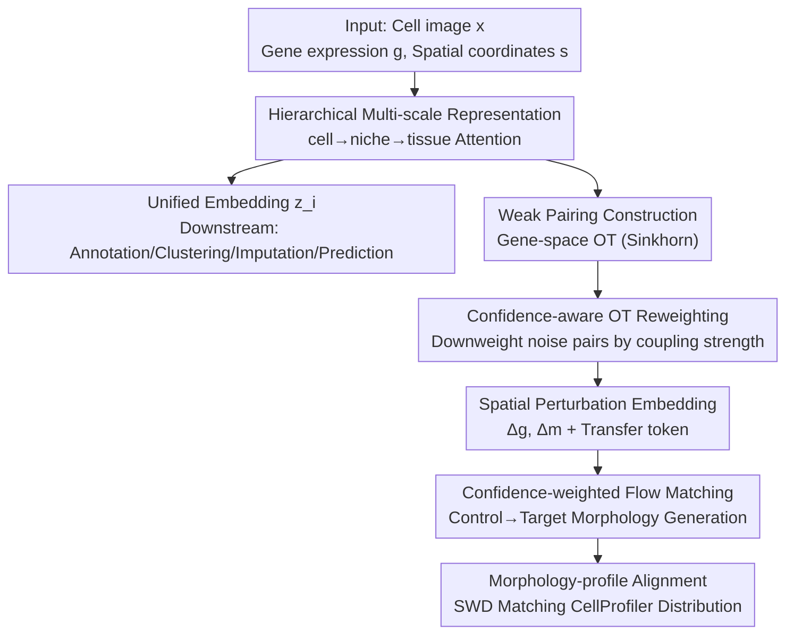

# SPATIA: Multimodal Generation and Prediction of Spatial Cell Phenotypes

**Conference**: ICML2026  
**arXiv**: [2507.04704](https://arxiv.org/abs/2507.04704)  
**Code**: https://github.com/mims-harvard/SPATIA  
**Area**: Computational Biology / Spatial Transcriptomics / Multimodal Generation  
**Keywords**: Spatial Transcriptomics, Cell Phenotype, Flow Matching, Optimal Transport, Multi-scale Representation  

## TL;DR
Addressing the spatial transcriptomics challenge of joint modeling for "cell morphology + gene expression + spatial location," SPATIA utilizes a hierarchical attention mechanism (cell→niche→组织) for unified representation and a **spatial-conditioned morphology generation module** (weak pairing + confidence-aware Optimal Transport reweighting + morphology-profile alignment flow matching). It sets new SOTA across 25.9M cells and 12 tasks for both generation and prediction.

## Background & Motivation
**Background**: Image-based spatial transcriptomics (ST) technologies enable the simultaneous acquisition of **cell microscopic morphology images** and **gene expression profiles** while maintaining tissue integrity. Understanding how cell morphology, gene expression, and spatial organization jointly shape tissue function is a core problem in modeling healthy and diseased cell states.

**Limitations of Prior Work**: Existing methods generally operate in silos and fail to integrate these three dimensions at **cell-level resolution**. Single-cell models (scGPT, Geneformer) ignore morphology or only consider spot-level correlations; pathology models (UNI, HIPT) excel at whole-slide imaging but lose molecular information; vision-language models rely on text annotations and are weak in spatial localization and compositional reasoning. Even recent multimodal ST models are limited to **patch resolution** without cell-level granularity. Simple concatenation fails to capture the non-linear, context-dependent relationships in spatial omics.

**Key Challenge**: These deficiencies can be categorized into three points: (1) Inability to fully capture cell-level morphology and expression variation (key to defining cell identity); (2) Lack of cross-scale spatial interaction modeling (how local niches and global tissue jointly govern biological processes); (3) Inability to predict **microenvironment-dependent** morphological changes. Specifically for the third point: in destructive ST technologies, the same cell lacks **"before/after perturbation paired" observations** (measurement is destructive), preventing supervised learning as in standard image synthesis.

**Goal**: Decomposition into two coupled sub-problems: **Unified Representation Learning** (learning a multimodal, cross-scale cell embedding $\mathbf{z}_i=\mathcal{F}(x_i,\mathbf{g}_i,\mathbf{s}_i)$) and **Spatial Conditioned Generation** (predicting the target morphology after perturbation in the absence of paired data).

**Key Insight**: Utilize **hierarchical attention** (cell→niche→tissue) for multi-scale unified representation; use **optimal transport in the gene expression space** to construct weak pairings, then employ **confidence-aware flow matching** to learn the morphology transition from "pre-perturbation → post-perturbation." This transforms the "no paired data" deadlock into a learnable problem of "weak pairing + uncertainty reweighting."

## Method

### Overall Architecture
The input to SPATIA is a spatial transcriptomics dataset $\mathcal{D}=\{(x_i,\mathbf{g}_i,\mathbf{s}_i)\}$ (cell morphology crops $x_i$, gene expression vectors $\mathbf{g}_i$, and spatial coordinates $\mathbf{s}_i$). It serves two objectives: **Representation** (outputting a unified embedding $\mathbf{z}_i$ for downstream tasks like annotation, clustering, and imputation) and **Generation** (outputting the target morphology $x_{tgt}$ after perturbation). The architecture consists of two main parts: the first is **Hierarchical Representation Learning**, where cell-level cross-attention fuses morphology tokens with gene tokens, niche-level spatial patches model intercellular interactions, and tissue-level global transformers capture long-range dependencies to project a unified $\mathbf{z}_i$. The second is **Spatial Conditioned Morphology Generation**, which uses gene-space Optimal Transport (OT) to construct control-target weak pairs, followed by confidence-aware flow matching to learn a velocity field that "flows" the control morphology toward the target, ensured by morphology-profile alignment.

### Key Designs

**1. Hierarchical Multi-scale Representation: cell→niche→tissue three-level attention preserving "cell identity" and "spatial context" simultaneously**

To address the failure of existing methods to capture cell-level variation while modeling cross-scale interactions, SPATIA learns and fuses three levels of embeddings: $\mathbf{z}_i=\mathcal{F}_{\text{fusion}}(\mathbf{z}_{cell},\mathbf{z}_{niche},\mathbf{z}_{tissue})$. At the cell level, images are encoded via ViT to obtain $\mathbf{X}_{cell}$ and genes via a pre-trained single-cell encoder to obtain $\mathbf{X}_{gene}$, which are fused via cross-attention: $\mathbf{z}_{cell}=\mathrm{Attn}(Q=\mathbf{X}_{cell},K=\mathbf{X}_{gene},V=\mathbf{X}_{gene})$. The niche level clusters neighboring cells into queries $\mathbf{q}_{niche}$ combined with niche images via cross-attention for $\mathbf{z}_{niche}$. The tissue level aggregates niche embeddings with positional encodings to capture long-range dependencies. A critical design choice: **niche/tissue serve as "contextual signals" and do not replace cell-level modeling**, ensuring cell identity and morphology-expression correspondence are preserved.

**2. Weak Pairing + Confidence-aware OT Reweighting: Constructing pairs via gene-space OT and downweighting noise by reliability**

Since destructive ST cannot obtain images of the same cell before and after perturbation, SPATIA constructs **control-target weak pairs** $(x_{ctrl},\mathbf{g}_{ctrl};x_{tgt},\mathbf{g}_{tgt})$ between biologically related cells (e.g., within the same lineage or consistent niche regions). Pairing is performed using **entropy-regularized optimal transport** in the reduced PCA expression space via Sinkhorn iterations to obtain the coupling matrix $\mathbf{P}^*$. Crucially, **OT is performed in the gene expression space rather than the image space** to avoid trivial morphology matching. Since weak pairings are inherently noisy, the authors use the **OT coupling strength as a reliability signal**: for each $x_{ctrl}$, confidence is defined as $c(x_{ctrl})=\max_{x_{tgt}}\mathbf{P}^*(x_{ctrl},x_{tgt})$, normalized into training weights:

$$w(x_{ctrl})=\frac{c(x_{ctrl})^\gamma}{\mathbb{E}_{x_{ctrl}}[c(x_{ctrl})^\gamma]},$$

where $\gamma$ controls the penalty strength on uncertain pairs. This allows high-confidence pairs to contribute more to the velocity field while maintaining sample diversity under weak supervision.

**3. Confidence-weighted Flow Matching + Spatial Perturbation Embedding: Modeling "control → target" as conditional generation with explicit molecular and morphological transfer encoding**

Morphology generation is formulated as conditional flow matching. Given a control image and an OT-matched target, endpoints $\bm{\ell}_{ctrl},\bm{\ell}_{tgt}$ are encoded to define ground-truth velocity $\bm{u}=\bm{\ell}_{tgt}-\bm{\ell}_{ctrl}$. A conditional velocity field $v_\theta(\bm{\ell}_\lambda, \lambda \mid \mathbf{z}_{cond})$ is trained on the linear bridge $\bm{\ell}_\lambda=(1-\lambda)\bm{\ell}_{ctrl}+\lambda\bm{\ell}_{tgt}$ with $\lambda\sim\mathcal{U}(0,1)$. The loss is defined as $\mathcal{L}_{FM}^w=\mathbb{E}_\lambda[w\lVert v_\theta-\bm{u}\rVert_2^2]$. The condition $\mathbf{z}_{cond}$ fuses instance-specific context $\mathbf{z}_{ctrl}$ with a **Spatial Perturbation Embedding** $\mathbf{z}_{pert}$. The latter encodes molecular/morphological shifts for a transfer type $\tau$: gene shift signature $\Delta\mathbf{g}=\mathbb{E}[\mathbf{g}_{tgt}-\mathbf{g}_{ctrl}]$ and morphology shift signature $\Delta\mathbf{m}=\mathbb{E}[M(x_{tgt})-M(x_{ctrl})]$ (where $M$ is a CellProfiler feature). During inference, only the control image and pre-computed $\mathbf{z}_{pert}$ are needed, **requiring no features from the target cell**, thus avoiding target leakage and providing explicit morphological semantics. A **condition-contrastive regularization** $\mathcal{L}_{cond}$ is also applied to enhance transfer identifiability.

**4. Morphology-profile Alignment: Aligning generated and real distributions in the evaluation feature space for biological fidelity**

To ensure biological fidelity, SPATIA performs distribution alignment in the **same morphological feature space used for evaluation**. Using a frozen morphology encoder $\phi(\cdot)$, the **Sliced Wasserstein Distance** aligns the generated distribution $\mathcal{D}_{gen}$ with the real distribution $\mathcal{D}_{real}$: $\mathcal{L}_{morph}=\mathrm{SWD}(\mathcal{D}_{gen},\mathcal{D}_{real})$. This upgrades the objective from "looking realistic" to "being biologically correct" regarding diagnostic morphological features.

### Loss & Training
The pre-training phase uses reconstruction-based self-supervision for unified cell embeddings. The total loss for the generation phase is:

$$\mathcal{L}=\mathcal{L}_{FM}^w+\rho\,\mathcal{L}_{cond}+\lambda_{morph}\mathcal{L}_{morph}.$$

Training was conducted on 4 H100 GPUs for 25K steps with a hierarchical batching strategy. Evaluation used a donor-disjoint 70/10/20 split to prevent data leakage of donor-specific morphology/expression/spatial context between sets.

## Key Experimental Results

### Data and Setup
The authors introduced **MIST** (Multi-scale dataset for Image-based ST), comprising 74 sources, 17 tissues, 60 donors, and 4 platforms across three nested scales: MIST-C (25.9M cells), MIST-N (2M niches), and MIST-T (20K tissue entries). SPATIA was compared against 18 models across 12 tasks.

### Main Results: Conditional Morphology Generation

| Method | FID↓ | KID↓ | Wass.Corr↑ | KS↑ |
|------|------|------|------------|-----|
| CellFlux | 64.1 | 2.31 | 0.83 | 0.57 |
| MorphDiff | 70.5 | 2.52 | 0.81 | 0.54 |
| GeneFlow | 62.4 | 2.20 | 0.87 | 0.58 |
| SPATIA (base) | 59.5 | 2.09 | 0.90 | 0.61 |
| + Reweight | 59.1 | 2.06 | 0.91 | 0.62 |
| **+ Morph. Loss** | **58.5** | **2.01** | **0.94** | **0.65** |

SPATIA outperforms all generative baselines. Components such as **confidence reweighting** and **morphology loss** consistently improve performance, with the morphology loss having the most significant impact on biological fidelity metrics (Wass.Corr 0.90→0.94).

### Ablation Study: Cross-platform Clustering

| Model | Xenium ARI↑ | Xenium NMI↑ | CosMx ARI↑ | CosMx NMI↑ |
|------|-------------|-------------|------------|------------|
| scGPT | 0.730 | 0.678 | 0.507 | 0.472 |
| scFoundation | 0.727 | 0.754 | 0.530 | 0.560 |
| UCE | 0.618 | 0.718 | 0.516 | 0.555 |
| **SPATIA** | **0.735** | **0.806** | **0.542** | 0.490 |

SPATIA leads in most metrics for frozen embedding clustering on Xenium and CosMx platforms, indicating that multi-scale multimodal representations are effective at preserving biological structure and mitigating batch effects.

### Key Findings
- **Morphology-profile alignment is the largest contributor**: It significantly boosts biological fidelity, proving that "visual realism" does not equal "biological correctness."
- **Confidence reweighting stabilizes weak supervision**: This consistently improves all generation metrics by mitigating the influence of noisy OT pairs.
- **Hierarchical representation provides cross-platform robustness**: Superior performance on heterogeneous platforms demonstrates the transferability of unified multi-scale embeddings.

## Highlights & Insights
- **Bypassing the "paired data" bottleneck**: The paradigm of gene-space OT pairing + confidence-weighted flow matching is highly transferable to any destructive measurement problem where only population data is available.
- **Group-level transfer signatures for zero target leakage**: Using $\Delta\mathbf{g},\Delta\mathbf{m}$ as conditions ensures the model is grounded in morphological semantics without needing target cell features during inference.
- **Training alignment within the evaluation feature space**: Using SWD on CellProfiler features directly incorporates downstream evaluation targets into the training objective.
- **Contextual niche/tissue modeling without replacing cell tokens**: This design choice preserves cell identity, allowing the model to perform well on both cell-level and tissue-level tasks.

## Limitations & Future Work
- **Fundamental assumption of OT weak pairing**: Pairing quality relies on lineage/niche consistency; systemic errors in lineage annotation may affect the model.
- **Group-level signatures may average out heterogeneity**: Populations with high intra-transition variance might be underfitted by average $\Delta\mathbf{m}$ and $\Delta\mathbf{g}$ signatures.
- **Computationally intensive**: Training requires 4×H100 and massive serialized datasets, creating a high barrier to entry for replication.

## Related Work & Insights
- **Compared to single-cell models (scGPT / scFoundation)**: These models ignore morphology; SPATIA integrates it via cross-attention with spatial context.
- **Compared to pathology models (UNI / GigaPath)**: These excel at vision but lack molecular detail; SPATIA provides a unified molecular-morphology representation.
- **Compared to generative baselines (CellFlux / GeneFlow)**: SPATIA is superior across both visual realism and biological fidelity axes due to its noise-handling and alignment strategies.

## Rating
- Novelty: ⭐⭐⭐⭐⭐ 
- Experimental Thoroughness: ⭐⭐⭐⭐⭐ 
- Writing Quality: ⭐⭐⭐⭐ 
- Value: ⭐⭐⭐⭐⭐ 

<!-- RELATED:START -->

## Related Papers

- [\[ICML 2026\] What Makes a Representation Good for Single-Cell Perturbation Prediction?](what_makes_a_representation_good_for_single-cell_perturbation_prediction.md)
- [\[CVPR 2026\] Predicting Spatial Transcriptomics from Histology Images via High-Order Multi-Cell Interaction Modeling](../../CVPR2026/computational_biology/predicting_spatial_transcriptomics_from_histology_images_via_high-order_multi-ce.md)
- [\[CVPR 2026\] HyperST: Hierarchical Hyperbolic Learning for Spatial Transcriptomics Prediction](../../CVPR2026/computational_biology/hyperst_hierarchical_hyperbolic_learning_for_spatial_transcriptomics_prediction.md)
- [\[CVPR 2026\] HINGE: Adapting a Pre-trained Single-Cell Foundation Model to Spatial Gene Expression Generation from Histology Images](../../CVPR2026/computational_biology/adapting_a_pre-trained_single-cell_foundation_model_to_spatial_gene_expression_g.md)
- [\[AAAI 2026\] SpaCRD: Multimodal Deep Fusion of Histology and Spatial Transcriptomics for Cancer Region Detection](../../AAAI2026/computational_biology/spacrd_multimodal_deep_fusion_of_histology_and_spatial_transcriptomics_for_cance.md)

<!-- RELATED:END -->
