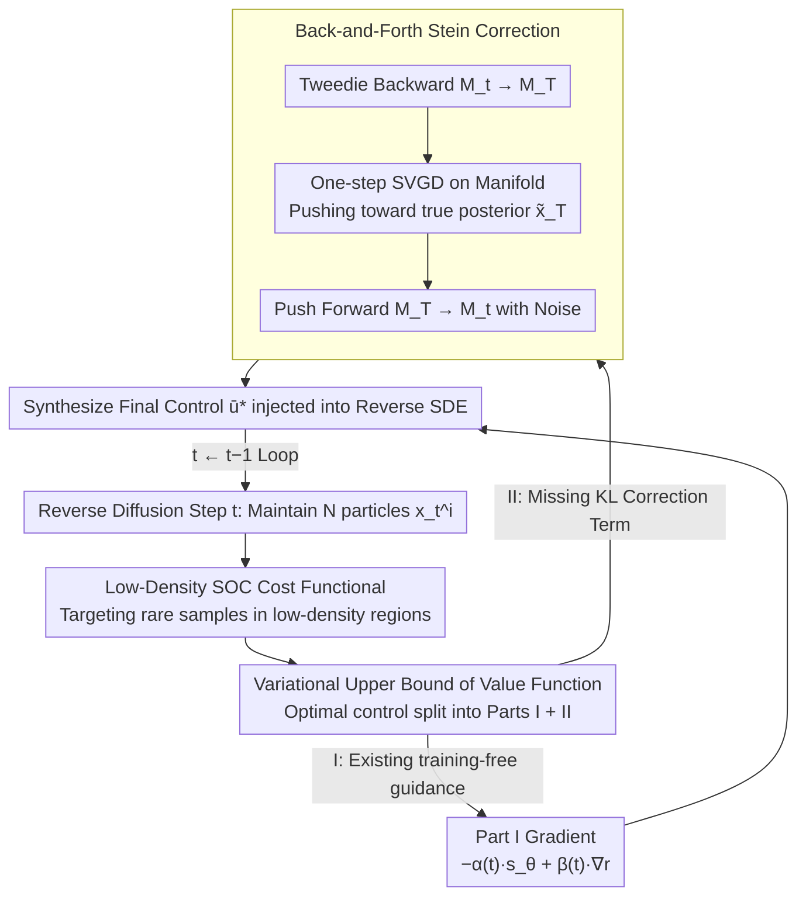

# Stein Diffusion Guidance: Training-Free Posterior Correction for Sampling Beyond High-Density Regions

**Conference**: ICML 2026  
**arXiv**: [2507.05482](https://arxiv.org/abs/2507.05482)  
**Code**: To be confirmed  
**Area**: Diffusion Models / Training-Free Guidance / Posterior Sampling / Molecular Generation  
**Keywords**: Diffusion Guidance, Stochastic Optimal Control, Stein Variational Inference, Tweedie's Formula, Low-Density Sampling  

## TL;DR
SDG unifies the two paradigms of "training-free diffusion guidance" and "Stochastic Optimal Control (SOC) posterior sampling." By deriving a variational upper bound for the guidance term via SOC, it identifies that existing Tweedie-based methods overlook a KL regularization term. Consequently, it designs a "Back-and-Forth" correction mechanism using Stein Variational Gradient Descent—mapping from the noise manifold $\mathcal{M}_t$ back to the data manifold $\mathcal{M}_T$ via Tweedie, applying Stein correction, and pushing forward back to $\mathcal{M}_t$. This approach significantly outperforms baselines such as DPS, LGD, MPGD, and UGD in both image guidance and molecule-protein docking tasks, demonstrating particular strength in exploring rare, high-value samples in low-density regions.

## Background & Motivation

**Background**: There are currently two main approaches to guide diffusion models using an external classifier or reward $r(\mathbf{x})$ during generation. One is **classifier-based guidance** (Dhariwal-Nichol), which requires the classifier to be trained on all noise levels $t$, incurring high engineering costs. The other is **training-free guidance** (DPS, LGD, MPGD, UGD), which utilizes Tweedie's formula $\mathbb{E}[\mathbf{x}_T|\mathbf{x}_t]=(\mathbf{x}_t+\gamma^2(t)\mathbf{s}_\theta(\mathbf{x}_t))/\eta(t)$ to map a noisy sample to an estimate of the clean data $\hat{\mathbf{x}}_T$ in one step, followed by gradient backpropagation through a pre-trained "clean classifier" $r(\hat{\mathbf{x}}_T)$. The latter has recently become mainstream as it avoids retraining classifiers.

**Limitations of Prior Work**: Tweedie's formula provides an **expectation** rather than a sample from the true posterior $p(\mathbf{x}_T|\mathbf{x}_t)$—it collapses the entire posterior distribution into a point estimate. While the bias is manageable when $\mathbf{x}_t$ resides in high-density regions of the data distribution, scenarios such as drug discovery or rare-event modeling specifically care about **low-density regions**. In these areas, the score model $\mathbf{s}_\theta$ is inherently less accurate, and the single-step extrapolation of Tweedie further amplifies errors, often leading the guidance to pull samples off the generation manifold, resulting in molecules that are neither drug-like nor synthesizable.

**Key Challenge**: Another paradigm based on SOC (Uehara, Domingo-Enrich, etc.) can theoretically provide the "true posterior sampling" optimal control $\mathbf{u}^*$. However, calculating the value function $V(\mathbf{x},t)$ requires simulating the entire reverse SDE and backpropagating gradients, making the memory and computational overhead nearly prohibitive for high-resolution images or large molecules. There is a fundamental **trade-off between speed (Tweedie) and correctness (SOC)**.

**Goal**: (1) Derive a **new cost functional** from SOC first principles that explicitly includes "low-density rewards" to support rare sample exploration. (2) Prove that existing Tweedie-based methods only optimize two terms in the SOC upper bound, **missing a KL regularization term**, thereby explaining their failure in low-density regions. (3) Design an efficient correction mechanism to recover the missing KL term without the expensive full-trajectory backpropagation required by SOC.

**Key Insight**: The authors note that recovering the KL term $D_{\mathrm{KL}}(q(\mathbf{x}_T|\mathbf{x}_t)\|p(\mathbf{x}_T|\mathbf{x}_t))$ essentially involves moving the proposal posterior $q$ (the approximation provided by Tweedie) toward the true posterior $p$. This is precisely what Stein Variational Gradient Descent (SVGD) excels at—it can approximate any target distribution with a known score using kernel-weighted gradients of a set of particles, **without requiring the closed-form density of $p$**. The remaining problem is estimating the score of the true posterior using the diffusion score $\mathbf{s}_\theta$.

**Core Idea**: By identifying the KL correction term in the SOC upper bound, the method uses the Stein operator to perform a one-step correction on Tweedie particles on the data manifold $\mathcal{M}_T$. The corrected particles are then pushed back to the noise manifold $\mathcal{M}_t$ to serve as an additional control signal superimposed on the original guidance.

## Method

### Overall Architecture
SDG addresses the inaccuracy of training-free guidance in low-density regions by reformulating it as a Stochastic Optimal Control (SOC) problem. At each reverse diffusion step $t$, it maintains $N$ particles $\{\mathbf{x}_t^i\}_{i=1}^N$. These particles are mapped to the data manifold $\mathcal{M}_T$ via Tweedie's formula, where the Stein operator pushes them toward the true posterior $p(\mathbf{x}_T|\mathbf{x}_t)$. They are then pushed forward back to the noise manifold $\mathcal{M}_t$, and a "low-density + reward" gradient is added to form the final control $\bar{\mathbf{u}}^*(\mathbf{x}_t,t)$ injected into the reverse SDE. This workflow requires no classifier training or diffusion model fine-tuning, serving as a plug-and-play module. Its theoretical value lies in precisely identifying the term missing in Tweedie-based methods through the variational upper bound of the SOC optimal control and recovering it with minimal cost.

### Key Designs

**1. Low-Density SOC Cost Functional: Targeting Rare Samples in Low-Density Regions**

Tasks like drug discovery care about low-density regions, but original SOC only optimizes rewards without distinguishing density levels. Author adds a Dirac time impulse $\delta(s-t)$ to the standard SOC framework of state cost $f$ and terminal cost $g$, constructing a new cost functional $\widetilde{J}(\mathbf{u},\mathbf{x},t)=\mathbb{E}_{\mathbb{P}^{\mathbf{u}}}[\int_t^T (\tfrac12\|\mathbf{u}\|^2 + \alpha(s)\log p_s(\mathbf{x}^{\mathbf{u}}_s)\delta(s-t))ds - \beta(t)r(\mathbf{x}_T^{\mathbf{u}})]$, where $\alpha(t)$ adjusts low-density annealing intensity and $\beta(t)$ adjusts the reward weight.

Lemma 2.2 identifies the controlled marginal distribution $p_t^{\mathbf{u}}(\mathbf{x}_t)\propto p_t^{1-\alpha(t)}(\mathbf{x}_t)\exp(\beta(t)r(\mathbf{x}_T))$, corresponding to the optimal control $\mathbf{u}^*(\mathbf{x},t)=\sigma(t)\nabla_{\mathbf{x}}\log\frac{p_t^{\mathbf{u}}(\mathbf{x})}{p_t(\mathbf{x})}$. This form is intuitive: the data density is annealed to the $1-\alpha(t)$ power before multiplying the reward energy. The $\alpha(t)\log p_t$ term is a differentiable expression for "moving toward rarity"—increasing $\alpha$ flattens the target distribution, encouraging particles to leave the main peaks of the training set.

**2. Variational Upper Bound: Exposing the Overlooked KL Term**

Since the true SOC value function $V(\mathbf{x},t)=-\log\frac{p_t^{\mathbf{u}}}{p_t}$ is not directly computable, the authors introduce a proposal distribution $q\in\mathcal{Q}$. Applying Jensen's inequality yields an upper bound $\bar{V}(\mathbf{x},t,q)=\alpha(t)\log p_t(\mathbf{x})-\beta(t)\mathbb{E}_{\mathbf{x}_T\sim q}[r(\mathbf{x}_T)]+D_{\mathrm{KL}}(q(\mathbf{x}_T|\mathbf{x}_t)\|p(\mathbf{x}_T|\mathbf{x}_t))$. The critical observation is that the first two terms are exactly the "score + reward gradient" used by DPS/LGD/MPGD/UGD, while the third KL term is collectively omitted. This term is the source of sampling errors in low-density regions where Tweedie's point estimate serves as a coarse approximation with $D_{\mathrm{KL}}\neq 0$.

The optimal control is decomposed into two parts:

$$\bar{\mathbf{u}}^*/\sigma(t)=\underbrace{[-\alpha(t)\mathbf{s}_\theta(\mathbf{x}_t)+\beta(t)\nabla_{\mathbf{x}_t}\mathbb{E}_q[r(\mathbf{x}_T)]]}_{\text{Part I: Existing training-free guidance}}+\underbrace{[-\nabla_{\mathbf{x}_t}D_{\mathrm{KL}}(q\|p)]}_{\text{Part II: Stein Correction Term}}$$

Part II is computed using SVGD (Lemma 2.1), as SVGD is one of the few methods needing only the score and not the normalizer, fitting the diffusion scenario. The steepest KL descent direction is given by $\phi^*(\mathbf{x}_T^i)=\mathbb{E}_{\mathbf{x}_T^j\sim q}[\nabla_{\mathbf{x}_T^j}\log p(\mathbf{x}_T^j|\mathbf{x}_t^j)\,k(\mathbf{x}_T^i,\mathbf{x}_T^j)+\nabla_{\mathbf{x}_T^j}k(\mathbf{x}_T^i,\mathbf{x}_T^j)]$, with the bandwidth of the RBF kernel $k$ set via the median heuristic $m=\mathrm{med}(\|\cdot\|^2)/\log N$.

**3. Back-and-Forth Stein Correction: Step-wise KL Correction without Full-Trajectory Backprop**

Directly calculating $\phi^*$ for $\mathbf{x}_t^i$ requires second-order derivatives (Jacobian-vector products) of the score, causing memory explosion in high dimensions. The authors circumvent this via a manifold loop: (a) **Backward $\mathcal{M}_t\to\mathcal{M}_T$**: Map $\{\mathbf{x}_t^i\}$ to $\{\mathbf{x}_T^i\}$ via Tweedie as an initial proposal. (b) **Stein Step on Manifold**: Update particles to $\{\tilde{\mathbf{x}}_T^i\}$ on $\mathcal{M}_T$ using SVGD with step size $\epsilon(t)$. The true posterior score is approximated via Lemma 3.3 as $\nabla_{\mathbf{x}_T}\log p(\mathbf{x}_T|\mathbf{x}_t)\approx \mathbf{s}_\theta(\mathbf{x}_T)-\eta(t)\mathbf{s}_\theta(\mathbf{x}_t)$, requiring only two score forward passes. (c) **Forward $\mathcal{M}_T\to\mathcal{M}_t$**: Re-add noise to map particles back to $t$, superimpose Part I gradients, and inject into the reverse SDE.

This replaces the SOC-level correction requiring second-order derivatives with "two score forwards + one kernel derivative," reducing costs by an order of magnitude. Corollary 3.5 further proves that as $\epsilon(t)\to 0$, the Stein correction degenerates to the Langevin correction of Song et al. 2020b, making SDG a strict generalization.

### Loss & Training
SDG is entirely training-free. The score model $\mathbf{s}_\theta$ and rewards $r(\cdot)$ are taken from existing checkpoints. The primary hyperparameters are particle count $N$, $\alpha(t)$, the $\beta(t)$ schedule, and Stein step size $\epsilon(t)$. The paper tests four variants: full SDG ($\alpha>0,\epsilon>0$), SDG♣ (no Stein, equivalent to baseline), SDG♡ ($\alpha=0,\epsilon>0$, Stein without low-density), and SDG♢ ($\alpha>0,\epsilon=0$, degenerated to Langevin correction).

## Key Experimental Results

### Main Results (Image Guidance + Molecular Docking)

| Task | Dataset/Target | Metric | DPS | LGD | MPGD | UGD | SDG♡ |
|------|---------------|------|-----|-----|------|-----|------|
| Label Guidance | ImageNet | Acc(%) ↑ | 50.1 | 32.2 | 38.0 | 45.9 | **54.0** |
| Gaussian Deblur | — | FID ↓ | 172.0 | 102 | 88.3 | 94.2 | 105.4 |
| Super Resolution | — | LPIPS ↓ | 0.420 | 0.360 | 0.283 | 0.249 | **0.228** |
| T2I Style Transfer | WikiArt + Partiprompts | Style ↓ | 5.06 | 5.42 | 4.08 | 4.97 | **3.05** |

| Method | Fa7 Hit % | 5ht1b Hit % | Jak2 Hit % | Parp1 Hit % |
|--------|-----------|-------------|------------|-------------|
| GDSS (Base Diffusion) | 0.368 | 4.667 | 1.167 | 1.933 |
| MOOD (Classifier-guided) | 0.733 | 18.673 | **9.200** | 7.017 |
| SDG♣ (No Stein) | 0.299 | 0.033 | 0.000 | 0.671 |
| **SDG (Full)** | **1.156** | **22.690** | 9.167 | **8.780** |

### Ablation Study

| Configuration | Jak2 Hit % | Description |
|------|-----------|------|
| Full SDG ($\alpha>0,\epsilon>0$) | 9.167 | Full method |
| SDG♣ (No Stein correction) | 0.000 | KL term removed; failure in low-density regions |
| SDG♡ ($\alpha=0$, Reward only) | 8.312 | No explicit low-density exploration; ~1% drop |
| SDG♢ ($\epsilon=0$, Langevin) | 8.722 | Langevin performs slightly worse than SDG |

### Key Findings
- **Stein correction is the "on/off switch" for molecular tasks**: Removing it (SDG♣) leads to near-zero success rates on protein targets (e.g., Jak2: 0.000%), while its inclusion increases hit ratios by two to three orders of magnitude.
- **Low-density annealing is essential**: SDG♡ ($\alpha=0$) consistently underperforms compared to full SDG, proving that explicitly flattening the target distribution to $p^{1-\alpha}$ is necessary for rare sample exploration.
- **Stein outperforms Langevin**: SDG♢ (Langevin decay) loses to full SDG due to the lack of inter-particle repulsive forces. SVGD's kernel repulsion prevents particles from collapsing into the same local mode, improving diversity (Figure 7 shows nearly 100% uniqueness).
- **Reward over-estimation phenomenon**: Figure 6 reveals that without Stein correction, reward models give falsely high scores while the physical properties (QED/SA) of generated molecules are poor. Stein correction aligns reward estimates with actual attributes and stabilizes the score norm, confirming it keeps samples within the generation manifold.

## Highlights & Insights
- **Seamless alignment of theory and method**: Deriving a variational upper bound from SOC where each term corresponds to a known method—this is a rare example of using mathematics to explain why existing SOTA is insufficient and then adding exactly what is missing.
- **Back-and-Forth as a key engineering trick**: By mapping to $\mathcal{M}_T$ via Tweedie before applying SVGD, high-dimensional Jacobian-vector products are replaced by two score forwards, making SOC-level corrections feasible for plug-and-play use.
- **Transferable to any score-based posterior sampling**: SDG is model-agnostic. As long as $\mathbf{s}_\theta$ and a differentiable reward $r$ exist, it can be applied to text, video, or 3D generation requiring OOD/rare sample exploration.
- **Unification of Langevin, Tweedie, and SOC**: Corollary 3.5 shows Langevin as a limit case, while the KL correction perspective organizes disparate training-free guidance works into a single mathematical framework.

## Limitations & Future Work
- While lower than full SOC, the computational overhead remains higher than pure Tweedie methods. At each step, $N$ particles must be maintained and the kernel matrix computed; analysis of the $N \to \infty$ limit is missing.
- The schedules for $\alpha(t)$, $\beta(t)$, and $\epsilon(t)$ require manual tuning. The paper provides formulas in Appendix C.2, but systematic discussion on selection across diverse tasks is absent.
- Lemma 3.3 assumes Gaussian forward kernels $p_{t|T}(\mathbf{x}_t|\mathbf{x}_T)=\mathcal{N}(\eta(t)\mathbf{x}_T,\gamma^2(t)I)$ for approximating the true posterior score, which may not apply directly to non-Gaussian diffusion or Flow Matching.
- Experiments focus on ImageNet and four protein targets. Validation on larger models (e.g., SDXL, AlphaFold3) to see if scalability holds is an open question.

## Related Work & Insights
- **vs DPS/LGD/MPGD/UGD**: These optimize only the first two terms of the derived upper bound. This paper proves they miss the KL term and demonstrates consistent superiority across 5 tasks by adding it—elevating "empirical SOTA" to "theoretical SOTA."
- **vs Uehara et al. 2024 (SOC fine-tuning)**: While the SOC path is correct, it requires full-trajectory backprop. SDG approximates this via Stein correction to achieve near-optimal performance at much lower costs.
- **vs MOOD / FREED (Molecular-specific guidance)**: Despite being a general framework, SDG outperforms MOOD in 3 out of 4 protein targets, showing that a general method with proper correction can beat domain-specific designs.
- **vs Corso et al. 2024 (Repulsive diverse sampling)**: While that work uses repulsive forces for non-i.i.d. sampling, the repulsion here is intrinsic to SVGD for the steepest KL descent. The resulting diversity is a "theorized" byproduct rather than just a heuristic.

## Rating
- Novelty: ⭐⭐⭐⭐⭐ Fuses SOC, Tweedie, and Stein into a unified framework and identifies missing components in prior art.
- Experimental Thoroughness: ⭐⭐⭐⭐ 4 image tasks + 4 molecular targets + various ablations, though lacking large-scale text-to-image models.
- Writing Quality: ⭐⭐⭐⭐⭐ Lemmas, Propositions, and Corollaries are clearly articulated; Figure 2 effectively illustrates the architecture.
- Value: ⭐⭐⭐⭐⭐ A general-purpose upgrade for training-free posterior sampling that can be applied to many future diffusion scenarios.

<!-- RELATED:START -->

## Related Papers

- [\[ICML 2026\] On the Collapse of Generative Paths: A Criterion and Correction for Diffusion Steering](on_the_collapse_of_generative_paths_a_criterion_and_correction_for_diffusion_ste.md)
- [\[NeurIPS 2025\] Split Gibbs Discrete Diffusion Posterior Sampling](../../NeurIPS2025/computational_biology/split_gibbs_discrete_diffusion_posterior_sampling.md)
- [\[ICML 2026\] From Holo Pockets to Electron Density: GPT-style Drug Design with Density](from_holo_pockets_to_electron_density_gpt-style_drug_design_with_density.md)
- [\[ICML 2026\] Temporal Score Rescaling for Temperature Sampling in Diffusion and Flow Models](temporal_score_rescaling_for_temperature_sampling_in_diffusion_and_flow_models.md)
- [\[ICML 2026\] Learning the Neighborhood: Contrast-Free Multimodal Self-Supervised Molecular Graph Pretraining](learning_the_neighborhood_contrast-free_multimodal_self-supervised_molecular_gra.md)

<!-- RELATED:END -->
