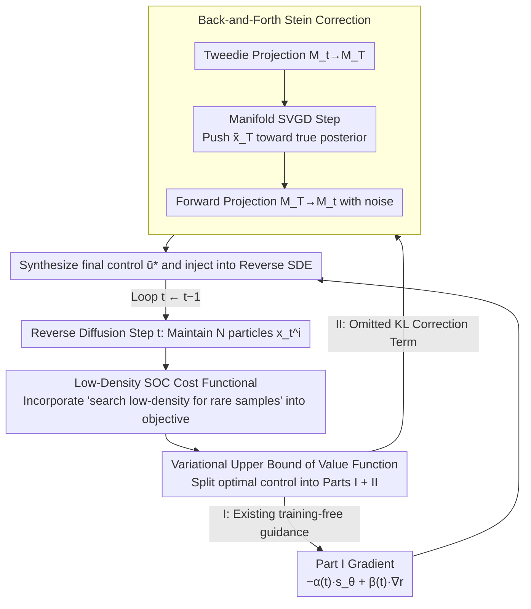

# Stein Diffusion Guidance: Training-Free Posterior Correction for Sampling Beyond High-Density Regions

**Conference**: ICML 2026  
**arXiv**: [2507.05482](https://arxiv.org/abs/2507.05482)  
**Code**: To be confirmed  
**Area**: Diffusion Models / Training-Free Guidance / Posterior Sampling / Molecule Generation  
**Keywords**: Diffusion Guidance, Stochastic Optimal Control (SOC), Stein Variational Inference, Tweedie's Formula, Low-Density Sampling  

## TL;DR
SDG unifies the "training-free diffusion guidance" and "Stochastic Optimal Control (SOC) posterior sampling" paradigms. By deriving the variational upper bound of the guidance term via SOC, it is revealed that existing Tweedie-based methods omit a crucial KL regularization term. Consequently, the authors design a "back-and-forth" correction mechanism using Stein Variational Gradient Descent (SVGD): first performing a Tweedie reverse-projection to the data manifold $\mathcal{M}_T$, then applying a Stein correction, and finally forward-projecting back to the noise manifold $\mathcal{M}_t$. This approach significantly outperforms baselines such as DPS/LGD/MPGD/UGD in both image guidance and molecule-protein docking tasks, demonstrating particular strength in sampling rare, high-value samples from low-density regions.

## Background & Motivation

**Background**: Guiding diffusion models during generation to follow external classifiers or rewards $r(\mathbf{x})$ currently follows two main paths. One is **classifier-based guidance** (Dhariwal-Nichol), which requires expensive training of classifiers across all noise levels $t$. The other is **training-free guidance** (DPS, LGD, MPGD, UGD), which utilizes Tweedie's formula $\mathbb{E}[\mathbf{x}_T|\mathbf{x}_t]=(\mathbf{x}_t+\gamma^2(t)\mathbf{s}_\theta(\mathbf{x}_t))/\eta(t)$ to map noisy samples to an estimate of clean data $\hat{\mathbf{x}}_T$ in a single step, followed by gradient backpropagation through a "clean classifier" $r(\hat{\mathbf{x}}_T)$. The latter has become the mainstream due to its no-retraining requirement.

**Limitations of Prior Work**: Tweedie's formula provides an **expectation** rather than a sample from the true posterior $p(\mathbf{x}_T|\mathbf{x}_t)$, essentially collapsing the posterior distribution into a point estimate. While the bias is manageable when $\mathbf{x}_t$ lies in high-density regions of the data distribution, scenarios like drug discovery or rare event simulation focus precisely on **low-density regions**. In these areas, the score model $\mathbf{s}_\theta$ is inherently inaccurate, and Tweedie's one-step extrapolation further amplifies these errors, often leading samples off the data manifold, resulting in molecules that are neither drug-like nor synthesizable.

**Key Challenge**: Alternative routes via Stochastic Optimal Control (SOC) (e.g., Uehara, Domingo-Enrich) can theoretically provide the optimal control $\mathbf{u}^*$ for "true posterior sampling." however, computing the value function $V(\mathbf{x}, t)$ requires simulating and backpropagating through the entire reverse SDE, making the memory and computational costs prohibitive for high-resolution images or large molecules. There is a fundamental conflict between **Speed (Tweedie)** and **Correctness (SOC)**.

**Goal**: (1) Derive a **new cost functional** from SOC first principles that explicitly includes a "low-density reward" term to naturally support rare sample exploration. (2) Prove that existing Tweedie-style methods only optimize two terms in the SOC upper bound, **omitting a KL regularization term**, thereby explaining their failure in low-density regions. (3) Design an efficient correction mechanism to restore the missing KL term without introducing the extreme overhead of full-trajectory backpropagation in SOC.

**Key Insight**: The authors observe that restoring the KL term $D_{\mathrm{KL}}(q(\mathbf{x}_T|\mathbf{x}_t)\|p(\mathbf{x}_T|\mathbf{x}_t))$ essentially involves moving the proposal posterior $q$ (the approximation given by Tweedie) toward the true posterior $p$. This is exactly where Stein Variational Gradient Descent (SVGD) excels—it can approximate any target distribution with a known score using kernel-weighted gradients of a set of particles, **without requiring the closed-form density of $p$**. The remaining problem is how to use the diffusion score $\mathbf{s}_\theta$ to estimate the score of the true posterior.

**Core Idea**: Formulate the SOC upper bound, identify the KL correction term, use a Stein operator on the data manifold $\mathcal{M}_T$ to perform a one-step correction on Tweedie particles, and then forward-project back to the noise manifold $\mathcal{M}_t$ as an additional control signal superimposed on the original guidance.

## Method

### Overall Architecture
SDG aims to solve the inaccuracy of training-free diffusion guidance in low-density regions by reformulating it as an SOC problem. At each reverse diffusion step $t$, it maintains $N$ particles $\{\mathbf{x}_t^i\}_{i=1}^N$. It first maps particles to the data manifold $\mathcal{M}_T$ using Tweedie's formula, applies a Stein operator to push them toward the true posterior $p(\mathbf{x}_T|\mathbf{x}_t)$, and then forward-projects back to the noise manifold $\mathcal{M}_t$ to combine with "low-density + reward" gradients, forming the final control $\bar{\mathbf{u}}^*(\mathbf{x}_t,t)$ injected into the reverse SDE. This process requires no classifier training or model fine-tuning and acts as a plug-and-play module. Its theoretical value lies in precisely identifying which term existing methods lack and restoring it with minimal cost.

### Key Designs

**1. Low-Density SOC Cost Functional: Objective for Rare Sample Exploration**

Tasks like drug discovery often prioritize low-density regions, but original SOC only optimizes for rewards without differentiating density. Tweedie methods inherit this structure. The authors introduce a Dirac time impulse $\delta(s-t)$ into the standard SOC framework of state cost $f$ and terminal cost $g$, constructing a new functional $\widetilde{J}(\mathbf{u},\mathbf{x},t)=\mathbb{E}_{\mathbb{P}^{\mathbf{u}}}[\int_t^T (\tfrac12\|\mathbf{u}\|^2 + \alpha(s)\log p_s(\mathbf{x}^{\mathbf{u}}_s)\delta(s-t))ds - \beta(t)r(\mathbf{x}_T^{\mathbf{u}})]$, where $\alpha(t)$ adjusts low-density annealing intensity and $\beta(t)$ adjusts reward weight.

From Lemma 2.2, the controlled marginal distribution is $p_t^{\mathbf{u}}(\mathbf{x}_t)\propto p_t^{1-\alpha(t)}(\mathbf{x}_t)\exp(\beta(t)r(\mathbf{x}_T))$, corresponding to the optimal control $\mathbf{u}^*(\mathbf{x},t)=\sigma(t)\nabla_{\mathbf{x}}\log\frac{p_t^{\mathbf{u}}(\mathbf{x})}{p_t(\mathbf{x})}$. This is intuitive: the data density is annealed to the power of $1-\alpha(t)$, then multiplied by the reward energy. The $\alpha(t)\log p_t$ term provides a differentiable expression for moving toward sparsity—increasing $\alpha$ flattens the target distribution and amplifies low-density regions, encouraging particles to leave the main peaks of the training set.

**2. Variational Upper Bound: Exposing the Omitted KL Term**

The true SOC value function $V(\mathbf{x},t)=-\log\frac{p_t^{\mathbf{u}}}{p_t}$ is not directly computable. The authors introduce a proposal distribution $q\in\mathcal{Q}$ and apply Jensen's inequality to derive the upper bound $\bar{V}(\mathbf{x},t,q)=\alpha(t)\log p_t(\mathbf{x})-\beta(t)\mathbb{E}_{\mathbf{x}_T\sim q}[r(\mathbf{x}_T)]+D_{\mathrm{KL}}(q(\mathbf{x}_T|\mathbf{x}_t)\|p(\mathbf{x}_T|\mathbf{x}_t))$. Critically, the first two terms represent the "score + reward gradient" used by DPS/LGD/MPGD/UGD, while the third KL term is universally omitted—this term is the root cause of sampling errors in low-density regions, as Tweedie only provides a coarse point estimation where $D_{\mathrm{KL}}\neq 0$.

The optimal control is decomposed into:

$$\bar{\mathbf{u}}^*/\sigma(t)=\underbrace{[-\alpha(t)\mathbf{s}_\theta(\mathbf{x}_t)+\beta(t)\nabla_{\mathbf{x}_t}\mathbb{E}_q[r(\mathbf{x}_T)]]}_{\text{I: Prev. training-free guidance}}+\underbrace{[-\nabla_{\mathbf{x}_t}D_{\mathrm{KL}}(q\|p)]}_{\text{II: Stein Correction Term}}$$

Part II is calculated via SVGD (Lemma 2.1). SVGD is chosen as it only requires the score rather than the normalizer, fitting the diffusion scenario. The steepest descent direction for KL is $\phi^*(\mathbf{x}_T^i)=\mathbb{E}_{\mathbf{x}_T^j\sim q}[\nabla_{\mathbf{x}_T^j}\log p(\mathbf{x}_T^j|\mathbf{x}_t^j)\,k(\mathbf{x}_T^i,\mathbf{x}_T^j)+\nabla_{\mathbf{x}_T^j}k(\mathbf{x}_T^i,\mathbf{x}_T^j)]$, using an RBF kernel $k$ with bandwidth $m$ determined by a median heuristic.

**3. Back-and-Forth Stein Correction: Efficient Step-wise Correction**

Directly calculating $\phi^*$ on $\mathbf{x}_t^i$ would require second-order derivatives (Jacobian-vector products) of the score with respect to $\mathbf{x}_t$, which is memory-prohibitive. The authors bypass this through a "manifold projection" strategy: (a) **Reverse Projection $\mathcal{M}_t\to\mathcal{M}_T$**: Use Tweedie to map $\{\mathbf{x}_t^i\}$ to $\{\mathbf{x}_T^i\}$ as identifying proposal posteriors. (b) **Manifold Stein Step**: Perform a single SVGD update on $\mathcal{M}_T$ with step size $\epsilon(t)$ along $\phi^*$ to obtain $\{\tilde{\mathbf{x}}_T^i\}$. The true posterior score is approximated via Lemma 3.3 as $\nabla_{\mathbf{x}_T}\log p(\mathbf{x}_T|\mathbf{x}_t)\approx \mathbf{s}_\theta(\mathbf{x}_T)-\eta(t)\mathbf{s}_\theta(\mathbf{x}_t)$, requiring only two score forward passes. (c) **Forward Projection $\mathcal{M}_T\to\mathcal{M}_t$**: Re-inject noise to pull corrected particles back to time $t$, superimposing the Part I low-density reward gradient to form the final $\bar{\mathbf{u}}^*$.

This reduces an SOC-level correction requiring second-order derivatives to "two score forwards + one kernel derivative," lowering costs by an order of magnitude. Corollary 3.5 further proves that as $\epsilon(t)\to 0$, the Stein correction reduces to the Langevin correction of Song et al. 2020b, making SDG a strict generalization of existing correction methods.

### Loss & Training
SDG is completely training-free: the score model $\mathbf{s}_\theta$ and reward $r(\cdot)$ are taken from existing checkpoints. The primary hyperparameters are particle count $N$, schedules for $\alpha(t)$ and $\beta(t)$, and Stein step size $\epsilon(t)$. The paper evaluates four ablation variants: Full SDG ($\alpha>0,\epsilon>0$), SDG♣ (No Stein, equivalent to baseline), SDG♡ ($\alpha=0,\epsilon>0$, Stein only), and SDG♢ ($\alpha>0,\epsilon=0$, equivalent to Langevin correction).

## Key Experimental Results

### Main Results (Image Guidance + Molecule Docking)

| Task | Dataset/Target | Metric | DPS | LGD | MPGD | UGD | SDG♡ |
|------|---------------|------|-----|-----|------|-----|------|
| Label Guidance | ImageNet | Acc(%) ↑ | 50.1 | 32.2 | 38.0 | 45.9 | **54.0** |
| Gaussian Deblur | — | FID ↓ | 172.0 | 102 | 88.3 | 94.2 | 105.4 |
| Super Resolution | — | LPIPS ↓ | 0.420 | 0.360 | 0.283 | 0.249 | **0.228** |
| T2I Style Transfer | WikiArt + Partiprompts | Style ↓ | 5.06 | 5.42 | 4.08 | 4.97 | **3.05** |

| Method | Fa7 Hit % | 5ht1b Hit % | Jak2 Hit % | Parp1 Hit % |
|--------|-----------|-------------|------------|-------------|
| GDSS (Base) | 0.368 | 4.667 | 1.167 | 1.933 |
| MOOD (classifier-guided) | 0.733 | 18.673 | **9.200** | 7.017 |
| SDG♣ (No Stein) | 0.299 | 0.033 | 0.000 | 0.671 |
| **SDG (full)** | **1.156** | **22.690** | 9.167 | **8.780** |

### Ablation Study

| Configuration | Jak2 Hit % | Description |
|------|-----------|------|
| Full SDG ($\alpha>0,\epsilon>0$) | 9.167 | Complete method |
| SDG♣ (No Stein correction) | 0.000 | KL term removed; complete failure in low-density regions |
| SDG♡ ($\alpha=0$, Reward only) | 8.312 | No explicit low-density exploration; ~1% drop |
| SDG♢ ($\epsilon=0$, Langevin) | 8.722 | Langevin performs slightly worse than SDG |

### Key Findings
- **Stein correction is the critical "on-off switch" for molecular tasks**: Removing it (SDG♣) results in near-zero hits on protein targets (e.g., Jak2: 0.000%). Its inclusion boosts hit ratios by two to three orders of magnitude.
- **Low-density annealing is essential**: SDG♡ ($\alpha=0$) consistently underperforms full SDG, proving that flattening the target distribution to $p^{1-\alpha}$ is necessary for rare sample exploration.
- **Stein outperforms Langevin**: The repulsion force inherent in SVGD prevents particles from collapsing into a single local mode, leading to better diversity as proved by the near 100% uniqueness in Figure 7.
- **Correction of reward over-estimation**: Figure 6 reveals that without Stein, the reward model provides falsely high scores while the physical properties (QED/SA) of generated molecules are poor. Stein correction aligns the reward with physical reality and prevents score norm divergence.

## Highlights & Insights
- **Seamless Theory-Method Alignment**: The derivation from the SOC variational upper bound ensures each term corresponds to a known or new component—a rare example of using mathematics to identify precisely why SOTA methods fall short and then providing the solution.
- **Back-and-Forth as a Critical Engineering Trick**: By performing SVGD on $\mathcal{M}_T$ after a Tweedie projection, the authors replace high-dimensional Jacobian-vector products with two score forwards, making SOC-level corrections computationally feasible.
- **Universal Adaptability for Score-Based Posterior Sampling**: SDG is model-agnostic. It can be applied to any scenario requiring OOD/rare samples (e.g., text, video, 3D generation) as long as $\mathbf{s}_\theta$ and a differentiable reward $r$ exist.
- **Unification of Langevin, Tweedie, and SOC**: Corollary 3.5 shows Langevin correction as a limit case, unifying fragmented training-free guidance research within a single mathematical framework.

## Limitations & Future Work
- While lower than full SOC, the computational cost exceeds pure Tweedie methods. Maintaining $N$ particles and computing kernel matrices increases memory pressure; the study lacks an analysis of large-scale limits for $N$.
- The schedules for $\alpha(t)$, $\beta(t)$, and $\epsilon(t)$ require manual tuning. While Appendix C.2 provides some forms, there is no systematic discussion on selection across diverse tasks.
- Lemma 3.3 assumes a Gaussian forward kernel $p_{t|T}(\mathbf{x}_t|\mathbf{x}_T)=\mathcal{N}(\eta(t)\mathbf{x}_T,\gamma^2(t)I)$; applicability to non-Gaussian diffusion (e.g., discrete diffusion, Flow Matching) remains to be verified.
- Experiments focus on ImageNet/WikiArt and four proteins; validation on larger models like Stable Diffusion XL or AlphaFold3 is needed.

## Related Work & Insights
- **vs DPS / LGD / MPGD / UGD**: These only optimize the first two terms of the upper bound. This paper proves they omit the KL term and demonstrates consistent gains across five tasks by restoring it.
- **vs Uehara et al. 2024**: While the SOC route is correct, it requires full-trajectory backprop. SDG approximates this correctness with plug-and-play efficiency.
- **vs MOOD / FREED**: Unlike these domain-specific molecular guidance designs, SDG is a general framework that nonetheless outperforms MOOD on three of four protein targets.
- **vs Corso et al. 2024 (Repulsive force for diversity)**: While that work used repulsion for non-i.i.d. sampling, the repulsion here is an intrinsic part of SVGD's steepest descent for KL, making diversity a theoretical by-product rather than a heuristic.

## Rating
- Novelty: ⭐⭐⭐⭐⭐ (Successfully weaves SOC, Tweedie, and Stein into a unified framework).
- Experimental Thoroughness: ⭐⭐⭐⭐ (Comprehensive across 8 tasks/targets with detailed ablations).
- Writing Quality: ⭐⭐⭐⭐⭐ (Clear derivations and intuitive visual aids like Figure 2).
- Value: ⭐⭐⭐⭐⭐ (A general-purpose upgrade for training-free posterior sampling).

## Related Papers

- [\[ICML 2026\] On the Collapse of Generative Paths: A Criterion and Correction for Diffusion Steering](on_the_collapse_of_generative_paths_a_criterion_and_correction_for_diffusion_ste.md)
- [\[NeurIPS 2025\] Split Gibbs Discrete Diffusion Posterior Sampling](../../NeurIPS2025/computational_biology/split_gibbs_discrete_diffusion_posterior_sampling.md)
- [\[ICML 2026\] Plug-and-Play Guidance for Discrete Diffusion Models via Gradient-Informed Logit Correction](plug-and-play_guidance_for_discrete_diffusion_models_via_gradient-informed_logit.md)
- [\[ICML 2026\] Temporal Score Rescaling for Temperature Sampling in Diffusion and Flow Models](temporal_score_rescaling_for_temperature_sampling_in_diffusion_and_flow_models.md)
- [\[ICML 2026\] From Holo Pockets to Electron Density: GPT-style Drug Design with Density](from_holo_pockets_to_electron_density_gpt-style_drug_design_with_density.md)

<!-- RELATED:END -->

<!-- RELATED:START -->

## Related Papers

- [\[ICML 2026\] Plug-and-Play Guidance for Discrete Diffusion Models via Gradient-Informed Logit Correction](plug-and-play_guidance_for_discrete_diffusion_models_via_gradient-informed_logit.md)
- [\[ICML 2026\] On the Collapse of Generative Paths: A Criterion and Correction for Diffusion Steering](on_the_collapse_of_generative_paths_a_criterion_and_correction_for_diffusion_ste.md)
- [\[NeurIPS 2025\] Split Gibbs Discrete Diffusion Posterior Sampling](../../NeurIPS2025/computational_biology/split_gibbs_discrete_diffusion_posterior_sampling.md)
- [\[ICML 2026\] Temporal Score Rescaling for Temperature Sampling in Diffusion and Flow Models](temporal_score_rescaling_for_temperature_sampling_in_diffusion_and_flow_models.md)
- [\[ICML 2026\] From Holo Pockets to Electron Density: GPT-style Drug Design with Density](from_holo_pockets_to_electron_density_gpt-style_drug_design_with_density.md)

<!-- RELATED:END -->
