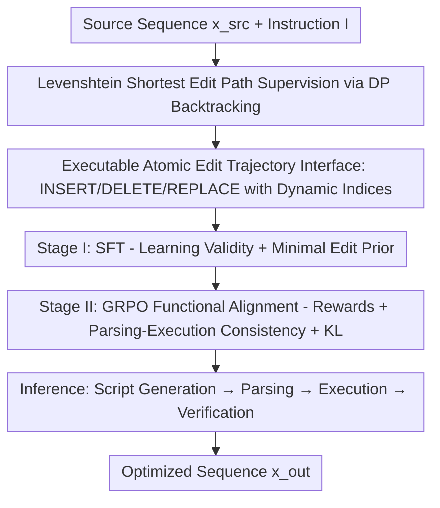

# STRIDE: Post-Training LLMs to Reason and Refine Bio-Sequences via Edit Trajectories

**Conference**: ICML2026  
**arXiv**: [2603.03573](https://arxiv.org/abs/2603.03573)  
**Code**: https://github.com/daiheng-zhang/STRIDE  
**Area**: Computational Biology  
**Keywords**: Bio-sequence optimization, edit trajectories, post-training, GRPO, protein/molecule design

## TL;DR
STRIDE reformulates "protein/molecule sequence optimization" as "trajectory planning in edit space." It trains an LLM to explicitly generate executable atomic edit scripts (INSERT/DELETE/REPLACE). By using Levenshtein shortest edit paths for SFT and GRPO-style reinforcement learning to align with task rewards, STRIDE increases the success rate of protein all-action stress tests from 42% to 89% and novelty from 47% to 97% in variable-length, syntactically-constrained discrete sequence optimization.

## Background & Motivation
**Background**: The design and optimization of proteins and small molecules are core to computational biology. Most real-world scenarios involve **goal-oriented refinement** rather than de novo generation—starting from an existing precursor and applying minimal edits in a vast discrete space to improve target properties (e.g., fluorescence, drug-likeness) while satisfying hard constraints like amino acid signatures or SMILES grammar.

**Limitations of Prior Work**: Two mainstream paradigms have inherent flaws. **Discrete diffusion models** support iterative refinement but lack a "controllable discrete edit interface"—especially for insertions/deletions, which rely on specialized transition parameterizations and sampling, making it difficult to enforce domain validity at intermediate steps. **Autoregressive LLMs** work natively on discrete tokens but are **short-sighted** during optimization: locally reasonable edits may fail the long-range planning required to traverse rugged fitness landscapes under tight edit budgets.

**Key Challenge**: Refinement tasks require an edit interface that is "iterative, controllable/executable, and variable-length." Diffusion provides iteration but lacks controllable discrete edits, while LLMs provide discrete tokens but suffer from short-sightedness. Both lack an "explicit, verifiable, variable-length edit strategy."

**Goal**: To enable models to directly output a series of executable atomic edits (INSERT/DELETE/REPLACE), making every step a transparent, parsable, executable, and verifiable program. Post-training is used to ensure these trajectories maintain validity and align with downstream task rewards.

**Key Insight**: Rather than learning a separate stochastic transition process, the model is trained to treat editing as "trajectory planning in edit space." Using the shortest edit path from Levenshtein alignment as a conservative structural prior biases the model toward "local, minimal changes" rather than global rewriting.

**Core Idea**: Use "executable edit trajectories" as a unified control interface, combined with a two-stage post-training pipeline—"SFT for learning valid minimal edits + GRPO for task reward alignment"—to transform discrete sequence optimization into a plannable and verifiable editing process.

## Method

### Overall Architecture
STRIDE (Sequence Trajectory Refinement via Iterative Discrete Editing) takes a source sequence $x_{\mathrm{src}}$ (wild-type protein or initial molecule) and an instruction $I$ as input, and outputs an optimized sequence $x_{\mathrm{out}}$. The intermediate product is an atomic edit script wrapped in `<edit_traj>...</edit_traj>`. The pipeline follows two stages: **Data stage** uses Levenshtein dynamic programming to backtrack "source $\to$ target" pairs into shortest edit scripts as supervision signals; **Training stage** first performs SFT to teach the model to "output valid minimal edit trajectories + final sequences," followed by GRPO-style reinforcement learning to align trajectories with task rewards while using KL divergence to the SFT policy to prevent degradation. During inference, the policy generates an edit script, which is parsed, sequentially executed on $x_{\mathrm{src}}$, and verified to produce the final sequence.

### Key Designs

**1. Executable Atomic Edit Trajectory Interface: Treating "How to Modify" as an Executable Program**

Addressing the pain point of uncontrollable diffusion and unverifiable LLM outputs, STRIDE defines edit trajectories as executable programs acting on an evolving sequence. At step $t$, action $a_t = (op_t, p_t, v_t)$ acts on the current sequence $x_{t-1}$ of length $L_{t-1}$. **Indices are 0-based and always interpreted relative to the current sequence $x_{t-1}$ (not the initial $x_{\mathrm{src}}$).** Specifically: $\text{INSERT}(p,v)$ inserts token $v$ before position $p$ (appends to the end if $p=L_{t-1}$); $\text{DELETE}(p)$ removes $x_{t-1}[p]$; $\text{REPLACE}(p,v)$ sets $x_{t-1}[p] \leftarrow v$. Since indices are re-evaluated after every operation, the script execution is unambiguous. The sequence format is $(x_{\mathrm{src}}, I) \to \langle\text{edit\_traj}\rangle T^\star \langle/\text{edit\_traj}\rangle \to x_{\mathrm{out}}$. This interface naturally supports variable-length, index-consistent editing where every step is transparent and verifiable.

**2. Levenshtein Shortest Edit Path Supervision: Backtracking DP for "Minimal Change" Examples**

To obtain high-quality supervision, given $x_{\mathrm{src}}$ and $x_{\mathrm{tgt}}$, the minimal cost edit script $T^\star$ is solved under unit-cost operations. The Levenshtein DP table $D \in \mathbb{Z}_{\geq 0}^{(m+1) \times (n+1)}$ is computed with boundaries $D[i,0]=i$ and $D[0,j]=j$, using the recurrence:

$$D[i,j]=\min\{\,D[i-1,j]+1,\;D[i,j-1]+1,\;D[i-1,j-1]+\mathbb{I}[x^{\mathrm{src}}_i\neq x^{\mathrm{tgt}}_j]\,\}.$$

The path is backtracked from $(m,n)$, and alignment steps are **replayed forward** on a mutable copy of $x_{\mathrm{src}}$ to maintain dynamic indices (as per Design 1). If multiple precursors exist in the DP table, tie-breaking is deterministic to ensure reproducibility. Notably, while endpoints are valid sequences, intermediate states in the shortest path are not guaranteed to be domain-valid (e.g., valid SMILES), so the script serves as process supervision while validity is evaluated on the final output.

**3. Stage I — SFT: Learning to Write Valid and Minimal Edits**

To ensure the model learns to write legal, concise edits, for each training pair $(x_{\mathrm{src}}, x_{\mathrm{tgt}})$ and instruction $I$, $T^\star$ is derived. The prompt $q=(x_{\mathrm{src}}, I)$ and completion $y=[\langle\text{edit\_traj}\rangle T^\star\langle/\text{edit\_traj}\rangle; x_{\mathrm{tgt}}]$ are constructed. The model is trained to **generate the edit trajectory before the final target sequence**. Standard teacher-forcing minimizes negative log-likelihood:

$$\mathcal{L}_{\mathrm{SFT}}(\theta)=-\mathbb{E}_{(q,y)\sim\mathcal{D}}\sum_{t=1}^{|y|}\log\pi_\theta(y_t\mid q, y_{<t}).$$

Supervising both process ($T^\star$) and result ($x_{\mathrm{tgt}}$) introduces two inductive biases: **Validity bias** (learning the implicit prior of producing valid sequences) and **Minimal edit bias** (learning concise, non-redundant paths). The resulting policy $\pi_{\mathrm{ref}}$ serves as the KL reference for Stage II.

**4. Stage II — GRPO Functional Alignment: Aligning Trajectories with Task Rewards**

Since SFT only mimics shortest paths and may not optimize target properties, Stage II uses GRPO-style policy optimization to maximize task rewards while regularizing toward $\pi_{\mathrm{ref}}$ using KL. For each prompt, a group of $G$ completions $\{o_i\}$ is sampled to compute group-normalized advantage $A_i=\frac{r_i-\mu_r}{\sigma_r+\epsilon}$. The objective is a PPO-style clipped surrogate with KL:

$$J_{\mathrm{GRPO}}(\theta)=\mathbb{E}\Big[\tfrac{1}{G}\sum_i\tfrac{1}{|o_i|}\sum_t\min(\rho_{i,t}A_i,\ \mathrm{clip}(\rho_{i,t},1-\varepsilon,1+\varepsilon)A_i)-\beta D_{\mathrm{KL}}(\pi_\theta\|\pi_{\mathrm{ref}})\Big].$$

**A critical constraint is "parsing-execution consistency"**: If trajectory $T$ is unparsable, unexecutable, or if executing $T$ on $x_{\mathrm{src}}$ does not reproduce $x_{\mathrm{out}}$, the reward is set to $r=0$. This forces the model to ensure its "reasoning" matches its "result." Rewards are task-specific: For proteins, $R_{\mathrm{protein}}=\mathbb{I}[1\leq d\leq 3]+\mathbb{I}[f_{\mathrm{fl}}(x_{\mathrm{out}})>f_{\mathrm{fl}}(x_{\mathrm{src}})]$; for molecules, $R_{\mathrm{mol}}=(\mathbb{I}_{\mathrm{valid}}\cdot R_{\mathrm{prop}}\cdot R_{\mathrm{sim}})+R_{\mathrm{stable}}$.

### Function Example
For molecule optimization: The user provides SMILES `CC(=O)Nc1cc(NC(=O)N[C@@H](CCO)c2cccs2)ccc1C` with the instruction "improve drug-likeness while maintaining similarity." The model generates `<edit_traj> DELETE(21) REPLACE(31,2) INSERT(7,=) ... </edit_traj>`. The parser executes these sequentially, producing the final SMILES `CC(=O)N=Cc1ccc(C=NC(=O)N[C@@H](CCO)c2cccs2)cc1`. RL validates that executing the script indeed results in this output; otherwise, the reward is zeroed.

## Key Experimental Results

### Main Results
**Proteins (GFP Fluorescence, All-Action Stress Test)**: Performance across $N=100$ samples per source sequence.

| Method | Success | Unique | Novelty |
| :--- | :--- | :--- | :--- |
| Random Perturbation | 5/100 | 5/5 | 3/5 |
| Zero-Shot | 54/100 | 8/54 | 4/8 |
| Edit Flow | 79/100 | 51/79 | 13/51 |
| Vanilla SFT | 42/100 | 30/42 | 14/30 |
| **STRIDE** | **89/100** | **78/89** | **76/78** |

STRIDE improves success rate from Vanilla SFT's 42% to 89% and novelty from ~47% to ~97%. Compared to Edit Flow (which supports variable length but has low novelty), STRIDE maintains high success while significantly increasing novelty.

**Molecules (DrugAssist 14 Tasks × 500 Molecules)**:

| Metric | STRIDE-SFT | STRIDE-GSPO |
| :--- | :--- | :--- |
| Valid ↑ | 0.750 | **0.909** |
| Success (Strict) ↑ | 0.579 | **0.676** |
| Success (Loose) ↑ | 0.684 | **0.782** |
| Shift Rate ↓ | 0.983 | **0.755** |

GSPO alignment significantly improves validity, strict success rate, and controllability (lower non-target property shift) compared to SFT alone.

### Ablation Study

| Configuration | Key Finding |
| :--- | :--- |
| Direct Generation (No Trajectory) | Novelty 23 (GFP replace-only) |
| Structured Edit Tokens Only | Novelty 23 $\to$ 40; gains come from the executable interface, not just long text |
| Full STRIDE | Best balanced performance; Rank 1 in AAV all-action metrics |

### Key Findings
- **Executable edit interface is the source of gain**: Ablations show structured edit tokens themselves drive novelty, rather than free-form natural language reasoning.
- **Variable-length advantage**: While methods perform similarly in replace-only tasks, Vanilla SFT drops to 42% success in all-action modes (including indel), whereas STRIDE remains robust at 89%.
- **Transferability**: The same recipe transfers to AAV capsid optimization, ranking first across three metrics, indicating the interface generalizes across different protein landscapes.
- **RL improves controllability**: In molecules, GSPO reduces the Shift Rate from 0.983 to 0.755, suppressing unwanted property drift.

## Highlights & Insights
- **Optimization as Trajectory Planning**: Instead of stochastic transitions, optimization is framed as executable atomic edits, combining diffusion-style refinement with LLM discrete token priors.
- **Consistency Reward Gate**: Zeroing rewards for "script-result mismatches" prevents reward hacking and ensures that interpretability is a hard constraint, not just a byproduct.
- **Dynamic Indexing**: The design where indices are relative to the current state enables unambiguous execution of variable-length scripts, providing a "programmable editing" interface.

## Limitations & Future Work
- **Oracle Dependence**: Performance is measured against oracles/predictors. Since these are often trained on limited data, absolute metrics in all-action modes should be interpreted as "controllability stress tests."
- **Shortest Path Bias**: Using Levenshtein paths may bias the model toward minimal edits, which might be too conservative for targets requiring major structural overhaul.
- **Manual Thresholds**: Reward functions (e.g., $1 \leq d \leq 3$ budget) and property thresholds $\tau_p$ involve manual tuning.

## Related Work & Insights
- **vs. Discrete Diffusion (EvoDiff/DPLM)**: Diffusion lacks explicit executable strategies and is often fixed-length. STRIDE outperforms EvoDiff in GFP success rates and supports robust variable-length editing.
- **vs. Edit Flow**: Edit Flow models edits via CTMC but shows low novelty in all-action settings. STRIDE's LLM-based trajectory generation better balances success and novelty.
- **vs. PepThink-R1/Mol-R1**: While those works use natural language CoT, STRIDE's gain specifically stems from the structured "executable edit interface."

## Rating
- Novelty: ⭐⭐⭐⭐⭐ Reformulating optimization as executable trajectory planning with consistency gates is highly novel.
- Experimental Thoroughness: ⭐⭐⭐⭐ Extensive testing across proteins and molecules, including ablation and transfer studies.
- Writing Quality: ⭐⭐⭐⭐ Clear progression from motivation to design and results.
- Value: ⭐⭐⭐⭐⭐ Provides a controllable, verifiable, and variable-length interface for discrete sequence engineering.

<!-- RELATED:START -->

## Related Papers

- [\[ICLR 2026\] CDBridge: A Cross-omics Post-training Bridge Strategy for Context-aware Biological Modeling](../../ICLR2026/computational_biology/cdbridge_a_cross-omics_post-training_bridge_strategy_for_context-aware_biologica.md)
- [\[ICML 2026\] CoSiNE: Conditional Site-Independent Neural Evolution Model for Antibody Sequences](conditionally_site-independent_neural_evolution_of_antibody_sequences.md)
- [\[ICLR 2026\] Thompson Sampling via Fine-Tuning of LLMs](../../ICLR2026/computational_biology/thompson_sampling_via_fine-tuning_of_llms.md)
- [\[ICML 2026\] Active Timepoint Selection for Learning Measure-Valued Trajectories](active_timepoint_selection_for_learning_measure-valued_trajectories.md)
- [\[ICLR 2026\] CellDuality: Unlocking Biological Reasoning in LLMs with Self-Supervised RLVR](../../ICLR2026/computational_biology/cellduality_unlocking_biological_reasoning_in_llms_with_self-supervised_rlvr.md)

<!-- RELATED:END -->
## Related Papers

- [\[ICLR 2026\] Protein as a Second Language for LLMs](../../ICLR2026/computational_biology/protein_as_a_second_language_for_llms.md)
- [\[ICLR 2026\] Thompson Sampling via Fine-Tuning of LLMs](../../ICLR2026/computational_biology/thompson_sampling_via_fine-tuning_of_llms.md)
- [\[ICLR 2026\] EvoFlows: Evolutionary Edit-Based Flow-Matching for Protein Engineering](../../ICLR2026/computational_biology/evoflows_evolutionary_edit-based_flow-matching_for_protein_engineering.md)
- [\[ICML 2026\] Active Timepoint Selection for Learning Measure-Valued Trajectories](active_timepoint_selection_for_learning_measure-valued_trajectories.md)
- [\[NeurIPS 2025\] Post Hoc Regression Refinement via Pairwise Rankings](../../NeurIPS2025/computational_biology/post_hoc_regression_refinement_via_pairwise_rankings.md)

<!-- RELATED:END -->
