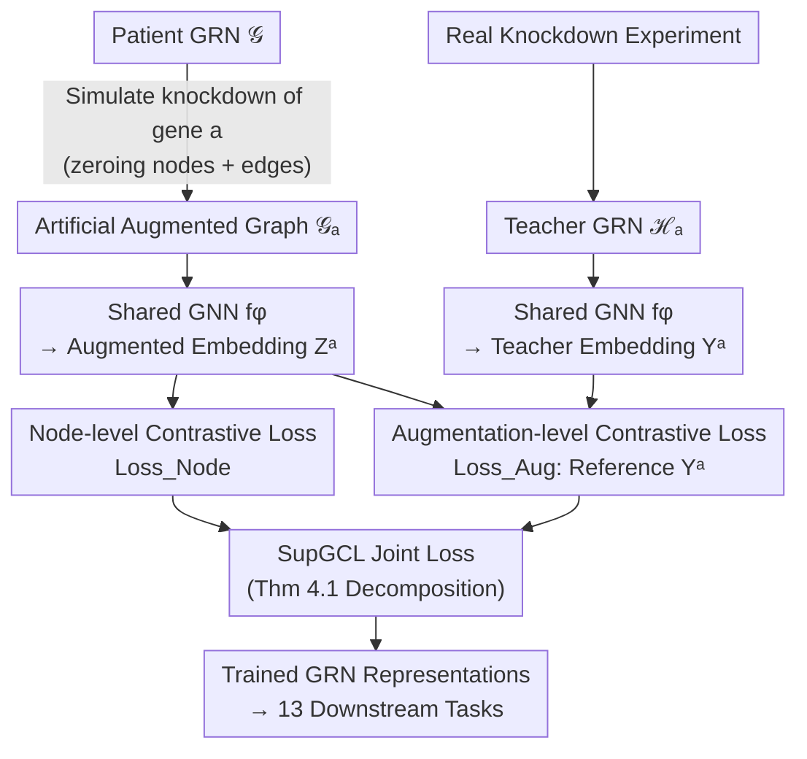

# Supervised Graph Contrastive Learning for Gene Regulatory Networks

**Conference**: ICML2026  
**arXiv**: [2505.17786](https://arxiv.org/abs/2505.17786)  
**Code**: https://github.com/shobioinfo/SupGCL (Dataset available at Zenodo 15496012)  
**Area**: Computational Biology / Graph Contrastive Learning / Representation Learning  
**Keywords**: Gene Regulatory Networks, Graph Contrastive Learning, Gene Knockdown, Supervised Augmentation, Cancer Subtypes

## TL;DR
The authors treat "gene knockdown experiments" as supervisory signals for graph contrastive learning. By ensuring that graph augmentations for Gene Regulatory Networks (GRN) are based on real biological perturbations rather than random noise, the method achieves clearer disease subtype clustering on patient-specific GRNs and consistently outperforms existing graph representation learning baselines across 13 downstream tasks.

## Background & Motivation

**Background**: Graph representation learning is widely employed to analyze Gene Regulatory Networks (GRNs), where nodes represent genes and edges represent regulatory relationships. Graph Contrastive Learning (GCL) is a dominant self-supervised paradigm that generates two views of the same graph via data augmentation and maximizes the similarity between corresponding node representations.

**Limitations of Prior Work**: Conventional GCL augmentations (e.g., random node or edge dropping) often destroy vital network structures, such as "master regulators," causing learned representations to deviate from biological reality. To circumvent this, recent "augmentation-free" methods (e.g., BGRL, SGRL) perturb model parameters instead of the graph structure itself.

**Key Challenge**: Augmentation-free approaches treat "structural changes" purely as a nuisance to be avoided. Consequently, they miss a critical opportunity: real biological experiments (such as gene knockdowns) inherently produce structural changes that are not noise, but rather rich sources of causal regulatory information. While high-throughput sequencing has made knockdown data accessible, it has not yet been integrated into the contrastive learning paradigm.

**Goal**: To align "augmentation perturbations" in GCL directly with real-world gene knockdown perturbations, using the latter as explicit supervision to learn biologically grounded GRN representations.

**Key Insight**: In a gene knockdown experiment, inhibiting a specific gene triggers observable perturbations, resulting in a "modified GRN." By treating this real modified network as a "teacher" to constrain the direction of artificial augmentations, one can preserve the advantages of contrastive learning while injecting biological priors.

**Core Idea**: Utilizing teacher GRNs obtained from actual knockdowns as supervision, the authors propose SupGCL (Supervised Graph Contrastive Learning). This framework provides a continuous extension of traditional GCL within a probabilistic setting, linking "artificial augmentations" to "real knockdown perturbations," and demonstrating that traditional node-level GCL is a degenerate special case.

## Method

### Overall Architecture

The input to SupGCL consists of a patient-specific GRN $\mathcal{G}=(\mathcal{V},\mathcal{E},\bm{X}^{\mathcal{V}},\bm{X}^{\mathcal{E}})$ and a set of teacher GRNs $\{\mathcal{H}_a\}_{a\in\mathcal{K}}$ derived from real knockdown experiments, where $\mathcal{H}_a$ is the observed network after knocking down the $a$-th gene. The output is a shared Graph Neural Network (GNN) $f_\phi$ that encodes any GRN into node representations for downstream gene-level or patient-level tasks.

The pipeline is as follows: first, simulate the knockdown of gene $a$ on the original graph (by zeroing the features of the gene and its incident edges) to obtain an artificially augmented graph $\mathcal{G}_a$. The same GNN $f_\phi$ encodes the augmented graph and the teacher graph to produce embeddings $\bm{Z}^a=f_\phi(\mathcal{G}_a)$ and $\bm{Y}^a=f_\phi(\mathcal{H}_a)$. Finally, two levels of contrastive loss are optimized simultaneously: a node-level loss (ensuring representation consistency for the same node across views) and an augmentation operator-level loss (aligning the selection of artificial augmentations with the similarity structure provided by teacher networks). These are merged into a unified $\mathrm{Loss}_{\rm SupGCL}$ under a KL-divergence framework.

### Key Designs

**1. Gene Knockdown as Supervision for Augmentation**:  
To address the dilemma where random augmentation destroys critical nodes while augmentation-free methods ignore structural information, SupGCL provides a grounded basis for augmentations. It formalizes "knocking down the $a$-th gene" as a deterministic augmentation operator $\mathcal{G}_a$. Simultaneously, the network $\mathcal{H}_a$ observed in real experiments serves as the "teacher" for this augmentation. This aligns the "augmentation space of contrastive learning" with the "perturbation space of biological experiments."

**2. Augmentation-level Contrastive Loss**:  
SupGCL defines probability distributions for augmentation operators over the embedding space $\mathbb{R}^{|\mathcal{V}|\times d}$ using the Frobenius inner product. The teacher distribution $p_\phi(b\mid a)\triangleq \mathrm{softmax}_c\,\big(\mathrm{sim}_F(\bm{Y}^a,\bm{Y}^b)/\tau_{\rm a}\big)$ is derived from teacher embeddings $\{\bm{Y}^a\}$, while the learned distribution $q_\phi(b\mid a)$ uses augmented embeddings $\{\bm{Z}^a\}$. The loss is defined as:

$$\mathrm{Loss}_{\rm Aug}\triangleq \frac{1}{|\mathcal{K}|}\sum_{a\in\mathcal{K}} D_{\mathrm{KL}}\big(p_\phi(b\mid a)\,\|\,q_\phi(b\mid a)\big)$$

This forces the similarity structure of artificial augmentations to match that of real knockdown networks. Unlike standard GCL where the reference distribution is a constant (Kronecker delta), $p_\phi$ varies with teacher embeddings, naturally avoiding genes that drastically disrupt GRN structures.

**3. Unified Probabilistic Framework**:  
To prevent representation collapse, SupGCL combines node pairs $(i,j)$ and augmentation pairs $(a,b)$ into a joint distribution. Under the assumption that node identity and augmentation distributions are independent, Theorem 4.1 provides the decomposition:

$$\mathrm{Loss}_{\rm SupGCL}=\mathbb{E}_{a,b\sim p_\phi(b|a)\mathrm{U}_{\mathcal{K}}(a)}\big[\mathrm{Loss}_{\rm Node}^{a,b}\big]+\mathrm{Loss}_{\rm Aug}.$$

The first term is the expectation of the node-level GCL loss under the supervised augmentation distribution $p_\phi(b\mid a)$. Corollary 4.2 shows that as temperature $\tau_{\rm a}\to\infty$, $p_\phi(b\mid a)\to\mathrm{U}_{\mathcal{K}}$, and $\mathrm{Loss}_{\rm SupGCL}\to\mathrm{Loss}_{\rm Node}$. Thus, **traditional node-level GCL is a singular solution of SupGCL at infinite temperature**. Furthermore, Remark 4.4 notes that the loss remains well-defined even if teacher and target graphs have different gene sets, facilitating cross-cancer training.

### Loss & Training
The GNN $f_\phi$ is trained using the combined loss from Theorem 4.1. Two temperature hyperparameters are used: $\tau_{\rm n}$ controls the sharpness of node-level representations, and $\tau_{\rm a}$ controls the intensity of following the teacher knockdown data. Larger $\tau_{\rm a}$ values cause the model to degenerate toward standard GCL.

## Key Experimental Results

### Main Results
Evaluation was performed on patient-specific GRNs for three cancers: Breast, Lung, and Colorectal. Results indicate: (i) clearer disease subtype clustering in the embedding space (NMI/ARI) without task-specific training; (ii) superior performance across 13 downstream tasks. Tasks include node-level Biological Process (BP), Cellular Component (CC), and Cancer Relevance (Rel) classification, as well as graph-level Survival Hazard (C-index) and Subtype classification.

| Task (Cancer) | w/o-pretrain | GAE | GRACE | SGRL (SOTA) | SupGCL |
|------|------|------|------|------|------|
| BP. Lung | 0.259 | 0.247 | 0.259 | 0.233 | **0.282** |
| CC. Breast | 0.264 | 0.250 | 0.236 | 0.249 | **0.291** |
| Rel. Breast | 0.573 | 0.561 | 0.575 | 0.580 | **0.600** |
| Hazard Colorectal | 0.621 | 0.631 | 0.647 | 0.616 | **0.698** |
| Subtype Breast | 0.804 | 0.834 | 0.841 | 0.829 | **0.847** |

SupGCL outperforms baselines including GAE (reconstructive), GraphCL (graph-level GCL), GRACE (node-level GCL), and SGRL (augmentation-free) in the majority of tasks.

### Ablation Study

| Configuration | Phenomenon | Explanation |
|------|------|------|
| $\tau_{\rm a}\to\infty$ | Degenerates to $\mathrm{Loss}_{\rm Node}$ | Corollary 4.2: Standard GCL is a singular special case. |
| Only $\mathrm{Loss}_{\rm Aug}$ | Collapse to trivial solution | GNN outputs a constant to zero out the loss; requires node-level loss. |
| GraphCL (Graph-level aug) | Most significant performance drop | Confirms that random structural perturbations damage master regulators. |
| Cross-cancer training | Loss remains well-defined | Remark 4.4: Support for varying gene sets between teacher and target. |

### Key Findings
- The augmentation-level loss ($\mathrm{Loss}_{\rm Aug}$) is essential for injecting biological priors but cannot be used in isolation as it leads to collapse.
- Graph-level augmentation methods (GraphCL) show the worst performance on GRNs, validating the motivation that random perturbations disrupt master regulators.
- The temperature $\tau_{\rm a}$ acts as a dial between "biological fidelity" and "traditional GCL," providing a continuous transition from supervised to unsupervised learning.

## Highlights & Insights
- The shift from avoiding structural changes to embracing them as supervisory signals is a powerful conceptual pivot. While augmentation-free routes hide from structural noise, SupGCL aligns with structural truth.
- The KL decomposition in Theorem 4.1 cleanly separates node-level and augmentation-level losses. Since it is independent of the specific contrastive loss used, it is highly modular.
- The independence assumption in Remark 4.4 allows for joint training even when teacher and target networks do not share identical gene sets, a trick applicable to other cross-domain graph learning scenarios.

## Limitations & Future Work
- The method relies heavily on the availability of real knockdown teacher data $\mathcal{H}_a$; supervision is missing for genes without experimental coverage in set $\mathcal{K}$.
- Modeling knockdown as "zeroing features/edges" is a coarse approximation and may not capture complex downstream cascade effects.
- While performance gains are consistent, they are often in the range of 0.X to a few percentage points; robustness across larger-scale or multi-tissue GRNs remains to be verified.

## Related Work & Insights
- **vs Augmentation-free GCL (BGRL, SGRL)**: These methods use bootstrapping or feature uniformity to bypass structural perturbations. SupGCL instead uses real experimental data as supervision for those perturbations.
- **vs Adaptive GCL (AD-GCL, AutoGCL)**: These optimize augmentations via adversarial or learnable strategies guided by the objective, whereas SupGCL's perturbations are grounded in biological phenomena.
- **vs SupCon (Supervised Contrastive)**: SupCon relies on categorical labels and sample-level distributions. SupGCL works with network-level teacher distributions and focuses on the similarity structure of augmentation operators.

## Rating
- Novelty: ⭐⭐⭐⭐⭐ 
- Experimental Thoroughness: ⭐⭐⭐⭐ 
- Writing Quality: ⭐⭐⭐⭐ 
- Value: ⭐⭐⭐⭐ 

<!-- RELATED:START -->

## Related Papers

- [\[ICML 2026\] Towards Universal Gene Regulatory Network Inference: Unlocking Generalizable Regulatory Knowledge in Single-cell Foundation Models](towards_universal_gene_regulatory_network_inference_unlocking_generalizable_regu.md)
- [\[ICML 2026\] Learning the Neighborhood: Contrast-Free Multimodal Self-Supervised Molecular Graph Pretraining](learning_the_neighborhood_contrast-free_multimodal_self-supervised_molecular_gra.md)
- [\[CVPR 2026\] Cross-Slice Knowledge Transfer via Masked Multi-Modal Heterogeneous Graph Contrastive Learning for Spatial Gene Expression Inference](../../CVPR2026/computational_biology/cross-slice_knowledge_transfer_via_masked_multi-modal_heterogeneous_graph_contra.md)
- [\[NeurIPS 2025\] Random Search Neural Networks for Efficient and Expressive Graph Learning](../../NeurIPS2025/computational_biology/random_search_neural_networks_for_efficient_and_expressive_graph_learning.md)
- [\[ICML 2026\] SIGMA: Structure-Invariant Generative Molecular Alignment for Chemical Language Models via Autoregressive Contrastive Learning](sigma_structure-invariant_generative_molecular_alignment_for_chemical_language_m.md)

<!-- RELATED:END -->
