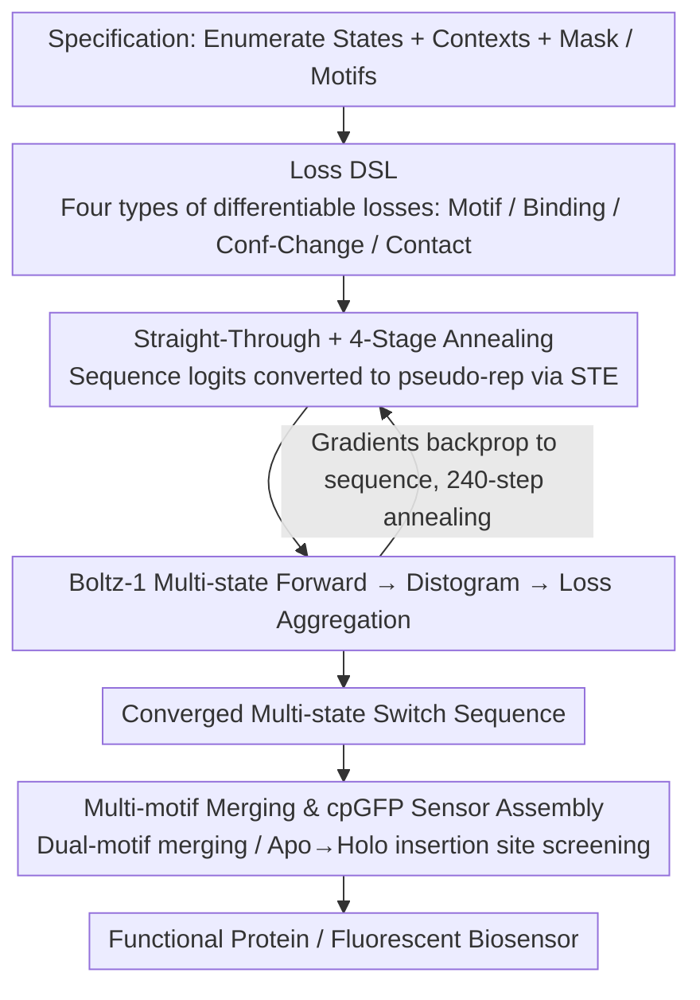

# SwitchCraft: A Programmatic Framework for Designing State-Switching Proteins

**Conference**: ICML 2026  
**arXiv**: [2605.31236](https://arxiv.org/abs/2605.31236)  
**Code**: https://github.com/bjing2016/switchcraft  
**Area**: Protein Design / Scientific Computing / Structural Biology  
**Keywords**: Multi-state protein design, Boltz-1, Differentiable structure prediction, Allosteric regulation, Biosensors  

## TL;DR
SwitchCraft formalizes the design of proteins capable of switching between multiple functional states as an optimization problem over combinatorial constraints. By backpropagating multiple state-dependent losses (motif, binding, conformational change, contact) through the structure prediction model Boltz-1, it directly optimizes amino acid logits via gradient descent. This represents the first general computational framework for multi-state protein design, demonstrated through in silico experiments including positive/negative allostery, motif switching, induced binding, ligand modification, ligand discrimination, and de novo design of cpGFP fluorescent biosensors.

## Background & Motivation

**Background**: Generative protein design is currently dominated by two technical routes: first, protein language models (PLMs, e.g., ProGen, ESM3), trained on billions of natural sequences to generate new ones based on family labels or GO terms; second, structural generative models (RFDiffusion, Boltz-1, BoltzDesign1), which learn structural distributions from the PDB or backpropagate through structure predictors for binder design and enzyme active site scaffolding.

**Limitations of Prior Work**: Natural proteins are far more than "one static structure for one static function." Many critical functions (motor proteins walking along microtubules, ATP synthase rotation, polymerase information processing, hemoglobin cooperative binding) depend on **multi-state dynamics**—proteins must switch precisely between multiple conformations or binding states. PLM conditioning can only reference existing labels and cannot describe unseen complex functions; structural generators are restricted to a single static structure. Neither route can directly express specifications like "fold into conformation 1 in the presence of ligand A, and conformation 2 in the presence of ligand B."

**Key Challenge**: Either the approach is data-driven but lacks labels (PLM route), or it is physically controllable but describes only a single state (structural route). Datasets that fully express "multiple states + structural constraints for each state" simply do not exist, making pure data-driven paths unfeasible.

**Goal**: Construct a **programmatic framework** that allows designers to specify arbitrary states and their respective structural constraints as if writing a branched program, enabling an optimizer to automatically find amino acid sequences that satisfy all states simultaneously.

**Key Insight**: The authors noted that methods like BoltzDesign1 have proven that backpropagating through the structure predictor Boltz-1 can design binders. Since this works for a single state, the losses for multiple states can be summed and backpropagated together. Boltz-1 accepts ligand context as input, naturally supporting multiple forwards where the "same sequence folds into different structures under different ligand environments."

**Core Idea**: The optimization objective is formulated such that a sequence $\mathbf{z}\in\mathbb{R}^{20\times L}$, when folded by Boltz-1 under multiple contexts $\{\mathcal{C}_s\}$, simultaneously satisfies a set of losses $\{\mathcal{L}_n\}$. Gradient descent is performed directly on $\mathbf{z}$, using a straight-through estimator to make the discrete amino acid argmax problem differentiable.

## Method

### Overall Architecture
SwitchCraft addresses the challenge of designing a single sequence that folds into multiple specified conformations under different ligand environments—something single-state generators cannot do—by rewriting this requirement as an optimization problem. The designer first writes a **specification**: enumerating states $s=1,\ldots,N_{\text{states}}$, each with a folding context $\mathcal{C}_s$ (including small molecules, metal ions, DNA, target peptides, etc.), and a set of losses $\mathcal{L}_n:\mathbb{R}^{20\times L}\to\mathbb{R}$, each depending on one or more Boltz-1 outputs. A design mask $\mathbf{m}\in\{0,1\}^L$ and optional fixed motif sequences $\mathbf{s}$ are declared. Then, **optimization** proceeds: with the sequence $\mathbf{z}$ represented as logits as the sole variable, a 240-step annealing schedule is executed. At each step, $\mathbf{z}$ is converted into a pseudo-representation and fed into Boltz-1; all losses are aggregated to compute gradients for updating $\mathbf{z}$. This process is conceptually similar to training a deep model—losses are the design goals, the optimizer is SGD, and the "weights" being optimized are the sequence itself. The resulting multi-state sequences can be further **assembled into devices**: embedding conformational switches into circularly permuted GFP (cpGFP) yields de novo designed fluorescent biosensors.

### Key Designs

**1. Composable Loss DSL: Translating Natural Language Specs into Differentiable Losses**

Designer requirements are often branched natural language like "scaffold a motif when ligand X is present, and disrupt it when absent." SwitchCraft extracts four basic loss primitives derived from Boltz-1 continuous outputs (distogram, pair representation), ensuring differentiability with respect to $\mathbf{z}$. **Motif Loss** $\mathcal{L}_{\text{motif}}=\sum_{i,j\in m, i\neq j}\sum_k \frac{p_{ijk}}{|m|(|m|-1)}(d_k-\|\mathbf{r}_i-\mathbf{r}_j\|)^2$ uses distogram probabilities to minimize the squared error between predicted and target residue distances in a motif. The corresponding **Anti-motif Loss** $\mathcal{L}_{\text{anti-motif}}=-0.5\,\mathcal{L}_{\text{motif}}$ uses a negative sign to express "active disruption of the scaffold." **Binding Loss** $\mathcal{L}_{\text{binding}}=\frac{1}{2c}\sum \min_j^{(k=c)}\min_i^{(k=2)} H_{<20\text{Å}}(D_{ij})$ aggregates proximity probabilities of the "top-$c$ ligand tokens and top-2 protein residues" to encourage high-confidence contact; **Anti-binding Loss** is similarly defined with a $-0.5$ factor.

The core of multi-state design lies in two other losses. **Conformational Change Loss** $\mathcal{L}_{\text{conf-change}}(\mathbf{z};\mathcal{C}_1,\mathcal{C}_2)=-\frac{1}{L}\sum_i \max_j \mathrm{JSD}(D^{(1)}_{ij}\|D^{(2)}_{ij})$ maximizes the JSD of distance distributions for the same residue pairs across states, forcing significant structural differentiation. JSD on distograms is used instead of "alignment + RMSD" because it avoids registration ambiguity and is naturally differentiable. **Contact Loss** $\mathcal{L}_{\text{contact}}=\frac{1}{L}\sum_j \min_{i:|i-j|\geq 9} H_{<14\text{Å}}(D_{ij})$ ensures each state is folded with high confidence, preventing the sacrifice of single-state plausibility for the sake of differentiation.

**2. Sequence Optimization with STE + 4-Stage Annealing: Continuous Search for Discrete Assets**

Optimization is difficult because amino acids are discrete. SwitchCraft uses a Straight-Through Estimator (STE) with multi-stage annealing: at each step, it calculates a soft distribution $\mathbf{z}_{\text{soft}}=\mathrm{softmax}(\mathbf{z}/\tau)$, a hard one-hot $\mathbf{z}_{\text{hard}}=\mathrm{onehot}(\mathrm{argmax}\,\mathbf{z})$, and original logits $\mathbf{z}$. It defines $\mathbf{z}_{\text{st}}=(\mathbf{z}_{\text{hard}}-\mathbf{z}_{\text{soft}})|_{\nabla=0}+\mathbf{z}_{\text{soft}}$ so the forward pass sees hard decisions while gradients flow through the soft path. The input to Boltz-1 is a convex combination $\mathbf{z}_{\text{pseudo}}=\beta\mathbf{z}_{\text{hard}}+(1-\beta)(\gamma\mathbf{z}_{\text{soft}}+(1-\gamma)\mathbf{z})$, where $\beta, \gamma, \tau$ control "hard/soft ratio," "sharpness," and "temperature."

These knobs are tuned across four stages: Stage 1 (30 steps, $\beta=0, \gamma=1, \tau=0.5$) for soft exploration; Stage 2 (100 steps, $\gamma$ annealing from 0 to 1) to extract hard decisions; Stage 3 (100 steps, $\tau$ from 0.5 to 0.005) to lower temperature; Stage 4 (10 steps, $\beta=1$) for final one-hot fine-tuning.

**3. Multi-motif Merging and cpGFP Assembly Workflow: Modular Device Integration**

Two additional steps convert "switching proteins" into useful devices. First, when a state must scaffold two motifs, Algorithm 2 merges motif constraints at the residue index level before standard motif loss. Second, to package switches into fluorescent sensors (Sec 4.6), designers first create switchers with significant apo/holo conformational differences (ContactLoss + BindingLoss + ConfChangeLoss). They then select insertion points for cpGFP where the backbone dihedral angle change is maximal (Algorithm 3), followed by co-folding with Boltz-1 to filter for designs where the chromophore contact changes significantly.

This workflow is based on reverse-engineering natural cpGFP sensors: for example, the nicotine sensor (PDB 7s7u/7s7v) relies on a glutamate on the linker that quenches fluorescence in the apo state and is pulled away by 14 Å in the holo state. The authors translate this into computational criteria (intraRMSD, crossRMSD, radius of gyration, effector iPTM), allowing the de novo generation of sensor candidates for any small molecule without requiring natural templates.

### Loss & Training
The global loss is the sum of all state-loss terms. The optimizer is Adam, with stage-specific learning rates $\alpha\in\{0.1, 0.2\}$. Initial $\mathbf{z}$ is sampled from a Gumbel-softmax. Large batches of independent trajectories (100 to 13,858) are run per task, with final sequences evaluated using 5 Boltz-1 predictions each.

## Key Experimental Results

### Main Results
The authors defined 6 multi-state design primitives and 1 biosensor workflow. The table summarizes in silico success rates (satisfied structural confidence + state difference + low intra-state RMSD).

| Design Task | Ligand Type | Total Designs | Successful Designs | Key Findings |
| :--- | :--- | :--- | :--- | :--- |
| Pos/Neg Allostery (Motif ON/OFF) | 5 Ligands × 24 Motifs | 12,000 | 11 motifs successful | Motif RMSD diff >5 Å, including fold switching |
| Motif Switching (3IXT↔1YCR) | OQO | 100 | 3 completely successful | Most candidates satisfied 3/4 constraints |
| Ligand Modification (heme + O₂) | heme + O₂ | 558 | 10 | His displaced by O₂ inducing 3.8 Å rearrangement |
| Induced Binding (Top7+Ca²⁺) | Ca²⁺ | 940 | 8 | Ca²⁺ binding induces 12.50 Å rearrangement |
| Ligand Discrimination (3 states) | OQO + Ca²⁺ | 465 | 12 | Loop RMSD ≥1.48 Å between any two states |
| Sensor Switcher (SAM/cGMP/ATP) | 3 small molecules | 13,858 | 89 filtered → 44 valid | Replicated nicotine sensor mechanism (Glu74) |

### Ablation Study
| Configuration | Phenomenon | Explanation |
| :--- | :--- | :--- |
| Full 4-stage schedule | Convergence to one-hot | Smooth transition from soft to hard |
| Motif loss only (single state) | Degenerates to BoltzDesign1 style | Confirms backward compatibility |
| No ConfChangeLoss | Multi-state collapses to single state | JSD is key for state separation |
| No ContactLoss | Structural confidence collapses | Required to maintain per-state plausibility |
| Anti-motif coeff: -0.5 to -1.0 | Global folding failure | Balance of opposing constraints is sensitive |

### Key Findings
- While absolute success rates are low (11/24 motifs, single-digit percentages), this benchmark provides a high-quality baseline; the authors propose the "5 ligands × 24 motifs" task as a standard for multi-state design.
- Failure modes in ligand modification included "large but unphysical conformational changes" (requiring unfolding/refolding), suggesting a need for kinetic constraints.
- Three-state discrimination was achieved using 50-residue miniproteins, where loops formed salt bridges, hydrophobic pockets, and metal coordination across different states.
- The biosensor workflow generated 44 plausible candidates for SAM/cGMP/ATP without templates, reproducing the quenching mechanism found in nature.

## Highlights & Insights
- Formalizes multi-state protein design as a constraint satisfaction problem on sequences; the notation (state + loss + mask) acts as a DSL for biologists.
- Symmetric losses (motif/anti-motif) unify "what should be" and "what should not be" into one framework via simple negation.
- ConfChangeLoss uses JSD on distograms rather than RMSD, avoiding registration issues and maintaining differentiability—a technique transferable to any task requiring diversity or adversarial generation.
- Using STE + 4-stage annealing for discrete search on the sequence simplex is a clean case of extending "inverse design through gradients" from the structural domain to the sequence domain.

## Limitations & Future Work
- Absolute success rates are low, indicating this is a benchmark rather than a production tool for mass-producing functional proteins yet.
- Evaluation is entirely in silico (via Boltz-1). Bias in the structure predictor may lead to designs that fold confidently in simulation but fail in the wet lab.
- Losses are structural; the lack of kinetic or energy surface constraints can result in physically unreachable conformational switches. Transition state or kinetic terms are needed.
- Computational cost is high due to multiple forward/backward passes per design step.

## Related Work & Insights
- **vs BoltzDesign1 (Cho et al. 2025)**: This work directly inherits and extends the single-state loss/optimization framework to multiple states, acting as a functional superset.
- **vs RFDiffusion (Watson et al. 2023)**: RFDiffusion is for single-state structure generation; the 24-motif benchmark here builds upon its scaffolding tasks but elevates the difficulty to ligand-responsive switches.
- **vs ProteinMPNN**: ProteinMPNN performs inverse folding given a fixed backbone. SwitchCraft optimizes sequence and backbone implicitly through Boltz-1, requiring no pre-defined backbone.
- **vs ProDiT / ProteinGenerator**: These attempt multi-backbone sequence generation but do not accept ligand inputs, thus failing to express ligand-driven state switching.

## Rating
- Novelty: ⭐⭐⭐⭐⭐ First general multi-state framework; single-to-multi state is a qualitative leap.
- Experimental Thoroughness: ⭐⭐⭐⭐ Good coverage across 6 tasks, though absolute success rates are low and purely in silico.
- Writing Quality: ⭐⭐⭐⭐⭐ Extremely clear abstraction into specification and optimization phases.
- Value: ⭐⭐⭐⭐⭐ Defines the interface and benchmark for next-generation functional protein design.

<!-- RELATED:START -->

## Related Papers

- [\[NeurIPS 2025\] Learning Conformational Ensembles of Proteins Based on Backbone Geometry](../../NeurIPS2025/computational_biology/learning_conformational_ensembles_of_proteins_based_on_backbone_geometry.md)
- [\[ICLR 2026\] HeurekaBench: A Benchmarking Framework for AI Co-scientist](../../ICLR2026/computational_biology/heurekabench_a_benchmarking_framework_for_ai_co-scientist.md)
- [\[NeurIPS 2025\] BarcodeMamba+: Advancing State-Space Models for Fungal Biodiversity Research](../../NeurIPS2025/computational_biology/barcodemamba_advancing_state-space_models_for_fungal_biodiversity_research.md)
- [\[ICML 2025\] Designing Cyclic Peptides via Harmonic SDE with Atom-Bond Modeling](../../ICML2025/computational_biology/designing_cyclic_peptides_via_harmonic_sde_with_atom-bond_modeling.md)
- [\[NeurIPS 2025\] A Unified Framework for Variable Selection in Model-Based Clustering with Missing Not at Random](../../NeurIPS2025/computational_biology/a_unified_framework_for_variable_selection_in_modelbased_clu.md)

<!-- RELATED:END -->
