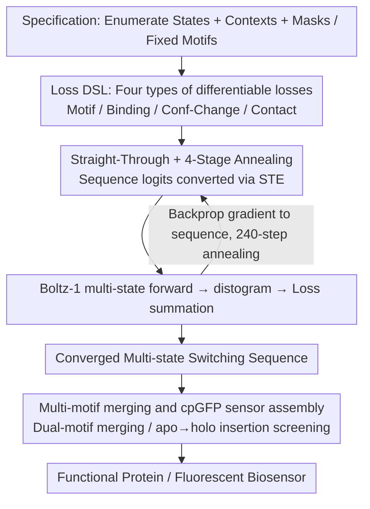

# SwitchCraft: A Programmatic Framework for Designing State-Switching Proteins

**Conference**: ICML 2026  
**arXiv**: [2605.31236](https://arxiv.org/abs/2605.31236)  
**Code**: https://github.com/bjing2016/switchcraft  
**Area**: Protein Design / Scientific Computing / Structural Biology  
**Keywords**: Multi-state protein design, Boltz-1, Differentiable structure prediction, Allosteric regulation, Biosensors  

## TL;DR
SwitchCraft formalizes the task of "designing a protein that switches between multiple functional states" as an optimization problem over combinatorial constraints. By backpropagating multiple state-dependent losses (motif, binding, conformational change, contact) through the structure prediction model Boltz-1, it directly optimizes amino acid logits via gradient descent. This represents the first general computational framework for multi-state protein design, demonstrated through in silico experiments including positive/negative allostery, motif switching, induced binding, ligand modification, ligand discrimination, and de novo design of cpGFP fluorescent biosensors.

## Background & Motivation

**Background**: Generative protein design is currently dominated by two technical routes: 1) Protein Language Models (PLMs, e.g., ProGen, ESM3), trained on billions of natural sequences to generate new ones based on family labels or GO terms; 2) Structural generative models (RFDiffusion, Boltz-1, BoltzDesign1), which learn structural distributions from the PDB or backpropagate through structure predictors for binder design and enzyme active site scaffolding.

**Limitations of Prior Work**: Natural proteins are far more than "one static structure corresponding to one static function." Numerous critical functions (motor proteins walking along microtubules, ATP synthase rotation, polymerase information processing, hemoglobin cooperative binding) rely on **multi-state dynamics**—proteins must switch precisely between multiple conformations or binding states. PLM conditioning can only reference existing labels and fails to describe unseen complex new functions; structural generators are restricted to a single static structure. Neither route can directly express specifications like "fold into conformation 1 in the presence of ligand A and conformation 2 in the presence of ligand B."

**Key Challenge**: Either data-driven but lacking labels (PLM route), or physically controllable but only describing a single state (structural route). A dataset that fully expresses "multiple states + structural constraints for each state" simply does not exist, making purely data-driven paths unfeasible.

**Goal**: Construct a **programmatic framework** that allows designers to specify any number of states and their respective structural constraints—similar to writing a program with branches—and let the optimizer automatically find the amino acid sequence that satisfies all states simultaneously.

**Key Insight**: The authors noted that methods like BoltzDesign1 have proven structure predictors like Boltz-1 can be backpropagated for binder design. If this works for a single state, adding losses from multiple states and backpropagating them together is possible. Boltz-1 accepts ligand context as input, naturally supporting multiple forward passes where the same sequence folds into different structures under different ligand environments.

**Core Idea**: The optimization objective is defined as "the result of sequence $\mathbf{z}\in\mathbb{R}^{20\times L}$ folding under multiple contexts $\{\mathcal{C}_s\}$ via Boltz-1 simultaneously satisfying a set of losses $\{\mathcal{L}_n\}$." Gradient descent is performed directly on $\mathbf{z}$, using a straight-through estimator to make the discrete amino acid argmax problem differentiable.

## Method

### Overall Architecture
SwitchCraft addresses what single-state generators cannot—making one sequence fold into multiple specified conformations under different ligand environments—by rewriting this requirement as an optimization problem. The designer first writes a **specification**: enumerating several states $s=1,\ldots,N_{\text{states}}$, each associated with a folding context $\mathcal{C}_s$ (which can include fixed molecules like small molecules, metal ions, DNA, or target peptides), then enumerating a set of losses $\mathcal{L}_n:\mathbb{R}^{20\times L}\to\mathbb{R}$, each depending on one or more Boltz-1 outputs for specific states, and declaring design masks $\mathbf{m}\in\{0,1\}^L$ with optional fixed motif sequences $\mathbf{s}$. Next is **optimization**: using sequence logits $\mathbf{z}$ as the sole variable, running a 240-step annealing schedule. In each step, $\mathbf{z}$ is converted to a pseudo-representation and fed into Boltz-1; all losses are summed and gradients are backpropagated to update $\mathbf{z}$. Conceptually, this process is like training a deep model—losses are design goals, the optimizer is SGD, and the "weights" being optimized are the sequence itself. The resulting multi-state switching sequences can be further **assembled into devices**: for example, embedding a conformational switch into circularly permuted GFP (cpGFP) to create a de novo fluorescent biosensor.

### Key Designs

**1. Composable Loss DSL: Translating Natural Language Specs into Differentiable Losses**

Design requirements are often branched natural language like "scaffold a motif when ligand X is present, and disrupt it when absent." SwitchCraft addresses the difficulty of feeding this to an optimizer by extracting four basic loss primitives derived from Boltz-1's continuous outputs (distogram, pair representation), making them differentiable with respect to $\mathbf{z}$. **Motif loss** $\mathcal{L}_{\text{motif}}=\sum_{i,j\in m, i\neq j}\sum_k \frac{p_{ijk}}{|m|(|m|-1)}(d_k-\|\mathbf{r}_i-\mathbf{r}_j\|)^2$ uses distogram probabilities to weight the mean squared error between predicted and target distances of motif residue pairs. The corresponding **anti-motif loss** $\mathcal{L}_{\text{anti-motif}}=-0.5\,\mathcal{L}_{\text{motif}}$ uses a negative sign to express "active disruption of the scaffold." **Binding loss** $\mathcal{L}_{\text{binding}}=\frac{1}{2c}\sum \min_j^{(k=c)}\min_i^{(k=2)} H_{<20\text{Å}}(D_{ij})$ borrows the truncated entropy from BoltzDesign1 to aggregate proximity probabilities of "top-$c$ ligand tokens and top-2 protein residues" to encourage high-confidence contact; the **anti-binding loss** is similarly taken as $-0.5\times \mathcal{L}_{\text{binding}}$.

The essence of multi-state design lies in two other losses. **Conformational change loss** $\mathcal{L}_{\text{conf-change}}(\mathbf{z};\mathcal{C}_1,\mathcal{C}_2)=-\frac{1}{L}\sum_i \max_j \mathrm{JSD}(D^{(1)}_{ij}\|D^{(2)}_{ij})$ maximizes the Jensen-Shannon Divergence (JSD) between distance distributions of the same residue pairs under two different states, forcing structural differentiation. JSD on distograms is used instead of "align structures then calculate RMSD" because it avoids registration ambiguity and is naturally differentiable. **Contact loss** $\mathcal{L}_{\text{contact}}=\frac{1}{L}\sum_j \min_{i:|i-j|\geq 9} H_{<14\text{Å}}(D_{ij})$ ensures each state folds with high confidence, preventing structural plausibility from being sacrificed for state differentiation. This symmetric/asymmetric design (motif vs. anti-motif, etc.) plus inter-state JSD allows users to combine "should have/should not have/must be different" into complex specifications like building blocks.

**2. Sequence Optimization with STE + 4-Stage Annealing: Turning Discrete Search into Differentiable Optimization**

The challenge in sequence optimization is that amino acids are discrete (1-of-20). Searching directly on the simplex leads to exponential explosion, while pure continuous relaxation yields non-physical "mixed amino acids." SwitchCraft uses a Straight-Through Estimator (STE) with multi-stage annealing to balance this: each step calculates a soft distribution $\mathbf{z}_{\text{soft}}=\mathrm{softmax}(\mathbf{z}/\tau)$, a hard one-hot $\mathbf{z}_{\text{hard}}=\mathrm{onehot}(\mathrm{argmax}\,\mathbf{z})$, and raw logits $\mathbf{z}$. It defines $\mathbf{z}_{\text{st}}=(\mathbf{z}_{\text{hard}}-\mathbf{z}_{\text{soft}})|_{\nabla=0}+\mathbf{z}_{\text{soft}}$ so the forward pass looks like a hard decision while gradients follow the soft path. The representation actually fed to Boltz-1 is a convex combination $\mathbf{z}_{\text{pseudo}}=\beta\mathbf{z}_{\text{hard}}+(1-\beta)(\gamma\mathbf{z}_{\text{soft}}+(1-\gamma)\mathbf{z})$, where $\beta, \gamma, \tau$ control "hard/soft ratio," "distribution sharpness," and "temperature."

These knobs are turned via a four-stage schedule to transition from global exploration to discrete convergence: Stage 1 (30 steps, $\beta=0, \gamma=1, \tau=0.5$) for soft exploration; Stage 2 (100 steps, $\gamma$ annealing from 0 to 1) to gradually squeeze out hard decisions; Stage 3 (100 steps, $\tau$ dropping from 0.5 to 0.005) to lower temperature; and Stage 4 (10 steps, $\beta=1$) to switch completely to one-hot for fine-tuning. Residues at motif positions ($\mathbf{m}[i]=0$) are fixed during each forward pass and do not participate in optimization. Early continuous gradients handle global exploration, while late hard constraints ensure convergence to valid residues.

**3. Multi-Motif Merging and cpGFP Biosensor Assembly Workflow: Turning Switches into Devices**

While the previous designs create "switching proteins," two steps are needed for actual utility. First, when a state requires scaffolding two different motifs simultaneously, Algorithm 2 merges motif constraints at the residue index level before applying standard motif loss. Second, the framework encapsulates multi-state switchers into fluorescent biosensors (Sec 4.6): SwitchCraft first designs a switcher with significant apo/holo conformational differences (using ContactLoss + BindingLoss + ConfChangeLoss). Then, residues with the largest backbone dihedral changes between apo and holo states are selected as insertion points for circularly permuted GFP (Algorithm 3 ensures spatial diversity of insertion sites). After embedding cpGFP, the construct is co-folded by Boltz-1 to screen for designs where chromophore contact changes significantly.

This workflow is based on reverse engineering natural cpGFP sensor mechanisms: for example, the nicotine sensor (PDB 7s7u/7s7v) relies on a glutamate on a linker that quenches fluorescence by approaching the chromophore in the apo state and is pulled $14 \text{Å}$ away in the holo state. The authors translated this mechanism into computational screening criteria (intraRMSD, crossRMSD, radius of gyration, effector iPTM thresholds), allowing the de novo generation of candidate sensors for any small molecule without requiring natural switcher templates.

### A Complete Example
Consider a "ligand modification" task involving heme + $\text{O}_2$: the specification declares two states, where context $\mathcal{C}_1$ contains only heme and $\mathcal{C}_2$ contains heme + oxygen. ContactLoss (ensuring both states fold confidently) and ConfChangeLoss (maximizing JSD between state distance distributions) are applied. During optimization, $\mathbf{z}$ undergoes Boltz-1 forward passes in both contexts to calculate distograms; losses are summed and backpropagated to the same logits. After 240 steps, a trajectory converges to a sequence where a histidine coordinates heme iron in the apo state and is displaced by the oxygen molecule in the holo state, triggering a local rearrangement of $\sim 3.8 \text{Å}$—successfully replicating the physical picture of hemoglobin's oxygen-binding cooperative transition through purely gradient-based optimization on Boltz-1.

### Loss & Training
The global loss is the sum of all state-loss terms; the optimizer is Adam, with step learning rates $\alpha\in\{0.1, 0.2\}$ switched per stage. Initial $\mathbf{z}$ is sampled from a Gumbel-softmax. For each design task, a large number of independent trajectories (100 to 13,858) are run, and each final sequence is evaluated by predicting 5 structures with Boltz-1.

## Key Experimental Results

### Main Results
The authors defined 6 multi-state design primitives with increasing complexity and 1 biosensor workflow. The table below summarizes the in silico success rates (Success = satisfying confidence, state difference, low intra-state RMSD, etc.).

| Design Task | Ligand Type | Total Designs | Successful Designs | Key Finding |
| :--- | :--- | :--- | :--- | :--- |
| +/- Allostery (Motif ON/OFF) | 5 types × 24 motifs × 100 | 12,000 | 11 motifs with $\geq 1$ success | Motif RMSD difference often $>5 \text{Å}$, including fold switching |
| Motif Switch (3IXT↔1YCR) | OQO | 100 | 3 completely successful | Most candidates satisfied 3 of 4 constraints, nearing success |
| Ligand Modification (heme + $\text{O}_2$) | heme + oxygen | 558 | 10 | His displaced by $\text{O}_2$ induces 3.8 $\text{Å}$ rearrangement (hemoglobin-like) |
| Induced Binding (Top7 frag + $\text{Ca}^{2+}$) | $\text{Ca}^{2+}$ | 940 | 8 | $\text{Ca}^{2+}$ binding induces 12.50 $\text{Å}$ rearrangement to form interface |
| Ligand Discrimination (3 states: apo/OQO/$\text{Ca}^{2+}$) | OQO + $\text{Ca}^{2+}$ | 465 | 12 | Key loop RMSD $\geq 1.48 \text{Å}$ between any two of the three states |
| Sensor Switcher (SAM/cGMP/ATP) | 3 small molecules | 13,858 | 89 strictly filtered → 44 contact change OK | Replicated nicotine sensor mechanism (Glu74 14.7 $\text{Å}$ shift) |

### Ablation Study

| Configuration | Phenomenon | Mechanism |
| :--- | :--- | :--- |
| Full 4-stage schedule | Convergence to one-hot in 240 steps | Smooth transition from soft to hard |
| Motif loss only (single state) | Degenerates to BoltzDesign1 style | Verifies backward compatibility |
| Remove ConfChangeLoss | Multi-state degenerates to state copies | JSD term is key to state separation |
| Remove ContactLoss | Collapse of structure confidence in some states | Must maintain state plausibility individually |
| Anti-motif coeff: $-0.5 \to -1.0$ | Disruption too strong, folding fails | Weight balance for opposing constraints is sensitive |

### Key Findings
- While absolute success rates are low (11/24 motifs, hit rates from single digits to low percent), they indicate this benchmark has significant room for improvement; the authors propose the "5 ligands × 24 motifs" task as a standard benchmark for multi-state design.
- The ligand modification task exhibited "large conformational changes that are physically implausible (requiring unfolding/refolding)" failure modes, suggesting a need for future kinetic constraints.
- Three-state ligand discrimination was achieved using a 50-residue miniprotein, where a key loop formed a salt bridge, a hydrophobic pocket, and a $\text{Ca}^{2+}$ coordination site across three states, hinting at the designability of multi-step enzymes.
- In the biosensor workflow, the authors generated 44 mechanismally sound candidates for SAM/cGMP/ATP without templates, with the SAM design mimicking the "linker glutamate displacement" mechanism of the nicotine sensor.

## Highlights & Insights
- Formalizes multi-state protein design as a "sequence constraint satisfaction problem"; the description format (state + loss + mask) acts as a domain DSL, allowing biologists to "program" new functions directly.
- Symmetric/asymmetric losses (motif vs. anti-motif) unify "what should be" and "what should not be" into a single framework using a simple sign change, providing high composability.
- ConfChangeLoss defines state differences via JSD on distograms rather than "structure alignment + RMSD," bypassing registration ambiguity and enabling direct differentiation. This trick is transferable to any task requiring "diverse outputs."
- Handling discrete search on a 20-dimensional simplex via STE + 4-stage annealing is a clean example of extending "inverse design via gradients" from the structural domain to the sequence domain, being more suitable for complex constraints than pure sampling like ProteinMPNN.

## Limitations & Future Work
- Absolute success rates remain low, meaning it is not yet a mass-production tool for functional proteins; the authors acknowledge it as a benchmark rather than a production tool.
- All evaluations are in silico—using Boltz-1 folding and scoring. Bias in the structure predictor is magnified; high-confidence predictions may not fold in a wet lab. The paper only mentions preliminary induced binding experiments in Appendix B.7.
- Losses are currently "structural," lacking kinetic or energy surface constraints. This leads to some conformational switches being physically unreachable without unfolding, necessitating future inclusion of transition states or kinetic terms.
- Boltz-1 forward passes are expensive; 240 steps for multiple states (forward + backward) represents a non-trivial computational cost and energy overhead.

## Related Work & Insights
- **vs. BoltzDesign1 (Cho et al. 2025)**: This work directly inherits its loss and optimization framework for single-state binders and extends it to multi-state, serving as an explicit "framework superset."
- **vs. RFDiffusion (Watson et al. 2023)**: RFDiffusion is for single-state structural generation. This paper's 24-motif benchmark reuses its scaffolding task settings but upgrades each to "ligand-responsive switchable scaffolds."
- **vs. ProteinMPNN / DynamicMPNN**: ProteinMPNN performs inverse folding for a given backbone. DynamicMPNN supports tied design for multiple backbones, but they must be provided. SwitchCraft optimizes backbone and sequence implicitly (via Boltz-1), requiring no pre-provided backbones.
- **vs. ProDiT / ProteinGenerator**: These also generate sequences for multiple backbones but **do not accept ligands as input**, failing to express "ligand-driven state switching," which is SwitchCraft's key differentiator.

## Rating
- Novelty: ⭐⭐⭐⭐⭐ First general multi-state protein design framework; qualitatively different from single-state approaches.
- Experimental Thoroughness: ⭐⭐⭐⭐ Good coverage across 6 tasks + biosensor case study, though absolute success rates are low and purely in silico.
- Writing Quality: ⭐⭐⭐⭐⭐ Extremely clear abstraction into specification and optimization stages; loss and schedule definitions are pedagogical.
- Value: ⭐⭐⭐⭐⭐ Establishes a general benchmark and interface for the next generation of functional protein design, likely defining method baselines for years to come.

<!-- RELATED:START -->

## Related Papers

- [\[ICLR 2026\] Pallatom-Ligand: an All-Atom Diffusion Model for Designing Ligand-Binding Proteins](../../ICLR2026/computational_biology/pallatom-ligand_an_all-atom_diffusion_model_for_designing_ligand-binding_protein.md)
- [\[ICML 2026\] Viral Proteins Reveal Geometry of Protein Language Models](viral_proteins_reveal_geometry_of_protein_language_models.md)
- [\[ICLR 2026\] Multi-state Protein Sequence Design with DynamicMPNN](../../ICLR2026/computational_biology/multi-state_protein_sequence_design_with_dynamicmpnn.md)
- [\[ICLR 2026\] MarS-FM: Generative Modeling of Molecular Dynamics via Markov State Models](../../ICLR2026/computational_biology/mars-fm_generative_modeling_of_molecular_dynamics_via_markov_state_models.md)
- [\[ICLR 2026\] VenusX: Unlocking Fine-Grained Functional Understanding of Proteins](../../ICLR2026/computational_biology/venusx_unlocking_fine-grained_functional_understanding_of_proteins.md)

<!-- RELATED:END -->
