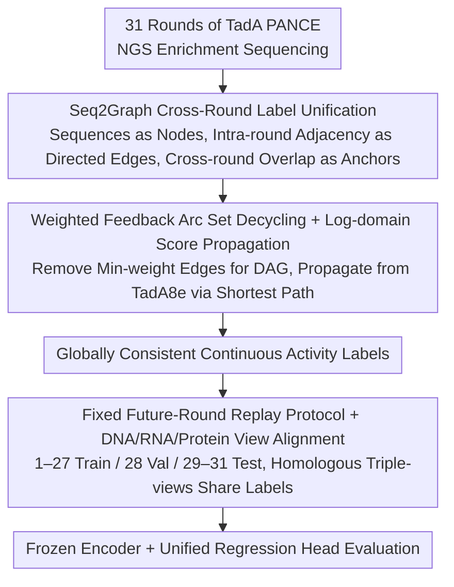

# TadA-Bench: A Million-Variant Benchmark for Future-Round Discovery Toward Agentic Protein Engineering

**Conference**: ICML 2026  
**arXiv**: [2606.02624](https://arxiv.org/abs/2606.02624)  
**Code**: Open-sourced (Hugging Face + GitHub)  
**Area**: Protein Engineering / AI for Science / Benchmarking  
**Keywords**: protein engineering, directed evolution, future-round discovery, benchmark, biological foundation models  

## TL;DR
TadA-Bench utilizes million-scale TadA variant sequences from 31 rounds of real directed evolution wet-lab experiments to formalize protein engineering as a fixed-data replay task of "predicting future rounds using preceding ones." Equipped with a Seq2Graph unified labeling pipeline, it reveals that mainstream biological foundation models significantly fail in "future-round discovery."

## Background & Motivation
**Background**: Protein engineering is transitioning from "one-off predictors" to "agentic iterative closed loops," where models read wet-lab history, invoke analytical tools, recommend variants for the next round, and return them for wet-lab validation. This requires benchmarking data with three attributes: temporal replayability, exploration scale, and cross-round label consistency.

**Limitations of Prior Work**: Current functional benchmarks (biophysical properties, DMS aggregations like ProteinGym) pursue "breadth"—as many families and assays as possible. However, they either lack a true timeline or only cover local fitness landscapes, failing to assess the ranking capability crucial for the "predict future rounds based on the past" closed-loop process. Data specifically for base editor deaminases is highly fragmented, mostly focusing on Cas/sgRNA interactions rather than the deaminase itself, and cross-lab integration introduces significant batch effects.

**Key Challenge**: Standard random split evaluations measure interpolation capability, whereas real-world protein engineering loops require extrapolation. The community lacks a "single campaign, deep temporal chain, unified label" hard benchmark to determine the magnitude of this gap and whether it can be bridged simply by selecting better regression heads.

**Goal**: (1) Construct a deep (31 rounds), large-scale (million variants), single-campaign directed evolution dataset with a clear temporal chain; (2) Convert "local rankings + cross-round anchors" from multi-round NGS enrichment counts into globally consistent continuous activity labels via graph-theoretic methods; (3) Define a fixed past $\rightarrow$ future replay protocol to evaluate DNA / RNA / Protein foundation models using unified metrics.

**Key Insight**: The authors selected TadA (a deaminase for Adenine Base Editors) and performed 31 rounds of PANCE directed evolution. NGS enrichment data from each round were treated as local partial order constraints. A graph-theoretic approach was used to eliminate cycles and anchor scores to the known TadA8e reference sequence, obtaining cross-round comparable activity labels.

**Core Idea**: Treat the "wet-lab directed evolution trajectory" as a fixed-data replay task. Use future-round ranking and finite-budget selection metrics to expose the actual recommendation capabilities of current biological models. By comparing "coverage vs. local density" at matching scales, the work points out that "evolutionary coverage is more informative than local dense sampling."

## Method

### Overall Architecture
TadA-Bench aims to transform a real wet-lab directed evolution trajectory into an offline benchmark that fairly assesses the future-round discovery capabilities of biological models. The authors decompose this into three layers: first, using NGS sequencing from 31 rounds of TadA PANCE as the data foundation to derive aligned DNA / RNA / Protein views; second, using the Seq2Graph pipeline to integrate batch-effect-ridden enrichment counts into globally comparable continuous labels; finally, fixing a "train on past, test on future" replay protocol to evaluate any frozen encoder with a unified regression head.

### Key Designs

**1. Seq2Graph Label Unification: Converting batch-effected multi-round counts into comparable labels**

The most challenging aspect of multi-round NGS is that absolute enrichment counts in each round contain batch-specific noise. Direct concatenation or normalization is dominated by batch effects, while global regression is hindered by duplicate variants and platform noise. The authors preserve only relative "who is better than whom" information: each unique DNA sequence is treated as a graph node. Within a round, directed edges are drawn from higher to lower counts between adjacent variants, with weights representing local enrichment ratios. Cross-round connections rely on "identical sequences appearing in different rounds" as natural anchors to stitch local graphs. This abstraction naturally resists batch effects and scales to millions of nodes.

**2. Weighted Feedback Arc Set Decycling + Log-domain Score Propagation: Restoring global labels from partial orders**

Inconsistent cycles (e.g., $v_i > v_j, v_j > v_k, v_k > v_i$) arise from noise. To obtain a global ranking, the graph must be decycled. The authors model this as a weighted Feedback Arc Set problem—removing a set of edges with minimum total weight to make the graph a DAG: $\min_{F\subseteq E}\sum_{e\in F}w_e$ such that $G\setminus F$ is acyclic. Since this is NP-hard, a greedy heuristic (Eades et al., 1993) is used within strongly connected components. After decycling, scores are propagated in the log-domain starting from the reference TadA8e (activity anchored at 1.0) along the "shortest path": since enrichment ratios are multiplicative, log-domain summation equals products, and shortest paths minimize noise accumulation. The authors emphasize this is a "data integration pipeline" rather than a graph learning contribution; edges and paths facilitate consistency and diffusion and **should not be interpreted as biological ancestry**.

**3. Fixed Future-Round Replay Protocol + View Alignment: Compressing closed-loop operations into reproducible extrapolation tasks**

Standard random splits allow models to "interpolate" using samples from the same mode, masking true extrapolation failure. For the "past-to-future" requirement, a cutoff is set at round $k$. The model trains on $D_{\le k}$ and must rank variants appearing only in $D_{>k}$. The main protocol fixes rounds 1–27 for training, 28 for validation, and 29–31 for testing, with non-overlapping sequences across splits. All views originate from the same NGS: DNA is direct, RNA replaces T$\rightarrow$U, and Protein is translated with synonymous codon activity averaged. This yields 729k+148k+150k DNA sequences and 256k+45k+108k independent protein sequences, enabling fair cross-modal comparison.

### Loss & Training
The primary protocol Uses frozen encoders with a unified regression head, trained using MSE on continuous activity. The validation set (round 28) is strictly for hyperparameter selection. To exclude the possibility that poor performance stems from weak probes, authors perform full fine-tuning and prompt tuning as additional adaptation checks. A discovery-mode evaluation (Recall@N) simulates wet-lab budgets by counting how many top-N predicted candidates are truly highly active future variants.

## Key Experimental Results

### Main Results

| View | Model | Spearman ↑ | Recall@10% ↑ | nDCG@10% ↑ |
|------|------|------------|--------------|------------|
| DNA | Evo2-7B | 0.0707 | 0.1005 | 0.3236 |
| DNA | Evo2-40B | 0.0675 | 0.1003 | 0.3244 |
| DNA | NT-500M | 0.0189 | 0.1005 | 0.3079 |
| RNA | OG-46M | 0.0079 | 0.1063 | 0.3158 |
| Protein | ESM2-650M | 0.0479 | 0.1120 | 0.2791 |
| Protein | ESMC-600M | **0.0509** | 0.1180 | 0.2860 |
| Protein | Prot-XLNET | 0.0342 | 0.1175 | 0.2895 |

Main Conclusion: Across DNA/RNA/Protein views, Spearman correlation for all frozen probes falls below $\rho \approx 0.1$, significantly lower than correlations under random split controls. This indicates that existing biological foundation models provide almost no effective ranking signal for "future rounds."

### Ablation Study

| Config | Phenom | Meaning |
|------|------|------|
| Random Split (IID) | Protein Spearman increases significantly to "strong interpolation" levels | Labels are learnable; Seq2Graph noise is not the primary issue |
| Future-Round Split (Default) | Spearman $\le 0.1$ | Extrapolation failure; bottleneck is in "past $\rightarrow$ future" |
| Full fine-tune | Limited improvement; gap remains | Not a lack of probe capacity |
| Prompt tuning | Same as above | Not an input conditioning issue |
| Finite Budget top-N Selection | Recall@10% remains weak | Hit rate is low even within realistic wet-lab budgets |
| Matched Scale: Coverage vs Density | Models trained on high evolutionary coverage subsets extrapolate better | "Coverage is more important than density"—design should preserve campaign structure |

### Key Findings
- Interpolation $\neq$ Future-Round Discovery: Models appearing "sufficient" on random splits drop to near-zero Spearman correlation under fixed future-round protocols across all modalities.
- Adaptation does not close the gap: Neither full fine-tuning nor prompt tuning resolves the extrapolation failure, suggesting representation learning lacks necessary trajectory signals.
- Evolutionary coverage outperforms local density: At matched training scales, training sets covering multiple lineages are better for future-round extrapolation than repeatedly sampling around known hits.
- Performance in limited-budget top-N selection is similarly weak, indicating low hit rates when recommending variants for wet labs.

## Highlights & Insights
- **Defining the "Wet-lab Replay" Paradigm**: Isolating the core subtask of agentic protein engineering into "fixed data + temporal split + ranking metrics" provides a much-needed reproducible evaluation for the community.
- **Seq2Graph as Data Infrastructure**: While modestly described as data integration, using FAS decycling and log-domain propagation to solve multi-round NGS stitching is a transferable toolkit for other assays (e.g., Cas9).
- **Homologous Multi-view Alignment**: Generating aligned DNA/RNA/Protein sequences from the same NGS data allows cross-modal models to be compared on the "same question in different languages."
- **The Conclusion is the Research Direction**: Quantifying the failure in "future-round extrapolation" provides immediate methodological insights, such as "coverage matters more," for the next generation of agentic AI for Science.

## Limitations & Future Work
- **Single Protein Family**: Despite the scale (31 rounds $\times$ millions of variants), the benchmark covers only one target (TadA) and one selection assay.
- **Fixed-data vs. True Closed-loop**: The protocol does not evaluate proposal, planning, tool-use, or automated wet-lab execution; it diagnoses only the "ranking module" of an agentic loop.
- **Sequence-defined vs. Design-defined Labels**: Activity reflects holistic cellular performance (expression + folding + editing); it is not an isolated catalytic constant.
- **Path Selection $\neq$ Ancestry**: While clarified by authors, users might still misinterpret the graph as an evolutionary lineage.
- **Future Directions**: Extending to multi-family PANCE data, adding active learning / acquisition function evaluation layers, and providing interfaces for candidate generation modules.

## Related Work & Insights
- **vs. ProteinGym / FLIP / ProteinBench**: These pursue "breadth" across families; TadA-Bench pursues "depth" through a single campaign and temporal protocols.
- **vs. CRISPRbase and Base Editor Aggregations**: TadA-Bench avoids cross-lab batch effects by using a single-source assay with internal consistency repair.
- **vs. Biological Foundation Model Evaluations**: Existing papers focus on zero-shot or DMS interpolation; TadA-Bench challenges the assumption that "larger encoders automatically equal better scientific discovery" by providing an extrapolation testbed.
- **vs. ML-guided Directed Evolution**: By isolating "ranking," this provides a clean sub-module testbed for ALDE-like methods.

## Rating
- Novelty: ⭐⭐⭐⭐ The task paradigm and label pipeline are rare in biological benchmarking.
- Experimental Thoroughness: ⭐⭐⭐⭐⭐ Cross-modality, multiple foundation models, plus random-split and adaptation controls.
- Writing Quality: ⭐⭐⭐⭐ Clear concepts with well-defined boundaries.
- Value: ⭐⭐⭐⭐⭐ Provides a rare hard benchmark for agentic AI4Science with actionable insights.

<!-- RELATED:START -->

## Related Papers

- [\[ICLR 2026\] NC-Bench and NCfold: A Benchmark and Closed-Loop Framework for RNA Non-Canonical Base-Pair Prediction](../../ICLR2026/computational_biology/nc-bench_and_ncfold_a_benchmark_and_closed-loop_framework_for_rna_non-canonical_.md)
- [\[ICLR 2026\] CAPSUL: A Comprehensive Human Protein Benchmark for Subcellular Localization](../../ICLR2026/computational_biology/capsul_a_comprehensive_human_protein_benchmark_for_subcellular_localization.md)
- [\[ICLR 2026\] GeomMotif: A Benchmark for Arbitrary Geometric Preservation in Protein Generation](../../ICLR2026/computational_biology/geommotif_a_benchmark_for_arbitrary_geometric_preservation_in_protein_generation.md)
- [\[ICML 2026\] Influence-Guided Symbolic Regression: Scientific Discovery via LLM-Driven Equation Search with Granular Feedback](influence-guided_symbolic_regression_scientific_discovery_via_llm-driven_equatio.md)
- [\[ICML 2026\] LineageFlow: Flow Matching for High-Fidelity Family-Aware Protein Sequence Generation](lineageflow_flow_matching_for_high-fidelity_family-aware_protein_sequence_genera.md)

<!-- RELATED:END -->
