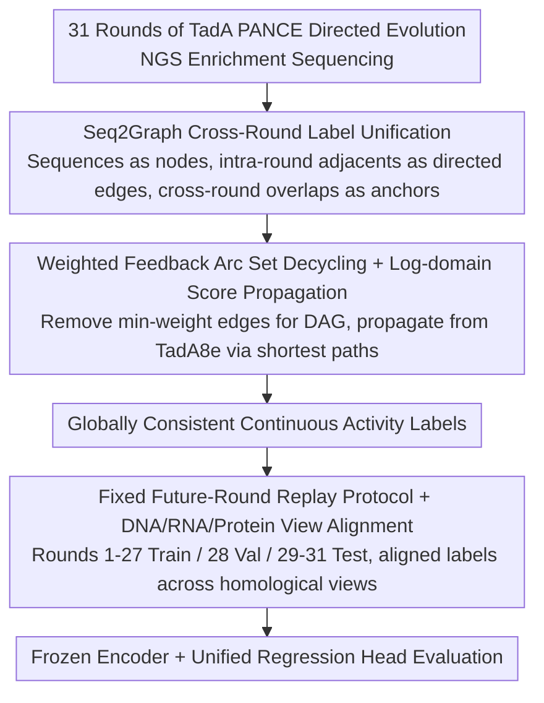

# TadA-Bench: A Million-Variant Benchmark for Future-Round Discovery Toward Agentic Protein Engineering

**Conference**: ICML 2026  
**arXiv**: [2606.02624](https://arxiv.org/abs/2606.02624)  
**Code**: Open source (Hugging Face + GitHub)  
**Area**: Protein Engineering / AI for Science / Benchmarking  
**Keywords**: protein engineering, directed evolution, future-round discovery, benchmark, biological foundation models  

## TL;DR
TadA-Bench utilizes million-level TadA variant sequences from 31 rounds of real-world directed evolution wet experiments. It formalizes protein engineering as a fixed-data replay task of "predicting future rounds using preceding ones" with a paired Seq2Graph label unification pipeline, revealing that mainstream biological foundation models significantly fail in "future-round discovery."

## Background & Motivation
**Background**: Protein engineering is transitioning from "one-off predictors" to "agentic iterative closed loops," where models are required to read wet-lab histories, invoke analytical tools, recommend variants for the next round, and wait for wet-lab verification. This necessitates evaluation data with three attributes: temporal replayability, exploration scale, and cross-round label consistency.

**Limitations of Prior Work**: Existing functional benchmarks (e.g., ProteinGym or other DMS aggregations) pursue "breadth"—maximizing families and assays. However, they either lack a real timeline or only cover local fitness landscapes, failing to assess the ranking capability critical to the "predicting future rounds based on the past" loop. Data specifically for base editor deaminases is highly fragmented, with most focused on Cas/sgRNA interactions rather than the deaminase itself; splicing data across laboratories also introduces significant batch effects.

**Key Challenge**: Standard random split evaluations measure interpolation ability, whereas real-world protein engineering loops require extrapolation. The community lacks a "single campaign, deep temporal chain, unified label" hard benchmark to determine how large this gap is and whether it can be bridged simply by selecting a better regression head.

**Goal**: (1) Construct a deep (31 rounds), large-scale (million variants), and temporally clear single-campaign directed evolution dataset; (2) Convert "local ranking + cross-round anchors" from multi-round NGS enrichment counts into globally consistent continuous activity labels using graph-theoretic methods; (3) Define a fixed past-to-future replay protocol to evaluate DNA / RNA / protein foundation models with a unified metric.

**Key Insight**: The authors performed 31 rounds of PANCE directed evolution on TadA (the deaminase used in Adenine Base Editors). NGS enrichment data from each round were treated as local partial order constraints. Graph theory methods were used to eliminate cycles and anchor scores to the known TadA8e reference sequence, obtaining activity labels comparable across rounds.

**Core Idea**: The "wet-lab directed evolution trajectory" is treated as a fixed-data replay task. By using future-round ranking and limited-budget selection metrics, the true recommendation capabilities of current biological foundation models are exposed. By comparing "coverage vs. local density" at a matched scale, the work points out that "evolutionary coverage is more informative than local dense sampling."

## Method

### Overall Architecture
TadA-Bench aims to solve how to transform a real wet-lab directed evolution trajectory into an offline benchmark that fairly assesses the future-round discovery capabilities of biological foundation models. This is decomposed into three layers: using NGS sequencing from 31 rounds of TadA PANCE as the data foundation to derive aligned DNA / RNA / protein tri-views; employing the Seq2Graph pipeline to integrate per-round enrichment counts (with batch effects) into continuous activity labels comparable across all variants; and finally, fixing a "train on past, test on future" replay protocol for evaluation.

### Key Designs

**1. Seq2Graph Cross-Round Label Unification: Converting batch-effect enrichment counts into comparable labels**

The most difficult aspect of multi-round NGS is that absolute enrichment readings carry round-specific batch noise. The authors ignore absolute values and preserve only "who is stronger" relative information: each unique DNA sequence is treated as a graph node. Within a round, directed edges are drawn from higher to lower-ranked variants based on enrichment readings, with edge weights representing local enrichment ratios. Between rounds, "identical sequences appearing in different rounds" serve as natural anchors to stitch local graphs together.

**2. Weighted Feedback Arc Set Decycling + Log-domain Score Propagation: Recovering globally consistent labels from partial order constraints**

Once local partial orders are combined, noise creates inconsistent cycles (e.g., $v_i>v_j,\ v_j>v_k,\ v_k>v_i$). Decycling is necessary for a consistent activity order. This is modeled as a weighted Feedback Arc Set problem—removing a set of edges with minimum total weight to make the graph a DAG: $\min_{F\subseteq E}\sum_{e\in F}w_e$ such that $G\setminus F$ is acyclic. This is NP-hard, so a greedy heuristic is used within strongly connected components. After decycling, scores are propagated in log-domain starting from the reference TadA8e (activity anchored at 1.0) along "shortest paths": since enrichment ratios are multiplicative, taking the log and summing along the path is equivalent to the product, and choosing the shortest path minimizes noise accumulation. The authors clarify that edges and paths serve only for consistency correction and score diffusion and **should not be interpreted as biological ancestry**.

**3. Fixed Future-Round Replay Protocol + DNA/RNA/Protein View Alignment: Compressing closed-loop operations into reproducible extrapolation tests**

Standard random splits allow models to "interpolate" through samples in the same mode, masking extrapolation failures. To simulate the agentic loop requirement of "predicting the future based on the past," round $k$ is used as a cutoff. The model trains on $D_{\le k}$ but must rank variants appearing only in $D_{>k}$. The main benchmark fixes rounds 1–27 for training, round 28 for validation, and rounds 29–31 for testing, with non-overlapping sequences across splits. The views are aligned: DNA from sequencing, RNA via T→U replacement, and proteins via codon translation (averaging activity for synonymous codons), resulting in 729k+148k+150k DNA sequences and 256k+45k+108k independent protein sequences.

### Loss & Training
The primary protocol utilizes a frozen encoder with a unified regression head, trained using MSE on continuous activity labels. The validation set (round 28) is used only for learning rate selection. To ensurepoor performance isn't due to "weak probes," full fine-tuning and prompt tuning are also evaluated. A discovery-mode check simulates wet-lab budgets: given top-N recommendations, the hit rate of truly high-activity future-round variants is calculated.

## Key Experimental Results

### Main Results

| View | Model | Spearman ↑ | Recall@10% ↑ | nDCG@10% ↑ |
|------|------|------------|--------------|------------|
| DNA | Evo2-7B | 0.0707 | 0.1005 | 0.3236 |
| DNA | Evo2-40B | 0.0675 | 0.1003 | 0.3244 |
| DNA | NT-500M | 0.0189 | 0.1005 | 0.3079 |
| RNA | OG-46M | 0.0079 | 0.1063 | 0.3158 |
| Protein | ESM2-650M | 0.0479 | 0.1120 | 0.2791 |
| Protein | ESMC-600M | **0.0509** | 0.1180 | 0.2860 |
| Protein | Prot-XLNET | 0.0342 | 0.1175 | 0.2895 |

Main finding: Across DNA / RNA / protein views, Spearman correlations for all frozen probes fall below $\rho\approx 0.1$, significantly lower than in random-split controls. This indicates current biological foundation models possess almost no effective ranking signal for "future rounds."

### Ablation Study

| Configuration | Phenomenon | Meaning |
|------|------|------|
| Random Split (IID) | Protein view Spearman rises significantly to "strong interpolation" levels | Labels are learnable; the issue is not Seq2Graph noise |
| Future-round Split (Default) | Spearman ≤ 0.1 | Extrapolation failure; bottleneck is "past→future" |
| Full fine-tune | Limited improvement; gap does not close | Not a lack of probe capacity |
| Prompt tuning | Same as above | Not an issue of input conditioning |
| Limited budget top-N selection | Recall@10% remains weak | Hit rate remains low even with realistic wet-lab budgets |
| Matched scale: Coverage vs. Density | Models trained on high evolutionary coverage subsets extrapolate better | "Coverage is more informative than local density" |

### Key Findings
- Interpolation ability $\neq$ future-round discovery ability: Biological foundation models that perform well on random splits see Spearman drops to near 0 under the fixed future-round protocol across all three views.
- Adaptation cannot save the day: Neither full fine-tuning nor prompt tuning closed the gap, implying the issue is not "weak probes" but a lack of extrapolation signals in learned representations.
- Evolutionary coverage outperforms local density: At matched training scales, training sets covering multiple lineages are better for future-round extrapolation than repeatedly sampling around known hits.
- Limited budget top-N performance is equally weak, indicating that recommendations to wet labs still suffer from low hit rates.

## Highlights & Insights
- **Defining the "wet-lab replay" paradigm**: By isolating the core sub-task of agentic protein engineering into "fixed data + temporal split + ranking metrics," a hard-to-evaluate closed-loop problem is compressed into a reproducible offline protocol.
- **Seq2Graph as data infrastructure**: While presented modestly as data integration rather than graph learning innovation, using FAS decycling and log-space propagation to solve multi-round NGS integration is a toolset transferable to other high-throughput screenings (e.g., Cas9).
- **Tri-view alignment**: Generating aligned DNA / RNA / protein sequences from a single NGS source provides a fair comparison ground for cross-modal biological foundation models.
- **The conclusion as a research direction**: Quantifying the "future-round extrapolation" bottleneck provides insights, such as "coverage is more important," which can guide future data collection and agentic methodologies.

## Limitations & Future Work
- **Single protein family**: Despite the scale (31 rounds × million variants), the benchmark covers only TadA and one selection-coupled assay; cross-family generalizability requires further work.
- **Fixed-data vs. True closed-loop**: The protocol excludes evaluation of proposal, planning, and tool-use, assessing only the ranking sub-module of the agentic loop.
- **Sequence-defined vs. Design-defined labels**: Activity reflects total cellular performance (expression + folding + activity) rather than isolated catalytic constants; signals are composite.
- **Path selection $\neq$ Ancestry**: Although explicitly stated by the authors, users might still misinterpret the graph as an evolutionary lineage.

## Related Work & Insights
- **vs ProteinGym / FLIP / ProteinBench**: These benchmarks emphasize "breadth" (multi-family aggregation); TadA-Bench emphasizes "depth" (single campaign, deep temporal chain).
- **vs CRISPRbase and base editor datasets**: Cross-lab splicing introduces batch effects; TadA-Bench uses a single assay source with Seq2Graph for consistency.
- **vs Biological Foundation Model evaluations (ESM, Evo, NT)**: Those evaluations often rely on zero-shot or DMS interpolation; TadA-Bench challenges the assumption that larger encoders automatically equal better scientific discovery.

## Rating
- Novelty: ⭐⭐⭐⭐ 
- Experimental Thoroughness: ⭐⭐⭐⭐⭐ 
- Writing Quality: ⭐⭐⭐⭐ 
- Value: ⭐⭐⭐⭐⭐ 

<!-- RELATED:START -->

- **ProteinGym**: Large-scale DMS aggregation for variant effect prediction.
- **PANCE**: Phage-assisted non-continuous evolution techniques.
- **Evo / ESM**: Foundations models for sequence modeling.

<!-- RELATED:END -->

## Related Papers

- [\[ICLR 2026\] EvoFlows: Evolutionary Edit-Based Flow-Matching for Protein Engineering](../../ICLR2026/computational_biology/evoflows_evolutionary_edit-based_flow-matching_for_protein_engineering.md)
- [\[ICLR 2026\] How to Make the Most of Your Masked Language Model for Protein Engineering](../../ICLR2026/computational_biology/how_to_make_the_most_of_your_masked_language_model_for_protein_engineering.md)
- [\[ICML 2026\] Influence-Guided Symbolic Regression: Scientific Discovery via LLM-Driven Equation Search with Granular Feedback](influence-guided_symbolic_regression_scientific_discovery_via_llm-driven_equatio.md)
- [\[NeurIPS 2025\] A Standardized Benchmark for Multilabel Antimicrobial Peptide Classification](../../NeurIPS2025/computational_biology/a_standardized_benchmark_for_multilabel_antimicrobial_peptide_classification.md)
- [\[ICML 2025\] scSSL-Bench: Benchmarking Self-Supervised Learning for Single-Cell Data](../../ICML2025/computational_biology/scssl-bench_benchmarking_self-supervised_learning_for_single-cell_data.md)

<!-- RELATED:END -->
