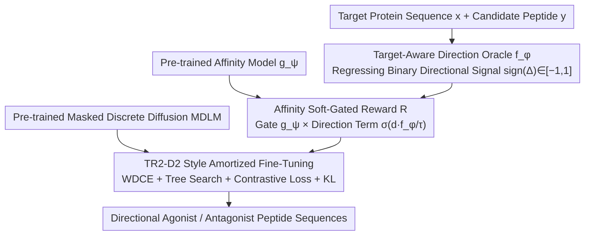

# TD3B: Transition-Directed Discrete Diffusion for Allosteric Binder Generation

**Conference**: ICML 2026 Spotlight  
**arXiv**: [2605.09810](https://arxiv.org/abs/2605.09810)  
**Code**: https://huggingface.co/ChatterjeeLab/TD3B (Available)  
**Area**: Medicine & Drugs / Discrete Diffusion / Protein Generation  
**Keywords**: Allosteric regulation, agonist/antagonist, masked discrete diffusion, direction Oracle, gated reward  

## TL;DR
TD3B formalizes the design of agonists and antagonists as a generation task for "directional transition operators." By employing a framework consisting of a direction Oracle, affinity gating, and tree-search amortized fine-tuning of a masked discrete diffusion model, it enables pre-trained peptide generators to produce sequences that directionally shift transitions between active and inactive protein conformations.

## Background & Motivation
**Background**: Current mainstream binder design methods (such as RFdiffusion, BindCraft, BoltzGen, and RareFoldGPCR) typically treat proteins as static 3D structures. They define the task as "stabilizing a specific target conformation or interface," which is essentially an equilibrium structure-matching problem.

**Limitations of Prior Work**: Allosteric regulation, particularly the clinical efficacy of GPCRs, depends on the binder's ability to shift the transition direction between "active $\leftrightarrow$ inactive" states rather than merely stabilizing a single conformation. The difference between agonists and antagonists lies in asymmetric perturbations along the kinetic path. Purely structural methods cannot systematically distinguish between them and must rely on post-hoc filtering or empirical biases, which yield limited effectiveness.

**Key Challenge**: Allosteric function is inherently a kinetic/non-equilibrium phenomenon (irreversible and directional), whereas structural generative models encode equilibrium priors. Their representation spaces are mismatched; structure-centric approaches fundamentally cannot express the concept that "this binder biases the transition toward activation."

**Goal**: To design a generative framework capable of (i) explicitly modeling the directionality of agonism vs. antagonism, (ii) decoupling directionality from affinity while ensuring binding, and (iii) leveraging existing powerful discrete diffusion priors for peptides.

**Key Insight**: The authors borrow from Markov State Models to abstract allosteric kinetics as sequence-conditional transition operators $Q(y)=Q_0+\Delta Q(y)$. The critical quantity is the directional asymmetry $\Delta_{ij}(y)=Q(y)(s_i,s_j)-Q(y)(s_j,s_i)$. Since continuous values are practically unobservable, only discrete labels $\mathrm{sign}(\Delta(y))\in\{+1,-1\}$ are utilized. This provides a robust supervisory signal: instead of regressing kinetic rates, the model utilizes only directional signals.

**Core Idea**: Directional control is treated as amortized guidance overlaid on a pre-trained MDLM. A direction Oracle provides directional gradients, while an affinity model serves as a soft gate. These are combined into a gated reward, and the model is fine-tuned using TR2-D2-style importance-weighted denoising.

## Method

### Overall Architecture
TD3B aims to enable generators to produce peptides that directionally shift active/inactive protein transitions rather than merely stabilizing a 3D conformation. The process is decomposed into three layers: first, training a direction Oracle to distinguish between agonism and antagonism; second, using a pre-trained affinity model as a soft gate to integrate directional signals and binding probability into a single gated reward; and finally, using this reward to perform amortized fine-tuning on a pre-trained masked discrete diffusion (MDLM) peptide generator. This entire pipeline operates within the sequence space, bypassing 3D structural modeling.

### Key Designs

**1. Target-Aware Direction Oracle $f_\phi$: Compressing Kinetic Direction into a Supervised Binary Signal**

Allosteric function is fundamentally a kinetic/non-equilibrium phenomenon. Because the continuous values of the true directional asymmetry $\Delta_{ij}(y)=Q(y)(s_i,s_j)-Q(y)(s_j,s_i)$ are unobservable, the authors utilize only $\mathrm{sign}(\Delta(y))\in\{+1,-1\}$. The Oracle $f_\phi(y,x)\to[-1,1]$ regresses only direction rather than rate. Given a target sequence $x$ and a candidate peptide $y$, pre-trained encoders pool features to obtain $h_x, h_y$, which are fused via gating $z=g\odot h_x+(1-g)\odot h_y$ (where $g=\sigma(W_g[h_x;h_y]+b_g)$) before passing through an MLP to output a scalar score. Supervision is performed via binary classification with confidence weights: $\mathcal{L}_{\text{dir}}=\mathbb{E}[\kappa(y)\log(1+\exp(-d\cdot f_\phi(y,x)))]$, where partial agonists are assigned lower confidence $\kappa_{\text{part}}\in(0,1)$. This approach matches the coarse-grained nature of available labels (as regressing continuous rates might mislead the model), while gated fusion allows the Oracle to utilize both target context and binder structure more flexibly than simple concatenation.

**2. Affinity Soft-Gated Reward: Binding First, Selecting Direction Within Binding Space**

If direction is used directly as a loss, the model may generate sequences that have the correct direction but fail to bind. Alternatively, using explicit Pareto weighting between direction and affinity makes weights difficult to tune and can cause the model to oscillate between objectives. TD3B employs a multiplicative gate: $R(y;d^\star,x)=g_\psi(y,x)\cdot\sigma(d^\star\cdot f_\phi(y,x)/\tau)$, where the pre-trained affinity model $g_\psi\in[0,1]$ acts as the gate and the directional term $\sigma(d^\star f_\phi/\tau)$ acts as an additive bias. This ensures that only sequences that are both "true binders + directionally correct" receive high rewards; non-binders are zeroed out by the gate, and those with incorrect directions are suppressed. This treats "being a binder" as a hard prerequisite, filtering directional preferences within the binding space and avoiding post-hoc Pareto trade-offs.

**3. TR2-D2 Style Amortized Fine-Tuning + Directional Contrastive Loss: Embedding Rewards into Sampling Distributions**

Pure Reinforcement Learning (RL) exhibits high variance over discrete diffusion. TD3B amortizes the gated reward into the MDLM sampling distribution. The training objective $p^\star(y)\propto p_{\theta_0}(y)\exp(S(y)/\alpha)$ is optimized via Importance Weighted Denoising Cross-Entropy (WDCE). Trajectory-level importance weights $w(y_{0:1})\propto\exp(S(y_1)/\alpha)\prod_n p_{\theta_0}/p_{\bar\theta}$ correct proposal bias. On the sampling side, PepTune-style trajectory-aware tree search is added, guided by gated rewards for importance-weighted branch selection. Tree search handles exploration, while WDCE internalizes the directionality. To prevent the Oracle from learning directional differences only at the classification head, a margin-based contrastive loss is added: $\mathcal{L}_{\text{ctr}}=\sum_P\|h_\theta(y_i)-h_\theta(y_j)\|^2+\sum_N\max(0,m-\|\cdot\|)^2$. This pulls samples with the same direction closer and pushes opposite directions apart in representation space. Finally, a KL term anchors $\theta$ near $\theta_0$ to prevent mode collapse.

### Loss & Training
The total loss is $\mathcal{L}=\mathcal{L}_{\text{WDCE}}+\lambda_{\text{ctr}}\mathcal{L}_{\text{ctr}}+\lambda_{\text{reg}}\mathcal{L}_{\text{KL}}$. Training data $\{(x,y,a)\}$ consists of peptide-target pairs with functional labels (full/partial agonist, antagonist, negative). Negatives are excluded from the directional loss but contribute to the training of the affinity gate.

## Key Experimental Results

### Main Results
The paper validates whether TD3B can outperform structural and inference-time guidance baselines in "directional selectivity" on clinically relevant targets such as GPCRs. The core evaluation metrics are the separability in functional space and the maintenance of affinity for agonist vs. antagonist sequences generated for the same target.

| Setup | Evaluation Metric | TD3B | Structural Baselines (RFdiffusion, etc.) | Key Difference |
|------|---------|------|---------------------------|----------|
| Directed Agonist Generation | Directional Selectivity | Significantly Positive | Near Random | Structural methods cannot encode direction |
| Directed Antagonist Generation | Directional Selectivity | Significantly Negative | Near Random | Same as above |
| Affinity Maintenance | Predicted Affinity | Comparable to Baselines | Baseline | Gating prevents degradation |
| Inference-time Guidance | Post-filtered Direction | Inferior to TD3B | — | Post-filtering reduces throughput |

### Ablation Study

| Configuration | Observation |
|------|------|
| Full TD3B | Achieves both directionality and affinity simultaneously |
| w/o Affinity Gate | Generates "directionally correct but non-binding" sequences |
| w/o Contrastive Loss | Oracle's separation of directions in representation space decreases |
| Pareto Weighting instead of Gate | Difficult weighting; tradeoff between direction and affinity |
| Guidance instead of Fine-tuning | Decrease in both diversity and directional accuracy |

### Key Findings
- Amortized fine-tuning is more reliable than pure inference-time guidance; since gradient guidance is limited in discrete space, embedding rewards into the model distribution is a more stable path.
- Treating affinity as a soft gate rather than a Pareto term is a critical engineering decision; the latter causes the model to "vacillate" between two objectives.
- Even with coarse binary directional supervision, contrastive loss can amplify separability in the representation space.

## Highlights & Insights
- **"Direction as a Generative Goal"**: This is the first work to explicitly optimize the directionality of allosteric function during sequence generation rather than via post-hoc filtering, providing a new interface for "function-oriented protein design."
- **Gated Reward Philosophy**: Treating a "necessary condition (binding)" as a soft gate and "directional preference" as an additive term offers a cleaner multi-objective fusion paradigm than Pareto weighting, applicable to any "X required, optimize for Y" generation task.
- **Honest Supervision Granularity**: The authors explicitly avoid regressing continuous kinetic rates, using only $\mathrm{sign}(\Delta)$. This approach of "theoretical framework preceding supervision granularity without forced extrapolation" is a valuable lesson for biological ML.

## Limitations & Future Work
- Supervision is limited to coarse directionality; "intensity" cannot be directly quantified. Sub-classification of clinical partial agonists requires finer labels or active learning.
- The method is based entirely on sequence space and does not explicitly model 3D interfaces; communication paths between complex conformations might lose structural specificity.
- The Oracle's training dataset (peptide-target pairs with functional labels) is limited in scale; generalization beyond GPCRs has not been fully validated.
- Tree search combined with WDCE incurs significant computational costs, resulting in slower throughput compared to inference-only guidance.
- The affinity gate $g_\psi$ is itself a pre-trained model, and its biases will be seamlessly inherited by TD3B.

## Related Work & Insights
- **vs RFdiffusion / BindCraft / BoltzGen**: These are structure-centric methods focused on stabilizing contact interfaces. TD3B shifts the goal to biasing transition directions, acting as a complement rather than a replacement.
- **vs PepTune / TR2-D2**: Both use MDLM-based guided fine-tuning but target affinity or multi-objective Pareto optimization. TD3B introduces directional supervision to extend goals to the kinetic level.
- **vs DRAKES / GLID2E**: Both update discrete diffusion policies using RL-style methods. TD3B uses a more stable amortized path with tree search and structures rewards in a gated format.
- **vs Classifier Guidance / SMC**: Gradient guidance is limited in discrete domains; this work resolves this through amortization.

## Rating
- Novelty: ⭐⭐⭐⭐⭐ Explicitly targeting directional allosteric control in diffusion generation is a significant first.
- Experimental Thoroughness: ⭐⭐⭐ GPCR validation is a strong start, but cross-family generalization and real-world wet-lab validation are still needed.
- Writing Quality: ⭐⭐⭐⭐ The mathematical framework (transition operator $\to$ directional supervision $\to$ gated reward) is logically progressive and clear.
- Value: ⭐⭐⭐⭐ Provides a new paradigm for designing functional binders for high-value clinical targets like GPCRs.

<!-- RELATED:START -->

## Related Papers

- [\[ICLR 2026\] Ultra-Fast Language Generation via Discrete Diffusion Divergence Instruct](../../ICLR2026/computational_biology/ultra-fast_language_generation_via_discrete_diffusion_divergence_instruct.md)
- [\[NeurIPS 2025\] Constrained Discrete Diffusion](../../NeurIPS2025/computational_biology/constrained_discrete_diffusion.md)
- [\[ICLR 2026\] Discrete Diffusion Trajectory Alignment via Stepwise Decomposition](../../ICLR2026/computational_biology/discrete_diffusion_trajectory_alignment_via_stepwise_decomposition.md)
- [\[ICML 2025\] PepTune: De Novo Generation of Therapeutic Peptides with Multi-Objective-Guided Discrete Diffusion](../../ICML2025/computational_biology/peptune_de_novo_generation_of_therapeutic_peptides_with_multi-objective-guided_d.md)
- [\[ICML 2026\] Plug-and-Play Guidance for Discrete Diffusion Models via Gradient-Informed Logit Correction](plug-and-play_guidance_for_discrete_diffusion_models_via_gradient-informed_logit.md)

<!-- RELATED:END -->
