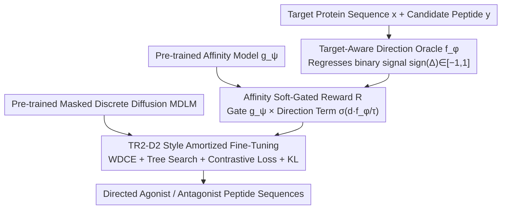

# TD3B: Transition-Directed Discrete Diffusion for Allosteric Binder Generation

**Conference**: ICML 2026 Spotlight  
**arXiv**: [2605.09810](https://arxiv.org/abs/2605.09810)  
**Code**: https://huggingface.co/ChatterjeeLab/TD3B (Available)  
**Area**: Medicine & Pharmacy / Discrete Diffusion / Protein Generation  
**Keywords**: Allosteric Regulation, Agonist/Antagonist, Masked Discrete Diffusion, Direction Oracle, Gated Reward

## TL;DR
TD3B treats agonist/antagonist design as a "directional transition operator" generation task. It employs a masked discrete diffusion framework incorporating a direction Oracle, affinity gating, and tree-search amortized fine-tuning, enabling a pre-trained peptide generator to produce sequences that directionally shift protein transitions between active and inactive conformations.

## Background & Motivation
**Background**: Current mainstream binder design methods (RFdiffusion, BindCraft, BoltzGen, RareFoldGPCR, etc.) treat proteins as fixed 3D structures. They define the task as "stabilizing a target conformation/interface," which is essentially equilibrium structural matching.

**Limitations of Prior Work**: Allosteric regulation (especially clinical efficacy of GPCRs) depends on the binder's ability to shift the direction of the "active ↔ inactive" transition, rather than merely stabilizing one conformation. The difference between agonists and antagonists is an asymmetric perturbation along the kinetic path. Purely structural methods cannot systematically distinguish them and must rely on post-hoc filtering or empirical bias, showing limited effectiveness.

**Key Challenge**: Allosteric function is fundamentally a kinetic/non-equilibrium phenomenon (non-reversible, directional), while structural generative models only encode equilibrium priors. Their representation spaces do not match—structure-centric methods simply cannot express the concept that "this binder biases the transition towards activation."

**Goal**: Design a generative framework capable of (i) explicitly modeling the directionality of agonism vs. antagonism, (ii) decoupling directionality from affinity while ensuring efficacy only for true binders, and (iii) reusing powerful existing peptide discrete diffusion priors.

**Key Insight**: The authors borrow from Markov State Models to abstract allosteric kinetics as sequence-conditional transition operators $Q(y)=Q_0+\Delta Q(y)$. The key quantity is directed asymmetry $\Delta_{ij}(y)=Q(y)(s_i,s_j)-Q(y)(s_j,s_i)$. Since continuous values are unobservable in practice, only discrete labels $\mathrm{sign}(\Delta(y))\in\{+1,-1\}$ are used. This provides a robust supervision criterion: instead of regressing kinetic rates, only the directional signal is used.

**Core Idea**: Directional control is treated as amortized guidance layered onto a pre-trained MDLM. A direction Oracle provides direction gradients, an affinity model serves as a soft gate, and these are combined into a gated reward for fine-tuning via TR2-D2 style importance-weighted denoising.

## Method

### Overall Architecture
TD3B aims to enable a generator to write peptides that directionally shift protein active/inactive transitions rather than stabilizing a 3D conformation. It decomposes this into three layers: training a direction Oracle to distinguish agonism from antagonism, using a pre-trained affinity model as a soft gate to merge directional signals and binding capability into a single gated reward, and finally using this reward to perform amortized fine-tuning on a pre-trained masked discrete diffusion peptide generator. The entire workflow operates in sequence space without entering 3D structures.

### Key Designs

**1. Target-Aware Direction Oracle $f_\phi$: Compressing Kinetic Direction into Supervisable Binary Signals**

Allosteric function is a kinetic/non-equilibrium phenomenon. Since the continuous values of directed asymmetry $\Delta_{ij}(y)=Q(y)(s_i,s_j)-Q(y)(s_j,s_i)$ are unobservable, the authors use $\mathrm{sign}(\Delta(y))\in\{+1,-1\}$. The Oracle $f_\phi(y,x)\to[-1,1]$ regresses direction rather than rate: given target sequence $x$ and candidate peptide $y$, pre-trained encoders pool features $h_x,h_y$, followed by gated fusion $z=g\odot h_x+(1-g)\odot h_y$ (where $g=\sigma(W_g[h_x;h_y]+b_g)$) and an MLP to output a scalar score. Supervision uses binary classification with confidence weights $\mathcal{L}_{\text{dir}}=\mathbb{E}[\kappa(y)\log(1+\exp(-d\cdot f_\phi(y,x)))]$, assigning lower confidence $\kappa_{\text{part}}\in(0,1)$ to partial agonists. This matches the coarse-grained supervision available (forced regression of rates would bias the model), while gated fusion allows the Oracle to utilize target context more flexibly than simple concatenation.

**2. Affinity Soft-Gated Reward: Binders First, Direction Selected within Binding Space**

If direction is used directly as a loss, the model may generate "directionally correct" sequences that fail to bind. Instead of Pareto weighting, TD3B uses a multiplicative gate: $R(y;d^\star,x)=g_\psi(y,x)\cdot\sigma(d^\star\cdot f_\phi(y,x)/\tau)$, where the pre-trained affinity model $g_\psi\in[0,1]$ acts as a gate and the direction term $\sigma(d^\star f_\phi/\tau)$ acts as an additive offset. High rewards are only assigned to sequences that are both "true binders + directionally correct." Non-binders are zeroed out by the gate, and incorrect directions are suppressed. This treats "being a binder" as a hard prerequisite, filtering direction within the binding space and avoiding post-hoc trade-offs.

**3. TR2-D2 Style Amortized Fine-Tuning + Directional Contrastive Loss: Embedding Rewards into the Sampling Distribution**

Pure RL on discrete diffusion suffers from high variance. TD3B amortizes the gated reward into the MDLM sampling distribution. The training objective $p^\star(y)\propto p_{\theta_0}(y)\exp(S(y)/\alpha)$ is optimized via Importance Weighted Denoising Cross-Entropy (WDCE). Trajectory-level weights $w(y_{0:1})\propto\exp(S(y_1)/\alpha)\prod_n p_{\theta_0}/p_{\bar\theta}$ correct proposal bias. Sampling incorporates PepTune-style trajectory-aware tree search, using gated rewards to guide importance-weighted branch selection. To prevent the Oracle from only learning direction at the classification head, a margin-based contrastive loss $\mathcal{L}_{\text{ctr}}=\sum_P\|h_\theta(y_i)-h_\theta(y_j)\|^2+\sum_N\max(0,m-\|\cdot\|)^2$ is added to pull same-direction samples closer and push opposite-direction samples apart in the representation space. A KL term keeps $\theta$ near $\theta_0$ to prevent mode collapse.

### Loss & Training
The total loss is $\mathcal{L}=\mathcal{L}_{\text{WDCE}}+\lambda_{\text{ctr}}\mathcal{L}_{\text{ctr}}+\lambda_{\text{reg}}\mathcal{L}_{\text{KL}}$. Training data $\{(x,y,a)\}$ consists of peptide-target pairs with functional labels (full/partial agonist, antagonist, negative). Negatives do not participate in direction loss but contribute to affinity gate training.

## Key Experimental Results

### Main Results
The paper validates TD3B on clinically relevant targets like GPCRs to see if it outperforms structural baselines and inference-time guidance in "directional selectivity." The core evaluation is the separability and affinity maintenance of generated agonist vs. antagonist sequences in functional space.

| Setting | Metric | TD3B | Structural Baselines (RFdiffusion, etc.) | Key Difference |
|------|---------|------|---------------------------|----------|
| Directed Agonist Generation | Directional Selectivity | Significantly Positive | Near Random | Structural methods cannot encode direction |
| Directed Antagonist Generation | Directional Selectivity | Significantly Negative | Near Random | Same as above |
| Affinity Maintenance | Predicted Affinity | Comparable to Baselines | Baseline | Gated reward ensures no degradation |
| Inference-time Guidance | Post-filtering Direction | Inferior to TD3B | — | Post-filtering reduces throughput |

### Ablation Study

| Configuration | Observation |
|------|------|
| Full TD3B | Achieves both direction and affinity |
| w/o Affinity Gate | Generates sequences with correct direction but zero binding |
| w/o Contrastive Loss | Oracle's separation of directions in representation space decreases |
| Pareto Weighting (instead of gate) | Difficult to tune; direction and affinity fluctuate inversely |
| Guidance vs. Fine-Tuning | Both diversity and directional accuracy decrease with pure guidance |

### Key Findings
- Amortized fine-tuning is more reliable than pure inference-time guidance: gradient guidance is limited in discrete space, so internalizing rewards into the distribution is more robust.
- Using affinity as a soft gate rather than a Pareto term is a critical engineering decision; the latter causes the model to "oscillate" between objectives.
- Even with coarse-grained binary labels, contrastive loss effectively amplifies directional separability in the representation space.

## Highlights & Insights
- **"Direction as a Generative Objective"**: The first to explicitly use allosteric directionality as an optimization objective for sequence generation rather than a post-hoc filter, providing a new interface for "function-oriented protein design."
- **Gated Reward Philosophy**: Treating "prerequisites (binding)" as a soft gate and "preferences (direction)" as an additive component is a cleaner multi-objective fusion paradigm than Pareto weighting, applicable to any "X required, optimize Y" task.
- **Honest Supervision Granularity**: Explicitly avoiding regression of continuous kinetic rates in favor of $\mathrm{sign}(\Delta)$ is a commendable approach in biological ML—having a framework that exceeds the supervision granularity without forced extrapolation.

## Limitations & Future Work
- Supervision is limited to coarse direction; "intensity" cannot be directly quantified—clinical differentiation of partial agonists requires finer labels or active learning.
- The method is sequence-based and does not explicitly model 3D interfaces; communication paths between complex conformations might lose structural specificity.
- The scale of the Oracle training dataset (labeled peptide-target pairs) is limited; generalization beyond GPCRs is not fully verified.
- Tree search + WDCE involves significant computational cost compared to inference-only guidance.
- The affinity gate $g_\psi$ is itself a pre-trained model; its biases are inherited by TD3B.

## Related Work & Insights
- **vs. RFdiffusion / BindCraft / BoltzGen**: These are structure-centric methods focused on stabilizing interfaces; TD3B shifts the goal to biasing transition directions, making them complementary.
- **vs. PepTune / TR2-D2**: Also based on MDLM guided fine-tuning, but for affinity or Pareto objectives; TD3B extends goals to the kinetic level using directional supervision.
- **vs. DRAKES / GLID2E**: Use RL-style updates for discrete diffusion; TD3B uses more stable amortized paths and structured gated rewards.
- **vs. Classifier Guidance / SMC**: Gradient guidance is limited in discrete domains; this work resolves this via amortization.

## Rating
- Novelty: ⭐⭐⭐⭐⭐ Explicitly targeting allosteric directionality in diffusion generation fills a significant gap.
- Experimental Thoroughness: ⭐⭐⭐ GPCR validation is a strong start, but cross-family generalization and wet-lab validation are needed.
- Writing Quality: ⭐⭐⭐⭐ The mathematical framework (Transition Operator → Direction Supervision → Gated Reward) is logically sound and clearly motivated.
- Value: ⭐⭐⭐⭐ Provides a new paradigm for designing functional binders for high-value clinical targets like GPCRs.

<!-- RELATED:START -->

## Related Papers

- [\[ICLR 2026\] Ultra-Fast Language Generation via Discrete Diffusion Divergence Instruct](../../ICLR2026/computational_biology/ultra-fast_language_generation_via_discrete_diffusion_divergence_instruct.md)
- [\[NeurIPS 2025\] Constrained Discrete Diffusion](../../NeurIPS2025/computational_biology/constrained_discrete_diffusion.md)
- [\[ICLR 2026\] Discrete Diffusion Trajectory Alignment via Stepwise Decomposition](../../ICLR2026/computational_biology/discrete_diffusion_trajectory_alignment_via_stepwise_decomposition.md)
- [\[ICML 2025\] PepTune: De Novo Generation of Therapeutic Peptides with Multi-Objective-Guided Discrete Diffusion](../../ICML2025/computational_biology/peptune_de_novo_generation_of_therapeutic_peptides_with_multi-objective-guided_d.md)
- [\[ICML 2025\] GenMol: A Drug Discovery Generalist with Discrete Diffusion](../../ICML2025/computational_biology/genmol_a_drug_discovery_generalist_with_discrete_diffusion.md)

<!-- RELATED:END -->
