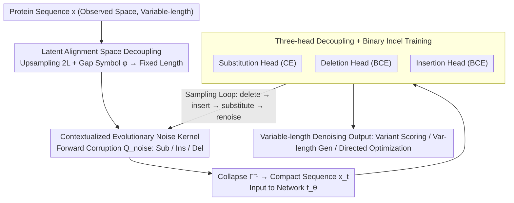

# Towards A Generative Protein Evolution Machine with DPLM-Evo

**Conference**: ICML 2026  
**arXiv**: [2605.00182](https://arxiv.org/abs/2605.00182)  
**Code**: None  
**Area**: Protein Generation / Discrete Diffusion / Biomedicine  
**Keywords**: Protein Language Models, Discrete Diffusion, Evolutionary Modeling, Variable-length Generation, Insertion and Deletion

## TL;DR
This paper proposes DPLM-Evo, which extends discrete diffusion in protein language models from "mask-and-replace only" to "explicit modeling of substitution, insertion, and deletion." By decoupling variable-length observed sequences into an upsampled latent alignment space and utilizing a contextualized evolutionary noise kernel, it achieves variable-length evolutionary generation and trajectory-style protein post-editing/optimization. It achieves SOTA performance on ProteinGym single-sequence variant effect prediction.

## Background & Motivation

**Background**: Protein Language Models (PLMs, such as ESM, ProGen, DPLM, DPLM-2) learn evolutionary constraints from large-scale sequence databases for applications including zero-shot variant effect prediction, structure prediction, and sequence generation. Among these, discrete diffusion PLMs (DPLM series) outperform autoregressive PLMs in representation and generation due to their bidirectional receptive fields and ability to model long-range dependencies.

**Limitations of Prior Work**: Existing DPLMs use an absorbing-state (masking) as the forward noise kernel, simplifying generation to "iterative mask recovery." This contradicts biological principles—protein evolution does not emerge from masks but through accumulated discrete edits (substitution, insertion, deletion; indels). Indels are crucial for reshaping loops, adjusting linker lengths, and generating or removing short motifs. Masked diffusion lacks native indel operations, and it's awkward to represent variable-length evolutionary trajectories or perform authentic post-editing on existing proteins within fixed-length frameworks.

**Key Challenge**: Standard discrete diffusion is defined over a fixed-dimensional categorical state space, whereas indels necessarily change the sequence length—these two mathematical structures are inherently incompatible.

**Goal**: Construct a unified discrete diffusion framework where both the forward noise and reverse denoising explicitly represent substitution, insertion, and deletion edits, supporting variable-length generation, evolutionary post-editing, and directed optimization of existing proteins.

**Key Insight**: Drawing inspiration from latent alignment methods like CTC and EditFlow, the variable-length observed sequence space $\mathcal{X}$ is decoupled into an upsampled latent alignment space $\mathcal{Z}$ (length $2L$). The latter transforms the variable-length problem into a fixed-length problem by inserting gap symbols $\phi$. The diffusion process is defined on $\mathcal{Z}$, while the neural network only observes the collapsed sequences in $\mathcal{X}$.

**Core Idea**: A unified transition matrix $\mathbf{Q}_{\mathrm{noise}}$ in the latent alignment space encodes three types of transitions ($\mathcal{A}\leftrightarrow\phi$) representing substitution, insertion, and deletion. This is supplemented by a "contextualized evolutionary noise kernel" that replaces uniform substitution noise with the model's own predicted conditional distribution. This ensures the corruption process aligns with evolutionary preferences. During decoding, substitution, deletion, and insertion are handled by three independent heads, executing a delete→insert→substitute→renoise cycle at each step to complete variable-length denoising.

## Method

### Overall Architecture
DPLM-Evo addresses the fundamental incompatibility between fixed-dimensional discrete diffusion and variable-length indels by moving the modeling to a fixed-length latent space. Specifically, the model maintains both an observed space $\mathcal{X}=\mathcal{V}^L$ (where $\mathcal{V}=\mathcal{A}\cup\{\mathbf{m}\}$, including a mask) and an upsampled latent alignment space $\mathcal{Z}=(\mathcal{V}\cup\{\phi\})^{2L}$ (where $\phi$ is a gap placeholder). A collapse function $\Gamma^{-1}(\mathbf{z})$ restores the observed sequence by removing all $\phi$ symbols from the latent sequence; conversely, $\Gamma(\mathbf{x})$ is the set of all valid alignments for $\mathbf{x}$. The forward diffusion $q_t(\mathbf{z}_t|\mathbf{z}_0)=\bar\alpha_t\delta_{\mathbf{z}_0}+(1-\bar\alpha_t)\pi(\mathbf{z}_0)$ occurs entirely in the latent space. The neural network $f_\theta$ only processes the compact observed sequence $\mathbf{x}_t=\Gamma^{-1}(\mathbf{z}_t)$, using three heads to predict the substitution distribution for each token, its deletion probability, and the right-side insertion probability. The mechanism is unified by the ELBO: $\log p_\theta(\mathbf{x}_0)\geq\mathbb{E}_{\mathbf{z}_0\in\Gamma(\mathbf{x}_0)}[\mathbb{E}_{q_t}[\log p_\theta(\mathbf{z}_0|\mathbf{z}_t)]]$, taking the expectation over all valid alignments of $\mathbf{x}_0$.

### Key Designs

**1. Variable-length Indel Decoupling via Latent Alignment Space: Transforming Evolutionary Changes into Token Substitution**

Defining a Markov process directly on variable-length sequences is extremely complex, as it requires joint sampling of length and content at each step. DPLM-Evo overcomes this by upsampling the sequence by factor 2 and inserting gap placeholders $\phi$ (e.g., $[A,B,C]\mapsto[A,\phi,\phi,B,\phi,C]$). This reduces indels to ordinary token substitutions between $\mathcal{A}\leftrightarrow\phi$ in the latent space: deletion is "amino acid to $\phi$," and insertion is "$\phi$ to amino acid." Forward corruption is controlled by a unified transition matrix $\mathbf{Q}_{\mathrm{noise}}$ with three hyperparameters $(\omega_{\mathrm{del}},\omega_{\mathrm{ins}},\rho_{\mathrm{mask}})$. An amino acid state is substituted with another with probability $1-\omega_{\mathrm{del}}$ (where $\rho_{\mathrm{mask}}$ denotes the proportion becoming masks) or becomes $\phi$ with probability $\omega_{\mathrm{del}}$ (deletion). $\phi$ states become amino acids with probability $\omega_{\mathrm{ins}}$ (insertion). During reverse denoising, $\Gamma^{-1}$ maps the latent sequence back to the observed space. This transformation is effective because it allows mature fixed-length diffusion toolchains to be reused; the $2\times$ upsampling ensures that the net insertion does not exceed the original length $L$, covering typical protein engineering scenarios like adjusting loop or linker lengths. An additional benefit is that since corruption in the latent space is essentially masking/substitution, DPLM-Evo can be initialized from existing masked DPLM weights, extending indel capabilities with minimal architectural changes.

**2. Contextualized Evolutionary Noise Kernel: Aligning Forward Noise with Biological Preferences**

Three options for the substitution matrix $\mathcal{T}_{\mathrm{sub}}$ are provided, from weak to strong: the uniform matrix $\mathbf{U}_K=\tfrac{1}{K}\mathbf{1}\mathbf{1}^\top$, static biological priors $\mathbf{M}_{\mathrm{BLOSUM}}$, and the proposed contextualized form $\mathcal{T}_{\mathrm{sub}}^{(j)}=\mathbb{E}_{q'_t(\mathbf{z}'_t|\mathbf{z}_0)}[p_\theta(\cdot|\mathbf{z}'^{\setminus j}_t,\mathbf{m})]$. The latter masks the target site $j$ and forces the model to predict the "intended" residue based on the partial-masked context, using this conditional distribution as noise. The rationale is that uniform noise treats biologically rare transitions (e.g., "Lys → Trp") with the same weights as common ones (e.g., "Lys → Arg"), wasting model capacity. By using the model's own conditional predictions as noise, the corruption encountered by the model closer resembles conservative substitutions and context-dependent mutations found in real evolution. This improves training efficiency and forces the model to capture evolutionary and homology dependencies. A warmup strategy is used: training begins with simple mask noise and switches to self-prediction noise after warmup. At $t=1$, it degrades to $p_\theta(\cdot|\mathbf{m}^L)$, providing a learned prior reflecting natural amino acid statistics.

**3. Three-head Decoupling + Binary Indel Training: Solving Mode Collapse from Indel Class Imbalance**

If substitution, deletion, and insertion are predicted within a single multinomial output (treating $\phi$ as a token in an expanded vocabulary), experiments show the model fails due to extreme class imbalance—substitutions far outnumber indels in biological sequences. This leads to deletion mode collapse (predicting deletion for all sites) and divergent insertion training. DPLM-Evo decouples these tasks entirely. Using an Index Mapping Function $\mathcal{I}:\{1,\dots,L_t\}\to\{1,\dots,N\}$, observed tokens are mapped back to latent positions. Three mutually exclusive losses are defined based on the $(\mathbf{z}_t,\mathbf{z}_0)$ token combinations. $\mathcal{L}_{\mathrm{sub}}^{(k)}$ applies only when both ends are amino acids (standard CE). The indel losses are reformulated as binary classification: $\mathcal{L}_{\mathrm{del}}^{(k)}=\mathrm{BCE}(\mathbb{I}_{\mathbf{z}_0^{(\mathcal{I}(k))}=\phi},p_\theta^{\mathrm{del}})$ determines "whether to delete," and $\mathcal{L}_{\mathrm{ins}}^{(k)}=\mathrm{BCE}(\mathbb{I}_{v_{\mathrm{next}}^{(k)}\neq\emptyset},p_\theta^{\mathrm{ins}})$ determines "whether to insert." The total loss $\mathcal{L}_t=\mathbb{E}[\sum_k\lambda_{t-1}(\gamma_{\mathrm{sub}}\mathcal{L}_{\mathrm{sub}}+\gamma_{\mathrm{del}}\mathcal{L}_{\mathrm{del}}+\gamma_{\mathrm{ins}}\mathcal{L}_{\mathrm{ins}})]$ aggregates these weights. This separation isolates class imbalance within the BCE, ensuring theoretical consistency and training stability.

### Loss & Training
- Total Loss: $\mathcal{L}_t=\mathbb{E}_{\mathbf{x}_0,\mathbf{z}_0,\mathbf{z}_t}[\sum_k\lambda_{t-1}(\gamma_{\mathrm{sub}}\mathcal{L}_{\mathrm{sub}}^{(k)}+\gamma_{\mathrm{del}}\mathcal{L}_{\mathrm{del}}^{(k)}+\gamma_{\mathrm{ins}}\mathcal{L}_{\mathrm{ins}}^{(k)})]$, with $\gamma$ parameters adjusting preferences for different evolutionary operations.
- Training Process: Initialize from pretrained DPLM → Warmup phase with mask noise → Switch to contextualized evolutionary noise kernel.
- Sampling: Maintain a noisy index set $\mathcal{N}_t$. Each step executes: (i) Delete sites where $p_\theta^{\mathrm{del}}>\tau_{\mathrm{del}}$; (ii) Insert $\mathbf{m}$ to the right of sites where $p_\theta^{\mathrm{ins}}>\tau_{\mathrm{ins}}$; (iii) Fill all noisy and masked sites using the substitution head; (iv) Re-noise the least confident positions using the evolutionary noise kernel.

## Key Experimental Results

### Main Results
The authors evaluated multiple tasks; detailed numbers are in the appendix:

| Task | Metric | DPLM-Evo Performance | vs Prev. SOTA |
|------|--------|----------------------|---------------|
| ProteinGym Variant Prediction (Single-seq) | Spearman Correlation | **SOTA** | Better than masked-scoring DPLM/ESM |
| Unconditional substitution-only generation | Foldability / Diversity | Comparable to or better than DPLM | Matches at same dimensions |
| Full edit operations (including indels) gen | Variable-length feasible | Native support | Masked diffusion cannot implement |
| Motif scaffolding (conditional generation) | Success Rate / Multi-length | Dynamic length adjustment via indel heads | Fixed-length methods cannot scale |
| GFP directed evolution optimization | Explicit edit trajectory | Improved fluorescence via iterative editing | Masked diffusion lacks trajectory |

DPLM-Evo replaces the conventional "mask residue → read logits" scoring with a direct evaluation of the substitution distribution from the wild-type input, an ability unique to substitution-based models.

### Ablation Study

| Configuration | Key Metric | Description |
|---------------|------------|-------------|
| Full DPLM-Evo (Contextual Kernel + BCE Heads) | Best ProteinGym Performance | Full model |
| $\mathcal{T}_{\mathrm{sub}}=\mathbf{U}_K$ (Uniform Kernel) | Significant decline | Uninformative noise slows learning |
| $\mathcal{T}_{\mathrm{sub}}=\mathbf{M}_{\mathrm{BLOSUM}}$ (Static Prior) | Moderate | Better than uniform, worse than self-conditional |
| Original multinomial indel loss (No BCE) | Mode collapse | Universal deletion prediction, divergent training |
| $\omega_{\mathrm{del}}=\omega_{\mathrm{ins}}=0$ (No Indels) | Degenerates to DPLM | No variable-length capability |
| $\rho_{\mathrm{mask}}=1$ (Pure Mask) | Degenerates to absorbing diffusion | Classic DPLM/MaskedDiff |
| $\rho_{\mathrm{mask}}=0$ (Pure Uniform) | Degenerates to uniform diffusion | Austin et al. 2021 |

### Key Findings
- **Contextualized Evolutionary Noise Kernel > Static BLOSUM > Uniform**: Self-predicted corruption distributions align better with evolutionary preferences.
- **Binary Indel Loss is Critical**: Multinomial forms lead to mode collapse; the BCE format maintains theoretical consistency and stabilizes training.
- **Framework Reducibility**: By adjusting $(\omega_{\mathrm{del}},\omega_{\mathrm{ins}},\rho_{\mathrm{mask}})$, the model can strictly degenerate into masked or uniform diffusion, facilitating hot-starts from existing PLMs.
- **SOTA on Single-sequence ProteinGym**: Explicit substitution modeling is more natural for variant scoring than mask-and-recover, as it allows reading substitution preferences directly from the wild-type.
- **2L Upsampling Constraint**: Post-editing is limited to a net insertion of original length $L$, which is sufficient for loop or linker engineering but not for extreme domain duplications.

## Highlights & Insights
- **Decoupling via Latent Alignment Space**: Mapping variable-length evolution to token substitution in a fixed-length alignment space is an elegant mathematical transformation.
- **Biological Priors as Learnable Noise**: Transitioning from fixed BLOSUM priors to a contextualized, learnable prior allows the model to define "reasonable" mutations relative to context.
- **Unified and Reducible Framework**: The transition matrix parameters cover all existing discrete diffusion variants, providing a unified perspective and allowing transfer from existing checkpoints.
- **Unlocking Protein Engineering Scenarios**: Breaking the fixed-length assumption enables loop remodeling, motif scaffolding with adjustable lengths, and directed evolution trajectories.

## Limitations & Future Work
- The $2L$ upsampling limit restricts extreme length expansions like tandem duplications; dynamic upsampling ratios or cascaded generation could be explored.
- Contextualized noise kernels require self-bootstrapping during training, which can be computationally expensive or unstable.
- Quantitative gaps between DPLM-Evo and structural SOTAs (like ESM-3) or structural metrics (TM-score) require further validation from the appendix.
- Computational costs for very long proteins ($>500$ residues) remain a concern for industrial applications.

## Related Work & Insights
- **vs DPLM/DPLM-2**: DPLM-Evo is a strict superset of DPLM, expanding its capabilities from fixed-length masking to variable-length editing.
- **vs ESM-2/ESM-3**: ESM uses mask-scoring; DPLM-Evo uses native substitution distributions, showing better performance on ProteinGym.
- **vs EditFlow/DreamOn**: Adapts latent alignment/gap ideas from text diffusion to the protein domain with biological noise kernels.
- **vs ProGen/RFdiffusion**: Addresses the lack of post-editing capabilities in autoregressive models and the sequence-level gap in structure-only diffusion models.

## Rating
- **Novelty**: ⭐⭐⭐⭐⭐ Explicitly integrating variable-length editing and contextualized noise into discrete diffusion is a significant paradigm shift.
- **Experimental Thoroughness**: ⭐⭐⭐⭐ Covers variant prediction, generation, scaffolding, and optimization, though specific metrics for some tasks are qualitative.
- **Writing Quality**: ⭐⭐⭐⭐ Well-structured mathematical derivations and clear explanations of the relationship with previous methods.
- **Value**: ⭐⭐⭐⭐⭐ Provides the first diffusion PLM specifically tailored for protein engineering tasks like directed evolution and loop optimization.

<!-- RELATED:START -->

## Related Papers

- [\[NeurIPS 2025\] Steering Generative Models with Experimental Data for Protein Fitness Optimization](../../NeurIPS2025/computational_biology/steering_generative_models_with_experimental_data_for_protein_fitness_optimizati.md)
- [\[ICML 2026\] On the Collapse of Generative Paths: A Criterion and Correction for Diffusion Steering](on_the_collapse_of_generative_paths_a_criterion_and_correction_for_diffusion_ste.md)
- [\[ICLR 2026\] DistMLIP: A Distributed Inference Platform for Machine Learning Interatomic Potentials](../../ICLR2026/computational_biology/distmlip_a_distributed_inference_platform_for_machine_learning_interatomic_poten.md)
- [\[ICML 2025\] Reliable Algorithm Selection for Machine Learning-Guided Design](../../ICML2025/computational_biology/reliable_algorithm_selection_for_machine_learning-guided_design.md)
- [\[ICML 2026\] Protein Language Model Embeddings Improve Generalization of Implicit Transfer Operators](protein_language_model_embeddings_improve_generalization_of_implicit_transfer_op.md)

<!-- RELATED:END -->
