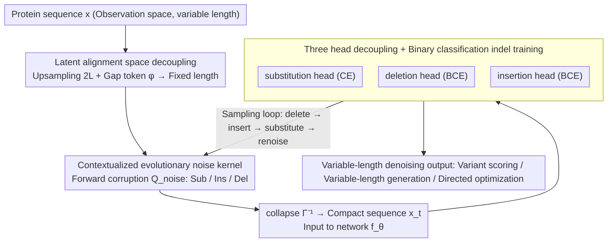

# Towards A Generative Protein Evolution Machine with DPLM-Evo

**Conference**: ICML 2026  
**arXiv**: [2605.00182](https://arxiv.org/abs/2605.00182)  
**Code**: None  
**Area**: Protein Generation / Discrete Diffusion / Biomedicine  
**Keywords**: Protein Language Models, Discrete Diffusion, Evolutionary Modeling, Variable-length Generation, Insertion/Deletion (Indels)

## TL;DR
This paper proposes DPLM-Evo, which extends the discrete diffusion of protein language models from "mask-replacement only" to "explicit modeling of substitution + insertion + deletion." By decoupling variable-length observed sequences into an upsampled latent alignment space ($2L$) and utilizing contextualized evolutionary noise kernels, DPLM-Evo achieves variable-length evolutionary generation and trajectory-based protein post-editing/optimization. It achieves SOTA on ProteinGym single-sequence variant effect prediction.

## Background & Motivation

**Background**: Protein Language Models (PLMs, e.g., ESM, ProGen, DPLM, DPLM-2) learn evolutionary constraints from large-scale sequence databases. Applications include zero-shot variant effect prediction, structure prediction, and sequence generation. Among these, discrete diffusion-based PLMs (DPLM series) outperform autoregressive PLMs in both representation and generation due to their bidirectional receptive fields and ability to model long-range dependencies.

**Limitations of Prior Work**: Existing DPLMs use absorbing-state (masking) as the forward noise kernel, simplifying generation to "iterative mask recovery." This contradicts biological reality—protein evolution does not emerge from masks but through accumulated discrete edits (substitution, insertion, deletion). Indels are crucial for reshaping loops, adjusting linker lengths, and generating/removing short motifs. Masked diffusion lacks native indel actions and uses clumsy fixed-length generation frameworks, making it difficult to express variable-length evolutionary trajectories or perform authentic post-editing on existing proteins.

**Key Challenge**: Standard discrete diffusion is defined on a fixed-dimensional categorical state space, whereas indels inherently change sequence length—these two mathematical structures are fundamentally incompatible.

**Goal**: Construct a unified discrete diffusion framework where both forward noise and reverse denoising explicitly express three evolutionary edit actions (substitution, insertion, deletion), supporting variable-length generation, evolutionary post-editing, and directed optimization of existing proteins.

**Key Insight**: Leverage latent alignment ideas similar to CTC/EditFlow by decoupling the variable-length observed sequence space $\mathcal{X}$ into an upsampled latent alignment space $\mathcal{Z}$ of length $2L$. The latter converts the variable-length problem into a fixed-length problem by inserting gap symbols $\phi$. The diffusion process is defined over $\mathcal{Z}$, while the neural network only observes the collapsed sequences in $\mathcal{X}$.

**Core Idea**: Use a unified transition matrix $\mathbf{Q}_{\mathrm{noise}}$ in the latent alignment space to encode three types of transitions ($\mathcal{A}\leftrightarrow\phi$) representing substitution, insertion, and deletion. This is supplemented by a "contextualized evolutionary noise kernel"—replacing uniform noise with the model's own predicted conditional distribution to ensure the corruption process aligns with evolutionary preferences. During decoding, three independent heads (substitution/deletion/insertion) are used to perform delete→insert→substitute→renoise operations in sequence at each step to complete variable-length denoising.

## Method

### Overall Architecture
DPLM-Evo addresses a fundamental incompatibility: standard discrete diffusion is defined on fixed-dimensional state spaces, while indels change sequence length. The solution is to move variable-length modeling into a fixed-length latent space. Specifically, the model maintains both an observation space $\mathcal{X}=\mathcal{V}^L$ (where $\mathcal{V}=\mathcal{A}\cup\{\mathbf{m}\}$, including a mask) and an upsampled latent alignment space $\mathcal{Z}=(\mathcal{V}\cup\{\phi\})^{2L}$ (where $\phi$ is a gap placeholder). A collapse function $\Gamma^{-1}(\mathbf{z})$ removes all $\phi$ from the latent sequence to recover the observed sequence; conversely, $\Gamma(\mathbf{x})$ is the set of all valid alignments of $\mathbf{x}$. Forward diffusion $q_t(\mathbf{z}_t|\mathbf{z}_0)=\bar\alpha_t\delta_{\mathbf{z}_0}+(1-\bar\alpha_t)\pi(\mathbf{z}_0)$ occurs entirely in the latent space, while the neural network $f_\theta$ only sees the collapsed compact observation sequence $\mathbf{x}_t=\Gamma^{-1}(\mathbf{z}_t)$, using three heads to predict the substitution distribution, deletion probability, and right-side insertion probability for each token. The entire mechanism is unified by the ELBO $\log p_\theta(\mathbf{x}_0)\geq\mathbb{E}_{\mathbf{z}_0\in\Gamma(\mathbf{x}_0)}[\mathbb{E}_{q_t}[\log p_\theta(\mathbf{z}_0|\mathbf{z}_t)]]$, which takes the expectation over all valid alignments of $\mathbf{x}_0$.

### Key Designs

**1. Latent Alignment Space for Decoupling Variable-length Indels: Converting evolutionary shifts into token replacement**

Defining Markov processes directly on variable-length sequences is extremely complex—every step requires joint sampling of length and content. DPLM-Evo upsamples the sequence by a factor of 2 and inserts gap placeholders $\phi$ (e.g., $[A,B,C]\mapsto[A,\phi,\phi,B,\phi,C]$). Thus, indels degenerate into ordinary token replacements between $\mathcal{A}\leftrightarrow\phi$ in the latent space: deletion is "amino acid to $\phi$," and insertion is "$\phi$ to amino acid." Forward corruption is controlled by a unified transition matrix $\mathbf{Q}_{\mathrm{noise}}$ with three hyperparameters $(\omega_{\mathrm{del}},\omega_{\mathrm{ins}},\rho_{\mathrm{mask}})$. Amino acids remain or change with probability $1-\omega_{\mathrm{del}}$ (with $\rho_{\mathrm{mask}}$ being the ratio transforming to mask) and are deleted to $\phi$ with probability $\omega_{\mathrm{del}}$; $\phi$ states transform into amino acids with probability $\omega_{\mathrm{ins}}$. Reverse denoising maps the latent sequence back to the observation space via $\Gamma^{-1}$. This transformation allows mature fixed-length diffusion toolchains to be reused; the $2L$ upsampling ensures that net insertion does not exceed the original length $L$, covering typical protein engineering scenarios like loop or linker adjustments. Additionally, because latent corruption is essentially masking/replacement, DPLM-Evo can be initialized from existing masked DPLM weights.

**2. Contextualized Evolutionary Noise Kernels: Aligning forward noise with evolutionary preferences**

Three options for the substitution matrix $\mathcal{T}_{\mathrm{sub}}$ are provided: a uniform matrix $\mathbf{U}_K=\tfrac{1}{K}\mathbf{1}\mathbf{1}^\top$, a static biological prior $\mathbf{M}_{\mathrm{BLOSUM}}$, and the proposed contextualized form $\mathcal{T}_{\mathrm{sub}}^{(j)}=\mathbb{E}_{q'_t(\mathbf{z}'_t|\mathbf{z}_0)}[p_\theta(\cdot|\mathbf{z}'^{\setminus j}_t,\mathbf{m})]$. The latter masks the target site $j$ and lets the model predict the distribution of that site based on the partially masked context. Uniform noise wastes model capacity by treating rare conversions (e.g., "Lys → Trp") with the same importance as "Lys → Arg"; using the model's own conditional prediction as noise yields corruption that reflects realistic conservative substitutions and contextual preferences. This improves training efficiency and forces the model to capture evolutionary and homology dependencies. Implementation uses a warmup strategy: training begins with simple mask noise and switches to self-prediction noise after warmup.

**3. Three-head Decoupling + Binary Classification Indel Training: Solving mode collapse caused by indel class imbalance**

Predicting substitution, deletion, and insertion tasks within a single multinomial output (treating $\phi$ as a token alongside amino acids) leads to collapse in experiments. Because amino acid substitutions far outnumber indels in biological sequences, this imbalance triggers deletion mode collapse or insertion training divergence. DPLM-Evo decouples these: an Index Mapping Function $\mathcal{I}:\{1,\dots,L_t\}\to\{1,\dots,N\}$ maps observed tokens back to latent positions, and three mutually exclusive losses are defined based on types in $(\mathbf{z}_t,\mathbf{z}_0)$. The $\mathcal{L}_{\mathrm{sub}}^{(k)}$ applies only when both ends are amino acids (Standard CE). Indel losses are reformulated as binary classification: $\mathcal{L}_{\mathrm{del}}^{(k)}=\mathrm{BCE}(\mathbb{I}_{\mathbf{z}_0^{(\mathcal{I}(k))}=\phi},p_\theta^{\mathrm{del}})$ and $\mathcal{L}_{\mathrm{ins}}^{(k)}=\mathrm{BCE}(\mathbb{I}_{v_{\mathrm{next}}^{(k)}\neq\emptyset},p_\theta^{\mathrm{ins}})$. Decisions to delete/insert are separated from what to insert/substitute, confining class imbalance within BCE and ensuring stable training.

### Loss & Training
- Total loss: $\mathcal{L}_t=\mathbb{E}_{\mathbf{x}_0,\mathbf{z}_0,\mathbf{z}_t}[\sum_k\lambda_{t-1}(\gamma_{\mathrm{sub}}\mathcal{L}_{\mathrm{sub}}^{(k)}+\gamma_{\mathrm{del}}\mathcal{L}_{\mathrm{del}}^{(k)}+\gamma_{\mathrm{ins}}\mathcal{L}_{\mathrm{ins}}^{(k)})]$, where $\gamma$ coefficients adjust preferences for different edit operations.
- Training strategy: Initialize from pretrained DPLM → Warmup phase with mask noise → Switch to contextualized evolutionary noise kernel.
- Sampling: Maintain a noisy index set $\mathcal{N}_t$. Each step sequentially (i) deletes sites with $p_\theta^{\mathrm{del}}>\tau_{\mathrm{del}}$; (ii) inserts $\mathbf{m}$ to the right of sites with $p_\theta^{\mathrm{ins}}>\tau_{\mathrm{ins}}$; (iii) fills all noisy/mask sites using the substitution head; (iv) re-noises the least confident positions using the evolutionary noise kernel.

## Key Experimental Results

### Main Results
Evaluation results across multiple tasks:

| Task | Metric | DPLM-Evo Performance | vs Prev. SOTA |
|------|------|--------------|--------------|
| ProteinGym Variant Effect (Single-seq) | Spearman $\rho$ | **SOTA** | Superior to masked-scoring DPLM/ESM |
| Unconditional substitution-only generation | Foldability / Diversity | Comparable or better than DPLM | Equivalent in same dimension |
| Full edit operations (incl. indel) generation | Variable-length feasible | Native support | Masked diffusion cannot achieve |
| Motif scaffolding (Conditional) | Success rate / Adjustable length | Dynamic length adjustment via heads | Fixed-length methods fail |
| GFP Directed Evolution Optimization | Explicit edit trajectory | Improved fluorescence via iteration | Masked diffusion lacks trajectory |

DPLM-Evo directly evaluates substitution distributions on the wild-type rather than using the standard "mask → read logits" loop, a unique capability of substitution-based modeling.

### Ablation Study

| Configuration | Key Metrics | Description |
|------|---------|------|
| Full DPLM-Evo (Contextual kernel + 3-head BCE) | Best ProteinGym performance | Full model |
| $\mathcal{T}_{\mathrm{sub}}=\mathbf{U}_K$ (Uniform kernel) | Significant drop | Uninformative noise slows learning |
| $\mathcal{T}_{\mathrm{sub}}=\mathbf{M}_{\mathrm{BLOSUM}}$ (Static prior) | Moderate | Better than uniform, worse than self-conditional |
| Original multinomial indel loss (No BCE) | Mode collapse | All-deletion predictions, divergent training |
| $\omega_{\mathrm{del}}=\omega_{\mathrm{ins}}=0$ (Indels disabled) | Degenerates to DPLM | No variable-length capability |
| $\rho_{\mathrm{mask}}=1$ (Pure mask) | Degenerates to absorbing diffusion | Classic DPLM/MaskedDiff |

### Key Findings
- **Contextualized Evolutionary Noise > Static BLOSUM > Uniform**: Model-predicted corruption distributions align better with evolutionary preferences.
- **Binary Indel Loss is Critical**: Multinomial forms lead to deletion mode collapse. BCE maintains theoretical consistency and stabilizes training.
- **Framework Generality**: By tuning $\omega_{\mathrm{del}},\omega_{\mathrm{ins}},\rho_{\mathrm{mask}}$, the model can strictly degenerate into masked, uniform, or mixed diffusion variants, allowing hot-starts from existing PLMs.
- **ProteinGym SOTA** suggests that explicit substitution modeling (rather than mask-and-recover) is more natural for variant scoring, as it avoids iterative masking loops.
- **2L Upsampling Constraint**: The net insertion cannot exceed the original length $L$. This is sufficient for loop adjustments (5-30 residues) but unsuitable for extreme expansions like domain duplication.

## Highlights & Insights
- **Decoupling Variable-length via Latent Alignment**: Mapping variable-length evolution to token replacement in a fixed-length aligned space is an elegant mathematical transformation. This is the first systematic application of this pattern (previously seen in CTC/EditFlow) to protein diffusion.
- **Biological Priors as Learnable Noise**: Replacing static BLOSUM/PAM matrices with self-prediction creates a "learnable and contextual prior," allowing the model to define what transformations are reasonable in a given context.
- **Unified + Degradable Framework**: The transition matrix covers almost all existing discrete diffusion variants, providing a unified perspective and practical flexibility for fine-tuning.
- **Unlocking Protein Engineering Scenarios**: Breaking the "diffusion = fixed-length generator" assumption allows the model to fit the reality of protein engineering as an editing task (loop reshaping, motif scaffolding with adjustable length, evolutionary trajectories).

## Limitations & Future Work
- The $2L$ upsampling limit restricts extreme expansions; dynamic upsampling ratios or cascaded generation could be explored.
- The contextualized noise kernel requires generating noise from the model after warmup, which may increase training costs or instability (similar to self-bootstrapping).
- While SOTA is achieved on ProteinGym, performance on long proteins (>500 residues) and computational costs for inference require further validation.
- The comparison between dynamic scaffold lengths via ins/del heads versus fixed prediction lacks exhaustive benchmarking against structural viability metrics.

## Related Work & Insights
- **vs DPLM/DPLM-2**: DPLM-Evo is a strict superset of DPLM's expressive power, extending it from mask-only to mask+sub+ins+del.
- **vs ESM-2/ESM-3**: ESM uses "mask → logits" for scoring; DPLM-Evo uses native substitution distributions, which is more semantically aligned with variant effect prediction.
- **vs EditFlow / DreamOn**: While these use latent alignments for text, DPLM-Evo scales the mechanism to proteins with domain-specific evolutionary noise kernels.
- **vs ProGen / RFdiffusion**: Autoregressive models struggle with post-editing; structural diffusion focuses on 3D coordinates. DPLM-Evo fills the gap for sequence-based, variable-length, edit-oriented generation.

## Rating
- **Novelty**: ⭐⭐⭐⭐⭐ Integrating variable-length edits into discrete diffusion and designing contextualized noise kernels is a major paradigm extension.
- **Experimental Thoroughness**: ⭐⭐⭐⭐ Covers variant prediction, unconditional/conditional generation, and directed evolution, though some fine-grained quantitative metrics are delegated to appendices.
- **Writing Quality**: ⭐⭐⭐⭐ Mathematical derivations for the ELBO decomposition and transition matrix relationships are clean and self-consistent.
- **Value**: ⭐⭐⭐⭐⭐ Provides the first diffusion PLM supporting edit-based generation and variable-length evolutionary priors, with direct potential for directed evolution and scaffold engineering.

<!-- RELATED:START -->

## Related Papers

- [\[NeurIPS 2025\] Steering Generative Models with Experimental Data for Protein Fitness Optimization](../../NeurIPS2025/computational_biology/steering_generative_models_with_experimental_data_for_protein_fitness_optimizati.md)
- [\[ICLR 2026\] DistMLIP: A Distributed Inference Platform for Machine Learning Interatomic Potentials](../../ICLR2026/computational_biology/distmlip_a_distributed_inference_platform_for_machine_learning_interatomic_poten.md)
- [\[ICML 2026\] On the Collapse of Generative Paths: A Criterion and Correction for Diffusion Steering](on_the_collapse_of_generative_paths_a_criterion_and_correction_for_diffusion_ste.md)
- [\[ICML 2025\] Reliable Algorithm Selection for Machine Learning-Guided Design](../../ICML2025/computational_biology/reliable_algorithm_selection_for_machine_learning-guided_design.md)
- [\[ICML 2026\] Protein Language Model Embeddings Improve Generalization of Implicit Transfer Operators](protein_language_model_embeddings_improve_generalization_of_implicit_transfer_op.md)

<!-- RELATED:END -->
