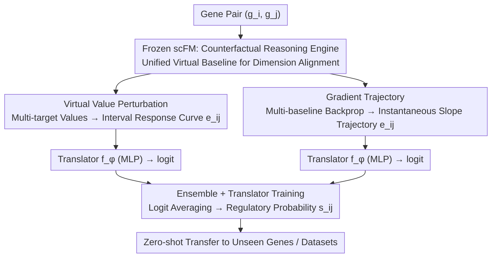

# Towards Universal Gene Regulatory Network Inference: Unlocking Generalizable Regulatory Knowledge in Single-cell Foundation Models

**Conference**: ICML 2026  
**arXiv**: [2605.08128](https://arxiv.org/abs/2605.08128)  
**Code**: Not disclosed  
**Area**: Foundation Models / Single-cell Bioinformatics / Representation Distillation  
**Keywords**: Gene Regulatory Networks, scFM, Counterfactual Perturbation, Gradient Trajectory, Zero-shot Generalization

## TL;DR
This paper points out that single-cell foundation models (scFMs) contain rich gene regulatory knowledge that is often obscured by "reconstructive pre-training." It proposes two probes, Virtual Value Perturbation (VVP) and Gradient Trajectory (GDT), to distill pairwise gene features from frozen scFMs that generalize across genes and datasets. This approach pushes AUPRC on the BEELINE benchmark from ~0.5 to 0.8–0.97, pioneering a new paradigm of "Universal GRN inference (UGRN)."

## Background & Motivation

**Background**: Gene Regulatory Network (GRN) inference is a core task for understanding cellular mechanisms. Traditional approaches (e.g., GENIE3, PIDC) rely on co-expression regression or mutual information within a single dataset. Recently, single-cell foundation models (scGPT, Geneformer, scBERT), pre-trained on hundreds of millions of single cells via masked value reconstruction, were expected to enable zero-shot GRN inference. Two mainstream usage patterns for scFMs are "in-silico perturbation" (zeroing out the input of a source gene $g_i$ and measuring the change in the reconstructed value of a target gene $g_j$) and "attention extraction" (treating cross-layer attention weights as regulatory strength).

**Limitations of Prior Work**: Multiple recent benchmarks (Jin et al. 2025, Ahlmann-Eltze et al. 2025) indicate that the AUPRC for these scFM usages typically ranges between 0.49–0.55, which is near-random guessing. This has led the biological community to question whether scFMs actually learn regulatory knowledge. Furthermore, traditional GRN methods are "closed-world": model dimensions are tied to the cell count $N$ of the training set, causing failure when encountering new datasets with different cell counts, let alone inferring interactions for unseen genes.

**Key Challenge**: The pre-training objective of scFMs is "expression value reconstruction," which essentially learns "which genes can be used to guess the expression of $g_j$." This is not causally equivalent to "whether $g_i$ regulates $g_j$." Simple zero-out perturbations only reflect the model's dependency strength on $g_i$, and since baseline expression levels vary significantly across genes, the perturbation magnitudes themselves are incomparable. Attention weights are further confounded by semantic and positional signals. Thus, the issue is not that scFMs haven't learned regulatory knowledge, but that the "probes are too coarse."

**Goal**: (1) Design an evaluation protocol (UGRN benchmark) that forces models to generalize across datasets and genes; (2) Propose probe methods capable of extracting "regulatory-interpretable" pairwise features $\mathbf{e}_{ij}$ from frozen scFMs.

**Key Insight**: scFMs can receive arbitrary virtual expression values as input, even those outside the training distribution. Consequently, one can move beyond the constraints of "real cells" by constructing a series of virtual perturbation states. By treating scFMs as "counterfactual reasoning engines," one can systematically probe the $g_i \to g_j$ response curve and use a lightweight "translator" $f_\phi$ to map response features to regulatory labels.

**Core Idea**: Use unified virtual baseline values coupled with multi-target perturbations (VVP) and multi-baseline gradient trajectories (GDT) to "distill" implicit pairwise regulatory knowledge within scFMs into dense feature vectors that generalize across genes and datasets.

## Method

### Overall Architecture
UGRN decomposes the task of "determining if $g_i$ regulates $g_j$" into two steps: First, freeze the scFM $\mathcal{M}$ and treat it as a counterfactual reasoning engine to extract a fixed-dimensional, cross-dataset comparable pairwise feature $\mathbf{e}_{ij}$ for any gene pair $(g_i, g_j)$. Second, train a shallow MLP translator $f_\phi$ on a source dataset $\mathcal{D}_b$ (e.g., hESC) to map $\mathbf{e}_{ij}$ to a regulatory probability $s_{ij}=f_\phi(\mathbf{e}_{ij})$. This model is then transferred zero-shot to target datasets containing unseen genes and cell types (e.g., mDC, mESC, hHEP). The key design lies in the first step: ensuring features are decoupled from specific cell counts $N$ and real expression magnitudes to enable alignment across datasets. The authors utilize two primary probes, VVP and GDT, and ensemble their logits.

### Key Designs

**1. Virtual Value Perturbation: Aligning Perturbation Responses via Unified Virtual Baselines**
Traditional zero-out probes fail because perturbation magnitudes are incomparable: zeroing out $g_i$ results in a perturbation equal to its original expression $\mathbf{x}_{c,i}$, causing high-expression genes to be perturbed heavily and low-expression genes lightly. VVP circumvents real cells by selecting a virtual baseline $v_b$ (a fixed scalar near zero mean) to set a unified background for all genes. Only the value for $g_i$ is filled with a query value to form a virtual cell vector $\mathbf{v}_{g_i\leftarrow v}$. Instead of binary "on/off" queries, VVP uses a set of target values $\{v_{p,1},\dots,v_{p,M}\}$ covering a dynamic range. The response is calculated as $e_{ij}^{v_p}=\mathcal{M}(\mathbf{v}_{g_i\leftarrow v_p})_j-\mathcal{M}(\mathbf{v}_{g_i\leftarrow v_b})_j$, forming $\mathbf{e}_{ij}=[e_{ij}^{v_{p,1}};\dots;e_{ij}^{v_{p,M}}]$. This essentially plots a discrete response curve of "how much $g_j$ moves as $g_i$ increases." Since all gene pairs are queried within the same $v_b$ coordinate system using the same $v_p$ set, features are naturally aligned across datasets.

**2. Gradient Trajectory: Reading Instantaneous Regulatory Intensity via Backpropagation**
While VVP provides the "cumulative response" over an interval, it lacks detail on the steepness of the curve at specific expression levels. GDT leverages the differentiability of scFMs to read instantaneous slopes. It defines an ordered set of baseline values $\{v_{b,1},\dots,v_{b,T}\}$, where each $v_{b,t}$ corresponds to a virtual input $\mathbf{v}_{g_i\leftarrow v_{b,t}}$. Backpropagation yields the gradient $\nabla_{ij}^{(t)}=\partial \mathcal{M}(\mathbf{v}_{g_i\leftarrow v_{b,t}})_j / \partial v_i$. These are concatenated into a trajectory $\mathbf{e}_{ij}=[\nabla_{ij}^{(1)};\dots;\nabla_{ij}^{(T)}]$. This informs the translator about local sensitivities, such as whether $g_i$ strongly influences $g_j$ at low expression levels but saturates at higher levels.

**3. Ensemble + Translator Training: Fusing Interval Response and Instantaneous Sensitivity**
VVP and GDT capture two perspectives of the same response curve: cumulative interval changes and point-wise slopes. In experiments, they excel in different datasets. The authors train two lightweight MLPs, $f_\phi^{\text{VVP}}$ and $f_\phi^{\text{GDT}}$, for the respective feature types (dimensions $M$ and $T$) to output sigmoid probabilities. The final prediction $s_{ij}$ is the average of the logits: $s_{ij}=\sigma\big(\tfrac{1}{2}(\text{logit}_{\text{VVP}}+\text{logit}_{\text{GDT}})\big)$. Logit averaging consistently outperforms individual probes, suggesting the two perspectives capture complementary regulatory cues.

### Loss & Training
The only learnable parameters are within the translator $f_\phi$, while the scFM remains frozen. The loss is standard binary cross-entropy (BCE): $\mathcal{L}_\phi = -\sum_{(i,j)\in\Omega_{tr}}[y_{ij}\log s_{ij}+(1-y_{ij})\log(1-s_{ij})]$. Evaluation strictly follows a "Leave-One/Some-Dataset-Out" protocol: $f_\phi$ is trained on one dataset (e.g., hESC + STRING network) and evaluated zero-shot on others. Because the source and target datasets do not share gene sets or expression matrices, the translator is forced to learn a truly generalizable mapping. VVP uses $M=8$ target values, and GDT uses $T=8$ baseline values.

## Key Experimental Results

### Main Results
Evaluations were conducted using the BEELINE framework across 7 scRNA-seq datasets × 4 ground-truth networks (STRING, Non-specific, Cell-type-specific, Lofgof), using scGPT and scBenchmark as backbones. The table below shows AUPRC for STRING (Str) and Non-specific (Nsp) networks using scGPT:

| Dataset / Network | Pert (Origin) | Attn (Origin) | Pert (Baseline) | Emb (Baseline) | VVP | GDT | Ens |
|---|---|---|---|---|---|---|---|
| Str / hHEP | 0.496 | 0.507 | 0.586 | 0.732 | 0.609 | 0.906 | **0.909** |
| Str / mDC | 0.512 | 0.536 | 0.569 | 0.637 | 0.606 | 0.917 | **0.923** |
| Str / mESC | 0.542 | 0.531 | 0.493 | 0.699 | 0.600 | **0.969** | 0.966 |
| Str / mH-L | 0.622 | 0.534 | 0.624 | 0.815 | 0.656 | 0.895 | 0.873 |
| Nsp / hHEP | 0.516 | 0.512 | 0.546 | 0.586 | 0.549 | **0.716** | 0.711 |
| Nsp / mESC | 0.551 | 0.539 | 0.512 | 0.638 | 0.582 | 0.835 | **0.836** |

Original scFM usage (Pert/Attn) is near-random. Converting the UGRN baseline into a translator format (Pert/Emb as features) improves AUPRC to 0.6–0.8. GDT + Ensemble pushes AUPRC to 0.83–0.97, representing a 40%–80% Gain over the original Pert.

### Ablation Study

| Configuration | mESC (Str) AUPRC | Description |
|---|---|---|
| Pert (Origin, real $\bar{\mathbf{x}}$) | 0.542 | Original scFM usage |
| Pert (Baseline, translator) | 0.493 | Using perturbation delta as feature; worse due to scale mismatch |
| Emb (Baseline) | 0.699 | Using only gene vocabulary embeddings |
| VVP (single target $v_p$) | ~0.60 | No response curve; slightly better than origin |
| VVP (multi-target $M=8$) | 0.600 | Full VVP, stable across datasets |
| GDT ($T=8$) | 0.969 | Gradient trajectory is the core gain |
| Ensemble (VVP+GDT) | 0.966 | Comparable to GDT, but more robust elsewhere |

### Key Findings
- **GDT is the primary source of gain**: Moving from original Pert (0.49) to GDT (0.97) nearly doubles performance, indicating that the "gradient signal" in scFMs, rather than reconstruction residuals, carries the true regulatory knowledge.
- **Unified virtual baselines are key to generalization**: The fact that Pert Baseline (0.49) is worse than Emb Baseline (0.70) highlights that real expression values cause incomparable perturbation magnitudes, which is the root cause of cross-dataset failure.
- **scFMs do contain regulatory knowledge**: Across all models, datasets, and ground-truth networks, GDT/Ensemble consistently outperform random (0.5) and traditional scFM methods, reversing the pessimistic conclusion that scFMs cannot learn GRNs.
- **Predictions possible without real cell measurements**: Since VVP/GDT rely entirely on virtual values, they can provide regulatory predictions even when target gene expression data is missing, which is highly useful for rare cell types and novel genes.

## Highlights & Insights
- **Reshaping scFM Interpretability**: By re-interpreting the model as a "counterfactual reasoning engine" rather than just a "reconstructor," internal knowledge can be systematically probed using virtual inputs. This approach is transferable to causal attribution in LLMs or attribute disentanglement in generative models.
- **Gradients as an Underestimated Signal**: The authors demonstrate that $\partial \mathcal{M}_j / \partial v_i$ from a frozen scFM provides stable, cross-dataset alignable features that are stronger than attention-based or residual-based features, providing a new toolkit for mechanistic interpretability.
- **Unified Baselines + Multi-objective Sampling**: This "scale elimination + response curve sampling" paradigm is highly versatile and could be used to construct comparable counterfactual features in areas like Recommender Systems, Causal Inference, or drug response.
- **UGRN Benchmark Contribution**: Traditional GRN evaluations are in-distribution. This paper mandates leave-dataset-out and unseen genes, ensuring the evaluation reflects true "universality," a benchmark design philosophy that should be promoted in AI for Biology.

## Limitations & Future Work
- **Dependency on scFM Quality**: The method assumes the scFM has already captured latent regulatory knowledge. If the backbone is weak (e.g., pre-trained on too few cells), VVP/GDT may not yield valid signals.
- **GDT Computational Cost**: Backpropagation must be performed for $T=8$ virtual baselines. Scaling this to all gene pairs (tens of thousands squared) could become a bottleneck in terms of memory and time; sparse engineering solutions were not provided.
- **Lack of Explicit Temporal Dynamics**: GRN regulation is naturally time-dependent. Static virtual sampling cannot capture "activation evolving over time." Future work could integrate this with trajectory inference.
- **MLP Translator is still a black-box**: While the input features are more interpretable, the BCE-trained MLP still doesn't directly reveal "which pathways drive the prediction," which still leaves a gap for biologists seeking mechanistic explanations.

## Related Work & Insights
- **vs. Original scFM in-silico perturbation (Theodoris et al. 2023; Cui et al. 2024)**: Previous works used the output difference of a single zero-out as the regulatory score. This paper transforms that operation into a feature vector with "unified baselines + multi-target values" and a learnable translator, jumping from ~0.5 to 0.8+ AUPRC.
- **vs. Attention Extraction (Yang et al. 2022)**: Attention weights mix semantic and positional signals. This paper replaces them with gradient-based GDT, proving gradients are "purer" regulatory signals.
- **vs. Traditional GRN Inference (GENIE3, PIDC)**: Those methods are in-distribution and closed-world. This work achieves true zero-shot generalization through the scFM's unified vocabulary $\mathcal{V}$ and virtual input capabilities.
- **vs. Causal Tracing / Mechanistic Interpretability**: Similar to activation patching in LLMs, this work performs "counterfactual intervention on input dimensions + gradient attribution," serving as a practical case of mechanistic interpretability in biological foundation models.

## Rating
- Novelty: ⭐⭐⭐⭐⭐ Reshapes scFM as a counterfactual engine, defines the UGRN paradigm, and provides two complementary interpretable probes.
- Experimental Thoroughness: ⭐⭐⭐⭐ Dense ablation across multiples models, datasets, and ground-truth networks, though missing controls for scFM scale/pre-training data.
- Writing Quality: ⭐⭐⭐⭐ Equations and diagrams are clear; the logical chain from problem to method is natural, though "baseline" vs. "origin" naming can be confusing.
- Value: ⭐⭐⭐⭐⭐ Reverses pessimistic sentiment in the bio-foundation model community and provides a counterfactual probing strategy applicable to other foundation models.

<!-- RELATED:START -->

## Related Papers

- [\[ICML 2026\] Supervised Graph Contrastive Learning for Gene Regulatory Networks](supervised_graph_contrastive_learning_for_gene_regulatory_networks.md)
- [\[ICML 2026\] Scalable Single-Cell Gene Expression Generation with Latent Diffusion Models](scalable_single-cell_gene_expression_generation_with_latent_diffusion_models.md)
- [\[ICLR 2026\] SAVE: A Generalizable Framework for Multi-Condition Single-Cell Generation with Gene Block Attention](../../ICLR2026/computational_biology/save_a_generalizable_framework_for_multi-condition_single-cell_generation_with_g.md)
- [\[ICML 2026\] scCBGM: Interpretable Single-Cell Counterfactual Editing](sccbgm_interpretable_single-cell_counterfactual_editing.md)
- [\[AAAI 2026\] Gene Incremental Learning for Single-Cell Transcriptomics](../../AAAI2026/computational_biology/gene_incremental_learning_for_single-cell_transcriptomics.md)

<!-- RELATED:END -->
