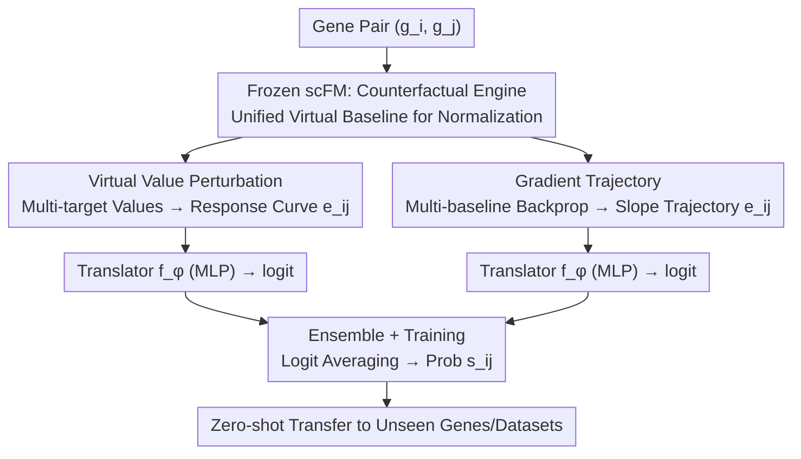

# Towards Universal Gene Regulatory Network Inference: Unlocking Generalizable Regulatory Knowledge in Single-cell Foundation Models

**Conference**: ICML 2026  
**arXiv**: [2605.08128](https://arxiv.org/abs/2605.08128)  
**Code**: Not disclosed  
**Area**: Foundation Models / Single-cell Bioinformatics / Representation Distillation  
**Keywords**: Gene Regulatory Network, scFM, Counterfactual Perturbation, Gradient Trajectory, Zero-shot Generalization

## TL;DR
This paper points out that single-cell foundation models (scFM) contain rich gene regulatory knowledge obscured by "reconstructive pre-training." It proposes two probes, Virtual Value Perturbation and Gradient Trajectory, to distill pairwise gene features from frozen scFMs that generalize across genes and datasets. This approach pushes AUPRC on the BEELINE benchmark from ~0.5 to 0.8–0.97, pioneering the new paradigm of "Universal GRN inference (UGRN)."

## Background & Motivation

**Background**: Gene Regulatory Network (GRN) inference is a core task for understanding cellular mechanisms. Traditional methods (GENIE3, PIDC, etc.) rely on co-expression regression or mutual information within a single dataset. Recently, single-cell foundation models (scGPT, Geneformer, scBERT), pre-trained via masked value reconstruction on hundreds of millions of cells, were expected to enable zero-shot GRN inference. Two primary scFM usages are "in-silico perturbation" (zeroing out source gene $g_i$ to observe changes in target gene $g_j$) and "attention extraction" (using cross-layer attention weights as regulatory strength).

**Limitations of Prior Work**: Several recent benchmarks (Jin et al. 2025, Ahlmann-Eltze et al. 2025) indicated that these scFM methods generally achieve an AUPRC of only 0.49–0.55, nearly equivalent to random guessing. This lead the biological community to doubt whether scFMs actually learn regulatory knowledge. Meanwhile, traditional GRN methods are "closed-world": model dimensions are tied to the cell count $N$ of the training set, causing failure on new datasets with different $N'$, let alone inferring unseen genes.

**Key Challenge**: The pre-training objective of scFM is "value reconstruction," focusing on "which genes can predict the expression of $g_j$," which is not causally equivalent to "whether $g_i$ regulates $g_j$." Simple zero-out perturbations only reflect the model's dependency on $g_i$. Moreover, baseline expression varies significantly across genes, making perturbation magnitudes incomparable; attention weights are confounded by semantic and positional signals. Rather than a lack of knowledge in scFMs, the issue lies in "probes being too coarse."

**Goal**: (1) Design an evaluation protocol (UGRN benchmark) that forces models to generalize across datasets and genes. (2) Propose probe methods capable of extracting "regulation-interpretable" pairwise features $\mathbf{e}_{ij}$ from frozen scFMs.

**Key Insight**: scFMs can receive arbitrary virtual expression values as input, even outside the training distribution. Thus, one can decouple from "real cells" and directly construct virtual perturbation states, treating the scFM as a "counterfactual reasoning engine" to systematically detect $g_i \to g_j$ response curves. A lightweight "translator" $f_\phi$ then learns the mapping from response features to regulatory labels.

**Core Idea**: Use unified virtual baseline values with multi-target perturbation (VVP) and multi-baseline gradient trajectories (GDT) to "distill" implicit pairwise regulatory knowledge in scFMs into dense feature vectors that generalize across genes and datasets.

## Method

### Overall Architecture
UGRN decomposes the task of "determining if $g_i$ regulates $g_j$" into two steps. First, the scFM $\mathcal{M}$ is frozen and treated as a counterfactual reasoning engine to extract a fixed-dimension, cross-dataset comparable pairwise feature $\mathbf{e}_{ij}$ for any gene pair $(g_i, g_j)$. Second, a shallow MLP translator $f_\phi$ is trained on a source dataset $\mathcal{D}_b$ (e.g., hESC) to map $\mathbf{e}_{ij}$ to a regulatory probability $s_{ij}=f_\phi(\mathbf{e}_{ij})$, followed by zero-shot migration to target datasets containing unseen genes and cell types (mDC, mESC, mHSC, hHEP, etc.). The design focuses on ensuring features are independent of specific cell counts $N$ and real expression scales. The authors compare two baseline strategies—**Pert** (zero-out difference using real mean expression $\bar{\mathbf{x}}$) and **Emb** (sum of scFM vocabulary embeddings $\mathbf{E}_{\mathcal{M},i}+\mathbf{E}_{\mathcal{M},j}$)—against the proposed VVP and GDT probes, which are ultimately ensembled via logit averaging.

### Key Designs

**1. Virtual Value Perturbation: Aligning Response Curves via Unified Baselines**

Traditional zero-out probes fail because perturbation magnitudes are incomparable: setting $g_i$ to zero makes the perturbation equal to its original expression $\mathbf{x}_{c,i}$. Consequently, highly expressed genes are perturbed heavily while lowly expressed ones are not, misaligning scales across datasets. VVP ignores real cells and selects a virtual baseline value $v_b$ (a fixed scalar near zero mean) to form a unified background for all genes. Only the value for $g_i$ is filled with a query value to create a virtual cell vector $\mathbf{v}_{g_i\leftarrow v}$. Instead of a binary "on/off" query, VVP uses a set of target values $\{v_{p,1},\dots,v_{p,M}\}$ covering a dynamic range, calculating responses $e_{ij}^{v_p}=\mathcal{M}(\mathbf{v}_{g_i\leftarrow v_p})_j-\mathcal{M}(\mathbf{v}_{g_i\leftarrow v_b})_j$ to form $\mathbf{e}_{ij}=[e_{ij}^{v_{p,1}};\dots;e_{ij}^{v_{p,M}}]$. This approximates the discrete response curve of "$g_j$ change given $g_i$ increase." Since all gene pairs are queried under the same $v_b$ coordinate system with the same $v_p$, features are naturally aligned across datasets.

**2. Gradient Trajectory: Capturing Instantaneous Regulatory Strength**

While VVP provides cumulative response over an interval, it may miss the exact steepness of the curve at specific expression levels. GDT utilizes the differentiability of scFMs to read instantaneous slopes. A set of ordered baseline values $\{v_{b,1},\dots,v_{b,T}\}$ is defined, where each $v_{b,t}$ corresponds to a virtual input $\mathbf{v}_{g_i\leftarrow v_{b,t}}$. Backpropagation yields $\nabla_{ij}^{(t)}=\partial \mathcal{M}(\mathbf{v}_{g_i\leftarrow v_{b,t}})_j / \partial v_i$. These are concatenated into a trajectory $\mathbf{e}_{ij}=[\nabla_{ij}^{(1)};\dots;\nabla_{ij}^{(T)}]$, informing the translator about details such as "strong influence at low expression that saturates at higher levels," providing a complementary perspective to VVP.

**3. Ensemble + Translator Training: Fusing Interval and Point-wise Sensitivity**

VVP and GDT capture two facets of the same response curve—cumulative interval change and point-wise slope. Experiments show they excel in different datasets (e.g., GDT is stronger on mDC, VVP on mH-G). The authors train two lightweight MLPs, $f_\phi^{\text{VVP}}$ and $f_\phi^{\text{GDT}}$, providing sigmoid probabilities. The final prediction uses logit averaging $s_{ij}=\sigma\big(\tfrac{1}{2}(\text{logit}_{\text{VVP}}+\text{logit}_{\text{GDT}})\big)$, which consistently outperforms single probes.

### Loss & Training
The translator $f_\phi$ is the only trainable component; the scFM remains frozen. The loss is standard Binary Cross Entropy (BCE): $\mathcal{L}_\phi = -\sum_{(i,j)\in\Omega_{tr}}[y_{ij}\log s_{ij}+(1-y_{ij})\log(1-s_{ij})]$. Evaluation uses a Leave-One/Some-Dataset-Out protocol: training $f_\phi$ on one dataset (e.g., hESC + STRING network) and evaluating zero-shot AUPRC on all others. This forces the translator to learn a truly generalizable mapping. VVP uses $M=8$ target values, and GDT uses $T=8$ baseline values.

## Key Experimental Results

### Main Results
Evaluated across 7 scRNA-seq datasets (hESC, hHEP, mDC, mESC, mHSC-E/G/L) and 4 ground-truth networks (STRING, Non-specific, Cell-type-specific, Lofgof) under the BEELINE framework. Selected AUPRC results for STRING (Str) and Non-specific (Nsp) using scGPT:

| Dataset / Net | Pert (Origin) | Attn (Origin) | Pert (Baseline) | Emb (Baseline) | VVP | GDT | Ens |
|---|---|---|---|---|---|---|---|
| Str / hHEP | 0.496 | 0.507 | 0.586 | 0.732 | 0.609 | 0.906 | **0.909** |
| Str / mDC | 0.512 | 0.536 | 0.569 | 0.637 | 0.606 | 0.917 | **0.923** |
| Str / mESC | 0.542 | 0.531 | 0.493 | 0.699 | 0.600 | **0.969** | 0.966 |
| Str / mH-L | 0.622 | 0.534 | 0.624 | 0.815 | 0.656 | 0.895 | 0.873 |
| Nsp / hHEP | 0.516 | 0.512 | 0.546 | 0.586 | 0.549 | **0.716** | 0.711 |
| Nsp / mESC | 0.551 | 0.539 | 0.512 | 0.638 | 0.582 | 0.835 | **0.836** |

Original scFM usage (Pert/Attn) is nearly random. Converting the baseline to a translator-based format (Pert/Emb as features) improves results to 0.6–0.8. GDT + Ensemble pushes AUPRC to 0.83–0.97, an 40%–80% Gain over the original Pert.

### Ablation Study

| Config | mESC (Str) AUPRC | Description |
|---|---|---|
| Pert (Origin, real $\bar{\mathbf{x}}$) | 0.542 | Original scFM usage |
| Pert (Baseline, with translator) | 0.493 | Fed directly to translator; worse due to scale mismatch |
| Emb (Baseline) | 0.699 | Using only gene vocabulary embeddings |
| VVP (Single target $v_p$) | ~0.60 | No response curve; slightly better than origin |
| VVP (Multi-target $M=8$) | 0.600 | Full VVP, stable across datasets |
| GDT ($T=8$) | 0.969 | Gradient trajectory provides the core gain |
| Ensemble (VVP+GDT) | 0.966 | Comparable to GDT, but more robust generally |

### Key Findings
- **GDT is the primary driver of Gain**: Doubling AUPRC from origin (0.49) to GDT (0.97) proves that gradient signals, rather than reconstruction residuals, are the carriers of regulatory knowledge.
- **Unified baselines are critical for generalization**: The failure of Pert Baseline (0.49) compared to Emb Baseline (0.70) highlights that incomparable perturbation magnitudes from real expression values prevent cross-dataset transfer.
- **scFMs contain regulatory knowledge**: Across all scFMs, datasets, and ground-truth networks, GDT/Ensemble consistently outperformed random guessing and traditional scFM usage.
- **Prediction without real cell measurements**: Since VVP/GDT uses virtual values, regulatory predictions can be made without target gene expression data, which is beneficial for rare cell types.

## Highlights & Insights
- **Reshaping scFM Interpretability**: Reinterprets models from "reconstructors" to "counterfactual reasoning engines," allowing systematic probing of knowledge via virtual inputs. This can be adapted for causal attribution in LLMs or attribute disentanglement in generative models.
- **Gradients as an Underestimated Probe**: Demonstrates that $\partial \mathcal{M}_j / \partial v_i$ from backpropagation provides stable, cross-dataset aligned features far superior to attention or residual-based features.
- **Unified Baseline + Multi-target Sampling**: This paradigm of "removing scale variance + sampling response curves" is highly generalizable and could be used for cross-domain counterfactual features in RecSys or drug response modeling.
- **UGRN Benchmark Contribution**: Moves beyond in-distribution evaluations to leave-dataset-out and unseen-gene testing, ensuring true "universality" in assessment.

## Limitations & Future Work
- **Dependency on scFM Quality**: Assumes the scFM has pre-learned regulatory knowledge. If the backbone is weak (e.g., small-scale pre-training), these probes may not yield effective signals.
- **Computational Cost of GDT**: Backpropagation for $T=8$ virtual baselines across all gene pairs (tens of thousands squared) incurs significant memory and time overhead; sparse engineering solutions are not provided.
- **Static vs. Dynamic Modeling**: GRN regulation is time and developmental-stage dependent. The static sampling of virtual values does not capture activation evolution over time.
- **MLP Translator is a Blackbox**: While input features are interpretable, the MLP avoids direct transparency regarding which pathways drive the prediction.

## Related Work & Insights
- **vs. scFM In-silico Perturbation (Theodoris et al. 2023)**: Prior work uses single zero-out output differences as scores. This work transforms perturbation into feature vectors with unified baselines, jumping from ~0.5 to 0.8+ AUPRC.
- **vs. Attention Extraction (Yang et al. 2022)**: Replaces attention weights (confounded by semantics) with gradient-based GDT, proving gradients are "puruer" regulatory signals.
- **vs. Traditional GRN (GENIE3)**: Traditional methods are in-distribution and closed-world. This work leverages scFM's universal vocabulary $\mathcal{V}$ and virtual input capacity for true zero-shot generalization.
- **vs. Mechanistic Interpretability**: Similar to activation patching in LLMs, this can be viewed as "input-dimension counterfactual intervention + gradient attribution" applied to biological foundation models.

## Rating
- Novelty: ⭐⭐⭐⭐⭐ Reshapes scFM as a counterfactual engine, defines UGRN benchmark, and provides two complementary probes.
- Experimental Thoroughness: ⭐⭐⭐⭐ Dense ablation across multiple models and networks, though lacks control for scFM scale.
- Writing Quality: ⭐⭐⭐⭐ Clear logic; however, the naming "baseline" vs "origin" can be slightly confusing.
- Value: ⭐⭐⭐⭐⭐ Reverses pessimistic sentiment regarding scFMs for GRN and provides a counterfactual probing template for other foundation models.

<!-- RELATED:START -->

## Related Papers

- [\[ICML 2026\] Scalable Single-Cell Gene Expression Generation with Latent Diffusion Models](scalable_single-cell_gene_expression_generation_with_latent_diffusion_models.md)
- [\[AAAI 2026\] Gene Incremental Learning for Single-Cell Transcriptomics](../../AAAI2026/computational_biology/gene_incremental_learning_for_single-cell_transcriptomics.md)
- [\[ACL 2025\] A Survey on Foundation Language Models for Single-cell Biology](../../ACL2025/computational_biology/foundation_lm_single_cell_survey.md)
- [\[CVPR 2026\] HINGE: Adapting a Pre-trained Single-Cell Foundation Model to Spatial Gene Expression Generation from Histology Images](../../CVPR2026/computational_biology/adapting_a_pre-trained_single-cell_foundation_model_to_spatial_gene_expression_g.md)
- [\[CVPR 2026\] Cell-Type Prototype-Informed Neural Network for Gene Expression Estimation from Pathology Images](../../CVPR2026/computational_biology/cell-type_prototype-informed_neural_network_for_gene_expression_estimation_from_.md)

<!-- RELATED:END -->
