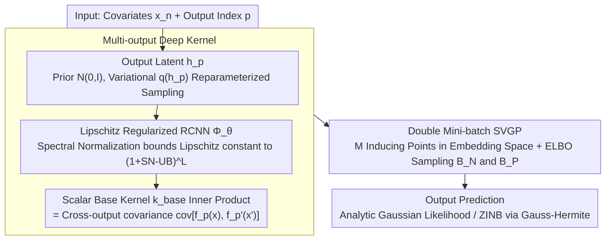

# Transformed Latent Variable Multi-Output Gaussian Processes

**Conference**: ICML 2026  
**arXiv**: [2605.05133](https://arxiv.org/abs/2605.05133)  
**Code**: The paper does not provide an explicit repository address in the main text  
**Area**: Computational Biology  
**Keywords**: Multi-Output Gaussian Processes, Deep Kernels, Lipschitz Regularization, SVGP, Spectral Normalization

## TL;DR
This paper proposes T-LVMOGP: it transforms the core modeling problem of Multi-Output Gaussian Processes (MOGP)—the construction of cross-output covariance $k_{p,p'}(x, x')$—into "computing an inner product with a single scalar base kernel in a Lipschitz-regularized RCNN embedding space." Fully integrated into the SVGP framework, it enables MOGP to handle $P > 10,000$ outputs (including spatial transcriptomics data with ZINB likelihoods) with high scalability and expressivity for the first time, while comprehensively outperforming baselines such as SV-LMC, OILMM, and GS-LVMOGP.

## Background & Motivation
**Background**: Multi-Output Gaussian Processes (MOGP) extend single-output GPs to vector-valued observations and are widely used in medical time-series, climate modeling, spatial transcriptomics, and robot inverse dynamics. The classic Linear Model of Coregionalization (LMC) expresses each output $f_p$ as a linear combination of shared latent GPs $f_p = \sum_{q,r} \alpha_{p,r}^{(q)} g_r^{(q)}$, where the cross-output covariance is equivalent to a linear kernel on latent output embeddings, resulting in a low-rank structure. LV-MOGP further assigns a latent variable $h_p$ to each output and applies kernels over $\{h_p\}$, extending to the sum-of-separable kernels in GS-LVMOGP.

**Limitations of Prior Work**: The complexity of standard MOGP is $O(P^3)$ with respect to the number of outputs $P$, which is prohibitive in high-dimensional scenarios like climate ($P \sim 10^4$) and spatial transcriptomics ($P \sim 5,000$ genes). Existing scalable solutions either enforce rigid structural assumptions (Kronecker, low-rank, or sum-of-separable) or utilize deep kernels based purely on neural embeddings, which suffer from feature collapse, loss of distance awareness, and overconfident predictions.

**Key Challenge**: It is difficult to simultaneously satisfy scalability, structural flexibility, and uncertainty reliability. LMC/OILMM sacrifice expressivity for scalability; naïve deep kernel GPs sacrifice uncertainty for expressivity; GS-LVMOGP remains limited by fixed kernel-like structures despite using sum-of-separable kernels.

**Goal**: To construct an MOGP framework that is: (i) scalable with respect to $P$ (mini-batching over both inputs and outputs); (ii) free from structural assumptions for cross-output covariance; (iii) capable of preserving the distance awareness and uncertainty reliability of GPs; and (iv) naturally compatible with non-Gaussian likelihoods and recent tighter variational bounds.

**Key Insight**: Decouple the two tasks of MOGP—"assigning an embedding to each output" and "computing covariance over embeddings." The former is handled by learnable latent variables $h_p$ and neural mappings, while the latter utilizes the standard single-output SVGP inference pipeline. As long as the embedding space satisfies Lipschitz continuity, the issues associated with deep kernels can be mitigated.

**Core Idea**: Concatenate $(x, h_p)$ and map them into an embedding space via a Lipschitz-regularized RCNN $\Phi_\theta$. The cross-output covariance is defined as $\text{cov}[f_p(x), f_{p'}(x')] = k_{\text{base}}(\Phi_\theta(x, h_p), \Phi_\theta(x', h_{p'}))$. This reduces MOGP to a scalar GP with inducing points in the embedding space, facilitating training via mini-batch SVGP.

## Method

### Overall Architecture
T-LVMOGP addresses the problem of scaling multi-output GPs to tens of thousands of outputs without rigid structural assumptions. It decouples MOGP into two independent components: learning a latent variable embedding for each output and computing similarity in the embedding space using a standard scalar GP. The architecture consists of three layers: the Latent Layer assigns a Gaussian prior $p(h_p) = \mathcal{N}(0, I)$ for each output $p$, approximated by a variational distribution $q(h_p) = \mathcal{N}(m_p, \Sigma_p)$; the Embedding Layer uses a Lipschitz-regularized Residual CNN (RCNN) $\Phi_\theta : \mathbb{R}^{D_X} \times \mathbb{R}^{D_H} \to \mathbb{R}^{D_T}$ to encode $(x_n, h_p)$ into $\tilde{x}_{n,p}$; and the GP Layer places $M$ inducing points $Z$ in the embedding space, computing $q(f_p(x_n)) = \int q(u) p(f_p(x_n) | u) du$ using standard SVGP. Differentiability is maintained via reparameterization $h_p^{(j)} = m_p + \Sigma_p^{1/2} \epsilon^{(j)}$, and training involves mini-batching over both inputs $\mathcal{B}_N$ and outputs $\mathcal{B}_P$.

### Key Designs

**1. Multi-output Deep Kernel via Latents + Neural Embeddings: Breaking Free from Low-rank/Kronecker Constraints**

A persistent criticism of MOGP is that the cross-output covariance $k_{p,p'}(x, x')$ must either be a low-rank linear combination (LMC/OILMM) or a sum-of-separable structure (GS-LVMOGP), which restricts expressivity. This work assigns a learnable latent variable $h_p$ to each output, concatenates the "output ID" with the "input," and passes them into $\Phi_\theta$ to obtain the embedding $\tilde{x}_{n,p}$. All cross-output covariances are then formulated as a scalar base kernel inner product in the embedding space: $k_{p,p'}(x, x') = k_{\text{base}}(\Phi_\theta(x, h_p), \Phi_\theta(x', h_{p'}))$ (typically ARD-RBF). This collapses the $P$-dimensional multi-output GP into a single scalar GP in the embedding space. It avoids $O(P^3)$ complexity by leveraging SVGP and preserves uncertainty regarding output relationships by treating $h_p$ with a Bayesian approach, preventing overfitting. There is no loss in expressivity: Appendix D proves this kernel class strictly contains the separable and sum-of-separable kernels of LV-MOGP as special cases.

**2. Lipschitz-Regularized RCNN: A Safety Constraint for Deep Kernels**

Directly using neural networks for embeddings in deep kernels often leads to three issues: feature collapse, loss of distance awareness, and overconfidence on OOD inputs. These stem from the network's ability to arbitrarily "collapse" distant points. This work employs a Residual CNN (RCNN) with a controllable Lipschitz constant as $\Phi_\theta$. Residual connections preserve expressivity, while per-layer weights are constrained by Spectral Normalization (SN) to an upper bound (SN-UB) using power iteration. Consequently, the overall Lipschitz constant of an $L$-layer network is bounded by $(1 + \text{SN-UB})^L$. This prevents the mapping from collapsing distant inputs together, ensuring that the GP's "near-similar, far-different" distance awareness holds in the embedding space. Results from Bartlett et al. guarantee that this restricted parameterization can still represent a wide class of smooth Lipschitz mappings without sacrificing fitting capability. This constraint is critical—removing SN increased the NLL on EEG from 0.814 to 4.109, representing the most significant impact in ablation studies.

**3. Double Mini-batch SVGP: Scaling to $P > 10^4$ with Non-Gaussian Support**

To scale to tens of thousands of outputs, the inference itself must be scalable with respect to both input size $N$ and output size $P$. This work places $M$ inducing points $Z$ in the embedding space and defines the ELBO as:

$$\mathcal{L}_3 = \sum_n \sum_p \mathbb{E}_{q(h_p) q(f_p(x_n))}[\log p(y_{n,p}|f_p(x_n))] - \mathrm{KL}[q(u)\|p(u)] - \sum_p \mathrm{KL}[q(h_p)\|p(h_p)]$$

The key innovation is treating the $P$-dimensional output space as a "sampleable dimension." Unlike most SVGP-on-MOGP implementations that only mini-batch over inputs, this method simultaneously samples $\mathcal{B}_N$ and $\mathcal{B}_P$ to estimate $\tilde{\mathcal{L}}_3$, enabling training for $P > 10^4$ within realistic memory constraints. The total complexity is reduced to $O(N_b P_b M^2 + M^3)$ plus $O(Tmn)$ for spectral normalization (negligible due to the RCNN's shallow architecture). The framework is likelihood-agnostic: expectations are analytic for Gaussian likelihoods and estimated via Gauss-Hermite quadrature or MC for non-Gaussian likelihoods like ZINB. Furthermore, the tighter variational bounds of Titsias (2025) and Bui (2025) are easily integrated by adding the term $\Delta = \frac{1}{2} \sum_n [d_n / \sigma_y^2 - \log(1 + d_n/\sigma_y^2)]$.

### Loss & Training
The training objective is the negative ELBO $-\mathcal{L}_3$. Expectations are computed analytically for Gaussian likelihoods and via Gauss-Hermite quadrature or MC with reparameterization for non-Gaussian likelihoods. Mini-batches are sampled from both inputs and outputs. Key hyperparameters include the number of inducing points $M$, the spectral norm upper bound SN-UB, the latent dimension $D_H$, and the embedding dimension $D_T$. SN-UB exhibits a clear trade-off (too strict loses expressivity; too loose causes overfitting) and must be tuned per dataset—the optimal value is $\sim 0.005$ for EEG and $\sim 1.0$ for SARCOS.

## Key Experimental Results

### Main Results

| Dataset | Metric | Ours | Prev. SOTA | Note |
|---|---|---|---|---|
| EEG ($P=7$) | MSE / NLL | **0.115 / 0.814** | SV-LMC 0.282 / 0.857 | Electrode voltage prediction |
| SARCOS ($P=7, N \approx 5 \times 10^4$) | MSE / NLL / Time | **0.022 / -0.485 / 5.26 s** | G-MOGP 0.023 / -0.483 / 5.89 s | Inverse dynamics |
| ERA5 ($P=3395$) | MSE / NLL | **0.002 / -1.564** | GS-LVMOGP 0.014 / -0.699 | UK 2m temperature (30 months) |
| Copernicus Marine ($P=21679$) | MSE / NLL / Time | **0.029 / -0.439 / 1.23 s** | GS-LVMOGP($Q=3$) 0.035 / 4.975 / 2.08 s | SST prediction, output extrapolation |
| Spatial Trans. ($P=5000$, ZINB) | MSE / NLL | **9.189 / 0.674** | GS-LVMOGP($Q=3$) 11.024 / 0.674 | $\approx 2.18 \times 10^7$ observations |

### Ablation Study

| Configuration | EEG NLL | SARCOS NLL | ERA5 (random) NLL |
|---|---|---|---|
| Full T-LVMOGP | **0.814** | **-0.485** | **-1.564** |
| w/o Spectral Norm (SN) | 4.109 | 0.112 | -1.401 |
| w/o Neural Network (Identity) | 1.153 | -0.336 | -1.554 |
| SN-UB set to 0.001 (EEG) / 0.1 (SARCOS) | 1.371 | -0.363 | — |
| Tighter variational bound | — | -0.502 | — |

### Key Findings
- Spectral Normalization is an indispensable "safety valve" for deep kernel GP: its absence causes NLL to skyrocket from 0.814 to 4.109 on EEG. The effect is smaller on larger datasets like ERA5 but consistent, suggesting that smaller data carries higher overfitting risk, making Lipschitz constraints more critical.
- SN-UB follows an "optimal middle" curve: too tight (0.001) limits expressivity, while too loose (No SN) reverts to standard deep kernel issues. It must be tuned per dataset.
- In the Copernicus Marine output extrapolation task, T-LVMOGP's NLL dropped significantly from GS-LVMOGP's 4.975 to -0.439, highlighting the advantage of deep kernel flexibility when generalizing to new outputs.
- The combination of a single-layer GP and a complex embedding outperformed multi-kernel GPs in wall-clock time (SARCOS 5.26 s/epoch vs. G-MOGP 5.89 s), demonstrating that shifting complexity from kernel stacking to embedding networks is a cost-effective design.

## Highlights & Insights
- The abstraction of "expressing any MOGP as a single scalar GP in an embedding space" is elegant. It liberates MOGP from Kronecker/low-rank constraints and aligns it with methodologies like metric learning and CLIP.
- Applying Lipschitz constraints to deep kernels is a known technique (DUE/SNGP), but its application to MOGP is particularly effective: MOGP inherently requires "output-to-output" distance consistency, which spectral normalization preserves.
- Double mini-batching (sampling both $N$ and $P$) is the engineering key to pushing MOGP to $P > 10^4$, whereas previous SVGP-on-MOGP approaches typically only mini-batched the input side.
- Seamless compatibility with ZINB likelihoods allows spatial transcriptomics data (zero-inflated counts) to be handled within the same framework, extending MOGP from Gaussian regression to biomedical scenarios.

## Limitations & Future Work
- The latent variable posterior uses a mean-field factorization $q(H) = \prod_p q(h_p)$, failing to capture posterior coupling between outputs. The authors suggest using structured variational or amortized inference in the future.
- SN-UB requires per-dataset tuning (0.005 for EEG vs. 1.0 for SARCOS), and an automatic selection strategy is missing, which reduces "out-of-the-box" usability.
- Rules for choosing the embedding dimension $D_T$ and latent dimension $D_H$ lack theoretical guidance beyond empirical values.
- While Lipschitz constraints ensure distance awareness, they do not directly guarantee calibration, especially on severe OOD inputs where uncertainty reliability has not been systematically evaluated.
- For outputs with highly non-smooth structures (e.g., jumps in time series), a single stationary base kernel may be insufficient, placing a heavy burden on the embedding layer $\Phi_\theta$ to capture all non-stationarity.

## Related Work & Insights
- **vs LMC / OILMM / SV-LMC**: These structure the cross-output covariance as a low-rank linear combination; Ours bypasses the low-rank assumption entirely, leading to significantly better MSE on EEG/ERA5.
- **vs LV-MOGP / GS-LVMOGP (Dai 2017 / Jiang 2025)**: These are the direct predecessors. Appendix D proves the kernel class in this work strictly contains sum-of-separable kernels as special cases, and experiments show GS-LVMOGP being outperformed across multiple datasets.
- **vs G-MOGP (Dai 2024)**: G-MOGP uses an attention-based graph model for expressive priors; T-LVMOGP achieves similar goals via deep kernel embeddings with faster training (SARCOS 5.26 vs 5.89 s/epoch).
- **vs DUE / SNGP (Van Amersfoort 2021 / Liu 2020)**: Directly borrows the core idea of Lipschitz-regularized deep kernels, extending them from single-output GPs to MOGP with full SVGP integration.
- **vs Tighter Variational Bounds (Titsias 2025 / Bui 2025)**: The authors demonstrate modular integration of these bounds, yielding small improvements in SARCOS NLL from -0.485 to -0.502.

## Rating
- Novelty: ⭐⭐⭐⭐ The abstraction of MOGP as a scalar GP in embedding space plus the introduction of Lipschitz deep kernels is a clean and original combination.
- Experimental Thoroughness: ⭐⭐⭐⭐ Large coverage from EEG ($P=7$) to Copernicus Marine ($P > 21,000$) and ZINB spatial transcriptomics; ablations cover SN, NN, SN-UB, and bounds.
- Writing Quality: ⭐⭐⭐⭐ Formulas and figures are clear; the theorem-proof structure is strong (with details in Appendix).
- Value: ⭐⭐⭐⭐ Removes the "low-rank/Kronecker" shackles for MOGP, providing a practical tool for large-scale multi-output modeling in climate, biology, and robotics.

<!-- RELATED:START -->

## Related Papers

- [\[ICML 2026\] Flow Sampling: Learning to Sample from Unnormalized Densities via Denoising Conditional Processes](flow_sampling_learning_to_sample_from_unnormalized_densities_via_denoising_condi.md)
- [\[ICML 2026\] RETROSPECT: RETROsynthesis via Sequential Prediction, and Chemically Transformed-ranking](retrospect_retrosynthesis_via_sequential_prediction_and_chemically_transformed-r.md)
- [\[ICML 2025\] MF-LAL: Drug Compound Generation Using Multi-Fidelity Latent Space Active Learning](../../ICML2025/computational_biology/mf-lal_drug_compound_generation_using_multi-fidelity_latent_space_active_learnin.md)
- [\[ICML 2026\] Scalable Single-Cell Gene Expression Generation with Latent Diffusion Models](scalable_single-cell_gene_expression_generation_with_latent_diffusion_models.md)
- [\[ICML 2026\] Routing by Reaching: Composition of Pre-trained GFlowNets for Multi-Objective Generation](routing_by_reaching_composition_of_pre-trained_gflownets_for_multi-objective_gen.md)

<!-- RELATED:END -->
